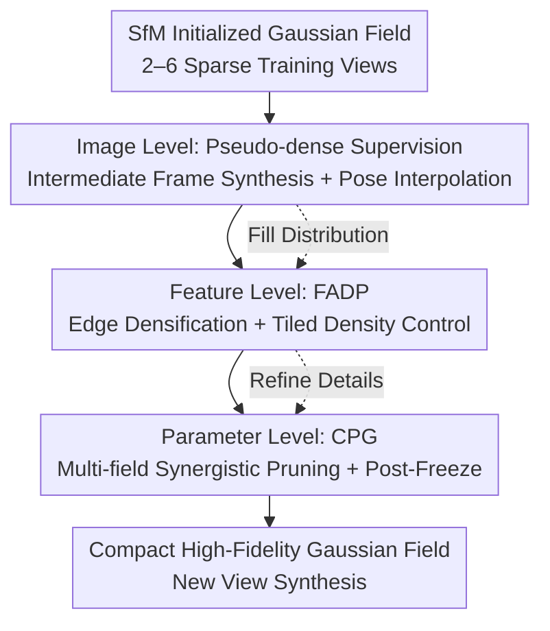

# HeroGS: Hierarchical Guidance for Robust 3D Gaussian Splatting under Sparse Views

**Conference**: CVPR 2026  
**Paper**: [CVF Open Access](https://openaccess.thecvf.com/content/CVPR2026/html/Li_HeroGS_Hierarchical_Guidance_for_Robust_3D_Gaussian_Splatting_under_Sparse_CVPR_2026_paper.html)  
**Code**: None  
**Area**: 3D Vision  
**Keywords**: Sparse View Reconstruction, 3D Gaussian Splatting, Frame Interpolation Pseudo-labels, Adaptive Densification, Geometric Consistency Pruning  

## TL;DR
HeroGS decomposes the overfitting problem of 3DGS under sparse views into three levels of hierarchical constraints: image-level (pseudo-dense supervision via frame interpolation), feature-level (adaptive Gaussian addition/deletion based on edges and tiling), and parameter-level (synergistic pruning of geometrically inconsistent Gaussians across multiple fields). It comprehensively outperforms SOTAs like FSGS and DropGaussian on LLFF 2/3/6-view benchmarks.

## Background & Motivation
**Background**: 3DGS uses explicit Gaussian primitives for new view synthesis (NVS). Its rendering quality approaches NeRF with real-time speeds, making it a mainstream choice for high-fidelity reconstruction. However, its success heavily relies on dense camera coverage.

**Limitations of Prior Work**: When input views become sparse (2–6 images), supervision signals are severely insufficient, leading to highly irregular Gaussian distributions. This manifests as three types of artifacts: sparse global coverage, blurry background regions, and misaligned/distorted Gaussians in high-frequency detail areas. This causes the model to overfit to training views and collapse during NVS.

**Key Challenge**: Under sparse views, Gaussians outside the field of view receive almost no gradient feedback, while the limited training views cause the model to overfit rapidly. Existing sparse-view 3DGS works (e.g., FSGS accelerating early densification, DropGaussian using dropout regularization, CoR-GS using multi-view consistency) only apply patches at a **single level**. They lack cohesive guidance from global to local scales, leaving the Gaussian field optimization incomplete: background Gaussians remain insufficient (blurry), and high-frequency details lack supervision (misalignment).

**Goal**: Achieve global completeness, local precision, and geometric consistency simultaneously for Gaussian distributions under extremely sparse inputs.

**Key Insight**: The authors observe that "adding views improves gradient coverage" (Fig. 1). They propose synthesizing pseudo-views between training views to turn sparse supervision into dense supervision without increasing real-world capture costs. Accuracy issues in pseudo-labels are then refined through feature and parameter levels.

**Core Idea**: Replace single-level patch-style regularization with a hierarchical guidance framework that coordinates across image, feature, and parameter levels to systematically shape the Gaussian distribution under sparse views.

## Method

### Overall Architecture
HeroGS starts from a Gaussian field initialized by SfM and applies three progressive levels of supervisory signals throughout training. The logic is to "fill the distribution globally, refine details locally, and prune errors geometrically":

1.  **Image-level (Global Coverage)**: Uses a video frame interpolation (VFI) model to synthesize intermediate RGB frames between adjacent training views as pseudo-labels. This converts sparse supervision into pseudo-dense supervision to regularize the global distribution.
2.  **Feature-level (Local Precision)**: FADP utilizes edge features and tiling statistics from training views to densify Gaussians at high-frequency boundaries, prune redundancy in homogeneous regions, and fill background gaps.
3.  **Parameter-level (Error Pruning)**: CPG introduces two auxiliary Gaussian fields trained jointly with the main field. It performs synergistic pruning based on geometric consistency to remove Gaussians with positional drift or shape distortion.

The three levels are not isolated but interconnected with feedback (dashed lines in the paper): the complete distribution from the previous level is the prerequisite for the next level (e.g., tiled counting $C$ in the feature level relies on the image level filling the distribution).

### Key Designs

**1. Image-level Pseudo-dense Supervision: Interpolating Sparse Views for "Fake" Dense Supervision**

Addressing the lack of gradients and overfitting, the authors use a VFI model to synthesize intermediate frames $I_n^{(\alpha)} = \mathrm{VFI}(I_n, I_{n+1}, \alpha)$ between adjacent training frames $I_n$ and $I_{n+1}$, where $\alpha \in (0,1)$. Since these frames lack ground-truth extrinsic parameters, camera poses are also interpolated: rotation via spherical linear interpolation $R_n^{(\alpha)}=\mathrm{slerp}(R_n,R_{n+1},\alpha)$, and translation via linear interpolation $T_n^{(\alpha)}=(1-\alpha)T_n+\alpha T_{n+1}$. The loss includes photometric terms (L1 + D-SSIM) and a depth geometric term (Pearson correlation between rendered depth $\hat D_n^{(\alpha)}$ and estimated depth $D_n^{(\alpha)}$):

$$L_g=\sum_{n=1}^{N-1}\Big[\lambda_1\lVert I_n^{(\alpha)}-\hat I_n^{(\alpha)}\rVert_1+\lambda_2 L_{\text{D-SSIM}}(I_n^{(\alpha)},\hat I_n^{(\alpha)})+\lambda_3\big(1-\mathrm{Corr}(D_n^{(\alpha)},\hat D_n^{(\alpha)})\big)\Big]$$

Two engineering points ensure stability: (1) A selection module filters low-quality pseudo-labels. (2) Since interpolation models are not 3D-aware, interpolated poses are set as **learnable parameters** and optimized jointly with the Gaussian field.

**2. Feature-level FADP: Edge Densification + Tiled Density Control**

While pseudo-labels provide global supervision, their detail accuracy is limited. Feature-level guidance uses two strategies. First, **Edge-aware Densification**: an edge detection model extracts edge maps $E_n$. 2D points along edges are back-projected to 3D as new Gaussian centers. Attributes for new Gaussians $\hat G$ (color, opacity, shape) are initialized via inverse distance weighted interpolation of $K$ neighbors (default $K=3$): $\hat A=\frac{\sum_k w_k A_k}{\sum_k w_k}$, $w_k=\frac{1}{d_k+\epsilon}$.

Second, **Tiled Density Control** prevents local oversampling. Images are divided into $m \times m$ tiles (default $m=8$). The projected Gaussian count $C=\{c_1,\dots,c_{m^2}\}$ per tile is reweighted:

$$c_i'=\begin{cases}c_{\min}, & c\le\tau_{\text{sparse}}\\ c_i\cdot\lambda_{\text{low}}, & \tau_{\text{sparse}}<c<\tau_{\text{low}}\\ c_i, & \tau_{\text{low}}\le c\le\tau_{\text{high}}\\ c_i\cdot\lambda_{\text{high}}, & c>\tau_{\text{high}}\end{cases}$$

Here, $\lambda_{\text{low}}>1$ upsamples under-represented regions, while $\lambda_{\text{high}}<1$ downsamples over-dense ones. Sparse tiles are guaranteed a minimum $c_{\min}$. Counts are normalized $C'\leftarrow\mathrm{round}\!\big(C'\cdot\frac{\sum_i c_i}{\sum_i c_i'}\big)$ ensuring the **total Gaussian count remains unchanged** while redistributing density.

**3. Parameter-level CPG: Synergistic Pruning + Post-Freeze**

The authors introduce two auxiliary fields. **Synergistic Pruning Criterion**: for each Gaussian $G_y^s$ in the source field $G^s$, find the nearest neighbor $z^*$ in the target field $G^t$. If the distance $w_y=\lVert p_y^s-p_{z^*}^t\rVert_2$ exceeds $\delta$ (set to 5), it is pruned as "unreliable."

The **Post-Freeze Strategy** is critical: Before a threshold $N_{\text{iter}}$, all three fields prune each other. Afterward, the two auxiliary fields are **partially frozen** (fixing scale and rotation), and pruning becomes one-way: the main field is pruned using the frozen auxiliary fields as geometric references. This provides stable geometric anchors in the later stages of training.

### Loss & Training
The total objective is $L=\lambda_g L_g+L_r$, where $L_g$ is the loss on synthesized (pseudo-label) views and $L_r$ is the loss on real training views. The main field and two auxiliary fields are supervised independently. The parameter-level switches to one-way pruning at $N_{\text{iter}}$. The interpolation factor $S$ (generating $S-1$ frames per pair) defaults to $S=4$.

## Key Experimental Results

### Main Results
Evaluation on LLFF (2/3/6 views, 8× downsampling) and Tanks&Temples (3/6 views) using PSNR / SSIM / LPIPS.

| Dataset | Views | Metric | HeroGS | Prev. SOTA | Note |
| :--- | :--- | :--- | :--- | :--- | :--- |
| LLFF | 2 | PSNR↑ | **18.78** | 17.38 (CoR-GS) | Gain of +1.40 in extreme sparsity |
| LLFF | 2 | SSIM↑ | **0.595** | 0.539 (CoR-GS) | +0.056 |
| LLFF | 3 | PSNR↑ | **21.30** | 20.55 (DropGaussian) | +0.75 |
| LLFF | 6 | PSNR↑ | **24.59** | 24.55 (DropGaussian) | Gap narrows with more views |
| T&T | 3 | PSNR↑ | **17.51** | 17.06 (CoR-GS) | Leading in large scenes |
| T&T | 6 | PSNR↑ | **24.70** | 24.15 (DropGaussian) | +0.55 |

The gain is most significant at 2 views, verifying that hierarchical guidance is most effective when supervision is extremely scarce.

### Ablation Study
Incremental addition of levels (LLFF, PSNR):

| Configuration | 2 views | 3 views | 6 views | Note |
| :--- | :--- | :--- | :--- | :--- |
| FSGS (baseline) | 15.65 | 20.43 | 24.15 | Starting point |
| + VFI (Image-level) | 16.91 | 20.68 | 24.18 | Largest single-step gain |
| + FADP (Feature-level) | 17.28 | 20.99 | 24.25 | Refines high-freq/background |
| + GSField Post-Freeze | 17.93 | 21.08 | 24.40 | Parameter-level prototype |
| HeroGS (Full) | **18.78** | **21.30** | **24.59** | Complete hierarchy |

### Key Findings
- **Image-level pseudo-labels are the primary driver**: Adding VFI to FSGS improves 2-view PSNR by +1.26, proving that "densifying" sparse supervision is most effective.
- **CPG corrects interpolation inaccuracies**: HeroGS with VFI (21.30 PSNR) actually outperforms using uniformly sampled Ground Truth frames (21.09) without CPG, suggesting CPG prunes geometric misalignments introduced by pseudo-labels.
- **Fewer Gaussians, Higher PSNR**: Training analysis shows HeroGS surpasses the baseline by 5K iterations and maintains a significantly lower Gaussian count, leading to more compact reconstruction and faster rendering.

## Highlights & Insights
- **Hierarchical guidance divides overfitting into three manageable layers**: Global filling (image) → Local refining (feature) → Geometric pruning (parameter). Each layer targets a specific sparce-view artifact.
- **Learnable interpolation poses** are clever: Since frame interpolation lacks 3D awareness, treating poses as learnable variables bypasses the mismatch between synthesized images and camera extrinsics.
- **Freezing auxiliary fields for pruning**: Fixing scale/rotation forces auxiliary fields to stabilize, providing discriminative geometric references to prune the main field's erroneous Gaussians.

## Limitations & Future Work
- Relies on external VFI models; pseudo-label quality is coupled with scene motion. Interpolation may fail in scenes with huge parallax or non-smooth trajectories.
- Jointly training two auxiliary fields increases memory and compute during training (though the final Gaussian count is lower).
- Evaluation is focused on forward-facing/outdoor scenes; robustness to 360° captures or highly reflective surfaces is unverified.
- Future work: Replacing 2D VFI with 3D-aware priors (e.g., Diffusion-based NVS) could further improve pseudo-label accuracy.

## Related Work & Insights
- **vs FSGS**: HeroGS is built on FSGS but adds 3 levels of guidance. For 2 views, it improves PSNR from 15.65 to 18.78, showing hierarchical guidance is far superior to simple densification.
- **vs DropGaussian**: DropGaussian uses dropout for regularization, which can cause ghosting in high-frequency areas. HeroGS uses FADP to actively shape high-frequency distributions, resulting in sharper textures.
- **vs CoR-GS**: CPG inherits multi-view consistency ideas but adds the "Post-Freeze" strategy and places it at the end of a hierarchical pipeline as a "geometric quality check."

## Rating
- Novelty: ⭐⭐⭐⭐ 
- Experimental Thoroughness: ⭐⭐⭐⭐ 
- Writing Quality: ⭐⭐⭐⭐ 
- Value: ⭐⭐⭐⭐ 

<!-- RELATED:START -->

## Related Papers

- [\[CVPR 2026\] GIFSplat: Generative Prior-Guided Iterative Feed-Forward 3D Gaussian Splatting from Sparse Views](gifsplat_generative_prior-guided_iterative_feed-forward_3d_gaussian_splatting_fr.md)
- [\[CVPR 2026\] GaussianZoom: Progressive Zoom-in Generative 3D Gaussian Splatting with Geometric and Semantic Guidance](gaussianzoom_progressive_zoom-in_generative_3d_gaussian_splatting_with_geometric.md)
- [\[CVPR 2026\] Wavelet-Driven 3D Anomaly Detection under Pose-Agnostic and Sparse-View](wavelet-driven_3d_anomaly_detection_under_pose-agnostic_and_sparse-view.md)
- [\[CVPR 2026\] Robust3DGSW: Toward Robust Watermarking for Quantization-Aware 3D Gaussian Splatting](robust3dgsw_toward_robust_watermarking_for_quantization-aware_3d_gaussian_splatt.md)
- [\[CVPR 2026\] DualSplat: Robust 3D Gaussian Splatting via Pseudo-Mask Bootstrapping from Reconstruction Failures](dualsplat_robust_3d_gaussian_splatting_via_pseudo-mask_bootstrapping_from_recons.md)

<!-- RELATED:END -->
