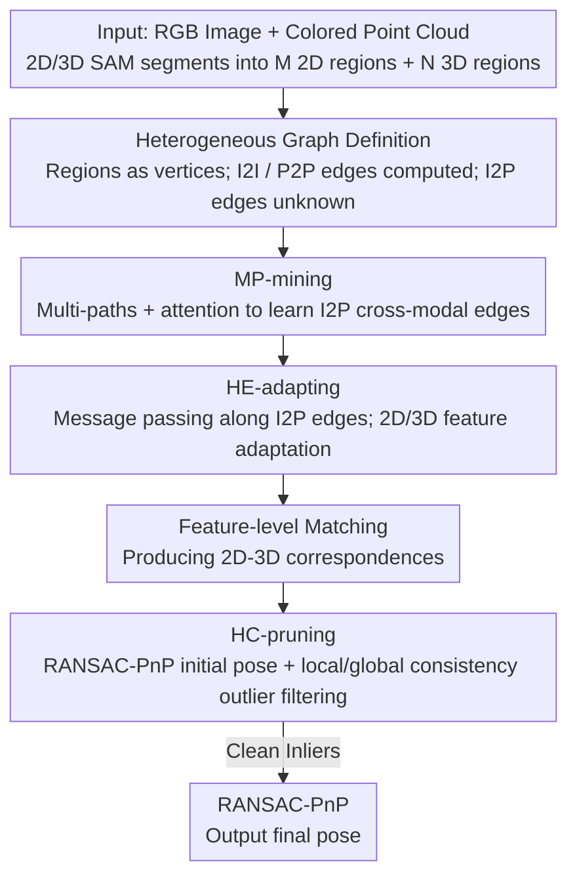

# Hg-I2P: Bridging Modalities for Generalizable Image-to-Point-Cloud Registration via Heterogeneous Graphs

**Conference**: CVPR 2026  
**arXiv**: [2603.27969](https://arxiv.org/abs/2603.27969)  
**Code**: [https://github.com/anpei96/hg-i2p-demo](https://github.com/anpei96/hg-i2p-demo)  
**Area**: 3D Vision  
**Keywords**: Image-to-Point-Cloud Registration, Heterogeneous Graphs, Cross-modal Feature Adaptation, Correspondence Pruning, Cross-domain Generalization

## TL;DR

Hg-I2P introduces Heterogeneous Graphs (HG) to unify the modeling of relationships between 2D image regions and 3D point cloud regions. By leveraging multi-path adjacency relation mining for cross-modal edge learning, heterogeneous edge-based feature adaptation, and graph-based projection consistency pruning, it achieves state-of-the-art generalization and precision across six indoor and outdoor cross-domain benchmarks.

## Background & Motivation

1. **Background**: Image-to-point-cloud (I2P) registration aims to establish correspondences between 2D pixels and 3D points, serving as a cornerstone for visual localization, navigation, and 3D reconstruction. Recently, learning-based methods have progressed by improving backbones, matching strategies, and loss functions, such as MATR using coarse-to-fine matching and CoFiI2P introducing patch-level matching.

2. **Limitations of Prior Work**: Existing methods perform well within the training domain but suffer significant performance degradation in unseen scenes. The core reason is the massive distribution gap between 2D image features (appearance-based) and 3D point cloud features (geometry-based)—even for correct correspondences, feature similarity might be low, making it difficult for neural networks to distinguish correct matches.

3. **Key Challenge**: Existing improvements either focus solely on feature refinement (lacking explicit cross-modal reasoning) or solely on correspondence pruning (relying on depth prediction or manual heuristics). Addressing these tasks in isolation fails to solve the generalization problem systematically. While Vision Foundation Models (SAM, DepthAnything, etc.) can help bridge the modal gap, a unified framework to simultaneously leverage feature refinement and correspondence pruning is missing.

4. **Goal**: (1) How to construct a unified structure that supports both cross-modal feature refinement and correspondence pruning? (2) How to effectively learn the cross-modal mapping between 2D and 3D regions? (3) How to utilize consistency information within the graph structure to filter erroneous matches?

5. **Key Insight**: Use 2D/3D SAM to segment images and point clouds into regions and construct a heterogeneous graph to model region-to-region relationships. The heterogeneous edges (I2P edges) of the graph define a 2D-3D region mapping that can both guide feature refinement (via cross-modal message passing along edges) and support correspondence pruning (via projection consistency checks within the graph).

6. **Core Idea**: Unify 2D-3D region relationship modeling using heterogeneous graphs, performing both cross-modal feature adaptation and correspondence pruning on the same graph structure to achieve robust generalization in I2P registration.

## Method

### Overall Architecture

Hg-I2P addresses the generalization problem where I2P registration "collapses in new scenes," rooted in the vast difference between 2D appearance and 3D geometric features. The solution involves partitioning both images and point clouds into regions and linking them through a graph for unified reasoning. Specifically, given an RGB image and a colored point cloud, 2D/3D SAM segments them into $M$ 2D regions and $N$ 3D regions. Each region serves as a vertex in the heterogeneous graph $\mathcal{G}_H = (\mathcal{V}_H, \mathcal{E}_H)$. Once the graph is established, features and correspondences flow through the same structure: MP-mining infers missing cross-modal edges during inference; HE-adapting performs cross-modal message passing along these edges to align features; and HC-pruning utilizes graph-based projection consistency to filter false matches after region/point-level matching. All three modules share the same set of edges, ensuring feature refinement and correspondence pruning are no longer decoupled.

### Key Designs

**1. Heterogeneous Graph Definition: Integrating modalities to serve both refinement and pruning**

Previous methods handled feature refinement and correspondence pruning independently. The HG approach provides a common carrier. The vertex set $\mathcal{V}_H = \mathcal{V}_I \cup \mathcal{V}_P$ combines $M$ 2D regions and $N$ 3D regions, where each vertex carries a $c$-dimensional feature (mean-pooled from region features). Edges are categorized into three types: homogeneous 2D-2D edges $\mathbf{E}_{I2I}$ (based on 2D feature distance, $\mathbf{E}_{I2I}^{(i,j)} = e^{-\alpha\|\mathbf{v}_i^I - \mathbf{v}_j^I\|_2^2}$), homogeneous 3D-3D edges $\mathbf{E}_{P2P}$, and the critical heterogeneous 2D-3D edges $\mathbf{E}_{I2P}$. While $\mathbf{E}_{I2P}$ should ideally be defined by the IoU of projected 3D regions and 2D regions under the ground truth (GT) pose, the GT pose is unavailable at inference. Thus, these edges must be learned.

**2. MP-mining: Bypassing unknown I2P edges via intra-modal neighbors**

Since $\mathbf{E}_{I2P}$ is unknown and initial matching $\tilde{\mathbf{E}}_{I2P}$ is often inaccurate, MP-mining uses known homogeneous edges as bridges to approximate 2D-3D relationships through three paths:

$$\mathbf{E}_{I2P}^1 = \mathbf{E}_{I2I}\tilde{\mathbf{E}}_{I2P}, \quad \mathbf{E}_{I2P}^2 = \tilde{\mathbf{E}}_{I2P}\mathbf{E}_{P2P}, \quad \mathbf{E}_{I2P}^3 = \mathbf{E}_{I2I}\tilde{\mathbf{E}}_{I2P}\mathbf{E}_{P2P}$$

The first path transfers through 2D neighbors before crossing modalities, the second crosses modalities then diffuses through 3D neighbors, and the third uses both. These matrices are concatenated and fed into an attention layer to predict $\hat{\mathbf{E}}_{I2P}$. From a Bayesian perspective, these paths marginalize indirect causal relationships: even if direct matching $\tilde{\mathbf{E}}_{I2P}$ is noisy, similar regions propagate neighbor evidence to correct the estimation.

**3. HE-adapting: Cross-modal feature alignment through learned edges**

HE-adapting uses the learned heterogeneous edges as conduits for features to absorb cross-modal information. For a 2D region $\mathcal{I}_i$, features are aggregated from its 3D region neighbors via $\mathcal{E}_{I2P}$ to form a cross-modal message $\bar{\mathbf{m}}_i^I$. Cross-attention determines the relevance between this message and the 2D region's own feature. Finally, the original and message features are concatenated and fused via self-attention, then combined with the original feature using a ratio $\beta$. This injects geometric cues into 2D features and appearance cues into 3D features, bridging the modal gap and increasing correct match similarity.

**4. HC-pruning: Filtering outliers via dual projection consistency**

HC-pruning runs an initial RANSAC-PnP on matching results to obtain an initial pose $\tilde{\mathbf{T}}$, then verifies each correspondence using two criteria: (1) Local constraint: checking if the correspondence falls within the $\mathcal{E}_{I2P}$ adjacency and has a reprojection distance smaller than $\delta_{\text{rej}}$; (2) Global constraint: comparing cosine similarity of relative position vectors derived from graph projections. Correspondences meeting either criterion are retained as inliers, which are then used for a final refined PnP estimation.

### Loss & Training

$$L_{\text{Hg-I2P}} = L_{\text{corr}} + \lambda_1 \|\hat{\mathbf{E}}_{I2P}[\text{mask}] - \mathbf{E}_{I2P}[\text{mask}]\|_2^2$$

Where $L_{\text{corr}}$ is the standard circle loss for correspondences, and the second term supervises the learning of heterogeneous edges (calculated only on valid non-zero mask positions).

## Key Experimental Results

### Main Results

I2P registration performance on the 7-Scenes dataset (trained on one scene, tested on others):

| Method | IR (C→) AVG | RR (C→) AVG | IR (K→) AVG | RR (K→) AVG |
|------|------------|------------|------------|------------|
| MATR | 0.387 | 0.478 | 0.537 | 0.706 |
| Top-I2P | 0.433 | 0.628 | 0.596 | 0.785 |
| MinCD | 0.445 | 0.592 | 0.568 | 0.814 |
| Hg-I2P† (w/o HC-pruning) | 0.472 | 0.642 | 0.618 | 0.802 |
| **Hg-I2P (Ours)** | **0.581** | **0.667** | **0.688** | **0.853** |

### Ablation Study

| Configuration | IR AVG | RR AVG | Description |
|------|--------|--------|------|
| Hg-I2P (Full) | 0.581 | 0.667 | Full model |
| Hg-I2P† (w/o HC-pruning) | 0.472 | 0.642 | Removed HC-pruning, IR drops by 18.8% |
| Baseline MATR | 0.387 | 0.478 | Baseline method |

### Key Findings

- The unified HG framework significantly outperforms methods that only perform feature refinement or only correspondence pruning.
- The advantage is more pronounced in cross-domain settings, validating the method's generalization capability.
- Heterogeneous edges learned via MP-mining are crucial for the effectiveness of both HE-adapting and HC-pruning.

## Highlights & Insights

- **HG as a Unified Framework**: Unifying feature refinement and correspondence pruning into a single graph structure avoids the pitfalls of fragmented processing.
- **Bayesian Interpretation of MP-mining**: Viewing homogeneous edges as conditional probabilities and multi-path products as marginalization provides an elegant theoretical basis for relationship learning.
- **Coarse-to-Fine Messaging**: Messages aggregated at the region level (coarse) and refined at the pixel/point level (fine) balance efficiency and accuracy.

## Limitations & Future Work

- **SAM Dependency**: Performance relies on 2D/3D SAM segmentation quality.
- **RANSAC Initialization**: HC-pruning requires an initial RANSAC-PnP pose; poor initial matching may lead to failed pruning.
- **Computational Overhead**: The runtime for SAM, graph construction, and message passing needs to be optimized for real-time applications.

## Related Work & Insights

- **vs MinCD (Bie et al.)**: MinCD converts I2P to 3D-3D registration, but predicted depth lacks scale. Hg-I2P operates directly in 2D-3D space.
- **vs An et al. (2024)**: While both use SAM, Hg-I2P utilizes the graph structure more systematically for feature adaptation and pruning.
- **vs MATR**: MATR lacks explicit cross-modal reasoning, which Hg-I2P provides via graph-based message passing.

## Rating

- Novelty: ⭐⭐⭐⭐
- Experimental Thoroughness: ⭐⭐⭐⭐
- Writing Quality: ⭐⭐⭐⭐
- Value: ⭐⭐⭐⭐

<!-- RELATED:START -->

## Related Papers

- [\[CVPR 2026\] CMHANet: A Cross-Modal Hybrid Attention Network for Point Cloud Registration](cmhanet_a_cross-modal_hybrid_attention_network_for_point_cloud_registration.md)
- [\[CVPR 2026\] MHopReg: Efficient Hierarchical Multi-Hop Graph Search for Point Cloud Registration](mhopreg_efficient_hierarchical_multi-hop_graph_search_for_point_cloud_registrati.md)
- [\[CVPR 2026\] Generalized-CVO: Fast and Correspondence-Free Local Point Cloud Registration with Second Order Riemannian Optimization](generalized-cvo_fast_and_correspondence-free_local_point_cloud_registration_with.md)
- [\[CVPR 2026\] GeoFree-CoSeg: Unsupervised Point Cloud-Image Cross-Modal Co-Segmentation Without Geometric Alignment](geofree-coseg_unsupervised_point_cloud-image_cross-modal_co-segmentation_without.md)
- [\[CVPR 2026\] C-GenReg: Training-Free 3D Point Cloud Registration by Multi-View-Consistent Geometry-to-Image Generation with Probabilistic Modalities Fusion](c-genreg_training-free_3d_point_cloud_registration_by_multi-view-consistent_geom.md)

<!-- RELATED:END -->
