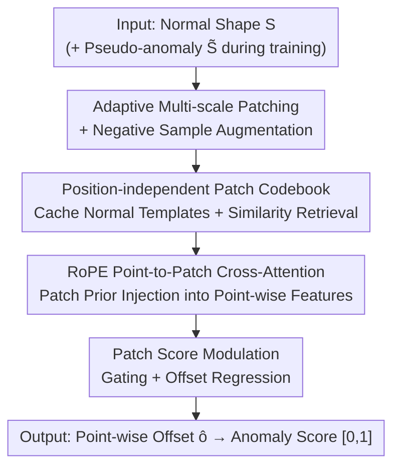

# Hierarchical Point-Patch Fusion with Adaptive Patch Codebook for 3D Shape Anomaly Detection

**Conference**: CVPR 2026  
**Paper**: [CVF Open Access](https://openaccess.thecvf.com/content/CVPR2026/html/Kang_Hierarchical_Point-Patch_Fusion_with_Adaptive_Patch_Codebook_for_3D_Shape_CVPR_2026_paper.html)  
**Code**: https://github.com/Shape-AnomalyCodebook (The paper provides github.com/Shape-AnomalyCodebook.git, ⚠️ the full repository path is subject to the original text)  
**Area**: 3D Vision / Anomaly Detection  
**Keywords**: 3D Shape Anomaly Detection, Multi-scale patch, Feature codebook, Point-patch fusion, Offset regression

## TL;DR
This paper proposes a hierarchical "point-patch" fusion network that constructs a position-independent normal patch feature codebook using adaptive multi-scale patching. It then injects patch-level priors into point-wise features via RoPE cross-attention to regress anomaly offsets. The method significantly outperforms previous point-wise approaches in detecting large-scale structural defects (planar displacement, angular misalignment) on public benchmarks and self-constructed industrial datasets.

## Background & Motivation

**Background**: 3D shape anomaly detection aims to localize structural or geometric defects on industrial workpieces. Mainstream approaches encode a batch of normal shapes into a latent space as a reference and then determine anomalies using out-of-distribution (OOD) detection or reconstruction error. Recently, dual-memory branches, teacher-student architectures, RGB+Point Cloud multi-modal fusion, and zero/few-shot solutions aligned with multi-view projections have emerged.

**Limitations of Prior Work**: Existing methods fundamentally rely only on **local point representations**, making them inadequate for **large-scale structural anomalies** common in industrial scenarios (e.g., global planar displacement, gear angular misalignment). Reconstruction-based methods (DRAEM-A, R3D-AD) are sensitive to noise, unstable in planar/concave regions, and heavily dependent on negative sample augmentation. Point-wise/keypoint-based methods (PO3AD, 3DKeyAD) excel at small local defects but are powerless against large structural displacements and component misalignments, which are precisely underestimated in public benchmarks.

**Key Challenge**: The scale of anomalies spans vastly—from subtle depressions of a few points to geometric misalignments of entire planes. Modeling only at a single (local point) granularity inevitably fails at the other end; the lack of explicit modeling for "references at different scales" is the root cause of poor generalization.

**Goal**: (1) Characterize regional component features and local point features simultaneously for scale-aware robust anomaly inference; (2) Address the lack of large structural defect evaluation in public benchmarks by releasing a real industrial test set containing planar displacement and gear angular misalignment.

**Key Insight**: Break down normal shapes into **multi-scale patches** and cache their features into a lightweight, position-independent patch codebook as a "normal geometry dictionary." During testing, the shape is similarly patched and compared against the codebook, using patch-level differences to guide point-wise detection. Multi-scale references provide the model with a comparable "what normal looks like" for anomalies of different sizes.

**Core Idea**: Replace pure point-wise OOD/reconstruction with "multi-scale normal patch codebook + patch-guided point-wise offset regression," enabling both large structural anomalies and fine local defects to be detected within the same framework.

## Method

### Overall Architecture
The method processes a normal shape $S\in\mathbb{R}^{N\times3}$: first, patching and negative sample augmentation are performed to generate a pseudo-anomaly $\tilde S$. Features for each patch are extracted using a pre-trained 3D U-Net. Normal patch features are populated into a multi-scale codebook; pseudo-anomaly/test patches retrieve the best-matching normal template from the codebook via cosine similarity. Subsequently, RoPE cross-attention is used to fuse the retrieved patch priors into point-wise features, followed by patch score modulation gating. Finally, point-wise anomaly offsets $\hat o_i$ are regressed and normalized into anomaly scores in $[0,1]$. During inference, only the test shape is input, and patch features are retrieved from the pre-cached codebook.

### Key Designs

**1. Adaptive Multi-scale Patching and Negative Sample Augmentation: Preparing comparable references for anomalies of all scales**

Point-wise methods fail to see "entire planes moving" because they lack regional-level references. This paper uses FPS on each normal shape at three scales (e.g., patch counts of 32/64/192, corresponding to sizes 64/32/8). $p_1<p_2<p_3$ correspond to fine/medium/coarse resolutions, allowing the network to model both local fine structures and larger-scale contexts. Training-side negative sample augmentation is specifically designed for "large structural defects": random anchor points are selected, and depression/sinking anomalies are created using Gaussian kernel displacements along the normal direction. Sine waves then modulate the normal direction to produce alternating convex deformations, and cubic/cylindrical masks are used for random hole digging and planar cutting to simulate missing or displaced surfaces. These generated pseudo-anomalies are closer to real industrial defects than simple scratches. For the industrial test set, the authors also reverse the patch scales (patch counts 8/32/64, sizes 192/64/32) to **emphasize large structural changes**.

**2. Position-independent Patch Feature Codebook: Compressing "normal geometry" into a reusable, translation-invariant dictionary**

Patch features $p^{(l)}_j=f\!\big(\frac{1}{|N^{(l)}_j|}\sum_{i}(x^{(l)}_{j,i}-c^{(l)}_j)\big)$ are calculated using the distribution of points within the patch relative to their centroid, inherently providing **translation invariance**. The codebook uses spatial hashing of patch positions as keys and features as values, sorted by distance to the object centroid. When a shape exhibits symmetry (e.g., four identical corner blocks), the same patch feature is stored once and reused via spatial hashing, saving significant memory. Codebook updates use threshold merging: cosine similarity $s_i$ is calculated between new features and existing entries. If $s_i\ge\tau=0.85$, they are merged via count-weighting $c_i\leftarrow\frac{n_i c_i+s_i t_j}{n_i+s_i}$ to suppress redundancy; otherwise, a new entry is created to preserve geometric diversity. During inference, test patches act as queries across the three scales. Scale similarity $\alpha^{(l)}=\sum_j p^{(l)}_j\!\cdot t^{(l)}_j$ takes the diagonal sum, and $\arg\max_l\alpha^{(l)}$ selects the best scale to guide subsequent modulation—ensuring both local and global correspondences are included, making the system robust to geometric scale variations.

**3. RoPE Point-to-Patch Cross-Attention: Aligning patch-level priors with point-wise features**

Patch retrieval alone is insufficient; each point must "know what normal patch it should belong to." Point-wise features $z_i$ are mapped as queries, while retrieved codebook patch features $t_k$ serve as keys/values for multi-head cross-attention. To encode the **relative spatial relationship** between a point and its patch center, Rotary Positional Embedding $\text{RoPE}(x_i,\bar x_i)=R^d_{\Theta,i}(x_i-\bar x_i)$ is introduced, rotating feature embeddings by angular offsets. Attention is aggregated using a linear attention form with non-negative feature maps $\phi(x)=\varphi(x)=\text{elu}(x)+1$ (see Eq. 5). This aligns each point geometrically with its nearest normal patch, magnifying both fine local defects and perceiving large structural misalignments.

**4. Patch Score Modulation and Offset Regression: Gating point-wise predictions with "normal-anomaly patch differences"**

The difference between a matched normal patch $t_k$ and an anomalous patch $p_j$, $\Delta f_{kj}=(1-t_k\cdot p_j)$, measures "how abnormal this area is." A gate $\rho_i=\sigma_i(\text{MLP}_{gate}(\Delta f_{kj}))\in[0,1]$ estimates anomaly likelihood, while a modulation network predicts scaling/shifting $(\gamma_i,\beta_i)$ to obtain $z'_i=\rho_i\odot(\gamma_i\odot\hat z_i+\beta_i)$, adaptively weighting each point's contribution by patch difference. Finally, $z'_i$ is concatenated with attention features $\hat z_i$ and fed into an MLP for residual offset prediction $\hat o_i=\text{MLP}(\text{Concat}[z'_i,\hat z_i])+\hat z_i$, "pointing" anomalous points back to their intended normal positions.

### Loss & Training
The total loss is $L_{anomaly}=L_{dist}+\lambda_{sim}L_{sim}+\lambda_{BCE}L_{BCE}$ ($\lambda_{sim}=\lambda_{BCE}=0.5$). $L_{dist}=\frac1N\sum\|\hat o_i-o^{gt}_i\|_1$ constrains offset magnitude; $L_{sim}$ is a cosine direction loss encouraging predicted offset directions to align with ground truth; $L_{BCE}$ supervises the anomaly sign mask $\hat m_i$ (concave/convex direction). The three terms jointly constrain magnitude, direction, and sign consistency. During inference, offset magnitudes are normalized to $\hat\delta_i\in[0,1]$ following PO3AD's L1 strategy, scoring only points identified as valid by the mask. The backbone is a Minkowski 3D U-Net pre-trained on large-scale 3D data; inputs are normalized to canonical space and voxelized to $256^3$; training lasts 1500 epochs using Adam with a learning rate of $1\times10^{-3}$.

## Key Experimental Results

### Main Results
Three datasets: Anomaly-ShapeNet (40 categories, 1600 samples), Real3D-AD (12 categories, 4 normal templates per category + 100 test), and a self-constructed industrial set (8 normal + 8 abnormal, including angular misalignment and planar displacement). Metrics are AUC-ROC and AUC-PR.

| Dataset | Metric | Gain of Ours over Prev. SOTA | Description |
|--------|------|------|------|
| Anomaly-ShapeNet (40 cats) | object-level AUC-ROC | Achieved SOTA average; slightly lower than PO3AD by ~3%–5% in specific categories (bottle0/eraser0/helmet0) | Overall lead maintained |
| Real3D-AD (12 cats) | object-level AUC-ROC | Average ~**7.5%** higher than the 2nd best method | 2nd best performed better in specific categories (Chicken/Diamond/Fish) |
| Industrial Set | point-level AUC-ROC | Exceeds PO3AD by **50%+**; R3D-AD failed on most samples | Large angular misalignments/planar displacements show the greatest gap |

> Summary Statement: Point-level improvement of **40%+** on new industrial anomaly types, Real3D-AD average **+7%**, Anomaly-ShapeNet average **+4%**. ⚠️ The provided text mentions "7.5% margin over 2nd best" for Real3D-AD and "50%+" for the industrial set; discrepancies with the 7%/40% figures in the abstract likely stem from different baselines/metrics; refer to original tables for accuracy.

### Ablation Study

| Configuration | Key Trend | Description |
|------|---------|------|
| Full model | Optimal | Multi-scale patching + Codebook + RoPE fusion + Modulation |
| w/o Neg. Augmentation | Significant Drop | Loss of pseudo-anomaly supervision leads to severe degradation in discriminative power |
| Multi-scale Ball Patching vs Semantic/Mesh/FPS-Voxel | Multi-scale Ball Patching Best | Semantic parts are too coarse, lacking fine geometric matching capabilities |

Inference overhead breakdown (RTX 3090, batch=1): 3D U-Net backbone accounts for **51.7%**, RoPE cross-attention decoding for **29.4%**, FPS patching for **14.4%**, and MLP heads for **4.5%**. Total inference 178 ms (PO3AD 172 ms, R3D-AD 183 ms), VRAM usage 2125 MB (PO3AD 2013 MB, R3D-AD 2318 MB).

### Key Findings
- **Negative sample augmentation is critical**: Removing it results in the steepest performance drop, indicating that pseudo-anomaly diversity (concave/convex/holes/planar cutting) directly determines discriminative ability.
- **Patch granularity has a sweet spot**: Voxel resolution ≥$128^3$ and patch count ≥128 lead to saturated gains; patch size peaks at 64, as excessive size (128/256) blurs fine anomaly boundaries.
- **Large structural anomalies are the biggest source of gain**: The 50%+ advantage on the industrial set far exceeds the single-digit improvements on public benchmarks, confirming that "multi-scale references" specifically address the blind spots of point-wise methods.

## Highlights & Insights
- **Reformulating anomaly detection as "point-wise offset regression" + "patch-level gating"**: Offsets provide both localization and direction, offering more information than a simple anomaly score. Gating allows patch differences to explicitly regulate the weight of each point—a paradigm transferable to 2D/multi-modal anomaly detection.
- **Position-independent codebook + Symmetry reuse**: Trading absolute position for translation invariance via relative centroid distribution and using spatial hashing for symmetric regions is a practical trick to keep the "memory bank" lightweight.
- **Adaptive scale selection via $\arg\max_l\alpha^{(l)}$**: Rather than fixing a single granularity, the system lets the data choose the best-matching scale for modulation, which is effective for varied industrial defect scales.
- **Addressing benchmark shortcomings**: The authors noted that public benchmarks underestimate large structural defects and built an industrial set, a methodology of "identifying evaluation gaps before creating data" that holds significant research value.

## Limitations & Future Work
- **Reliance on the authenticity of negative sample augmentation**: Although carefully designed, if real defect types fall outside Gaussian displacement/sine convex/mask digging, they may be missed; the geometric priors of the strategy are implicit assumptions.
- **Small scale of the industrial set** (8+8): With only one instance per category, object-level metrics are unavailable, and results provide limited statistical robustness.
- **Hyperparameter burden of multi-scale patching**: Number of scales/patch counts/sizes need tuning per dataset (public and industrial sets even used reversed scales), lacking an automatic scale selection mechanism.
- **Backbone consumes half of the computation**: The 3D U-Net takes 51.7% of inference time; edge deployment would require a more lightweight backbone.

## Related Work & Insights
- **vs PO3AD**: Both perform point-wise offset regression, but PO3AD uses only local geometry and lacks multi-scale regional references, resulting in poor generalization for large structural displacements and unseen categories. Ours uses a codebook for multi-scale normal comparison, achieving 50%+ higher point-level AUC-ROC on the industrial set.
- **vs R3D-AD / DRAEM-A (Reconstruction-based)**: These rely on reconstruction error, making them noise-sensitive and unstable in planar/concave areas. Ours does not reconstruct the entire shape but retrieves patch templates + regresses offsets, proving more stable for planar displacements.
- **vs Reg3D-AD / Memory-bank-based**: Traditional memory banks store local point features for OOD projection. Ours makes memory **multi-scale, position-independent, and symmetry-reusable** via a patch codebook, injecting priors into points via RoPE cross-attention rather than simple distance comparison.

## Rating
- Novelty: ⭐⭐⭐⭐ The combination of a multi-scale position-independent codebook + patch-guided point-wise offset regression is relatively new in 3D anomaly detection, though components (FPS patching, memory banks, RoPE, offset regression) are largely reassembled existing parts.
- Experimental Thoroughness: ⭐⭐⭐⭐ Three datasets + comprehensive ablations on time/VRAM/hyperparameters/patching strategies; however, the industrial set is small and lacks object-level metrics.
- Writing Quality: ⭐⭐⭐⭐ Pipeline and formulas are clearly explained, though discrepancies exist between the abstract and body regarding performance gains (7% vs 7.5%, 40% vs 50%).
- Value: ⭐⭐⭐⭐ Directly addresses the underestimated scenario of large industrial structural defects and provides evaluation data, showing clear practical value.

<!-- RELATED:START -->

## Related Papers

- [\[CVPR 2026\] MoECLIP: Patch-Specialized Experts for Zero-shot Anomaly Detection](moeclip_patch-specialized_experts_for_zero-shot_anomaly_detection.md)
- [\[CVPR 2026\] Back to Point: Exploring Point-Language Models for Zero-Shot 3D Anomaly Detection](back_to_point_exploring_point-language_models_for_zero-shot_3d_anomaly_detection.md)
- [\[ICLR 2026\] PAANO: Patch-Based Representation Learning for Time-Series Anomaly Detection](../../ICLR2026/object_detection/paano_patch-based_representation_learning_for_time-series_anomaly_detection.md)
- [\[CVPR 2026\] Geometry-Aligned and Anomaly-Aware Reconstruction for 3D Anomaly Detection](geometry-aligned_and_anomaly-aware_reconstruction_for_3d_anomaly_detection.md)
- [\[CVPR 2026\] CHAL: Causal-guided Hierarchical Anomaly-aware Learning for Moving Infrared Small Target Detection](chal_causal-guided_hierarchical_anomaly-aware_learning_for_moving_infrared_small.md)

<!-- RELATED:END -->
