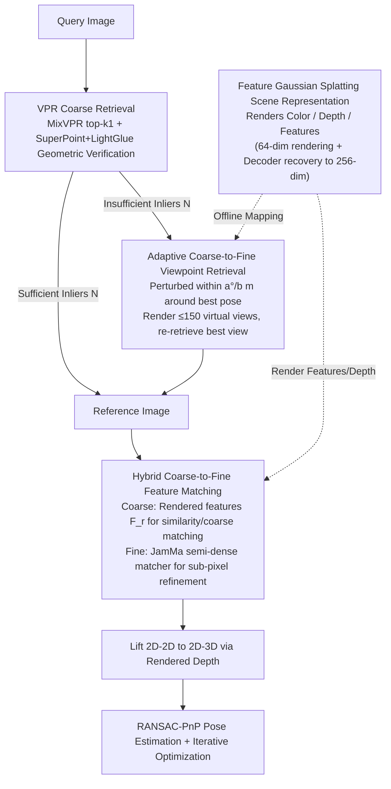

# Hierarchical Visual Relocalization with Nearest View Synthesis from Feature Gaussian Splatting

**Conference**: CVPR 2026  
**arXiv**: [2603.29185](https://arxiv.org/abs/2603.29185)  
**Code**: [https://hqitao.github.io/SplatHLoc](https://hqitao.github.io/SplatHLoc)  
**Area**: 3D Vision  
**Keywords**: Visual Relocalization, Gaussian Splatting, Feature Matching, Novel View Synthesis, Hierarchical Localization

## TL;DR

Ours proposes SplatHLoc, a hierarchical visual relocalization framework based on Feature Gaussian Splatting. It synthesizes virtual views closer to the query via adaptive viewpoint retrieval and utilizes a hybrid feature matching strategy (rendered features for coarse matching and a semi-dense matcher for fine matching), achieving SOTA results on indoor and outdoor relocalization benchmarks.

## Background & Motivation

1. **Background**: Visual relocalization is a fundamental task in 3D vision. Mainstream methods are divided into three categories: structure-based (SfM sparse point clouds + PnP), regression-based (direct regression of poses or scene coordinates), and rendering-based (novel view synthesis via NeRF/GS). Among these, hierarchical methods (e.g., HLoc) offer excellent scalability due to their modular design.

2. **Limitations of Prior Work**: Hierarchical relocalization methods rely on database images that are sufficiently close to the query viewpoint. When database images are sparsely distributed, establishing reliable feature correspondences is difficult. Existing virtual keyframe augmentation methods (e.g., GPVK-VL) synthesize additional views but do not guarantee alignment with the query viewpoint and incur significant storage overhead.

3. **Key Challenge**: Images rendered by GS often contain artifacts, making correspondences unstable when features are extracted from rendered images. While features directly rendered by FGS incorporate multi-view knowledge and reduce error accumulation, a feature gap exists between rendered features and query image features, making them unsuitable for pixel-level precision matching.

4. **Goal**: Address (a) large viewpoint deviations in retrieved reference images caused by sparse databases and (b) how to complement the respective strengths and weaknesses of rendered and extracted features.

5. **Key Insight**: The authors found that rendered features perform better in the coarse matching stage (due to multi-view knowledge and reduced cumulative error), whereas features directly extracted from images are superior in the fine matching stage (precise geometric relationships). Thus, different features can be used in different stages.

6. **Core Idea**: Construct adaptive viewpoint retrieval (synthesizing virtual reference images closer to the query) and hybrid feature matching (rendered features for coarse stages and semi-dense matcher features for fine stages) on top of an FGS scene representation.

## Method

### Overall Architecture

SplatHLoc addresses the classic problem in hierarchical relocalization: when database images are too sparse, retrieved reference images are too far from the query viewpoint for successful matching. The solution is to first reconstruct the scene as a Gaussian map capable of direct feature rendering, then perform two tasks: synthesize a better-aligned virtual reference view on-the-fly and use optimal features for the coarse and fine matching stages respectively.

The pipeline operates as follows: A query image first undergoes VPR to retrieve the most similar database image and its pose. If the geometric correspondence is unreliable, adaptive viewpoint retrieval is triggered, rendering a batch of virtual views around that pose and selecting the one closest to the query as the reference. With the reference image, the hybrid matcher establishes 2D-2D correspondences between the query and reference, lifts them to 2D-3D using the rendered depth map, and finally estimates the pose via RANSAC-PnP followed by iterative optimization.

### Key Designs

**1. Feature Gaussian Splatting Scene Representation: Expanding "Color Rendering" to "Concurrent Color, Depth, and Feature Rendering"**

To perform feature matching on a Gaussian map, the map must render feature maps rather than just RGB. The authors attach a $d$-dimensional learnable feature $\mathbf{f}_i$ to each Gaussian primitive. During training, it is supervised by ground truth features $F_t$ extracted by a SuperPoint encoder on real images, while the Gaussian renders a feature map to align with it, jointly optimizing photometric and feature losses. To address storage overhead—as rendering 256-dim features would expand the map size excessively—a compression trick is used: Gaussians render a low-dimensional feature $F_r^{low}$ ($C'=64$), which is then restored to $C=256$ dimensions for matching via a $3\times3$ convolutional decoder. This "low-dim rendering + decoder recovery" design cuts resources significantly almost without precision loss: map size drops from 904MB to 353MB, training from 146 to 46 minutes, and GPU memory from 12GB to 4GB.

**2. Adaptive Coarse-to-Fine Viewpoint Retrieval: Synthesizing Better-Aligned Virtual Views On-the-fly**

The pain point of sparse databases is high viewpoint deviation in retrieved images, but pre-rendering all possible views (like GPVK-VL) is storage-intensive. The proposed approach synthesizes images on-demand using a two-stage contraction. In the coarse stage, MixVPR retrieves top-$k_1$ candidates, and SuperPoint+LightGlue performs geometric verification to select the best match $I_c^c$. Only when its inlier count $N$ falls below a threshold (indicating a poor match) is the fine stage triggered: random perturbations are applied within $a^\circ$ and $b$ meters around the pose of $I_c^c$ to render $k_2 \le 150$ virtual views. These are then processed through retrieval and geometric verification to select the final reference. This "on-demand" synthesis fills viewpoint gaps without massive pre-rendering storage.

**3. Hybrid Coarse-to-Fine Feature Matching: Using Rendered Features for Coarse and Image Features for Fine Matching**

This is the core insight of the paper. Rendered features and image-extracted features have complementary strengths: rendered features contain multi-view priors and low cumulative error but suffer from a feature gap with the query; image features are geometrically precise but lack multi-view knowledge. The authors decouple their usage by stage. In the coarse stage, similarity matrices are calculated between query features $F_t$ and rendered features $F_r^{high}$ at $C\times H/8\times W/8$ resolution to obtain coarse correspondences $\mathcal{C}_{q,r}^c$ via dual softmax and mutual nearest neighbor filtering. In the fine stage, the JamMa semi-dense matcher extracts fine features at $H/2\times W/2$ resolution from both the rendered image and query image, refining correspondences to sub-pixel accuracy within a $W\times W$ window guided by coarse matches. Ablations show that using rendered features for the fine stage actually drops 7-Scenes RR@[2cm,2°] by 0.61, whereas the hybrid strategy improves it by 2.91.

### Loss & Training

The training phase jointly optimizes photometric loss ($\mathcal{L}_1$ + D-SSIM weighting) and feature loss ($\mathcal{L}_1$) with weights $\gamma=1$ and $\lambda=0.2$ for 30K steps. The relocalization phase uses iterative optimization $n$ times ($n=4$ indoors, $n=2$ outdoors).

## Key Experimental Results

### Main Results

| Dataset | Metric | SplatHLoc | STDLoc (prev SOTA) | Gain |
|--------|------|-----------|-------------------|------|
| 7-Scenes (avg) | Median Error cm/° | **0.55/0.17** | 0.76/0.24 | -28%/-29% |
| 12-Scenes (avg) | Median Error cm/° | **0.3/0.14** | - | - |
| Cambridge (avg) | Median Error cm/° | **9/0.13** | 10/0.14 | -10%/-7% |

On 7-Scenes, SplatHLoc outperforms STDLoc across all 7 scenarios, reducing the average median translation error from 0.76cm to 0.55cm.

### Ablation Study

| Configuration | Stairs Error cm/° | RR@[5cm,5°] | Notes |
|------|---------|------|------|
| Baseline (MixVPR + SP+LG) | 1.82/0.49 | 75.5% | Standard hierarchical method |
| + Adaptive Retrieval | 1.57/0.45 | 80.5% | Adaptive retrieval +5% |
| + Hybrid Matcher | 1.14/0.33 | 84.0% | Hybrid matcher +8.5% |
| Full (Combination) | **1.03/0.30** | **91.9%** | Maximum combined gain |

### Key Findings
- The hybrid matcher is the largest contributor, increasing recall from 75.5% to 84.0% in weakly textured scenes (Stairs).
- Rendered features are only suitable for coarse matching: using them for fine matching decreases RR by 0.61%, whereas using them for coarse matching increases RR by 2.91%.
- The FGS map compression strategy is highly effective: compared to STDLoc, it reduces storage by 61%, training time by 68%, and GPU memory by 67%.
- In terms of efficiency, SplatHLoc is approximately 2x faster than STDLoc during the iterative optimization phase.

## Highlights & Insights
- **Staged Use of Rendered Features**: Instead of judging rendered features as simply "good" or "bad," the paper observes they are superior for coarse matching (multi-view priors) and image features are superior for fine matching (precise geometry). This insight is transferable to all tasks involving synthetic-to-real feature matching.
- **On-Demand Virtual View Synthesis**: Synthesizing views only when the initial retrieval is poor is far more efficient than pre-rendering all possible views.
- **Dimensionality Compression + Decoder**: The $64$-dim $\rightarrow$ $256$-dim restoration design is practical, slashing resource consumption without significant performance loss.

## Limitations & Future Work
- Performance depends on the quality of the Gaussian map, which is influenced by the number of mapping images.
- Large-scale outdoor scenarios require a sub-map strategy (noted as future work).
- Reliance on SfM for Gaussian primitive initialization; foundational 3D reconstruction models could replace COLMAP.
- The JamMa matcher is currently frozen; future work could explore end-to-end joint training.

## Related Work & Insights
- **vs. STDLoc**: STDLoc uses rendered features for both coarse and fine stages, ignoring the feature gap. SplatHLoc's hybrid strategy is more rational and surpasses it on all datasets while being ~2x faster.
- **vs. GPVK-VL**: GPVK-VL stores pre-rendered virtual keyframes; SplatHLoc is more storage-efficient via on-demand synthesis.
- **vs. ACE+GS-CPR**: GS-CPR uses MASt3R for matching but has low resolution and high computational cost; SplatHLoc is more lightweight.

## Rating
- Novelty: ⭐⭐⭐⭐ The insight regarding staged use of rendered features is novel, though the overall framework is an incremental improvement of hierarchical matching.
- Experimental Thoroughness: ⭐⭐⭐⭐⭐ Comprehensive coverage across three datasets, full ablations, efficiency comparisons, and visual analysis.
- Writing Quality: ⭐⭐⭐⭐ Clear structure with information-dense charts.
- Value: ⭐⭐⭐⭐ High practicality with clear improvements in both efficiency and accuracy.

<!-- RELATED:START -->

## Related Papers

- [\[CVPR 2026\] Cross-View Splatter: Feed-Forward View Synthesis with Georeferenced Images](cross-view_splatter_feed-forward_view_synthesis_with_georeferenced_images.md)
- [\[CVPR 2026\] Intrinsic Geometry-Appearance Consistency Optimization for Sparse-View Gaussian Splatting](intrinsic_geometry-appearance_consistency_optimization_for_sparse-view_gaussian_.md)
- [\[CVPR 2026\] From Rays to Projections: Better Inputs for Feed-Forward View Synthesis](from_rays_to_projections_better_inputs_for_feed-forward_view_synthesis.md)
- [\[CVPR 2026\] MoVieS: Motion-Aware 4D Dynamic View Synthesis in One Second](movies_motion-aware_4d_dynamic_view_synthesis_in_one_second.md)
- [\[CVPR 2026\] From None to All: Self-Supervised 3D Reconstruction via Novel View Synthesis](from_none_to_all_self-supervised_3d_reconstruction_via_novel_view_synthesis.md)

<!-- RELATED:END -->
