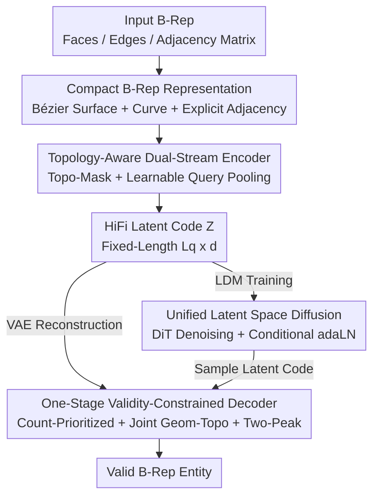

# HiFi-BRep: High-Fidelity Latent Representation for Robust B-Rep Generation

**Conference**: CVPR 2026  
**Paper**: [CVF Open Access](https://openaccess.thecvf.com/content/CVPR2026/html/Hou_HiFi-BRep_High-Fidelity_Latent_Representation_for_Robust_B-Rep_Generation_CVPR_2026_paper.html)  
**Code**: https://github.com/1nnoh/HiFi-BRep  
**Area**: 3D Vision / CAD Generation  
**Keywords**: B-Rep Generation, Boundary Representation, Topology-Aware Encoding, One-Stage Decoding, Differentiable Validity Constraints

## TL;DR
HiFi-BRep constructs a high-fidelity latent space using a "topology-aware encoder free of padding noise + a one-stage decoder jointly decoding geometry and topology", converting the manifold constraint of "each edge belongs to exactly two faces" into a differentiable training objective. Consequently, it achieves higher structural validity, a smaller gap between "compilable but invalid" outputs, and a 2–7× speedup in inference for CAD Boundary Representation (B-Rep) generation.

## Background & Motivation

**Background**: B-Rep (Boundary Representation) is the standard format for CAD, precisely encoding 3D shapes using parametric surfaces, curves, vertices, and topological connections between them, serving as the foundation of industrial design and manufacturing. Recently, deep generative models have succeeded on meshes and point clouds, naturally prompting the question: can high-quality and structurally valid B-Reps be directly generated?

**Limitations of Prior Work**: B-Rep is an object featuring a mixture of continuous geometry and discrete topology, governed by strict validity rules where even a minor error can cascade and invalidate the entire model. The authors categorize the "brittleness" of existing methods into two types: First, **representation brittleness**—early approaches utilize padding to handle variable-length primitives, which introduces statistical noise and destabilizes training, while some methods introduce topological priors but perform multi-hop neighbor propagation, undesirably polluting features with irrelevant information. Second, **generation brittleness**—mainstream pipelines decouple geometry and topology into multi-stage cascaded generation where information flows unidirectionally, rendering early decisions irreversible; moreover, many methods fail to treat topological validity as an explicit training target, pushing it instead to non-differentiable post-processing to force compliance, leading to training-inference inconsistency.

**Key Challenge**: Existing methods make compromises between "representation fidelity" and "structural validity". DTGBrepGen integrates validity constraints into the representation at the cost of a complex multi-stage cascade that is difficult to optimize. HoLa simplifies the pipeline and employs a local intersection paradigm to guarantee manifold edges but sacrifices expressiveness, failing to learn structures like "multiple edges between two faces" and struggling with global topology.

**Goal**: To establish a **unified and parallel** solution that simultaneously achieves compact high-fidelity representation, joint generation of geometry and topology, and differentiable enforcement of topological validity.

**Key Insight**: The authors' key insight is that an ideal representation should strike a balance between "expressiveness" and "learnability", and **transform validity constraints into learnable objectives** rather than post-processing patches.

**Core Idea**: To construct a high-fidelity latent space free of padding noise with "embedded" topology/validity via a topology-aware encoder, and then use a one-stage decoder to decode geometry and topology in parallel all at once while formulating the manifold constraint as a differentiable loss. In short, "moving hard constraints from post-processing into differentiable training objectives, and replacing cascaded generation with one-stage joint generation."

## Method

### Overall Architecture

HiFi-BRep defines a B-Rep entity $\mathcal{B}$ as a triplet: a set of $n_f$ parametric faces $F$, a set of $n_e$ parametric edges $E$, and a binary edge-face adjacency matrix $A \in \{0,1\}^{n_e \times n_f}$. The objective is to model the joint distribution $p(\mathcal{B}) = p(F, E, A)$ while satisfying manifold, watertightness, and other validity constraints.

The overall architecture is a **two-stage pipeline designed around a high-fidelity latent space**. The first stage trains a VAE: the topology-aware encoder compresses variable-length B-Rep inputs into a fixed-length latent sequence $Z$, and a one-stage decoder reconstructs geometry and topology in parallel from $Z$. The second stage trains a latent diffusion model (DDPM / DiT) on the learned latent space, decoupling "representation learning" from "distribution modeling"—the VAE captures the latent structure of complex B-Reps, while the diffusion model only needs to learn how to sample in this "well-behaved" latent space. During inference, a latent code is sampled from the diffusion model, and the pre-trained VAE decoder reconstructs the B-Rep in a single pass, supporting unconditional generation as well as class label / point cloud / image-conditioned generation.

The following four key designs are organized top-down along the main pipeline of "Input Representation → Encoding to Latent Space → Decoding Reconstruction → Latent Diffusion Generation", where the node names in the framework diagram correspond directly to the names of the key designs:

### Key Designs

**1. Compact and Sufficient B-Rep Representation: Embedding Validity inside the Representation**

Addressing the root cause of representation brittleness, the authors first design a representation with "inherent validity" before constructing the network. Each face is modeled as a Bézier surface (represented by adding embeddings of the bounding box $F_p$ and control grid $F_z$ to form face features), each edge is modeled as a Bézier curve (represented by adding embeddings of the bounding box $E_p$, control points $E_z$, and explicit endpoints $E_v$), and the global topology is represented by an explicit edge-face adjacency matrix $A$. The beauty of this representation lies in directly embedding two hard constraints into the structure: Bézier curves naturally possess two endpoints, automatically satisfying the vertex connectivity constraint that "each edge connects exactly two distinct vertices"; meanwhile, the explicit global edge-face adjacency matrix naturally encodes the manifold constraint that "each edge is shared by exactly two faces", while still accommodating complex structures like "multiple edges between two faces"—which is a limitation that HoLa’s local intersection paradigm fails to learn. To stabilize training, the primitives are sorted lexicographically by their bounding box centers and padded to align with the maximum number of faces/edges in the dataset, $(F_{\max}, E_{\max})$. Since the number of edges $n_e$ and faces $n_f$ are approximately linear in manifold entities, this budget is "sufficient yet non-redundant". This representation acts as a topology-guiding signal during encoding and serves as the direct supervision target during decoding.

**2. Topology-Aware Dual-Stream Encoder: Preventing Pollution with Topo-Mask and Removing Padding Noise with Learnable Queries**

The encoder must resolve two types of representation noise simultaneously: pollution from distant primitives and noise introduced by padding. The approach separates faces and edges into two independent streams and **strictly limits cross-stream interaction to topologically adjacent pairs**. The initial token embeddings $X^{(0)}_E = \phi_E(E_p, E_z, V) \in \mathbb{R}^{n_e \times d}$ and $X^{(0)}_F = \phi_F(F_p, F_z) \in \mathbb{R}^{n_f \times d}$ pass through several BiModalBlocks. Each block performs self-attention within its respective stream and bidirectional cross-attention between adjacent face-edge pairs. Crucially, the attention score is regularized by a Topo-Mask bias $S$ derived from the adjacency matrix:

$$\mathrm{Attn}(Q,K,V;S) = \mathrm{softmax}\!\Big(\tfrac{QK^\top}{\sqrt{d}} + S\Big)V,\quad S[u,i] = \begin{cases} 0, & A[u,i]=1,\\ -\infty, & \text{otherwise,}\end{cases}$$

where $u$ indexes edges and $i$ indexes faces. This means non-adjacent face-edge pairs are directly masked out by $-\infty$, restricting information propagation to true first-order adjacencies and preventing multi-hop propagation from polluting features with irrelevant information. After stacking $L$ blocks, $L_q$ learnable queries $Q_{enc} \in \mathbb{R}^{L_q \times d}$ are used to perform attention over the concatenated features $[X^{(L)}_E, X^{(L)}_F]$, pooling the variable-length tokens into a fixed-length latent code $Z \in \mathbb{R}^{L_q \times d}$ (where $L_q = 48$ in experiments). This step replaces "global summarizing after padding" with "query pooling", fundamentally eliminating padding noise. The resulting latent code is high-fidelity, topology-aware, and validity-conscious, providing a stable interface for subsequent one-stage decoding and diffusion.

**3. One-Stage Validity-Constrained Decoder: Count-Prioritized, Joint Geometry-Topology, and Two-Peak Differentiable Manifold Objective**

To tackle the generation brittleness caused by cascaded error propagation and post-processing fixes, the decoder solves "counting, geometry, and adjacency" in a **single stage**, allowing topology and geometry to guide each other throughout. The workflow is count-prioritized: first, two learnable counting queries predict logits for the number of faces and edges (classes $\{0,\dots,F_{\max}\}$ and $\{0,\dots,E_{\max}\}$). During training, ground-truth counts $(n_f, n_e)$ are used, while during inference, predicted counts $(\hat n_f, \hat n_e)$ generate hard padding masks, resolving "sequence length ambiguity" before parsing the primitives. Subsequently, face queries $Q_F$ and edge queries $Q_E$ are initialized and passed through a stack of DecBiBlocks (cross-attention of queries to latent code $Z$, intra-stream masked self-attention, bidirectional cross-attention between face-edge streams, and FFN) to produce topology-aware features $H_F, H_E$. The geometry heads regress face/edge control parameters from these features (predicting bounding box centers and sizes, utilizing a softplus function to ensure positive dimensions before converting to corners; edge endpoints are directly regressed). The topology head projects $H_E, H_F$ into a shared adjacency space $U = \psi_e(H_E) \in \mathbb{R}^{E_{\max}\times d_{adj}}$ and $W = \psi_f(H_F) \in \mathbb{R}^{F_{\max}\times d_{adj}}$ to calculate scaled bilinear scores $S = (UW^\top)/\sqrt{d_{adj}}$. Softmax is applied to each row, supervised by a **two-peak target distribution**—which evenly divides the probability mass between the two associated faces of each valid edge, thus converting the manifold prior of "each edge belongs to exactly two faces" into a differentiable training objective. During inference, the top-2 valid faces are selected for each valid edge based on these scores. This bidirectional optimization of geometry and topology prevents cascaded errors and aligns the training objective with the physical constraints of manifold entities.

**4. Unified Latent Space Diffusion: Decoupling Representation Learning and Distribution Modeling**

After pre-training the high-fidelity latent space of the VAE, a DDPM is trained on the fixed-length latent codes. Let the serialized latent code be $z_0$; the forward process is defined as $q(z_t|z_0) = \mathcal{N}(\sqrt{\bar\alpha_t}z_0, (1-\bar\alpha_t)I)$. A Diffusion Transformer (DiT) denoiser $\epsilon_\theta(z_t,t;c)$ is employed to minimize $\mathbb{E}\|\epsilon - \epsilon_\theta(z_t,t;c)\|_2^2$. The condition $c$ is optional and, when present, is injected via adaptive LayerNorm (adaLN), where a linear head maps $c$ to the scale and shift parameters $(\gamma,\beta)$ for each block. Image conditions are encoded using a pre-trained DINOv2, while point cloud conditions are encoded via PointNet++. During inference, starting from $z_T\sim\mathcal{N}(0,I)$, the process iteratively denoises under selected conditions (or unconditionally with null embeddings) to obtain $z_0$, which is then decoded by the pre-trained VAE decoder to recover the B-Rep in one pass. By placing distribution modeling in a "well-behaved" latent space, the diffusion process does not need to worry about geo-topological validity, which is already handled by the VAE.

### Loss & Training

The masked geometry reconstruction loss applies MSE to each geometric component:

$$\mathcal{L}_{\text{geom}} = \mathrm{MSE}(\widehat{F}_z,F_z) + \mathrm{MSE}(\widehat{E}_z,E_z) + \mathrm{MSE}(\widehat{F}_p,F_p) + \mathrm{MSE}(\widehat{E}_p,E_p) + \mathrm{MSE}(\widehat{\mathcal{V}},\mathcal{V})$$

The total objective is a weighted sum of KL divergence, count cross-entropy, geometric reconstruction, and row-wise adjacency losses:

$$\mathcal{L} = \lambda_{\mathrm{KL}}\mathcal{L}_{\mathrm{KL}} + \lambda_{\mathrm{len}}\big[\mathrm{CE}(\hat n_f,n_f)+\mathrm{CE}(\hat n_e,n_e)\big] + \lambda_{\mathrm{geom}}\mathcal{L}_{\text{geom}} + \lambda_{\mathrm{adj}}\,\mathcal{L}_{\mathrm{row\text{-}wise}}(S)$$

where $\mathcal{L}_{\mathrm{row\text{-}wise}}$ is the aforementioned row-wise two-peak adjacency loss. All terms are computed only on valid (non-padded) slots. Label smoothing and loss weights are fixed across all experiments. The VAE and DiT contain approximately 304.7M and 193.4M parameters respectively, and are trained on 2×RTX 4090s for 3000 and 1000 epochs (encoder/decoder width $d=768$, 6 blocks each, $L_q=48$, and an 18-layer DiT).

## Key Experimental Results

The datasets evaluated are DeepCAD and ABC, two standard public benchmarks for B-Rep generation. After deduplication and capping by the number of faces/edges, the training sets contain 83,611 and 186,148 shapes, respectively. Evaluation considers both distribution fidelity (COV Coverage, MMD-CD, JSD) and CAD-level validity (Novel, Unique, Compilability, Valid). Among these, Compilability measures whether the generated model can be successfully exported to a STEP file via OpenCascade, while Valid further requires the exported entity to be watertight and manifold-consistent—the gap between the two measures how frequently a model can construct a file but fails kernel-level validity checks.

### Main Results

Unconditional generation results (MMD-CD, JSD ×100):

| Dataset | Method | COV↑ | MMD-CD↓ | JSD↓ | Compilability%↑ | Valid%↑ |
|--------|------|------|---------|------|------------------|---------|
| DeepCAD | DeepCAD (Procedural Baseline) | 76.67 | 1.09 | 0.77 | 88.46 | 68.20 |
| DeepCAD | BRepGen | 47.03 | 1.51 | 3.12 | 20.91 | 20.76 |
| DeepCAD | BrepDiff | 45.03 | 1.32 | 2.39 | 63.69 | 63.69 |
| DeepCAD | DTGBrepGen | 73.50 | 1.06 | 0.98 | 92.48 | 43.20 |
| DeepCAD | **HiFi-BRep** | 70.40 | **1.05** | 1.72 | 90.38 | **72.20** |
| ABC | BRepGen | 34.73 | 2.08 | 5.72 | 20.77 | 20.19 |
| ABC | BrepDiff | 41.59 | 1.72 | 2.39 | 22.05 | 20.05 |
| ABC | DTGBrepGen | 70.63 | 1.30 | 1.55 | 50.55 | 24.88 |
| ABC | **HiFi-BRep** | 57.93 | 1.45 | 1.81 | 35.61 | **32.66** |

On DeepCAD, HiFi-BRep achieves the highest Valid (72.20%) and lowest MMD-CD (1.05), with a COV close to the procedural DeepCAD baseline. On ABC, DTGBrepGen achieves the best distribution alignment (highest COV, lowest MMD-CD/JSD), but HiFi-BRep yields the highest Valid rate (32.66%). Most tellingly, regarding the **Compilability $\rightarrow$ Valid gap**: on DeepCAD, HiFi-BRep is 90.38 $\rightarrow$ 72.20 (gap of 18.18), whereas DTGBrepGen is 92.48 $\rightarrow$ 43.20 (gap of 49.28); on ABC, HiFi-BRep is 35.61 $\rightarrow$ 32.66 (gap of 2.95), while DTGBrepGen is 50.55 $\rightarrow$ 24.88 (gap of 25.67). This indicates that the one-stage, validity-aware decoder outputs entities that are not only compilable but much more frequently manifold-consistent.

### Ablation Study

Ablation study on DeepCAD reconstruction (Face/Edge Acc represents counting accuracy, and Adj Acc represents edge-face adjacency matrix accuracy):

| Configuration | Face Acc%↑ | Edge Acc%↑ | Adj Acc%↑ | Valid%↑ |
|------|-----------|-----------|-----------|---------|
| HiFi-BRep (full) | 100.0 | 99.5 | 97.5 | 95.2 |
| w/o Topo-Mask (Encoder) | 99.3 | 98.7 | 92.7 | 89.5 |
| w/o two-peak | 99.3 | 98.5 | 90.4 | 87.2 |
| w/o One-Stage Decoding (geom → adj) | 98.6 | 98.2 | 73.2 | 69.3 |

Removing one-stage decoding and replacing it with a cascaded design ("first decode geometry with VAE, then feed into a separate topology predictor to infer adjacency") suffers the worst drop (Valid 95.2 $\rightarrow$ 69.3, Adj Acc 97.5 $\rightarrow$ 73.2), confirming that cascaded architectures amplify error accumulation from geometry to topology and cause training-inference misalignment. Replacing the row-wise two-peak target with independent BCE discards competition within each row, degrading score calibration and increasing wrong rankings among top-2 candidates, resulting in drops for both Adj Acc and Valid. Removing the encoder's Topo-Mask dilates the cross-stream signal-to-noise ratio, decreasing Valid even when counting accuracy remains similar.

### Key Findings

- **One-stage joint decoding contributes the most**: Removing it drops Valid from 95.2% to 69.3%, the largest drop across all ablations, demonstrating that bidirectional geometry-topology optimization and avoiding cascades are key to achieving structural validity.
- **Reconstruction validity is robust to face count distribution**: Although the face count in DeepCAD is highly imbalanced (dominated by 6–12 faces with a long tail up to 29), the validity rate remains $\ge 61.5\%$ even in rare, high-face-count bins. This indicates that the padding-free latent code combined with topology-constrained attention learns the intrinsic topology-geometry coupling rather than overfitting to high-frequency intervals.
- **Fastest inference**: End-to-end latency per shape (averaged over 1000 runs on DeepCAD).

| Method | Total Time (s) | Post-processing (s) |
|------|-----------|-----------|
| BRepGen | 8.09 | 0.32 |
| BrepDiff | 26.28 | 23.07 |
| DTGBrepGen | 23.55 | 12.83 |
| **HiFi-BRep** | **3.83** | 0.53 |

HiFi-BRep has a total time of 3.83 s per shape, which is 2.1× faster than BRepGen, 6.2× faster than DTGBrepGen, and 6.9× faster than BrepDiff. Although its post-processing (0.53 s) is slightly longer than BRepGen's (0.32 s, due to brief sampling and fitting when exporting surfaces/curves from control points), its total time remains the lowest as the one-stage pipeline eliminates multiple decoding passes.

## Highlights & Insights
- **Embedding hard constraints inside the representation rather than post-processing**: Using Bézier curves with built-in endpoints to satisfy vertex connection, and utilizing an explicit adjacency matrix to carry manifold constraints. This "embedding validity inside the representation" concept is more robust than patching with post-processing rules and circumvents training-inference inconsistency.
- **The two-peak objective is a masterstroke**: It translates the discrete manifold rule "each edge belongs to exactly two faces" into a differentiable target where "each row's softmax distributes mass equally between two faces", elegantly turning a non-differentiable topological constraint into a learnable signal. This formulation of "discrete constraint $\rightarrow$ row-wise bimodal distribution" can be transferred to other graph structure generation tasks with fixed degree or pairing constraints.
- **The Compilability–Validity gap as an evaluation perspective**: Looking only at Compilability easily overestimates a method's performance. The authors use the "compilable but invalid" gap to expose the true structural quality, presenting a valuable diagnostic metric.
- **Count-prioritization resolving ambiguity**: Determining the number of faces/edges before decoding primitives resolves the "length ambiguity" of variable-length generation upfront, which is simple yet significantly stabilizes variable-length decoding.

## Limitations & Future Work
- **Limitations acknowledged by the authors**: The method is limited to closed, watertight, and fixed-budget B-Rep entities, and does not yet cover open-boundary parts, large assemblies, or non-manifold structures. The one-shot decoder relies on accurate masking and merge tolerances, leaving room for failure—inconsistent trimming can drop faces, vertex merging may yield T-junctions or non-manifold edges, and ill-conditioned control points can produce narrow or self-intersecting patches, which are exactly the source of the Compilability–Validity gap (precise surface-curve intersection and trimming are still delegated to the CAD kernel).
- **Self-discovered limitations**: On ABC, distribution alignment (COV/MMD-CD/JSD) is inferior to DTGBrepGen. Since the method prioritizes validity over distribution fidelity, there exists a trade-off. Additionally, the absolute Valid rates (only 32.66% on ABC) are overall quite low, indicating that generative B-Rep is still far from "ready for production use".
- **Future directions**: The authors propose dynamic-capacity decoding (variable-length queries for long-tail topologies), differentiable feasibility projection (suppressing trimming/vertex errors), and plan to extend to open-boundary models and assemblies, incorporating explicit vertex constraints and global consistency checks.

## Related Work & Insights
- **vs DTGBrepGen**: It also embeds validity constraints into the representation, but relies on a complex multi-stage cascaded pipeline, making it difficult to optimize and slow in inference (23.55 s). In contrast, ours uses one-stage joint decoding + differentiable two-peak objectives, obtaining a much smaller Compilability–Validity gap (DeepCAD: 18.18 vs. 49.28) and running 6.2× faster.
- **vs HoLa**: It utilizes a compact holistic representation + local intersection paradigm to guarantee manifold edges, simplifying the generation pipeline, but its expressiveness is restricted (cannot learn multiple edges between two faces, and has weak global topology) and it still suffers from padding noise. Ours uses an explicit global adjacency matrix + Topo-Mask, yielding both manifold properties and the ability to represent complex structures.
- **vs BRepGen / SolidGen**: Early multi-stage methods handle variable lengths using padding and reconstruct topology via post-processing, introducing redundancy and failing to learn topological validity. Ours eliminates padding noise through learnable query pooling and converts validity into a training target.
- **vs BrepDiff**: Although also a single-stage model, it forces validity entirely in post-processing (meshing + intersection to recover edges/vertices, consuming 23.07 s of post-processing time), yielding training-inference inconsistency. Ours enforces manifold properties directly during decoding using a differentiable objective.

## Rating
- Novelty: ⭐⭐⭐⭐⭐ Resolving both representation and generation brittleness simultaneously, with the two-peak differentiable manifold objective and topology-aware pooling standing out as solid new designs.
- Experimental Thoroughness: ⭐⭐⭐⭐ Complete evaluation across dual benchmarks, comprehensive ablation studies, runtime analysis, and reconstruction robustness analysis are provided, though quantitative comparisons on conditional generation are slightly lacking.
- Writing Quality: ⭐⭐⭐⭐⭐ Problem dissection (the two types of brittleness) is neat, and the transition from motivation to methodology flows smoothly.
- Value: ⭐⭐⭐⭐⭐ Leading in both structural validity and efficiency, laying a solid foundation for reliable and scalable neural CAD generation.

<!-- RELATED:START -->

## Related Papers

- [\[CVPR 2026\] AutoRegressive Generation with B-rep Holistic Token Sequence Representation](autoregressive_generation_with_b-rep_holistic_token_sequence_representation.md)
- [\[CVPR 2026\] PP-Brep: Few-Shot B-rep Classification with Hybrid Graph Representation](pp-brep_few-shot_b-rep_classification_with_hybrid_graph_representation.md)
- [\[CVPR 2026\] FACE: A Face-based Autoregressive Representation for High-Fidelity and Efficient Mesh Generation](face_a_face-based_autoregressive_representation_for_high-fidelity_and_efficient_.md)
- [\[CVPR 2026\] LATTICE: Democratize High-Fidelity 3D Generation at Scale](lattice_democratize_high-fidelity_3d_generation_at_scale.md)
- [\[CVPR 2026\] HyperGaussians: High-Dimensional Gaussian Splatting for High-Fidelity Animatable Face Avatars](hypergaussians_high-dimensional_gaussian_splatting_for_high-fidelity_animatable_.md)

<!-- RELATED:END -->
