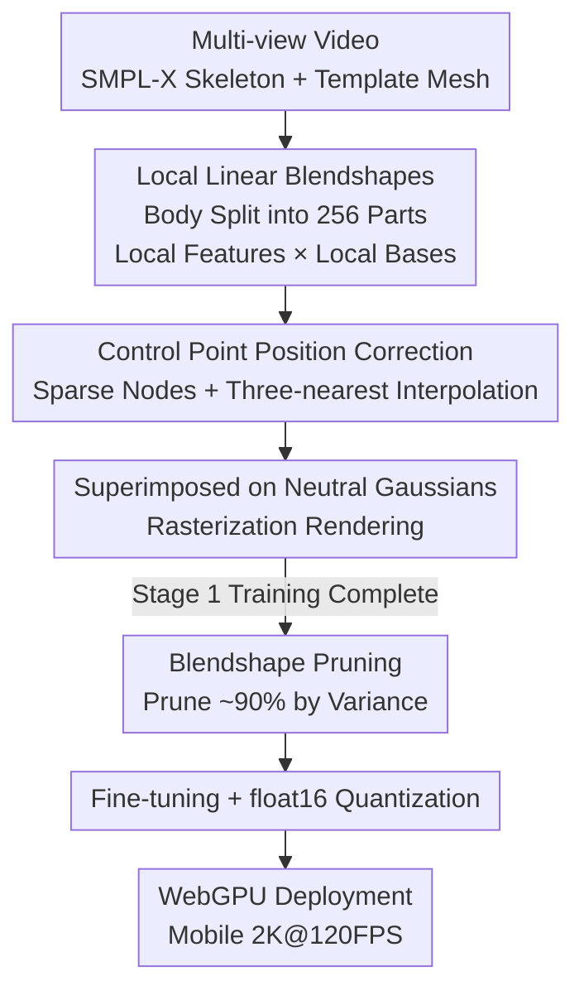

# High-Fidelity Mobile Avatars with Pruned Local Blendshapes

**Conference**: CVPR 2026  
**arXiv**: [2605.01854](https://arxiv.org/abs/2605.01854)  
**Code**: https://gapszju.github.io/webavatar/ (Available)  
**Area**: 3D Vision / Human Understanding / Digital Humans  
**Keywords**: 3D Gaussian Splatting, Digital Human, Blendshape Pruning, Mobile Rendering, WebGPU

## TL;DR
This work pushes the pose-dependent appearance decoding of 3DGS-based full-body digital humans to the extreme using "local linear blendshapes + 90% blendshape pruning." Through end-to-end training (without pre-trained large models), it achieves 2K resolution at 120 FPS in mobile browsers with a model size of only 19.4 MB.

## Background & Motivation
**Background**: 3D Gaussian Splatting (3DGS) has become the mainstream representation for reconstructing drivable digital humans from multi-view videos. To generate realistic non-rigid appearances (clothing folds, shadows) as the pose changes, "pose-dependent" Gaussian attributes must be predicted. High-quality methods (e.g., AnimatableGS) use convolutional networks to decode attributes for each Gaussian, yielding good quality but heavy decoding overhead. Mobile-oriented methods (e.g., TaoAvatar, SqueezeMe) are inspired by SMPL blendshapes, modeling Gaussian attributes as a linear combination of "global pose features × blendshapes" to enable real-time performance on VR/mobile devices.

**Limitations of Prior Work**: Mobile-oriented approaches face three specific drawbacks. First, TaoAvatar and SqueezeMe require training a high-quality teacher model followed by distillation, resulting in slow training and complex pipelines. Second, they use **a single global pose feature** to linearly combine all blendshapes across the whole body; however, Gaussian attributes are **non-linear** relative to poses, leading to large global linear fitting errors and loss of detail. Third, blendshapes themselves are voluminous (often multiple times the size of Gaussian attributes), posing a significant burden on storage, memory, and computation on bandwidth-constrained mobile devices. SqueezeMe attempts to save computation by letting neighboring Gaussians share correctives, resulting in severe detail degradation.

**Key Challenge**: There is a fundamental tension between "using simple linear operations to decode pose-dependent appearance (to save computation)" and "accurately fitting highly non-linear Gaussian attributes (to preserve detail)"—global linearity is too coarse, while global non-linearity is too heavy.

**Key Insight**: The authors observe that Gaussian attributes exhibit strong **locality**—neighboring Gaussians within a local body region are highly correlated (e.g., a group of Gaussians darkens together to simulate shadows when occluded), but correlations between different parts (arm vs. leg) are weak. From a PCA perspective, performing PCA on all body Gaussians simultaneously fails to capture this cluster-based fine covariance structure; however, **performing local PCA by part** can capture fine local covariance and explain the total variance with very few eigenvectors.

**Core Idea**: The body is partitioned into several local components, where **each component uses its own local pose features × local blendshapes** to linearly represent the non-linear variations of its Gaussians (approximating global non-linearity with local linearity). Furthermore, observing that "only a few Gaussians truly change with pose" (shoes and head remain almost constant), **pruning** is used to remove blendshapes from most Gaussians, turning them into constant Gaussians for extreme model compression. The entire pipeline is trained end-to-end without requiring pre-training or distillation.

## Method

### Overall Architecture
The input is multi-view video. Human masks are extracted and SMPL-X skeletons are tracked frame-by-frame. $N_g = 200K$ Gaussians are uniformly sampled on the template mesh. Reconstruction consists of two stages: In the **first stage**, the body is divided into $N_G = 256$ local components. Each component uses a small MLP to predict local pose features from pose and expression, which are then linearly combined with the component's local blendshape matrix to obtain correctives for rotation, scale, and color. These are added to the "neutral Gaussians" to obtain pose-dependent appearances (position correctives are separately interpolated using sparse control points). In the **second stage**, the variance of each Gaussian's corrective across the training set is calculated, and blendshapes for Gaussians with low variance are pruned (approx. 90% pruned), followed by fine-tuning. Finally, the model is quantized to float16 and implemented using Rust + WebGPU for deployment as a mobile-accessible web page.

### Key Designs

**1. Local Linear Blendshapes: Approximating Global Non-linearity with Local Linearity**

To address the issue that "global pose features × full-body blendshapes cause large errors and loss of detail," the authors sample $N_G = 256$ points on the template mesh using Poisson-disk sampling. Each Gaussian is assigned to the nearest sampling point, forming 256 local components (the template mesh is used only for initialization and discarded after grouping). For the $i$-th component, a local blendshape matrix $B^i$ is defined with shape $[N_{G^i}, N_B, 10]$, where $N_B = 16$ is the blendshape dimension and 10 corresponds to quaternion rotation, scale, and RGB color. Each component is assigned a **dedicated small MLP** that takes pose $\bm{\theta}_p$ (63D joint axis-angles) and expression $\bm{\theta}_e$ (first 10D of FLAME) as input, outputting local pose features $\mathbf{e}^i = \mathsf{MLP}^i(\bm{\theta}_p \oplus \bm{\theta}_e)$. For non-head components, pose is zeroed out to reduce crosstalk from expressions. Correctives $\{\delta\mathbf{r}^k, \delta\mathbf{s}^k, \delta\mathbf{c}^k\} = B^i \cdot \mathbf{e}^i$ are obtained by weighted summation over $N_B$ dimensions. This works because the Gaussian covariance structure within a local part is fine and strongly correlated, allowing a few bases to explain the total variance—equivalent to performing local PCA, which is much more accurate than global linear fitting while the computation remains a simple linear combination.

**2. Control Point Position Correction: Reducing Per-Gaussian Offset Overhead via Sparse Nodes**

Non-rigid deformation also requires position correctives $\delta\mathbf{x}$, but providing position blendshapes for all 200,000 Gaussians is too heavy. Inspired by mmlphuman, the authors assume a global corrective function exists that only needs to be evaluated at discrete nodes. Specifically, $N_s = 10K$ Gaussians are uniformly sampled as control nodes. Local position blendshape matrices $B^i_s$ (shape $[N_{G_s^i}, N_B, 3]$) are defined for nodes in each component. Node displacements are similarly obtained via $\{\delta\mathbf{x}_s^k\} = B^i_s \cdot \mathbf{e}^i$. The displacement of each Gaussian is then interpolated from the 3 nearest nodes using inverse distance weighting $\delta\mathbf{x} = \frac{\sum_j \alpha_j \delta\mathbf{x}_s^j}{\sum_j \alpha_j}$ ($\alpha_j = 1/\|\mathbf{x} - \mathbf{x}_s^j\|$). By reducing per-Gaussian position prediction to "sparse nodes + local interpolation," the model preserves non-rigid expressive power while saving computation. Colors do not use high-order SH (human bodies are mostly diffuse), and opacity is set as a constant to further reduce load.

**3. Blendshape Pruning: Removing Everything Except the "Few Gaussians That Actually Move"**

To address the issue that "blendshape volume is the primary burden," the core observation is that dynamic appearance is determined by a minority of Gaussians; most Gaussians (e.g., shoes, head) barely change with pose, making their blendshapes redundant. The difficulty is that blendshapes are learned, so it is unknown which to prune before training. Therefore, the authors first train an **over-parameterized** full blendshape model and then prune. After the first stage converges, they calculate the variance of rotation, scale, and color correctives for each Gaussian across all training poses: $\hat{r} = Var(\{\delta\mathbf{r}_p\})$, $\hat{s} = Var(\{\delta\mathbf{s}_p\})$, and $\hat{c} = Var(\{\delta\mathbf{c}_p\})$. For these three attribute types, they **independently** retain blendshapes for the top $N_P = 20K$ Gaussians with the largest variance and prune the rest (others become constant Gaussians). Sparse blendshapes can be stored in a compact format. To ensure pruning does not damage appearance, an $L_1$ constraint $\mathcal{L}_{cst} = \lambda_{\delta\mathbf{r}}\|\delta\mathbf{r}\|_1 + \|\delta\mathbf{s}\|_1 + \lambda_{\delta\mathbf{c}}\|\delta\mathbf{c}\|_1$ ($\lambda_{\delta\mathbf{r}} = 0.02, \lambda_{\delta\mathbf{c}} = 0.002$) is added in the first stage to encourage small correctives, limiting the impact of pruned Gaussians. This constraint is removed during fine-tuning. This process prunes about 90% of blendshape parameters, reducing model size from 72.4 MB to 19.5 MB and memory from 155 MB to 105 MB, with almost no loss in image quality.

### Loss & Training
The loss follows AnimatableGS: $\mathcal{L} = \mathcal{L}_1 + \lambda_{lpips}\mathcal{L}_{lpips} + \mathcal{L}_{scale} + \mathcal{L}_{cst}$, with $\lambda_{lpips} = 0.1$, $\mathcal{L}_{scale}$ to prevent excessive Gaussian expansion, and $\mathcal{L}_{cst}$ used only in the first stage. The first stage trains for 200K iterations and the fine-tuning stage for 80K iterations with a batch size of 4, taking approximately 7.5 hours on a single RTX 4090. During deployment, MLPs, blendshapes, and attributes are quantized to float16 (with some integer parameters to int16), resulting in a model of ~19.4 MB. The implementation uses Rust + WebGPU, where compute shaders handle MLP inference, blendshape combination, and LBS, followed by the c3dgs rasterizer for sorting and blending.

## Key Experimental Results

Datasets: AvatarRex, TalkingBody4D, ActorsHQ, DREAMS-Avatar (mostly 2K resolution with dozens to hundreds of cameras). Compared against AnimatableGS, mmlphuman, TaoAvatar, and SqueezeMe. Since the latter two are not open-sourced, values and figures are taken directly from their papers (marked with *).

### Main Results

AvatarRex (novel view + novel pose, following SqueezeMe settings, 2K resolution):

| Method | L1↓ | PSNR↑ | SSIM↑ | LPIPS↓ | FPS@4090↑ | Mobile Support |
|------|------|-------|-------|--------|-----------|--------|
| AnimatableGS | 0.02270 | 25.508 | 0.8655 | 0.1550 | 16 | No |
| mmlphuman | 0.02371 | 25.276 | 0.8617 | 0.1573 | 315 | Hard (Large Model) |
| SqueezeMe* | 0.059 | 20.051 | 0.849 | 0.158 | – | Yes |
| TaoAvatar* | – | – | – | – | 156 | Yes |
| **Ours** | 0.02343 | 25.346 | 0.8606 | 0.1576 | **1683** | **Yes** |

Key Point: Among mobile-compatible methods, Ours is significantly better than SqueezeMe (PSNR 25.35 vs 20.05) and on par with the heavy AnimatableGS/mmlphuman, while the rendering speed on 4090 (1683 FPS) far exceeds all competitors.

Comparison with TaoAvatar on TalkingBody4D:

| Metric (Novel View / Novel Pose+Expr) | TaoAvatar* | Ours |
|------|-----------|------|
| PSNR↑ (NV / NP) | 33.81 / 28.38 | **34.44** / 27.90 |
| SSIM↑ (NV / NP) | 0.9689 / 0.9389 | **0.9771** / **0.9395** |
| LPIPS↓ (NV / NP) | 0.06437 / 0.08874 | **0.03642** / **0.05582** |

Ours performs better on most metrics, recovering details like small text on pants and clothing wrinkles (novel-pose PSNR is only slightly lower than TaoAvatar).

### Ablation Study

Design Ablation (AvatarRex, trained pose + novel view):

| Configuration | L1↓ | PSNR↑ | SSIM↑ | LPIPS↓ |
|------|------|-------|-------|--------|
| Full (Ours) | 0.01488 | 29.405 | 0.9207 | 0.1074 |
| Global feature 16 | 0.01777 | 27.645 | 0.8978 | 0.1276 |
| Global feature 64 | 0.01744 | 27.913 | 0.8988 | 0.1270 |
| No pruning | 0.01471 | 29.342 | 0.9188 | 0.1076 |

Overhead Comparison before and after Pruning (RTX 3050, 2K):

| Configuration | FPS@3050↑ | VRAM(MB) | Model Size(MB) |
|------|-----------|----------|--------------|
| Ours | **312** | **105** | **19.5** |
| No Pruning | 191 | 155 | 72.4 |

### Key Findings
- **Local features are the main driver of quality**: Replacing them with global pose features (length 16 or 64, where 64 is the SqueezeMe setting) causes PSNR to drop from 29.41 to 27.6~27.9 with obvious loss of detail, proving "local linear" is much more accurate than "global linear."
- **Pruning barely affects quality but significantly reduces load**: After pruning 90% of blendshapes, PSNR only changed from 29.34 (No pruning) to 29.41. Quality remains consistent, while model size drops from 72.4 to 19.5 MB, VRAM from 155 to 105 MB, and FPS on 3050 increases from 191 to 312.
- **The bottleneck is sorting/rasterization, not decoding**: Blendshape combination time dropped from 2.26 ms to 0.52 ms, but the bulk of the frame time is Gaussian sorting and rendering, so the FPS Gain is lower than the model compression ratio.

## Highlights & Insights
- **The reasoning chain "Locality → Local PCA → Local Linear Blendshapes" is elegant**: Starting from the cluster structure of Gaussian attribute covariance, it demonstrates that "local linear approximation for each part can approximate global non-linearity," reducing a seemingly non-linear problem requiring heavy networks to a simple linear combination—the key to both quality and efficiency.
- **The "Over-parameterize then prune by variance" paradigm is reusable**: When basis functions are learned and it is not known what to prune beforehand, training to completion and then using statistics (corrective variance here) for importance ranking and pruning is a general-purpose strategy for "learned bases of unknown importance," transferable to other learned basis/dictionary compression tasks.
- **End-to-end, No Pre-training/Distillation**: Unlike TaoAvatar/SqueezeMe, which require pre-training a large model followed by distillation, this work directly optimizes blendshapes. This simplifies the workflow and is the prerequisite for open-sourcing the full training code.
- **WebGPU + Rust Cross-platform Landing**: The same implementation can be compiled into a desktop native program or a browser web page. Users can simply open a URL on their mobile phone, pushing a "research demo" truly into consumer-grade devices.

## Limitations & Future Work
- **Bottleneck shift to rasterization**: The authors acknowledge that FPS Gain from pruning is limited by sorting/rendering bottlenecks; decoding is already very fast. Further speedups require optimizing Gaussian sorting and blending rather than the decoding end.
- **Dependency on multi-view capture and SMPL-X registration**: The method requires multi-camera video and accurate skeleton tracking, and its applicability to monocular/in-the-wild scenes is unverified (ActorsHQ even borrows registrations from AnimatableGS).
- **Component partitioning is fixed uniform sampling**: The 256 parts are obtained via Poisson-disk sampling and are not adaptive to the dynamic complexity of different body areas; high-frequency motion zones and nearly static zones use the same granularity, which may not be optimal.
- **Several empirical hyperparameters**: $N_G, N_B, N_s, N_P$ are fixed empirical values without sensitivity analysis; whether $N_P = 20K$ for "top-K retention" is robust across different body types/clothing remains to be examined.

## Related Work & Insights
- **vs TaoAvatar / SqueezeMe**: These use "global pose features × full-body blendshapes" and rely on pre-trained teacher model distillation; Ours uses local features + local blendshapes (more accurate, preserves detail), trains end-to-end (simpler), and adds pruning to compress the model. Quality-wise, it leads among mobile methods and provides full training code.
- **vs mmlphuman**: Also uses basis functions for Gaussian attributes, but mmlphuman's bases are redundant, heavy in storage/computation, and hard to run on mobile. The pruning in this work specifically targets this redundancy, stripping 90% while maintaining quality.
- **vs AnimatableGS**: Uses CNNs to decode per-Gaussian attributes, achieving the highest quality but being slow (16 FPS on 4090, not for mobile). This work uses linear blendshape decoding to approximate its quality with speeds two orders of magnitude faster.
- **vs SplattingAvatar / HRM2Avatar, etc.**: These either don't model dynamic appearance or focus on monocular input, making it difficult to express rich pose-dependent details. This work specifically solves the "Mobile + High-fidelity dynamic appearance" combination.

## Rating
- Novelty: ⭐⭐⭐⭐ The combination of local linear blendshapes + post-learning variance pruning is insightful; individual ideas have origins but the synthesis is solid.
- Experimental Thoroughness: ⭐⭐⭐⭐ Four datasets, comparison with four representative methods, complete design/pruning ablations; however, some competitor values are taken from papers and sensitivity analysis is lacking.
- Writing Quality: ⭐⭐⭐⭐ The motivation reasoning chain is clear, formulas are complete, and the pipeline/pruning processes are well-explained.
- Value: ⭐⭐⭐⭐⭐ The first open-source 3DGS method capable of running high-fidelity full-body digital humans at 2K@120FPS in a mobile browser; high deployment value.

<!-- RELATED:START -->

## Related Papers

- [\[CVPR 2026\] CraftMesh: High-Fidelity Generative Mesh Manipulation via Poisson Seamless Fusion](craftmesh_high-fidelity_generative_mesh_manipulation_via_poisson_seamless_fusion.md)
- [\[CVPR 2026\] CustomTex: High-fidelity Indoor Scene Texturing via Multi-Reference Customization](customtex_high-fidelity_indoor_scene_texturing_via_multi-reference_customization.md)
- [\[CVPR 2026\] CrowdGaussian: Reconstructing High-Fidelity 3D Gaussians for Human Crowd from a Single Image](crowdgaussian_reconstructing_high-fidelity_3d_gaussians_for_human_crowd_from_a_s.md)
- [\[CVPR 2026\] HyperGaussians: High-Dimensional Gaussian Splatting for High-Fidelity Animatable Face Avatars](hypergaussians_high-dimensional_gaussian_splatting_for_high-fidelity_animatable_.md)
- [\[CVPR 2026\] Learning 3D Shape Fidelity Metric from Real-world Distortions](learning_3d_shape_fidelity_metric_from_real-world_distortions.md)

<!-- RELATED:END -->
