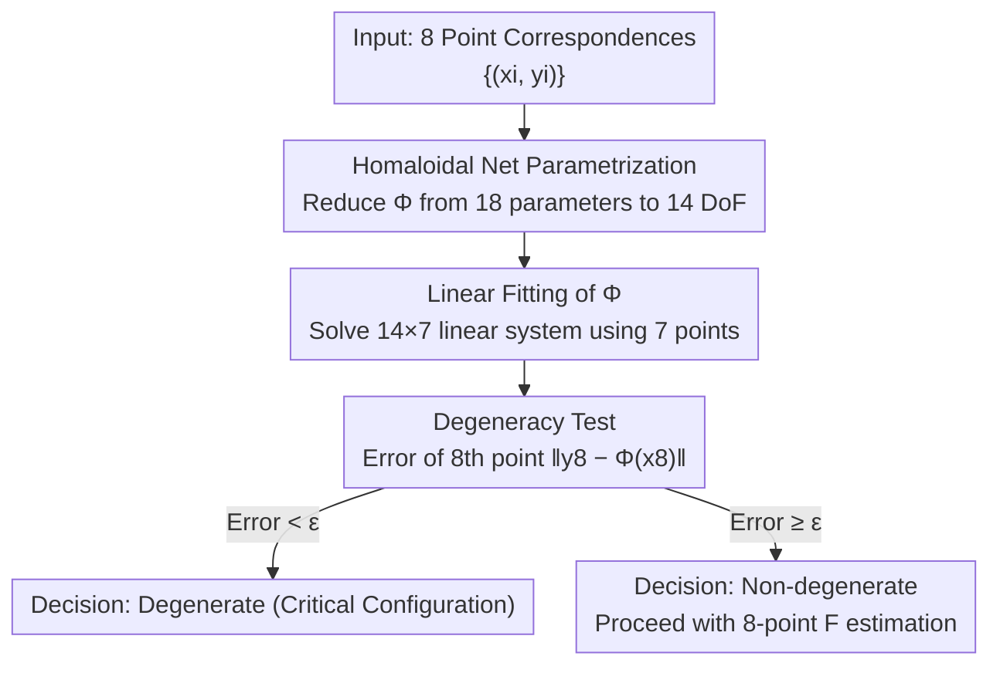

# Homaloidal parametrization for detecting critical two-view configurations

**Conference**: CVPR 2026  
**Paper**: [CVF Open Access](https://openaccess.thecvf.com/content/CVPR2026/html/Madhavan_Homaloidal_parametrization_for_detecting_critical_two-view_configurations_CVPR_2026_paper.html)  
**Code**: https://github.com/rakshith95/degeneracy-homoloidal  
**Area**: 3D Vision / Multi-view Geometry  
**Keywords**: Fundamental Matrix, Critical Configurations, Degeneracy Detection, Quadratic Transformation, Homaloidal Net  

## TL;DR
This paper proposes a novel quadratic transformation parametrization for detecting general critical surface degeneracies in two-view configurations using the "homaloidal net of conics" from projective geometry. By solving a **linear system** with 7 image correspondences to fit the quadratic transformation and using an 8th point for verification, the method identifies degeneracies **without pre-estimating the fundamental matrix**. It achieves higher precision and approximately 200× faster performance than the only comparable method by Luong–Faugeras.

## Background & Motivation

**Background**: Estimating the fundamental matrix $F$ from image correspondences is a core step in Structure-from-Motion (SfM) pipelines. However, when the scene geometry falls into "critical configurations," the estimation of $F$ becomes unstable or theoretically non-unique. Typical degeneracies include pure camera rotation, all 3D points being coplanar with the camera centers, or all 3D points and camera centers lying on a **ruled quadric** (e.g., hyperboloid of one sheet, cone, cylinder), known as a "critical surface."

**Limitations of Prior Work**: In practice, only the "planar scene" case has a widely adopted degeneracy detector based on the homography matrix $H$ (since $H$ is a linear mapping between image points and easy to estimate). For general **critical surfaces**, a practical detector has been missing: the only existing general method is Luong–Faugeras [19], which estimates an initial $F_P$, then solves a non-linear iterative optimization to find a second $F_Q$, forming a quadratic transformation for verification.

**Key Challenge**: Luong–Faugeras has two fundamental issues: (1) It **depends on a pre-estimated $F_P$**, which is ill-conditioned near critical configurations, creating a circular dilemma of needing to estimate the most unreliable quantity to detect the degeneracy. (2) Non-linear iterative optimization is slow and often fails to converge to the global optimum.

**Goal**: To design a stable and practical degeneracy detector for general critical surfaces that avoids pre-estimating the fundamental matrix, relies only on linear systems, and can determine degeneracy directly from 8 correspondences.

**Key Insight**: A known result in geometry states that 3D points on a critical surface are related across two images by a **quadratic transformation $\Phi$** (a plane-to-plane birational mapping with 14 degrees of freedom). The problem thus becomes how to fit this $\Phi$ stably and linearly.

**Core Idea**: Parametrize $\Phi$ using the "homaloidal net of conics" from classical algebraic geometry—a tool never previously used for degeneracy detection. Through this parametrization, fitting $\Phi$ reduces to solving a linear system, bypassing fundamental matrix estimation entirely.

## Method

### Overall Architecture
The input consists of 8 point correspondences $\{(x_i,y_i)\}_{i=1}^{8}$ (in homogeneous coordinates), and the output is a binary decision: whether these correspondences originate from a critical configuration. The pipeline involves randomly selecting 7 points to solve a $14\times 7$ linear system for the quadratic transformation $\Phi$ using homaloidal net parametrization. The 8th point is then projected via $\Phi$ to measure the reprojection error $\mathrm{err}(x_8,y_8)=\lVert y_8-\Phi(x_8)\rVert$. If the error is below a threshold $\epsilon$, the configuration is deemed degenerate; otherwise, it is non-degenerate and safe for 8-point $F$ estimation. No fundamental matrix is computed during this process.

### Key Designs

**1. Homaloidal Net Parametrization: Explicitly extracting the 14 DoF of $\Phi$**

A general quadratic plane-to-plane mapping $\Phi$ consists of three quadratic homogeneous polynomials in $x_0,x_1,x_2$ (Eq. 1), totaling 18 parameters. Linear fitting would require at least 9 points—more than estimation of $F$. However, as a birational quadratic transformation, $\Phi$ actually has only 14 degrees of freedom. This paper uses the algebraic structure of homaloidal nets to extract these 14 DoF.

Specifically, a quadratic transformation can be represented by a pair of **bilinear equations** $y_0L_0+y_1L_1+y_2L_2=0$ and $y_0M_0+y_1M_1+y_2M_2=0$ (Lemma 1), where $L_i, M_i$ are linear forms of $x$. The key observation (Prop. 3) is that the homaloidal net remains invariant under left-multiplication of the $2\times3$ coefficient matrix by any $2\times2$ invertible matrix $H$. Consequently, four parameters ($l_{00},l_{10},m_{00},m_{10}$) can be **fixed to random values**, leaving exactly 14 free parameters. This algebraic insight turns the abstract DoF count of $\Phi$ into a concrete, solvable parameter set.

**2. 7-point Linear Fitting of $\Phi$: A $14\times 7$ linear system without $F$**

With the 14-parameter model, each correspondence $(x_i,y_i)$ contributes two linear constraints from the bilinear equations (Eq. 12). Seven points yield 14 constraints, forming a linear system $Az=b$ (Algorithm 1). The design matrix $A$ is constructed from monomials like $[x_0y_2,x_1y_0,\dots,x_2y_2]$, and $b$ contains constant terms derived from the fixed parameters. The system is exactly determined for 7 points and can be solved using least squares for more points.

This is the essential difference from Luong–Faugeras, which first estimates up to three $F_P$ matrices using the 7-point algorithm and then applies `lsqnonlin` for each to fit $F_Q$ (geometric transfer error in Eq. 4). The proposed method is more stable because it avoids the ill-conditioned $F$ estimation in critical regions.

**3. 8th-point Degeneracy Test: Converting degeneracy to a reprojection error threshold**

Since 7 points can always fit $\Phi$ regardless of criticality, the discriminative power comes from the 8th point. The error is defined as $\mathrm{err}(x_8,y_8)=\lVert y_8-\Phi(x_8)\rVert$ (Eq. 13). If all 8 points lie on a critical surface, they obey $\Phi$ with minimal error; otherwise, the error is significantly larger. The threshold $\epsilon$ is comparable to image noise and similar to RANSAC thresholds for $F$. The authors highlight that F1 scores remain near 1.0 across a wide range of thresholds, indicating stability.

### Loss & Training
This method is a geometric solver and requires no training. It is implemented in MATLAB and tested on a laptop with an i5-14500HX CPU and 16GB RAM.

## Key Experimental Results

Experiments were primarily conducted on synthetic critical configurations (consistent with [6, 11, 19]), supplemented by real images. Critical surfaces were modeled using hyperboloids of one sheet, where points were projected using randomly generated camera pairs. Luong–Faugeras [19] served as the primary baseline.

### Main Results: Zero-noise Stability + Classification F1

| Scene | Metric | Ours | Luong–Faugeras [19] | Note |
|------|------|------|---------------------|------|
| 8th-point Error (100 trials) | Median Error | **9×10⁻¹⁵** | 3×10⁻⁵ | Ours: [1e-16, 7e-12], LF: [6e-15, **0.96**] |
| No-noise Classification | F1 | **1.0** (Wide range) | Always < 1 | LF fails due to unstable $F$ estimation |
| Runtime (Single test) | Time | **8.5 ms** | 1.65 s | Approx. **200× Speedup** |

### Ablation Study

| Configuration | Key Observation | Note |
|------|---------|------|
| 3D distance from critical surface $\theta\in[10^{-20},10^0]$ | Our error rises smoothly with $\theta$; LF error is large/high variance even at small offsets | $F$ is ill-conditioned near critical regions, affecting LF |
| 2D correspondence Gaussian noise $\sigma\in[10^{-20},10^0]$ | Both degrade with noise, but Ours maintains lower error and F1≈1 over a wider range | Verification of robustness |
| Real Image (Cylindrical plaza layout) | 8th-point error ~4×10⁻⁵ pixels; correctly classified as degenerate | Validation on real-world critical geometry |
| Real Planar Scene | Coplanar error err≈1.43×10⁻⁵; General position err≈0.94 | Universal for degeneracies where quadrics degrade to planes |

### Key Findings
- **Stability stems from bypassing $F$**: All instabilities in LF arise from pre-estimating $F$ at critical points. Ours solves directly from image correspondences, leading to a median error roughly 10 orders of magnitude lower than LF.
- **Threshold $\epsilon$ Insensitivity**: In zero-noise conditions, F1=1 covers a broad threshold range, meaning precise tuning is not required for deployment.
- **Universality**: While homography detection is specific to planes, the quadratic transformation test holds for any critical surface, including those that degenerate into planes.

## Highlights & Insights
- **Applying Algebraic Geometry to Vision**: The homaloidal net of conics is a novel addition to degeneracy detection. Using its invariance (Prop. 3) to reduce $\Phi$ from 18 to 14 parameters turns a non-linear problem into a linear one—a strategy applicable to other birational mapping problems.
- **Minimalist "Leave-one-out" Criterion**: 7-point fitting + 8th-point error check compresses complex degeneracy detection into a simple reprojection threshold, making it easy to implement (millisecond speed, 200x faster).
- **Paradigm for Ill-conditioned Problems**: Instead of estimating an ill-conditioned quantity, the authors substitute it with an equivalent but well-conditioned mapping ($\Phi$ instead of $F$).

## Limitations & Future Work
- The experiments rely heavily on synthetic data; the real-world validation is qualitative and lacks a large-scale quantitative benchmark.
- The method is designed for non-minimal cases (≥8 points); the 7-point minimal case (which has a different definition of degeneracy) is out of scope.
- The output is a binary decision; it does not yet extract specific geometric parameters (like surface type or plane+parallax) for reconstruction. Future work may explore the behavior of $\Phi$ when points are coplanar and its utility in 3D reconstruction.
- ⚠️ OCR artifacts: The quadratic transformation $\Phi$ and some indices in Eq. 1 and Eq. 12 may have minor typesetting discrepancies in the source; refer to the original paper for precise coefficient arrangements.

## Related Work & Insights
- **vs Luong–Faugeras [19]**: Same task and assumptions. LF estimates $F_P$ then fits $F_Q$; Ours uses homaloidal net to solve $\Phi$ linearly without $F$. Ours is more stable (10 orders of magnitude lower error), faster (200x), and threshold-insensitive.
- **vs Homography / Model Selection (GRIC [27], DEGENSAC [8,14])**: Those methods focus on pure rotation or planar degeneracies (using linear $H$). Ours covers general critical surfaces (using quadratic $\Phi$), providing a more universal criterion.
- **vs Minimal 7-point Case [11,12]**: Minimal cases define degenerate loci on Riemannian manifolds and require curve tests or homotopy continuation for implicit functions. Ours is a practical, linearized approach for non-minimal cases.
- **vs Machine Learning / Deep Classification [3,22,23]**: Those treat degeneracy as a black-box classification problem. Ours is purely geometric, requiring no training or 3D reconstruction.

## Rating
- Novelty: ⭐⭐⭐⭐⭐ First introduction of homaloidal nets to degeneracy detection.
- Experimental Thoroughness: ⭐⭐⭐ Strong synthetic analysis; needs larger real-world quantitative datasets.
- Writing Quality: ⭐⭐⭐⭐ Clear geometric derivation, though requires some background in algebraic geometry.
- Value: ⭐⭐⭐⭐ Provides a stable, practical, and millisecond-level degeneracy detector for SfM.

<!-- RELATED:START -->

## Related Papers

- [\[CVPR 2026\] Cross-View Splatter: Feed-Forward View Synthesis with Georeferenced Images](cross-view_splatter_feed-forward_view_synthesis_with_georeferenced_images.md)
- [\[CVPR 2026\] ArchSym: Detecting 3D-Grounded Architectural Symmetries in the Wild](archsym_detecting_3d-grounded_architectural_symmetries_in_the_wild.md)
- [\[CVPR 2026\] From Rays to Projections: Better Inputs for Feed-Forward View Synthesis](from_rays_to_projections_better_inputs_for_feed-forward_view_synthesis.md)
- [\[CVPR 2026\] Intrinsic Image Fusion for Multi-View 3D Material Reconstruction](intrinsic_image_fusion_for_multi-view_3d_material_reconstruction.md)
- [\[CVPR 2026\] FreeScale: Scaling 3D Scenes via Certainty-Aware Free-View Generation](freescale_scaling_3d_scenes.md)

<!-- RELATED:END -->
