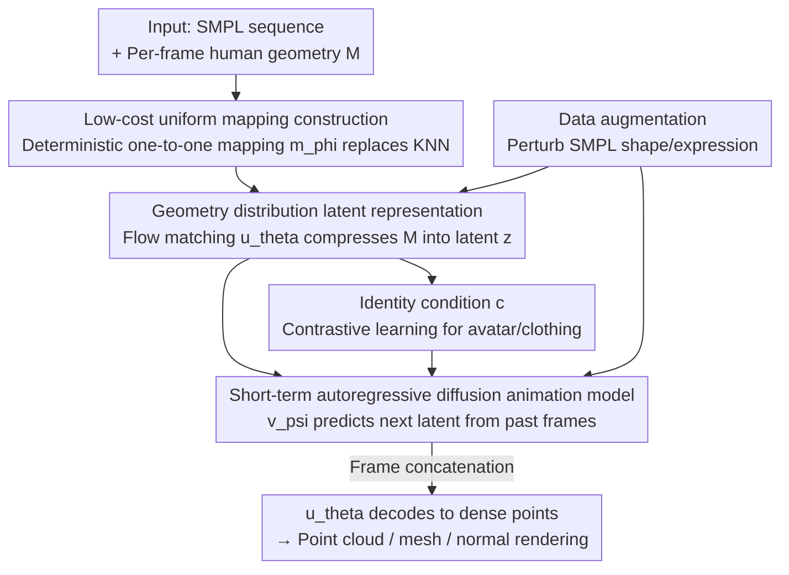

# Human Geometry Distribution for 3D Animation Generation

**Conference**: CVPR 2026  
**Paper**: [CVF Open Access](https://openaccess.thecvf.com/content/CVPR2026/html/Tang_Human_Geometry_Distribution_for_3D_Animation_Generation_CVPR_2026_paper.html)  
**Code**: TBD  
**Area**: 3D Vision  
**Keywords**: 3D Human Animation Generation, Geometry Distribution, Flow Matching, Autoregressive Diffusion, Clothing Dynamics

## TL;DR
This paper proposes a two-stage generation framework that first compresses per-frame 3D human geometry into a compact latent using an improved "Human Geometry Distribution (HuGeoDis)" and then generates short-term transitions in the latent space via identity-conditioned autoregressive diffusion. This approach synthesizes 3D human sequences with fine-grained clothing wrinkles, natural dynamics, and consistent identity even with scarce 3D animation data (reducing reconstruction Chamfer distance by approximately 90% and improving user study scores by 2.2x).

## Background & Motivation

**Background**: 3D human animation generation requires achieving two objectives simultaneously: capturing fine-grained geometric details (wrinkles, fabric folds) and synthesizing clothing dynamics that deform naturally with body movement. Early data-driven clothing deformation methods (TailorNet, PBNS, DeePSD) produce reasonable dynamics under limited data, but they are tied to specific clothing templates and are not generative, failing to generalize to unseen avatars or garments. Generative avatar models (GAN/NeRF/Gaussian Splatting based) can cover diverse identities but often fail to maintain high-fidelity geometry or learn realistic clothing deformation.

**Limitations of Prior Work**: No existing method can **simultaneously** satisfy "high-fidelity geometry + realistic clothing dynamics + generative generalization." Point cloud-based methods (CloSET, SCALE) are limited by sparse sampling, resulting in blurry details in loose or high-frequency regions. The predecessor HuGeoDis, which utilizes geometry distribution, can synthesize high-fidelity geometry from compact representations; however, it uses KNN to find the nearest points on SMPL to construct mappings, leading to **severe non-uniformity** in SMPL surface sampling—where some points correspond to many human points while others have almost none. Consequently, an extremely high number of points (over a million) is required to cover the geometry, resulting in low efficiency.

**Key Challenge**: On one hand, 3D human animation data is extremely scarce, making it easy to overfit long-sequence temporal dependencies and difficult to capture the many-to-one mapping of "one pose corresponding to diverse dynamics." On the other hand, the requirement for both fine details and compact representation creates a difficult trade-off.

**Goal**: This work decomposes the task into two sub-problems: (1) creating a latent representation that is both compact and capable of expressing high-fidelity geometry with uniform, efficient sampling; (2) learning a generalizable animation generation model under data scarcity.

**Key Insight**: The authors observe that the bottleneck of HuGeoDis lies not in the representation itself but in the non-uniformity of the "SMPL $\leftrightarrow$ Human" mapping. Drawing on the experience that modeling short-term transitions is more data-efficient than learning long sequences directly, they decompose the animation into autoregressively concatenable short segments.

**Core Idea**: Replace KNN with a **cheap, deterministic, one-to-one approximate mapping** to construct the target geometry distribution, making sampling uniform. Then, utilize **identity conditioning + short-term autoregressive diffusion** in the latent space to generate long animations.

## Method

### Overall Architecture
The method follows a common two-stage latent diffusion framework. A dynamic sequence consists of $N$ frames of "SMPL–Human" pairs $H=\{(S_1,M_1),\dots,(S_N,M_N)\}$. **Stage 1** learns the latent space: HuGeoDis is used to compress each frame's human geometry $M$ into a rank-3 tensor latent $z\in\mathbb{R}^{C\times H\times W}$. A flow matching network $u_\theta(x_t\mid t,x_S,S,z)$ reconstructs human surface points conditioned on SMPL points $x_S$ and latent $z$. The key improvement is replacing KNN with a "low-cost mapping construction" for more uniform SMPL $\leftrightarrow$ Human correspondence. **Stage 2** learns animation generation: treating the per-frame latent $z$ as the generation target, an autoregressive conditional diffusion model $v_\psi$ predicts the next frame latent from previous latents and the corresponding SMPL sequence. An identity condition $c$ is introduced to maintain long-term consistency, and sequences of arbitrary length are synthesized frame-by-frame. During inference, a latent sequence is sampled first, then decoded into dense geometric points via $u_\theta$ (which can be converted to mesh via Poisson reconstruction or rendered via Gaussian splatting).

### Key Designs

**1. Low-cost uniform mapping: Replacing KNN with deterministic one-to-one mapping**

Geometry distribution models the human surface $M$ as a probability distribution. HuGeoDis further introduces the SMPL surface $S$, but instead of learning $x_S \to x_M$ directly, it constructs a pair set $p=\{(x_S,x_M)\}$ and uses flow matching to learn a velocity field $u_\theta(x_t\mid t,x_S)$ from $\mathcal{N}(0,1)$ to the target distribution $T(p)=\{x_M-x_S\mid (x_S,x_M)\sim p\}$ (where $x_t=(1-t)x_0+tx_1$ and the training objective is $\arg\min_\theta \mathbb{E}\,\|u_\theta(x_t\mid t)-(x_1-x_0)\|$). The problem lies in how $p$ is constructed: HuGeoDis uses KNN to find the nearest point on SMPL for each human point $x_S=\arg\min_{x'_S\sim S}\|x_M-x'_S\|$, causing many-to-one mappings. Consequently, uniform sampling from $S$ leads to non-uniform sampling on $M$.

While optimal transport is ideal, it is too computationally expensive for every sample. The authors instead train a supervised model $m_\phi(x_S\mid S,z_m)$ to learn a **coarse but uniform, deterministic, and one-to-one** approximate mapping, optimized via Chamfer distance $\min_\phi \mathbb{E}\,\mathrm{Chamfer}(m_\phi(x_S\mid S,z_m),x_M)$. Once trained, $m_\phi$ is used to reconstruct $p$. This ensures that regions like the face and hands are nearly one-to-one, while loose clothing regions have higher mapping density, making the overall distribution significantly more uniform than KNN. Thus, fewer points (approx. 300K) can fully cover the geometry where HuGeoDis failed even with 1M points.

**2. Short-term autoregressive diffusion: Decomposing long sequences into short transitions**

Directly modeling long sequences requires learning complex temporal dependencies from minimal samples, leading to overfitting. The authors decompose animation generation into a series of short-term transitions processed autoregressively: flow matching $v_\psi(z_t\mid t,z_{s-i:s},S_{s-i:s+1},c)$ predicts the next latent $z_{s+1}$ from previous latents $z_{s-i:s}$ and corresponding poses $S_{s-i:s+1}$, with the objective $\min_\psi \mathbb{E}\,\|v_\psi(z_t\mid t,z_{s-i:s},S_{s-i:s+1},c)-(z_{s+1}-n)\|$ ($z_t=(1-t)n+tz_{s+1}$). By fixing a short-term context window, the model generates sequences of arbitrary length without increasing computational complexity. To synthesize the initial frames, classifier-free guidance is used during training by randomly replacing conditions with a null embedding.

**3. Identity condition c: Suppressing autoregressive drift for long-term consistency**

Pure autoregression causes human geometry to drift over time, losing the original identity. The authors add an identity condition $c$ encoding the avatar and clothing. A downsampling convolutional model $w_\omega(z)$ extracts $c$ from the latent, trained with a contrastive NT-Xent loss to pull frames of the same avatar/clothing together and push different ones apart ($\min_\omega -\frac{1}{N}\sum_{(i,j)\in A}\log\frac{\exp(\mathrm{sim}(c_i,c_j)/\tau)}{\sum_{k\neq i}\exp(\mathrm{sim}(c_i,c_k)/\tau)}$). During inference, $c$ is computed only once from the first frame $z_0$ and fixed. This prevents the "forgetting / identity drift" common in long video models.

**4. Shape/Expression augmentation: Disentangling appearance latent from SMPL**

Under data scarcity, $u_\theta$ easily memorizes spurious correlations between a specific SMPL $S$ and an appearance. The authors apply shape and expression parameter augmentation to $S$ during the training of $u_\theta$ and $v_\psi$. Parameters are interpolated with a "neutral template" using a random factor (range $(-1.0, 1.5)$) and shuffled within the batch. This forces the appearance latent $z$ to disentangle from SMPL $S$, avoiding pose-appearance memorization and maintaining consistency when body shapes change.

### Loss & Training
The Stage 1 latent learning objective is the flow matching loss plus an L2 regularization $\beta\|z\|^2$. The total loss for the Stage 2 animation model is $L=L_{\text{diff}}+\alpha L_{\text{nt-xent}}$. The supervised mapping $m_\phi$ is trained separately using Chamfer distance.

## Key Experimental Results

### Main Results

Reconstruction quality and efficiency (4d-dress dataset, Chamfer Distance $\times10^{-5}$, lower is better; time measured for 20-step denoising on A100):

| Method | 100K | 300K | 500K | 1M |
|------|------|------|------|------|
| HuGeoDis | 2.65 | 2.09 | 1.95 | 1.86 |
| Supervised ($m_\phi$) | 2.72 | 2.48 | 2.43 | 2.42 |
| **Ours** | **0.52** | **0.27** | **0.22** | **0.15** |
| Time (s) | 2.15 | 6.22 | 10.28 | 20.59 |

Ours reduces Chamfer distance by nearly an order of magnitude across all settings; 300K points achieve better coverage than 1M points in HuGeoDis.

Static random 3D human generation (THuman2, FID lower is better, comparing raw geometry):

| Method | Raw Geometry | Enhanced Rendering |
|------|------|------|
| ENARF | 223.72 | 223.72 |
| GNARF | 166.62 | 166.62 |
| EVA3D | 60.37 | 60.37 |
| E3Gen | 65.32 | 28.12 |
| GetAvatar | 56.07 | 22.77 |
| gDNA | 42.90 | 17.43 |
| HuGeoDis | 16.16 | 16.16 |
| **Ours** | **14.03** | **14.03** |

### Ablation Study

Animation generation comparison and ablation (4d-dress, FID lower is better; ID/Quality/Naturalness/Conformance higher is better):

| Method | FID ↓ | ID ↑ | Quality ↑ | Naturalness ↑ | Conformance ↑ |
|------|------|------|------|------|------|
| LHM (normal) | 33.37 | N/A | 3.3 | 2.7 | 2.0 |
| LHM (geometry) | 58.19 | N/A | 1.3 | 1.7 | 1.5 |
| long-term | 27.13 | 0.61 | 3.0 | 2.2 | 2.5 |
| w/o condition | 27.68 | 0.60 | 3.1 | 2.2 | 2.6 |
| w/o augment | 24.20 | 0.76 | 3.7 | 3.1 | 3.5 |
| **Ours** | 25.01 | **0.96** | **4.4** | **4.5** | **4.4** |

### Key Findings
- **Identity condition $c$ is the most significant contributor**: Removing it causes ID to drop from 0.96 to 0.60, indicating severe identity drift.
- **Augmentation is a trade-off between FID and consistency**: Without augmentation, FID is slightly lower (24.20) because it fits the dataset distribution better, but "pose-appearance" leakage occurs, resulting in lower ID (0.76) and poor cross-pose consistency.
- **Direct long-sequence modeling leads to overfitting**: The "long-term" model shows lower quality and inconsistency on unseen motions.
- **LHM relies on rigging for appearance translation**: While identity preservation is "trivial," clothing details remain static, causing it to fall behind in Quality and Naturalness.

## Highlights & Insights
- **Pinpointing the "Representation Bottleneck" as Mapping Non-uniformity**: The authors did not overhaul the geometry distribution paradigm but found the pain point to be the many-to-one mapping in KNN. Replacing it with a cheap $m_\phi$ achieved better coverage with 1/3 the points—a prime example of precision engineering.
- **Pragmatic combination of short-term AR and identity conditioning**: Given the constraint of 3D data scarcity, using short transitions reduces data requirements, while global identity conditions recover long-term consistency.
- **Transferable Trick**: Using an independently trained deterministic mapping to restructure the target distribution of a generative model for more uniform sampling is a strategy applicable to other point cloud/surface generation tasks.
- **Downstream-friendly geometry output**: The generated point clouds can be directly Poisson-reconstructed into meshes or rendered via Gaussian splatting, maintaining a seamless pipeline for geometry and appearance.

## Limitations & Future Work
- **Lack of physical accuracy**: Due to data scarcity, simulated dynamics are generalized from different materials, which can lead to material mismatches (e.g., a leather jacket behaving like soft cloth) and occasional clothing-body interpenetration.
- **Subjective evaluation**: Evaluation relies heavily on user studies for "naturalness," which lacks standard quantitative metrics. Identity consistency for some baselines (like LHM) is difficult to measure due to distribution shifts.
- **SMPL Dependency**: The method is highly dependent on SMPL as a structural prior and may be sensitive to fitting errors or non-standard body types.
- **Future Work**: Explicit handling of interpenetration to improve physical realism and disentangling avatars from clothing for fine-grained editing.

## Related Work & Insights
- **vs HuGeoDis [38]**: Both use geometry distribution, but HuGeoDis suffers from non-uniform sampling and requires massive point counts. Ours reduces Chamfer by 90% and extends the paradigm to dynamic animations with clothing dynamics.
- **vs LHM [29]**: LHM uses Gaussian splatting with rigging for identity consistency but lacks dynamic clothing details. Ours out-performs LHM in FID and user studies for dynamics.
- **vs Clothing Deformation (TailorNet/PBNS)**: These are template-based and non-generative. Ours is a generative framework capable of generalizing across identities and garments.

## Rating
- Novelty: ⭐⭐⭐⭐ First generative 3D animation framework to simultaneously achieve high geometry fidelity and realistic dynamics.
- Experimental Thoroughness: ⭐⭐⭐⭐ Comprehensive evaluation across reconstruction, static generation, and animation, though dynamic metrics are somewhat subjective.
- Writing Quality: ⭐⭐⭐⭐ Clear logic from motivation to design; equations are well-integrated with figures.
- Value: ⭐⭐⭐⭐ Provides a pragmatic pathway for high-fidelity 3D human animation under data scarcity.

<!-- RELATED:START -->

## Related Papers

- [\[CVPR 2026\] Improving Human Image Animation via Semantic Representation Alignment](improving_human_image_animation_via_semantic_representation_alignment.md)
- [\[CVPR 2026\] HumanOrbit: 3D Human Reconstruction as 360° Orbit Generation](humanorbit_3d_human_reconstruction_as_360_orbit_generation.md)
- [\[CVPR 2026\] Affostruction: 3D Affordance Grounding with Generative Reconstruction](affostruction_3d_affordance_grounding_with_generative_reconstruction.md)
- [\[CVPR 2026\] Easy3E: Feed-Forward 3D Asset Editing via Rectified Voxel Flow](easy3e_feed-forward_3d_asset_editing_via_rectified_voxel_flow.md)
- [\[CVPR 2026\] Adapting Point Cloud Analysis via Multimodal Bayesian Distribution Learning](adapting_point_cloud_analysis_via_multimodal_bayesian_distribution_learning.md)

<!-- RELATED:END -->
