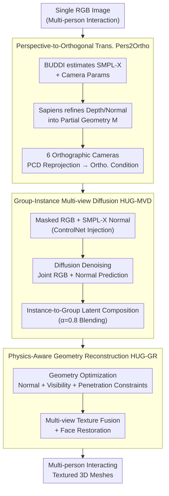

# Human Interaction-Aware 3D Reconstruction from a Single Image

**Conference**: CVPR 2026  
**arXiv**: [2604.05436](https://arxiv.org/abs/2604.05436)  
**Code**: None (Project Page: jongheean11.github.io/HUG3D_project)  
**Area**: 3D Vision  
**Keywords**: Multi-person 3D reconstruction, Human interaction, Multi-view diffusion, Physical constraints, Occlusion completion

## TL;DR
The HUG3D framework is proposed to achieve high-fidelity textured 3D reconstruction of multiple interacting humans from a single image through perspective-orthogonal view transformation, group-instance multi-view diffusion models, and physics-aware geometric reconstruction, significantly outperforming existing methods on metrics such as CD, P2S, and NC.

## Background & Motivation
1. **Background**: Single-person 3D reconstruction has made significant progress (SIFU, SiTH, PSHuman, etc.), but most focus on individuals and struggle with multi-person interaction scenarios.
2. **Limitations of Prior Work**: Multi-person scenes present three core challenges: (1) Geometric complexity and perspective distortion—depth variations in multi-person scenes are large, causing the orthographic assumption to fail; (2) Lack of interaction awareness—independent reconstruction leads to body inter-penetration and unnatural distances; (3) Missing geometry and texture in occluded regions—inter-person occlusion results in the loss of critical body part information.
3. **Key Challenge**: Existing methods treat each person independently, completely ignoring group context and interaction priors, whereas physical plausibility (contact, penetration avoidance) in multi-person interactions requires global information.
4. **Goal**: To reconstruct high-fidelity textured 3D models of interacting multiple people from a single image while ensuring physical plausibility.
5. **Key Insight**: Simultaneously utilize group-level and instance-level information, implicitly learning interaction priors via diffusion models and explicitly enforcing contact and penetration avoidance through physical constraints.
6. **Core Idea**: A multi-view diffusion model that fuses dual-level information (group/instance) to complete occlusions, combined with physics-based geometric optimization to ensure reasonable interactions.

## Method

### Overall Architecture
HUG3D consists of three stages: (1) The Pers2Ortho module transforms the input perspective image into a canonical orthographic multi-view representation; (2) The HUG-MVD diffusion model jointly completes the geometry and texture of occluded regions; (3) HUG-GR performs physics-aware geometric reconstruction and texture fusion. The input is a single RGB image, and the output is a textured 3D mesh of multiple interacting humans.

### Key Designs

**1. Perspective-to-Orthogonal Transformation (Pers2Ortho): Converting distorted perspective views into orthogonal representations compatible with diffusion models.**

Depth spans in multi-person photos are vast, and perspective distortion breaks the "orthographic hypothesis." Since multi-view diffusion models are most stable on orthographic views, the authors found that feeding perspective views directly into the diffusion model leads to severe deformation (see comparison in Fig. 3 of the paper). Pers2Ortho creates a clean orthogonal stage. It first uses BUDDI to estimate SMPL-X meshes and camera parameters, then refines the initial mesh into partial 3D geometry $\mathcal{M}$ using depth/normals predicted by Sapiens. Six orthographic cameras are placed around the normalized bounding box (azimuths 0°/45°/90°/180°/270°/315°), and the input RGB is "wrapped" onto these views via point cloud (PCD) reprojection to obtain partial appearance conditions $x_{pcd}^{(i)}$. PCD reprojection is used instead of mesh vertex coloring to preserve denser appearance details. The standardized camera layout also allows the diffusion model to learn stable interaction patterns more easily.

**2. Group-Instance Multi-view Diffusion (HUG-MVD): Using one diffusion model for both global consistency and individual details.**

Occluded body parts in orthogonal views need completion. This faces a data dilemma: single-person datasets (THuman2.0, CustomHumans) have identity diversity but lack interaction, while multi-person datasets (Hi4D) have real interaction but limited identities. HUG-MVD uses "mixed-sampling during training + dual-layer inference." Based on PSHuman/SD 2.1, the model takes masked RGB and SMPL-X normals (via ControlNet) to jointly predict completed RGB and normals. Training involves mixing single-person and multi-person data to incorporate both diversity and interaction priors. The key during inference is instance-to-group latent composition: at each denoising step, the latent $z_{t,inst(k)}^{(i)}$ inferred for each individual is injected into the corresponding spatial region of the group latent $z_{t,group}^{(i)}$, blended with a balance factor $\alpha=0.8$. The group-level latent maintains global consistency (e.g., occlusion relationships), while the instance-level latent refines local details (fingers, faces), resulting in a more coordinated output than using two independent models.

**3. Physics-Aware Geometry Reconstruction (HUG-GR): Forcing physical correctness via penetration and contact constraints.**

Diffusion models provide appearance and normal priors but do not guarantee physical plausibility, such as preventing inter-penetration or ensuring contact. HUG-GR adds explicit constraints during geometric optimization to ensure the SMPL-X mesh matches the diffusion-predicted normals and satisfies physical constraints. The total loss is:

$$\mathcal{L}_{total} = \mathcal{L}_{normal} + \lambda_{vis}\mathcal{L}_{vis} + \lambda_{pen}\mathcal{L}_{pen}$$

$\mathcal{L}_{normal}$ is applied at both group and instance levels. The penetration loss $\mathcal{L}_{pen}$ applies a minimum distance constraint on body part pairs in contact regions using a softplus smooth penalty, formulating "avoiding being too close" as a differentiable objective. The visibility loss $\mathcal{L}_{vis}$ ensures the rendered occlusion matches the ground truth. Finer learning rates are used for high-frequency semantic areas like hands and faces to prevent details from being smoothed out by global optimization. The paper uses the Contact Precision (CP) metric to quantify these constraints, which HUG-GR directly optimizes.

### Loss & Training
Diffusion Training: DDPM denoising target (Eq. 3) for both RGB and normals. Two-stage curriculum: first 1000 steps without occlusion masks, followed by 1000 steps with simulated occlusion. Training takes about two days on a single A100 (80GB) using the Adam optimizer ($lr=5\times10^{-6}$, $\beta_1=0.9$, $\beta_2=0.999$, batch=16, 8-step gradient accumulation). DDPM scheduler (1000 steps) for training; DDIM (40 steps, $\eta=1.0$) for inference. HUG-GR geometric optimization takes 200 steps with Adam ($lr=0.01$), $\lambda_{group}=1.0, \lambda_{inst}=0.2, \lambda_{pen}=2.0, \lambda_{vis}=1.0$. Fine-grained learning rates are used for high-frequency regions. Texture is fused via multi-view RGB projection, blending occluded regions with view-aware confidence masks and applying high-fidelity face restoration for side views.

## Key Experimental Results

### Main Results (MultiHuman Dataset)

| Method | CD↓ | P2S↓ | NC↑ | F-score↑ | CP↑ |
|------|-----|------|-----|----------|-----|
| SIFU | 5.644 | 2.284 | 0.754 | 29.244 | 0.089 |
| SiTH | 9.251 | 3.185 | 0.709 | 21.037 | 0.135 |
| PSHuman | 15.579 | 6.088 | 0.617 | 9.749 | 0.027 |
| DeepMultiCap | 13.719 | 2.555 | 0.749 | 18.125 | 0.083 |
| **Ours (HUG3D)** | **3.631** | **1.752** | **0.811** | **41.504** | **0.240** |

Texture quality: PSNR 16.456 (vs SIFU 15.202), SSIM 0.809, LPIPS 0.168.

### Ablation Study

| Configuration | CD↓ | Occ.Norm L2↓ | Occ.PSNR↑ |
|------|-----|-------------|-----------|
| Group-only training | 4.564 | 0.157 | 7.423 |
| Instance-only training | 4.645 | 0.156 | 7.726 |
| w/o instance-to-group latent comp. | 4.646 | 0.159 | 7.916 |
| Instance-only normal supervision | 4.642 | 0.156 | 7.902 |
| Group-only normal supervision | 4.620 | 0.159 | 7.678 |
| **Full HUG3D** | **4.316** | **0.153** | **8.082** |

### Key Findings
- HUG3D leads significantly across all geometric metrics: CD reduced by 35.7% (vs SIFU), and F-score improved by 41.8%.
- The contact plausibility metric (CP) improved from the best baseline of 0.135 to 0.240, indicating that interaction modeling markedly improves physical plausibility.
- Normals and PSNR in occluded areas showed significant improvement, validating the effectiveness of the diffusion model for occlusion completion.
- Dual-layer training (group + instance) outperforms either individual strategy, and latent composition contributes most to PSNR in occluded regions.

## Highlights & Insights
- **Utility of Pers2Ortho**: Perspective-to-orthogonal transformation is crucial for multi-person scenes. Training diffusion models directly on perspective views yields poor results (e.g., severe deformation as shown in Fig. 3). This transformation can be generalized to any 3D generation task requiring a canonical space.
- **Dual-layer Latent Composition Inference Strategy**: Allows a single diffusion model to perform both group and instance inference. Latent injection across spatial regions achieves complementarity between the two levels, which is more efficient than training two separate models.
- **Proposal and Optimization of the CP Metric**: Quantifies the plausibility of human-to-human contact. HUG-GR's penetration loss directly optimizes this metric. HUG3D's CP (0.240) is 78% higher than the best baseline (0.135), providing a reliable evaluation dimension for future multi-human reconstruction work.
- **PCD Reprojection is Superior to Mesh Vertex Coloring**: PCD reprojection preserves dense appearance details, whereas mesh-based coloring is often sparse and low-quality.

## Limitations & Future Work
- Currently handles only two-person interaction; scalability to 3+ persons is unverified. How group-level representations scale with the number of people is a key challenge.
- Dependency on the quality of initial SMPL-X estimates. RoBUDDI has limited robustness to extreme poses and heavy occlusions; failure in the initial estimate leads to failure across the entire pipeline.
- Partial 3D construction in Pers2Ortho may lack sufficient information under extreme occlusion, with only 45° and 315° reprojected views.
- Training data is primarily from lab-captured scans (Hi4D, THuman2.0); generalization to real-world in-the-wild scenes (complex lighting, cluttered backgrounds) requires further validation.
- Does not handle occlusions between humans and external objects (e.g., a table occluding the lower body), which is common in real scenarios.
- HUG-GR optimization requires 200 iterations, which, combined with the 40-step diffusion denoising, results in relatively high processing time per image.

## Related Work & Insights
- **vs SIFU/PSHuman**: These single-person methods process individuals independently, leading to penetration and inconsistency. HUG3D's group awareness provides a clear advantage (CD 3.631 vs SIFU 5.644).
- **vs BUDDI**: BUDDI only performs interaction modeling at the SMPL-X level (coarse geometry). HUG3D extends this to full textured mesh reconstruction. RoBUDDI in this paper is an improved version of BUDDI for initial pose estimation.
- **vs DeepMultiCap**: While DeepMultiCap has good P2S among multi-person methods, its NC and F-score are far behind HUG3D. It is also designed for multi-view input and performs poorly in a single-image setting.
- **vs Multiply (Video methods)**: Designed for video; not applicable to single-frame settings. HUG3D fills the gap for single-image multi-person scenarios.
- **Inspirations for Future Work**: The three-stage framework of HUG3D can be extended to human-scene interaction reconstruction, applying Pers2Ortho to scene-level multi-object reconstruction and using interaction-aware diffusion priors for human-object occlusions.
- **Contribution to Evaluation Protocol**: Defined a comprehensive evaluation system for multi-person reconstruction (geometry + texture + occluded regions + contact accuracy), providing a unified benchmark for future research.

## Rating
- Novelty: ⭐⭐⭐⭐ The first complete end-to-end framework to solve single-image multi-person textured 3D reconstruction, with creative group-instance design.
- Experimental Thoroughness: ⭐⭐⭐⭐ Comprises quantitative, qualitative, ablation, and in-the-wild evaluations; the CP metric is novel and useful.
- Writing Quality: ⭐⭐⭐⭐ Clear analysis of the three main challenges, systematic method description, and excellent illustrations.
- Value: ⭐⭐⭐⭐ Opens a new path for multi-person 3D reconstruction with wide potential applications (AR/VR, telepresence, digital humans).

<!-- RELATED:START -->

## Related Papers

- [\[CVPR 2026\] ReGenHOI: Unifying Reconstruction and Generation for 3D Human-Object Interaction Understanding](regenhoi_unifying_reconstruction_and_generation_for_3d_human-object_interaction_.md)
- [\[CVPR 2026\] ResiHMR: Residual-Limb Aware Single-Image 3D Human Mesh Recovery for Individuals with Limb Loss](resihmr_residual-limb_aware_single-image_3d_human_mesh_recovery_for_individuals_.md)
- [\[CVPR 2026\] FISHuman: Fine-grained Single-image 3D Human Reconstruction via Multi-view 4D Remeshing](fishuman_fine-grained_single-image_3d_human_reconstruction_via_multi-view_4d_rem.md)
- [\[CVPR 2026\] CARI4D: Category Agnostic 4D Reconstruction of Human-Object Interaction](cari4d_category_agnostic_4d_reconstruction_of_human_object_interaction.md)
- [\[CVPR 2026\] CrowdGaussian: Reconstructing High-Fidelity 3D Gaussians for Human Crowd from a Single Image](crowdgaussian_reconstructing_high-fidelity_3d_gaussians_for_human_crowd_from_a_s.md)

<!-- RELATED:END -->
