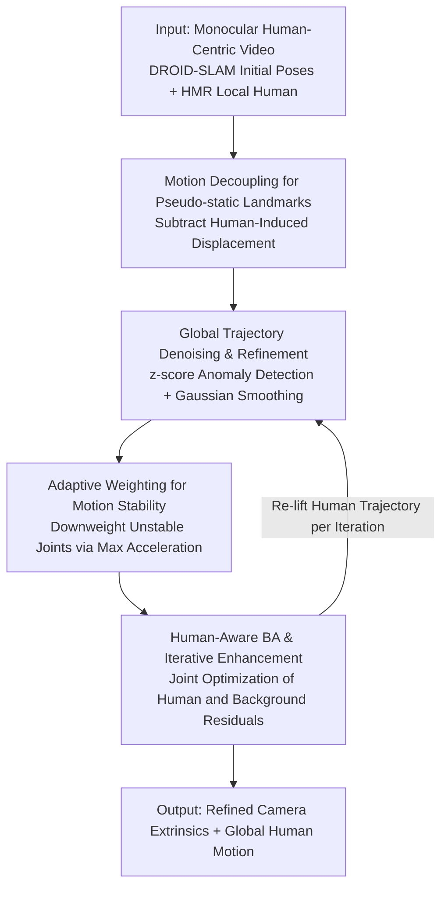

# HumanBA: Human-Aware Bundle Adjustment via Global Human-Camera Decoupling

**Conference**: CVPR 2026  
**Paper**: [CVF Open Access](https://openaccess.thecvf.com/content/CVPR2026/html/Yang_HumanBA_Human-Aware_Bundle_Adjustment_via_Global_Human-Camera_Decoupling_CVPR_2026_paper.html)  
**Code**: https://github.com/MartaYang/HumanBA  
**Area**: 3D Vision  
**Keywords**: Global Human Reconstruction, SLAM, Bundle Adjustment, Motion Decoupling, Monocular Video

## TL;DR
To address the failure of traditional SLAM in monocular videos where the foreground human occupies most of the frame, HumanBA treats humans not as dynamic distractions to be masked, but as structured landmarks. It uses HMR to estimate human motion and subtracts it from observed trajectories to obtain "pseudo-static" human joint landmarks. These landmarks, adaptively weighted by motion stability, are integrated into Bundle Adjustment (BA). This allows camera poses and global human reconstruction to mutually enhance each other during iteration, reducing trajectory errors for both on EMDB2 / SLOPER4D.

## Background & Motivation

**Background**: Recovering human meshes in world coordinates from monocular video (world-coordinate HMR) requires decoupling "camera motion" from "human motion" in image space. Mainstream approaches fall into two categories: those that directly learn a local-to-global mapping (WHAM / TRACE / GLAMR) to lift local poses/velocities to global trajectories, and those that explicitly run SLAM for camera motion combined with local human predictions (SLAHMR / TRAM), typically using modern backends like DROID-SLAM.

**Limitations of Prior Work**: The first category suffers from inherent ambiguity—identical local observations (e.g., walking on a treadmill) can correspond to vastly different global motions. The second category depends on SLAM, which assumes a mostly static scene. The standard practice is to **mask out** the dynamic human (setting human pixels to zero confidence or excluding them from feature matching). However, in human-centric videos, humans often occupy most of the frame; aggressively masking them removes significant geometric constraints, leading to tracking jitter or frame loss.

**Key Challenge**: The human body is both a "dynamic foreground violating the static assumption" and the "most informative structure in the frame." Masking it as an outlier loses constraints, while leaving it unhandled violates multi-view consistency. The fundamental problem is that the **apparent displacement between frames is a mixture of camera and human motion**; naive subtraction amplifies errors rather than eliminating them.

**Goal**: Re-integrate the masked human into BA as pseudo-static landmarks to stabilize camera optimization, while (1) correctly decoupling human-induced motion from observations and (2) suppressing the contamination of BA by human estimation noise.

**Key Insight**: The authors draw from dynamic scene SLAM (e.g., BA-Track using 3D point trackers for motion decoupling)—dynamic elements are not the problem; the entanglement of camera-induced and object-induced motion is. While BA-Track is object-agnostic and ignores human priors, human-centric tasks can leverage existing HMR models to provide structured human motion estimates.

**Core Idea**: Use HMR to estimate "human-induced motion" and subtract it from observed joint trajectories to obtain pseudo-static human landmarks containing only camera-induced motion. These are then adaptively weighted by motion stability and added as extra constraints to the BA objective—transforming the dynamic human from an "outlier to be removed" into a "usable world-coordinate anchor."

## Method

### Overall Architecture
The input is a monocular human-centric video, and the output is refined camera extrinsics $\{R_t, T_t\}$ and global human motion $\hat X^w$ in world coordinates. The workflow is: first, obtain initial camera poses and background point clouds via DROID-SLAM and frame-wise local human poses via HMR to lift an initial global trajectory. Then, for each BA keyframe pair $(i,j)$, perform **motion decoupling** to subtract human-induced displacement from observations, obtaining pseudo-static landmarks. The global trajectory is refined via denoising to improve landmark accuracy. Each landmark is **adaptively weighted** by its motion stability over the time interval. Finally, the weighted human residual term is added to the standard background BA for iterative optimization—after each pose update, the human trajectory is re-lifted, creating a closed loop where better camera poses lead to cleaner human anchors.

### Key Designs

**1. Motion Decoupling: Transforming Humans into Pseudo-static BA Landmarks**

The crux is that the apparent displacement of a person from frame $i$ to frame $j$ includes both camera and human motion. HumanBA explicitly decouples these. Given the current global human motion estimate, the human-induced displacement in world coordinates is $\Delta X^w(i,j) = X^w_j - X^w_i$. Converting this to the $j$-th frame's camera coordinate system yields $\Delta X^j(i,j) = R_j\,\Delta X^w(i,j)$. Subtracting this from the observed human joint $X^j_j$ in frame $j$ gives the position $X^j_i = X^j_j - \Delta X^j(i,j)$ where the joint would be "if only the camera moved and the human remained static." This is the pseudo-static landmark. The BA projection target is:

$$p^{hum*}_{ij} = \Pi_c\big(X^j_j - R_j(X^w_j - X^w_i)\big)$$

The method uses 24 SMPL kinematic joints (using all 6890 vertices is impractical for the 64×48 feature maps in DROID-SLAM). This is effective because it restores foreground constraints rather than discarding them, treating humans as reliable landmarks alongside background features.

**2. Global Human Trajectory Denoising: Pre-cleaning Landmarks**

BA is sensitive to landmark accuracy, and lifted global human trajectories are often noisy. Using these directly could inject errors into camera optimization. Before constructing landmarks, the initial world trajectory $X^w$ is refined: robust z-score thresholding is applied to joint velocities/accelerations (specifically $|z|>3.5$). Outlier increments are replaced by local means within a short window, and the trajectory is reintegrated and Gaussian smoothed. This refined $\hat X^w$ is used in all subsequent steps. Ablations show that without denoising, the gains from using human joints in BA are significantly lower.

**3. Adaptive Weighting: Prioritizing Stable Joints and Short Intervals**

Not all joints or frame pairs are equally reliable—extremities like hands jitter, and long time intervals accumulate uncertainty. HumanBA adaptively scores each landmark. The maximum discrete acceleration $a_{ij,k}$ for joint $k$ in interval $[i,j]$ is defined as $a_{ij,k} = \max_{t\in[i,j]} \|\Delta^2 \hat X^w_{t,k}\|_2$. This is mapped to a confidence weight using a bounded monotonically decreasing function:

$$w^{hum}_{ij,k} = \mathrm{clamp}\Big(1 - \log\big(\tfrac{\max(a_{ij,k},\epsilon)}{\tau}\big),\, 0,\, 1\Big)$$

where $\tau$ controls the decay rate ($\tau=1.0$ for EMDB2, $\tau=2.0$ for SLOPER4D). This weight naturally prioritizes root/hip/spine joints with low acceleration while downweighting end-effectors (wrists, hands) and long durations $|j-i|$, suppressing unstable constraints.

**4. Human-Aware BA & Iterative Enhancement: Mutual Camera-Human Feedback**

The human residual term is added to the standard background BA. For each frame pair $(i,j)$ and joint $k$, the human residual is the weighted difference between the target projection and geometric projection: $\ell^{hum}_{ij} = \sum_k w^{hum}_{ij,k}\,\|p^{hum*}_{ij,k} - \Pi_c(G_{ij}\circ X^i_{i,k})\|^2$. The total objective minimizes both background and human residuals. In **iterative enhancement**, after updating camera extrinsics $\{R_t,T_t\}$ in a BA round, the global trajectory $\hat X^w$ is re-lifted, and landmarks $p^{hum*}$ and weights $w^{hum}$ are refreshed for the next round. This positive feedback loop ("better camera → cleaner anchors → more reliable BA") allows human cues and camera optimization to mutually benefit.

### Loss & Training
HumanBA does not train a new network; it is an inference-time optimization framework. The objective is the total BA cost (background reprojection residuals + weighted human landmark residuals), solved iteratively via DROID-SLAM’s recurrent optimizer (19 iterations). Landmarks consist of 24 SMPL kinematic joints. Scale can be calibrated via the background scene (TRAM mode) or foreground human-contact joints (HAC mode).

## Key Experimental Results

### Main Results

On EMDB2 (25 dynamic camera sequences), compared to a strong baseline of Masked SLAM + scale estimation, HumanBA performs better across both camera and human metrics. Improvements are particularly significant on high-motion subsets.

| Dataset / Setting | ATE-S↓ | ATE↓ | W-MPJPE↓ | WA-MPJPE↓ |
|--------|------|------|------|------|
| EMDB2 All · Masked DROID + Scale [TRAM] | 0.708 | 0.369 | 230.97 | 79.80 |
| EMDB2 All · Masked DROID + HumanBA (Full) | **0.682** | **0.358** | **195.97** | **70.10** |
| High-Motion Subset · Masked DROID + Scale [TRAM] | 0.649 | 0.323 | 232.34 | 84.93 |
| High-Motion Subset · Masked DROID + HumanBA | **0.525** | **0.285** | **193.69** | **74.49** |

> Metrics: ATE (m) Average Translation Error after rigid alignment; ATE-S (m) Translation error without scale alignment; W-MPJPE (mm) and WA-MPJPE (mm) for joint errors.

### Ablation Study

On the full EMDB2 dataset, adding components to Masked DROID:

| Configuration | ATE-S↓ | ATE↓ | W-MPJPE↓ | WA-MPJPE↓ | Description |
|------|------|------|------|------|------|
| HumanBA (No Refine, No Weight) | 0.706 | 0.404 | 215.56 | 77.90 | Basic human landmarks |
| + Refine, Equal Weights | 0.791 | 0.508 | 224.75 | 82.71 | End-effector jitter hurts |
| + Refine, Root Joint Only | 0.718 | 0.398 | 211.86 | 74.81 | Root is stable, ATE-S improves |
| + Refine + Adaptive Weight (Full) | **0.682** | **0.358** | **195.97** | **70.10** | Best performance |

### Key Findings
- **Denoising is Essential**: Landmarks built directly from raw HMR trajectories provide less gain because BA is sensitive to noise.
- **Equal Weighting is a Trap**: Using equal weights is worse than using only the root joint because extremity noise pollutes constraints.
- **Physical Intuition in Weights**: Learned weights prioritize the torso and short time spans, consistent with uncertainty distribution.
- **Mutual Enhancement is Two-way**: Better camera trajectories reduce global human motion error, and cleaner human cues stabilize the camera.
- **Higher Benefit in Hard Scenarios**: Relative gains are larger in high-motion subsets where masked SLAM typically fails.

## Highlights & Insights
- **Perspective Shift**: Flipping the view of dynamic humans from "outliers to be masked" to "pseudo-static landmarks" recovers constraints that masked SLAM discards.
- **Clean Motion Decoupling**: Using structured HMR priors to explicitly subtract human motion is more suitable for human-centric tasks than object-agnostic point trackers like BA-Track.
- **Zero-Cost Adaptive Weights**: A simple acceleration-based function effectively filters reliability at both the joint level and temporal level.
- **Plug-and-Play**: The framework works on top of existing SLAM and HMR without retraining, making it easy to integrate into BA frameworks like DROID.

## Limitations & Future Work
- Landmarks are limited to 24 SMPL joints due to SLAM feature map resolution (64×48), limiting geometric density.
- Accuracy depends on the HMR model quality; decoupling fails if HMR collapses under occlusion.
- The decay coefficient $\tau$ is per-dataset tuned rather than self-adaptive.
- Evaluated on a limited subset of SLOPER4D due to SLAM keyframe limits; scalability for long sequences is unverified.
- Currently assumes a single human subject; multi-person scenarios are not addressed.

## Related Work & Insights
- **vs Masked DROID-SLAM / TRAM**: While they mask humans to maintain the static assumption, HumanBA uses decoupled humans as pseudo-static landmarks, resulting in lower errors when the human occupies the frame.
- **vs BA-Track**: HumanBA uses structured human priors (HMR) and adaptive weights rather than object-agnostic 3D point trackers.
- **vs WHAM / GLAMR**: These rely on local-to-global mappings which are inherently ambiguous; HumanBA uses explicit camera optimization to reduce drift via multi-frame joint constraints.

## Rating
- Novelty: ⭐⭐⭐⭐⭐ Elegant inversion of the "dynamic human" problem.
- Experimental Thoroughness: ⭐⭐⭐⭐ Solid results on two benchmarks with detailed ablations, though multi-person tests are missing.
- Writing Quality: ⭐⭐⭐⭐⭐ Geometric derivations and visualizations are very clear.
- Value: ⭐⭐⭐⭐ Practical plug-and-play solution for global human reconstruction.

<!-- RELATED:START -->

## Related Papers

- [\[CVPR 2026\] Parallel Rigidity Matters for Bundle Adjustment](parallel_rigidity_matters_for_bundle_adjustment.md)
- [\[CVPR 2026\] Egocentric Visibility-Aware Human Pose Estimation](egocentric_visibility-aware_human_pose_estimation.md)
- [\[ECCV 2024\] Event-based Mosaicing Bundle Adjustment](../../ECCV2024/3d_vision/event-based_mosaicing_bundle_adjustment.md)
- [\[ICCV 2025\] Back on Track: Bundle Adjustment for Dynamic Scene Reconstruction](../../ICCV2025/3d_vision/back_on_track_bundle_adjustment_for_dynamic_scene_reconstruction.md)
- [\[CVPR 2026\] Human Interaction-Aware 3D Reconstruction from a Single Image](human_interaction-aware_3d_reconstruction_from_a_single_image.md)

<!-- RELATED:END -->
