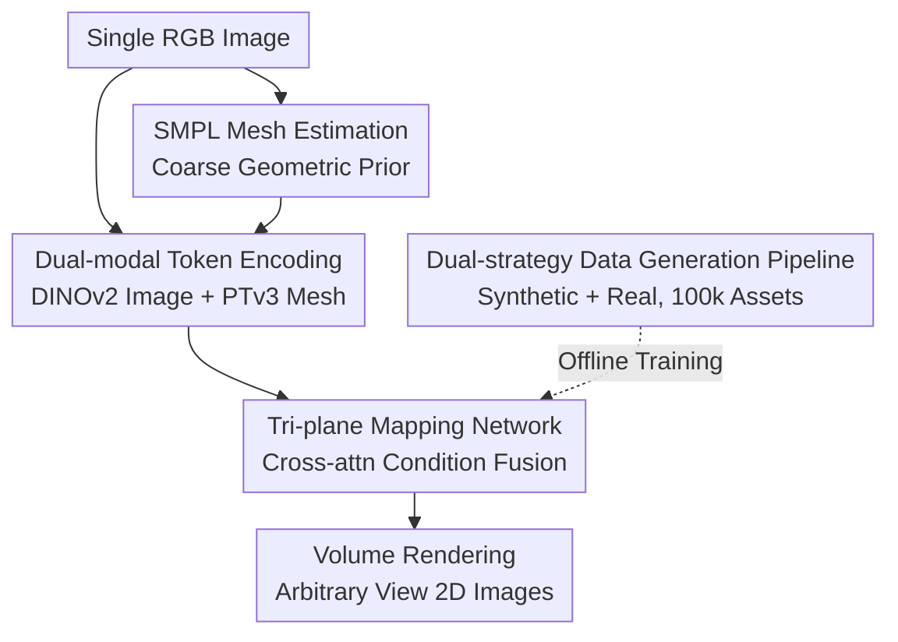

# HumanNOVA: Photorealistic, Universal and Rapid 3D Human Avatar Modeling from a Single Image

**Conference**: CVPR2026  
**arXiv**: [2606.02573](https://arxiv.org/abs/2606.02573)  
**Code**: Project Page https://HumanNOVA.github.io (Open source not confirmed)  
**Area**: 3D Vision  
**Keywords**: Single-image human reconstruction, feed-forward LRM, tri-plane representation, SMPL prior, large-scale data generation

## TL;DR
HumanNOVA transfers the Large Reconstruction Model (LRM) paradigm for general objects to the human domain. Utilizing a "dual-modal token conditioning + tri-plane" feed-forward architecture, it reconstructs photorealistic 3D humans from a single image in under 1 second. The study also introduces a scalable data generation pipeline that expands training assets to 100,000 (roughly a 20x increase), achieving a 40%+ relative improvement in LPIPS across three benchmarks.

## Background & Motivation
**Background**: The mainstream approach for single-image photorealistic 3D human avatar reconstruction (e.g., SiTH, SIFU) typically involves "parametric human priors (SMPL/SMPL-X) + advanced 3D representations (NeRF / 3DGS) + diffusion prior hallucination for the back view." These methods rely on diffusion models to complete invisible sides/backs, followed by per-instance optimization to obtain the final geometry and appearance.

**Limitations of Prior Work**: Such methods depend heavily on diffusion priors and require **slow per-instance optimization**, often taking several minutes per avatar, which hinders large-scale deployment. Furthermore, the generalization of diffusion-based completion is limited when training data is scarce.

**Key Challenge**: Achieving both photorealism and universality is difficult. The root cause is the **extreme scarcity of high-quality, diverse 3D human data**. While general object datasets like Objaverse contain 800,000 instances, existing human datasets (THuman2, CustomHuman, 2K2K) combined offer only a few thousand. Without sufficient data, it is impossible to train a human-centric model that performs direct feed-forward 3D reconstruction like general LRMs.

**Goal**: To build a single-image human reconstruction model that is fast (<1s), requires no test-time optimization, generalizes well, and produces high image quality. This requires solving two sub-problems: (1) where to obtain the data and (2) how to inject human priors into a general LRM architecture.

**Key Insight**: The authors argue that since general objects can now skip per-instance optimization via large-scale feed-forward LRMs, humans should be capable of the same—provided the data scale is increased and human-specific priors are incorporated.

**Core Idea**: **Replace "per-instance diffusion optimization" with a "feed-forward LRM + SMPL mesh prior"** and utilize an extensible data generation pipeline to scale human training data by approximately 20 times, allowing data-driven learning to replace slow optimization.

## Method

### Overall Architecture
HumanNOVA addresses the task of "Single RGB Image → Photorealistic 3D Human in <1 second." The entire pipeline is a single feed-forward pass: first, a coarse SMPL human mesh is estimated as a geometric anchor; the image and mesh are then encoded into compact tokens and fused via a cross-attention-based mapping network into a learnable tri-plane representation. Finally, volume rendering is used to generate 2D images from arbitrary views. While the model itself is compact, it is supported by an offline data generation pipeline that scales training assets to 100,000.

### Key Designs

**1. Feed-forward Tri-plane Avatar Modeling: Replacing Slow Optimization with LRM**

To address the bottleneck of slow, unscalable diffusion-based optimization, HumanNOVA adopts the Large Reconstruction Model (LRM) paradigm. It formulates 3D human reconstruction as a single feed-forward pass where input tokens are mapped directly to a tri-plane representation $\mathbf{T}\in\mathbb{R}^{3hw\times d}$, followed by standard ray-marching rendering $\hat{I}_\Phi=\pi(\mathbf{T}^*,\Phi)$. The mapping network, based on PointInfinity, consists of stacked blocks that use a three-step cross-attention mechanism to alternately update intermediate latents $\mathbf{L}$ and tri-plane tokens $\mathbf{T}$. Tri-planes serve as learnable tokens with shared initialization across all inputs, "sculpted" into specific humans by conditional signals. Inference takes <1s with no test-time tuning, enabling the "rapid + universal" capability.

**2. Dual-modal Token Conditioning + SMPL Mesh Prior: Geometric Anchors for LRM**

General LRM architectures lack category-specific search space constraints. Since human reconstruction is a high-value specialized task, HumanNOVA incorporates human priors. The model takes dual inputs: image tokens $\mathbf{f_i}\in\mathbb{R}^{N_i\times d}$ ($N_i=HW/p^2$) from DINOv2, and mesh tokens $\mathbf{f_m}\in\mathbb{R}^{N_m\times d}$ from a Point Transformer V3 (PTv3) encoding of an estimated SMPL mesh. Although the SMPL mesh is coarse (lacking detailed geometry/appearance), it provides **reliable body pose and initial surface estimates**, acting as a geometric anchor that mitigates the inherent ambiguity of single-view reconstruction (e.g., invisible back views). Ablation studies show that removing this mesh prior degrades LPIPS from 45.18 to 46.26.

**3. Dual-strategy Large-scale Data Generation Pipeline: 20x Data Scaling**

To overcome data scarcity, the authors employ two complementary strategies. The **Synthetic Branch** uses rigged human assets animated with real daily poses $\{\mathbf{R}^{\text{src}},\mathbf{T}_{\text{src}}\}$ sampled from AMASS, which are then re-centered and rendered from multiple camera views: $\{\mathbf{I}_i\}=\text{Render}(\text{RC}(A(\mathbf{M},\{\mathbf{R}^{\text{src}},\mathbf{T}_{\text{src}}\})),\{\mathbf{C}_i\})$. This provides the scale needed to train LRMs. The **Real Branch** utilizes multi-camera real-person captures (e.g., DNA-Rendering, MVHumanNet). Each mesh vertex is initialized as a 3D Gaussian, and a 3DGS representation is fitted by minimizing photometric loss $\mathcal{L}=\|I_i-f(V(\theta),\pi_i)\|^2$, allowing for novel view rendering in a canonical space. Together, these branches generate 100,000 assets and 2.6 million images.

### Loss & Training
The model is trained jointly with the objective $\mathcal{L}=\frac{1}{N}\sum_{n=1}^N(\mathcal{L}_r^n+\lambda_m\mathcal{L}_m^n+\lambda_p\mathcal{L}_p^n)$, comprising an RGB loss $\mathcal{L}_r$, a mask loss $\mathcal{L}_m$ (constraining accumulated density), and an LPIPS perceptual loss $\mathcal{L}_p$, with $\lambda_m=\lambda_p=0.5$. To save memory, losses are computed at the patch level with weighted sampling based on foreground ratios to focus on human details. Training utilized 64 H100 GPUs, $N=4$ rendering views, AdamW optimizer (lr 6e-4, batch 64), a tri-plane resolution of 96, and 180-size patches.

## Key Experimental Results

### Main Results
On CustomHuman, THuman2, and 2K2K benchmarks, using a front-view input and 512×512 rendering, HumanNOVA outperforms previous state-of-the-art (SOTA) methods (Table shows CustomHuman results, LPIPS scaled by ×100):

| Method | PSNR↑ | SSIM↑ | LPIPS↓ |
|------|-------|-------|--------|
| PaMIR | 18.15 | 0.9070 | 88.12 |
| SiFU | 17.94 | 0.9091 | 85.75 |
| Trellis | 18.59 | 0.9123 | 74.98 |
| SiTH (Prev. SOTA) | 19.13 | 0.9173 | 72.94 |
| Hunyuan2 | 19.42 | 0.9094 | 74.34 |
| SF3D | 19.46 | 0.9113 | 66.09 |
| **HumanNOVA** | **22.29** | **0.9360** | **42.42** |

LPIPS dropped from 66.09 (SF3D) to 42.42 (~36% relative reduction) and improved 42% relative to SiTH (72.94), supporting the claim of "40%+ relative LPIPS gain."

### Ablation Study
Conducted on CustomHuman (LPIPS ×100):

| Configuration | PSNR↑ | SSIM↑ | LPIPS↓ | Description |
|------|-------|-------|--------|------|
| Full (HumanNOVA) | 22.07 | 0.9344 | 45.18 | Full model |
| w/o gen-data (assets) | 21.84 | 0.9333 | 46.51 | Removed synthetic branch data |
| w/o gen-data (multi-cam) | 21.76 | 0.9326 | 47.83 | Removed real multi-cam branch data |
| 25% Data | 21.98 | 0.9313 | 50.14 | Data scale ablation |
| 50% Data | 22.02 | 0.9338 | 47.03 | Data scale ablation |
| w/o mesh prior | 21.89 | 0.9334 | 46.26 | Removed SMPL mesh prior |
| small triplane (32) | 21.78 | 0.9323 | 48.33 | Tri-plane size 96→32 |

> ⚠️ Note: Slight discrepancies in HumanNOVA digits between the main table and ablation table (e.g., LPIPS 42.42 vs. 45.18) are due to independent evaluation setups in the original paper.

### Key Findings
- **Data Scale is the strongest lever**: Performance improved monotonically as data increased from 25% to 100%, indicating that scaling to 100k assets is the primary driver of performance.
- **Complementary Dual Branches**: Removing the real multi-cam branch (LPIPS 47.83) caused a larger drop than removing the synthetic branch (46.51). Real data contributes more to photorealism, but both are essential.
- **Geometric Anchors and Capacity Matter**: Removing the SMPL prior or reducing tri-plane resolution (96 to 32) significantly hurts performance, with the latter showing the largest single-component drop in LPIPS.
- **Data Transferability**: Fine-tuning another method (Real3D) with the generated data reduced its LPIPS on CustomHuman from 95.12 to 58.54, proving the value of the dataset independent of the HumanNOVA architecture.

## Highlights & Insights
- **Revisiting Human Reconstruction as a Data Problem**: Unlike prior works that focus on complex diffusion hallucination for back-views, this work attributes the root problem to data scarcity. By scaling data by 20x, the model "learns" to generalize itself via feed-forward mapping.
- **Rational Synthetic+Real Split**: The split between synthetic "quantity" (via rigged assets) and real "quality" (via 3DGS-fitted multi-view captures) is a robust strategy for data scaling that compensates for the weaknesses of each source.
- **SMPL as a "Soft" Geometric Anchor**: By encoding the mesh via PTv3 and using it as a cross-attention condition rather than a hard constraint, the model benefits from human priors without being limited by inaccuracies in the coarse mesh (unlike older mesh-offset methods).
- **Transferability**: The approach of injecting parametric model tokens as category-specific priors into a general LRM can theoretically be extended to other tasks with parametric models, such as hands, faces, or animals.

## Limitations & Future Work
- **Dependency on SMPL Accuracy**: The model relies on an external SMPL estimator. In cases of extreme poses or severe occlusion, failures in SMPL estimation could mislead the reconstruction.
- **Static Reconstruction**: The model generates static avatars only; it does not currently include animatable capabilities, which is a necessary step for VR/telepresence applications.
- **Computational Cost**: Training with 64 H100 GPUs and 2.6 million images represents a high barrier to entry for reproduction.
- **Metric Focus**: Evaluation is primarily based on rendering quality (PSNR/SSIM/LPIPS). Geometric metrics (CD/NC/F-Score) are secondary, providing limited insight into geometric precision.

## Related Work & Insights
- **Comparison with SiTH / SIFU**: These rely on diffusion hallucination and slow per-instance optimization. HumanNOVA achieves a win-win in speed and LPIPS by using feed-forward LRM and large-scale data.
- **Comparison with LRM / SF3D / Real3D**: These are general-purpose models without category priors. HumanNOVA extends the LRM success to the human domain by injecting SMPL tokens and specialized data scaling.
- **Comparison with PaMIR / Early Mesh-Offset Methods**: HumanNOVA’s implicit tri-plane representation avoids the topological constraints of meshes, allowing it to handle complex clothing like dresses while still leveraging SMPL as a weak prior.

## Rating
- Novelty: ⭐⭐⭐⭐ (Applying LRM to humans is not entirely new, but the "data scaling + SMPL token prior" combination and systematic pipeline are solid.)
- Experimental Thoroughness: ⭐⭐⭐⭐⭐ (Tested on three benchmarks against seven baselines with multi-dimensional ablations.)
- Writing Quality: ⭐⭐⭐⭐ (Clear motivation and methodology, though inconsistencies in tables require more explanation.)
- Value: ⭐⭐⭐⭐ (Rapid photorealistic reconstruction and reusable data generation strategies are highly significant for VR deployment.)

<!-- RELATED:START -->

## Related Papers

- [\[CVPR 2026\] CrowdGaussian: Reconstructing High-Fidelity 3D Gaussians for Human Crowd from a Single Image](crowdgaussian_reconstructing_high-fidelity_3d_gaussians_for_human_crowd_from_a_s.md)
- [\[CVPR 2026\] Fresco: Frequency-Spatial Consistent Optimization for Fine-Grained Head Avatar Modeling](fresco_frequency-spatial_consistent_optimization_for_fine-grained_head_avatar_mo.md)
- [\[CVPR 2026\] 3D-Fixer: Coarse-to-Fine In-place Completion for 3D Scenes from a Single Image](3d-fixer_coarse-to-fine_in-place_completion_for_3d_scenes_from_a_single_image.md)
- [\[CVPR 2026\] Improving Human Image Animation via Semantic Representation Alignment](improving_human_image_animation_via_semantic_representation_alignment.md)
- [\[CVPR 2026\] MatE: Material Extraction from Single-Image via Geometric Prior](mate_material_extraction_from_single-image_via_geometric_prior.md)

<!-- RELATED:END -->
## Related Papers

- [\[CVPR 2026\] Human Interaction-Aware 3D Reconstruction from a Single Image](human_interaction-aware_3d_reconstruction_from_a_single_image.md)
- [\[CVPR 2026\] FISHuman: Fine-grained Single-image 3D Human Reconstruction via Multi-view 4D Remeshing](fishuman_fine-grained_single-image_3d_human_reconstruction_via_multi-view_4d_rem.md)
- [\[CVPR 2026\] UIKA: Fast Universal Head Avatar from Pose-Free Images](uika_fast_universal_head_avatar_from_pose-free_images.md)
- [\[CVPR 2026\] CrowdGaussian: Reconstructing High-Fidelity 3D Gaussians for Human Crowd from a Single Image](crowdgaussian_reconstructing_high-fidelity_3d_gaussians_for_human_crowd_from_a_s.md)
- [\[ICCV 2025\] GAS: Generative Avatar Synthesis from a Single Image](../../ICCV2025/3d_vision/gas_generative_avatar_synthesis_from_a_single_image.md)

<!-- RELATED:END -->
