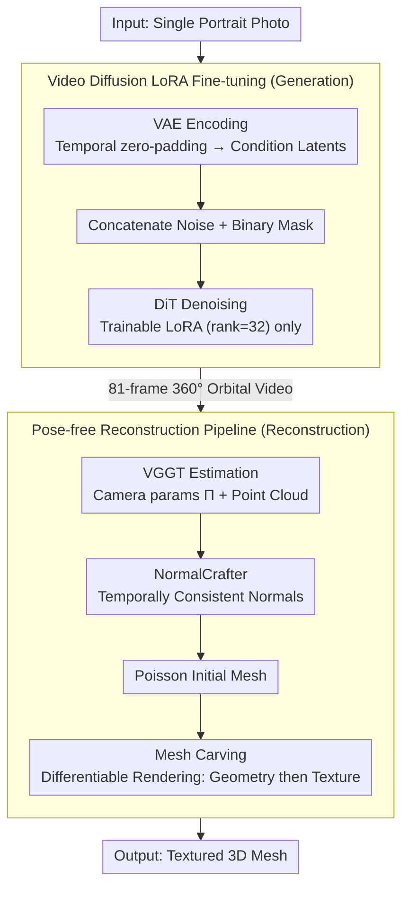

# HumanOrbit: 3D Human Reconstruction as 360° Orbit Generation

**Conference**: CVPR 2026 Findings  
**arXiv**: [2602.24148](https://arxiv.org/abs/2602.24148)  
**Code**: None  
**Area**: 3D Vision  
**Keywords**: 3D Human Reconstruction, Video Diffusion Model, Multi-view Generation, LoRA Fine-tuning, Orbital Video

## TL;DR

Single-image 3D human reconstruction is transformed into a 360° orbital video generation problem. By LoRA fine-tuning a video diffusion model (Wan 2.1) using only 500 3D scans, the model generates 81-frame orbital videos. High-quality textured meshes are then reconstructed via VGGT and Mesh Carving without pose annotations, surpassing existing methods in multi-view consistency and identity preservation.

## Background & Motivation

**Background**: Reconstructing realistic 3D humans from a single image is a long-standing challenge with applications in communication, gaming, and AR/VR. Current approaches include large reconstruction models (e.g., InstantMesh), human-specific models (relying on 3D human datasets), and multi-view diffusion-based methods.

**Limitations of Prior Work**:
   - **Scarcity of 3D Human Data**: High-quality multi-view/3D datasets require professional capture studios (dense camera calibration, controlled environments), which are extremely costly and limited in diversity.
   - **Inconsistency in Image Diffusion Methods**: Image-to-multi-view methods like Zero-1-to-3 and SyncDreamer still exhibit significant artifacts in cross-view consistency, particularly in facial and hand details.
   - **Dependence on External Priors**: Methods such as PSHuman require SMPL body shapes or camera pose annotations, limiting applicability to half-body photos or headshots.
   - **Large Training Data Requirements**: Human4DiT requires large-scale multi-dimensional human datasets.

**Key Insight**: The volume of 2D human image data far exceeds that of 3D datasets. Recent DiT video diffusion models (e.g., Wan 2.1), trained on billions of real-world videos, have acquired strong temporal consistency and implicit 3D structural priors. "Generating an orbital video" can thus be treated as "multi-view synthesis."

**Goal**: Instead of adapting image diffusion, the authors **fine-tune a video diffusion model** to generate 360° orbital videos. This leverages the natural temporal consistency of video models to ensure multi-view geometric consistency, requiring minimal 3D data for training.

## Method

### Overall Architecture

HumanOrbit decomposes single-image 3D human reconstruction into a two-step process: first framing it as a video generation problem, then using the generated video as multi-view source material for 3D reconstruction. The first stage is the **HumanOrbit Generation Model**, which takes a single portrait and outputs an 81-frame 360° orbital video, simulating a virtual camera revolving around the subject. The second stage is a **Pose-free Reconstruction Pipeline**, which treats these 81 frames as orbital photography. It utilizes VGGT to estimate camera parameters and point clouds for each frame, NormalCrafter to generate normal maps, Poisson reconstruction for the initial mesh, and finally differentiable rendering for Mesh Carving to refine the textured mesh. This pipeline operates without SMPL body priors or pre-defined camera trajectories.

### Key Designs

**1. Video Diffusion LoRA Fine-tuning: Strong Consistency with Minimal 3D Data**

High-quality 3D/multi-view human data is scarce; image diffusion-based methods often fail in cross-view consistency for faces and hands. HumanOrbit addresses this by fine-tuning the Wan 2.1 Image-to-Video 480p model (including a 3D VAE, CLIP image encoder, umT5 text encoder, and DiT blocks). The input image is zero-padded in the temporal dimension, encoded via VAE into conditional latents, and concatenated with noise and binary masks for DiT denoising. During training, only LoRA (rank=32) is applied to the DiT blocks while other parameters remain frozen. The training set consists of only 500 PosedPro 3D scans rendered in Blender as orbital videos (including full-body and head/shoulder compositions with slight rotation augmentation), expanded to 3000 videos of 81 frames at 640×640 resolution. Fine-tuning takes only 10 epochs on a single A100. This efficiency stems from Wan 2.1's pre-training on billions of videos, which internalizes camera motion and temporal consistency—effectively implicit 3D consistency. LoRA's task is merely to specialize the model's general orbital motion capability to the 360° human orbit, rather than learning geometry from scratch. Consequently, the model retains generalization and can generate reasonable orbital videos for non-human objects like chairs or dogs.

**2. Pose-free Reconstruction Pipeline: Dynamic Parameter Estimation via SfM**

Existing methods like PSHuman rely on pre-defined camera poses or SMPL fitting, which fail for non-full-body scenes. HumanOrbit avoids external pose requirements. It uses VGGT (a feed-forward 3D scene property estimation network) to simultaneously predict camera parameters $\Pi = \{\pi_i\}_{i=1}^K$ and depth-projected point clouds from the generated frames. Temporally consistent normal maps are obtained via NormalCrafter. For initialization, Poisson surface reconstruction is applied to the VGGT point clouds instead of using SMPL, preserving generalization for partial-body scenes. Finally, Mesh Carving is performed via iterative differentiable rendering. The geometry stage loss constrains masks and normals:

$$\mathcal{L}_{recon} = \mathcal{L}_{mask} + \mathcal{L}_{normal} = \sum_i \|M_i - \hat{M}_i\|_2^2 + \sum_i M_i \odot \|N_i - \hat{N}_i\|_2^2$$

After geometric convergence, vertex colors are optimized using $\mathcal{L}_{color} = \sum_i M_i \odot \|I_i - \hat{I}_i\|_2$. The success of this pipeline demonstrates that the generated video quality is sufficiently high for VGGT to recover a stable circular camera trajectory.

### Loss & Training

The video generation stage employs standard diffusion training loss with LoRA (rank=32) for 10 epochs on a single A100. The mesh reconstruction stage first optimizes geometry using $\mathcal{L}_{recon} = \mathcal{L}_{mask} + \mathcal{L}_{normal}$ and then optimizes texture with $\mathcal{L}_{color}$. The pipeline requires no body shape labels, camera pose labels, or dedicated face recognition modules.

## Key Experimental Results

### Main Results

| Dataset | Metrics | HumanOrbit | PSHuman | SV3D | MV-Adapter |
|--------|------|------|----------|------|------|
| CCP (Full Body) | CLIP Score ↑ | **0.8317** | 0.8282 | 0.7888 | 0.7735 |
| CCP (Full Body) | MEt3R ↓ | **0.3175** | 0.3576 | 0.2966 | 0.3721 |
| CCP (Full Body) | MVReward ↑ | **0.8035** | 0.6814 | 0.2378 | 0.6795 |
| CelebA (Headshot) | CLIP Score ↑ | **0.7073** | - | 0.6582 | 0.6729 |
| CelebA (Headshot) | MVReward ↑ | **0.4947** | - | 0.4918 | 0.4727 |

### Ablation Study

| Configuration | Key Metrics | Note |
|------|---------|------|
| VGGT vs COLMAP | VGGT: Dense cloud + continuous path; COLMAP: Sparse cloud + broken path | COLMAP leads to missing geometry (e.g., left arm) |
| Non-human Objects | Success in generating orbital videos | LoRA fine-tuning preserves pre-trained generalization |
| Fixed Elevation Orbit | Blind spots at top/bottom regions | Need for exploration of more diverse camera trajectories |

### Key Findings

- HumanOrbit significantly leads in the **MVReward** metric (closest to human preference) over PSHuman (0.8035 vs 0.6814), indicating superior generation quality and consistency.
- SV3D tends to generate blurred outlines and distorted faces; PSHuman lacks detail; MV-Adapter occasionally exhibits topological errors (e.g., extra limbs/shoes).
- VGGT reliably recovers circular camera trajectories from generated videos, indirectly proving high 3D consistency.
- The model is effective for headshot scenarios (where PSHuman fails due to SMPL dependence), demonstrating strong generalization.
- Success on non-human objects (chairs/dogs) suggests the model has learned a general orbital motion paradigm.

## Highlights & Insights

- **Problem Reformulation**: Converting multi-view generation from "image diffusion + 3D constraints" to "video diffusion + orbital motion" naturally achieves temporal consistency.
- **Extreme Data Efficiency**: Surpassing methods requiring large 3D datasets using only 500 3D scans by leveraging the strong priors of pre-trained video models.
- **Pose-free Design**: Eliminates the need for external pose annotations or pre-defined cameras; the model generates the orbit freely, and parameters are recovered via SfM, avoiding generation-annotation misalignment.
- **Minimalist yet Effective**: The approach only introduces LoRA parameters with minimal architectural changes.

## Limitations & Future Work

- **Fixed Elevation**: The orbital path is currently restricted to a single horizontal plane, leaving top-down and bottom-up regions (e.g., chin, top of head) invisible. Multiple elevations or spiral paths could be explored.
- **Inference Speed**: Based on a large video diffusion model, generating 81 frames takes approximately 17 minutes. Initial attempts to reduce frame counts were unsuccessful; more efficient inference strategies are needed.
- **Robustness Dependency**: VGGT camera estimation depends entirely on the consistency of the generated video.
- Comparison with recent methods like MEAT or Pippo was omitted due to unavailable code.

## Related Work & Insights

- **PSHuman**: Based on cross-scale multi-view diffusion and SMPL-initialized mesh carving; serves as the primary baseline.
- **SV3D**: Stability AI's orbital video diffusion model (21 frames), though it lacks sufficient consistency for humans.
- **VGGT**: Feed-forward 3D scene property estimation, used here as a modern alternative to SfM for generated video.
- **Wan 2.1**: The underlying DiT video diffusion model; this work proves it can be specialized for multi-view generation with LoRA.
- **Insight**: Video diffusion models as carriers of implicit 3D priors represent a potential new paradigm for single-image 3D reconstruction. The ability of LoRA to preserve pre-trained knowledge makes small-data fine-tuning feasible.

## Rating

- Novelty: ⭐⭐⭐⭐ The paradigm shift from video diffusion to multi-view generation is insightful, and the pose-free design is elegant.
- Experimental Thoroughness: ⭐⭐⭐ Comprehensive multi-view evaluation, but 3D reconstruction lacks quantitative metrics beyond visual comparison.
- Writing Quality: ⭐⭐⭐⭐ Clear motivation, concise methodology, and intuitive presentation of results.
- Value: ⭐⭐⭐⭐ A highly data-efficient solution for single-image human reconstruction with significant implications for 3D data generation.

<!-- RELATED:START -->

## Related Papers

- [\[CVPR 2026\] Illumination-Consistent Human-Scene Reconstruction from Monocular Video](illumination-consistent_human-scene_reconstruction_from_monocular_video.md)
- [\[CVPR 2026\] CARI4D: Category Agnostic 4D Reconstruction of Human-Object Interaction](cari4d_category_agnostic_4d_reconstruction_of_human_object_interaction.md)
- [\[CVPR 2026\] BulletGen: Improving 4D Reconstruction with Bullet-Time Generation](bulletgen_improving_4d_reconstruction_with_bullet-time_generation.md)
- [\[CVPR 2026\] Extend3D: Town-Scale 3D Generation](extend3d_town-scale_3d_generation.md)
- [\[CVPR 2026\] Fall Risk and Gait Analysis using World-Spaced 3D Human Mesh Recovery](fall_risk_gait_analysis_hmr.md)

<!-- RELATED:END -->
