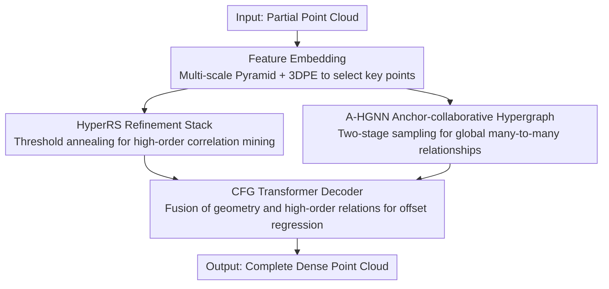

# Hyper-PCN: Hypergraph-Based Point Cloud Completion via High-Order Correlation Modeling

**Conference**: CVPR 2026  
**Paper**: [CVF Open Access](https://openaccess.thecvf.com/content/CVPR2026/html/Li_Hyper-PCN_Hypergraph-Based_Point_Cloud_Completion_via_High-Order_Correlation_Modeling_CVPR_2026_paper.html)  
**Code**: https://github.com/Rinfly/Hyper-PCN  
**Area**: 3D Vision  
**Keywords**: Point Cloud Completion, Hypergraph Neural Networks, High-Order Correlation, Encoder-Decoder, 3D Shape Reconstruction

## TL;DR
Addressing the issues where Transformers in point cloud completion only model pairwise correlations and fail to reconstruct complex structures in the absence of symmetry priors, Hyper-PCN introduces hypergraphs to **incomplete** point clouds for the first time. It utilizes a Hypergraph Refinement Stack (HyperRS) with threshold annealing to extract high-order correlations from coarse to fine, and an Anchor-collaborative Hypergraph Neural Network (A-HGNN) to model global many-to-many relationships. Hyper-PCN consistently sets new SOTAs on benchmarks including PCN, ShapeNet-55/34, and MVP.

## Background & Motivation

**Background**: Point cloud completion aims to reconstruct complete and dense shapes from partial point clouds. The key lies in modeling internal correlations within the point cloud. Early methods relied on PointNet/PointNet++ max-pooling to extract global features. PoinTr first introduced Transformers by partitioning point clouds into patches and using self-attention to establish local and global dependencies. Subsequent research followed two paths: designing stronger Transformer architectures (e.g., SnowflakeNet, AdaPoinTr, CRA-PCN) or injecting symmetry/learnable geometric priors to provide shape-level context (e.g., SymmCompletion, ODGNet).

**Limitations of Prior Work**: Existing methods still struggle with complex geometries and fine structures, **particularly when common priors like symmetry are absent or when symmetric regions on both sides are missing** (The core example in Figure 1). The root cause is the insufficient modeling of **high-order correlations**. Semantic relationships in real structures extend far beyond "pairwise similarity" or "symmetry"—for instance, the wings, tail, and fuselage of an aircraft must be collaboratively organized into an aerodynamic shape. These multi-component, collaborative many-to-many relationships cannot be represented by pairwise models.

**Key Challenge**: The query-key interaction in Transformers is inherently **pairwise**, which naturally limits its ability to model high-order (many-to-many) correlations. Hypergraphs, where a single hyperedge can connect any number of vertices, are natural tools for expressing such group relationships. However, prior hypergraph work for point clouds was designed for **complete** point clouds. Applying them to incomplete data faces two hurdles: (1) extracting reliable correlations from sparse, fragmented structures is inherently difficult, and one-shot hypergraph construction captures only limited relationships; (2) common strategies like random sampling or voxel partitioning bias computational resources towards complete regions, hindering the prediction of missing parts.

**Goal**: To model high-order correlations on incomplete point clouds for the first time and address the aforementioned engineering challenges—mining high-order relationships through multi-round refinement and ensuring global coverage without bias toward complete regions.

**Key Insight**: Instead of one-shot construction, hypergraphs are introduced via "progressive and collaborative sampling": a stack of hypergraph layers performs coarse-to-fine refinement, while key points and anchors collaborate in graph construction to correct sampling bias.

**Core Idea**: Replace Transformer-based pairwise attention with hypergraphs to explicitly model high-order correlations. HyperRS performs layer-wise refinement via threshold annealing, and A-HGNN conducts global mapping through anchor collaboration. Both are integrated into an encoder-decoder framework.

## Method

### Overall Architecture
Hyper-PCN employs an encoder-decoder architecture. The **hypergraph encoder** first uses a PointNet-based Feature Embedding to select $N_k$ key points and their features. These features are fed into two parallel branches: HyperRS constructs hypergraphs based on feature space distance for progressive layer-wise refinement, producing hyper features and a coarse shape; A-HGNN utilizes joint sampling of key points and anchors to extract global high-order relationships. The **decoder** concatenates the coarse features, local features, and global features from A-HGNN, feeding them into a two-stage CFG (Cross Fusion Geometry) Transformer to regress point-wise offsets and reconstruct the dense point cloud.

### Key Designs

**1. Hypergraph Convolution: Modeling Many-to-Many Correlations via Hyperedges**

A fundamental pain point in completion is that pairwise models cannot express "multi-component collaboration." The basic operator in Hyper-PCN is hypergraph convolution. In a hypergraph $\mathcal{G}=(V,E,W)$, a hyperedge can connect any number of vertices. The incidence matrix $H\in\{0,1\}^{n\times m}$ records whether vertex $v$ belongs to hyperedge $e$. Hypergraph convolution involves a "vertex → hyperedge → vertex" information flow: vertices first send features to connected hyperedges for aggregation, and then receive updated messages from adjacent hyperedges. The matrix form is:

$$X^{(t+1)} = \sigma\big(D_v^{-1} H W D_e^{-1} H^\top X^{(t)} Q_t\big)$$

where $D_v$ and $D_e$ are diagonal matrices of vertex and hyperedge degrees, and $Q_t$ is a learnable transformation matrix. Unlike Transformer's pairwise query-key, hyperedges naturally bind a set of semantically related points (e.g., repeating sails or wing-tail aerodynamic coupling) into a high-order unit for joint aggregation.

**2. HyperRS Refinement Stack: Threshold Annealing for Coarse-to-Fine Mining**

To address the limitation of capturing only narrow relationships from incomplete structures, HyperRS uses a stack of $L$ layers for progressive refinement. Each layer rebuilds the graph in feature space before convolution. The $\ell$-th layer centers on each vertex and groups neighbors within a feature distance threshold $\tau_\ell$ into the same hyperedge. The incidence matrix $H^{(\ell)}_{i,j}=1$ if and only if $\|X^{(\ell)}_i - X^{(\ell)}_j\|_2 \le \tau_\ell$. Crucially, the threshold follows **linear annealing**:

$$\tau_\ell = \tau_{\text{start}} + \frac{\ell-1}{L-1}\big(\tau_{\text{end}} - \tau_{\text{start}}\big),\quad \tau_{\text{start}} > \tau_{\text{end}}$$

Shallow layers have large thresholds and wide hyperedge coverage to capture broad context (e.g., low-order features like symmetry). Deep layers have smaller thresholds, connecting only closer neighbors to focus on fine-grained high-order relationships (e.g., wing-tail semantic coupling). Each layer performs a residual update with SiLU activation and BN: $X^{(\ell+1)} = X^{(\ell)} + \mathrm{BN}(\mathrm{SiLU}(\widetilde X^{(\ell)}))$. This accumulates high-order features across different granularities.

**3. A-HGNN Anchor-collaborative Hypergraph: Correcting Construction Bias**

The second hurdle is that random or voxel sampling biases graph construction toward complete regions. A-HGNN employs **collaboration** between key points and anchors to build a global hypergraph, mitigating structural bias and ensuring more comprehensive coverage. Specifically, anchors $P_a$ are obtained from key points $P_k$ via deterministic uniform downsampling (budget $N_a$). Euclidean distances $ED_{i,j}=\|p_{k,i}-p_{a,j}\|_2$ are calculated, and for each key point, the nearest $\alpha$ anchors are selected as neighbors $\mathcal{N}(i)=\arg\text{Top-}\alpha_j(-ED_{i,j})$. The incidence matrix is set as $H^{(A)}_{i,j}=1$ when $j\in\mathcal{N}(i)$. Global high-order features $F_{out}\in\mathbb{R}^{N_k\times 2N_k}$ are then extracted via hypergraph convolution.

**4. CFG Transformer Decoder: Integrating Geometry and High-Order Relations**

After the encoder provides the coarse shape and features, they must be fused for fine reconstruction. The CFG (Cross Fusion Geometry) Transformer is a two-stage architecture. First, coarse points $P_c$ are augmented with 3D positional encoding and concatenated with original coordinates to obtain a PE-enhanced representation $Z_{PE}$. Self-attention extracts geometry-aware features $F_g$ to align local geometry with high-order structural relations. These are transformed into refined representations $F_{ref}$ to regress point-wise offsets, resulting in the final point cloud $Y\in\mathbb{R}^{N_o\times3}$.

### Loss & Training
Chamfer Distance (CD) is used for supervision at three stages: coarse points, intermediate points of the first CFG stage, and the final complete points. The total loss is a weighted sum of the three. Training details: RTX 3090, AdamW, batch 64, 420 epochs, initial learning rate $2\times10^{-4}$, weight decay $5\times10^{-4}$, with a linear warm-up from $1\times10^{-5}$ to $2\times10^{-4}$ in the first 20 epochs. HyperRS has depth $L=6$, and the distance threshold is linearly annealed from $\tau_{\text{start}}=0.20$ to $\tau_{\text{end}}=0.16$. A-HGNN uses anchor/top-k budgets of $(N_a=128, k=24)$ and $(N_a=192, k=32)$ for two stages.

## Key Experimental Results

### Main Results

On the PCN dataset (lower $CD-L1\times10^{-3}$ and higher $F1@1\%$ are better), Hyper-PCN achieves the best performance in average CD, F1, and all 8 categories:

| Method | Source | CD-Avg↓ | F1↑ |
|--------|------|------|------|
| PoinTr | ICCV'21 | 8.38 | 0.745 |
| AdaPoinTr | TPAMI'23 | 6.53 | 0.845 |
| CRA-PCN | AAAI'24 | 6.39 | – |
| SymmCompletion | AAAI'25 | 6.28 | 0.853 |
| PointMAC | NIPS'25 | 6.33 | – |
| **Hyper-PCN (Ours)** | – | **6.20** | **0.858** |

Performance is also superior across multiple benchmarks (CD metrics $\times10^{-3}$ or $\times10^{-4}$):

| Dataset | Metric | Ours | Prev. SOTA (SymmCompletion) |
|--------|------|------|----------|
| ShapeNet55 | CD-Avg | **0.65** | 0.69 |
| ShapeNet-34 (Seen) | CD-Avg | **0.58** | 0.60 |
| ShapeNet-21 (Unseen) | CD-Avg | **0.94** | 0.97 |
| MVP | CD↓ / F1↑ | **4.76 / 0.558** | 4.89 / 0.534 |

On KITTI, models trained on PCN directly generalize well, with qualitative results showing more complete car shapes, sharper boundaries, uniform point density, and fewer outliers.

### Ablation Study

Validation of the two core modules on the PCN dataset:

| HyperRS | A-HGNN | CD↓ | F1↑ | Description |
|------|------|------|------|------|
| ✗ | ✗ | 6.43 | 0.844 | Baseline without hypergraph modules |
| ✓ | ✗ | 6.36 | 0.848 | HyperRS only |
| ✗ | ✓ | 6.32 | 0.851 | A-HGNN only |
| ✓ | ✓ | **6.20** | **0.858** | Full model |

### Key Findings
- **Complementarity**: Both HyperRS and A-HGNN independently reduce CD, but the maximum Gain is achieved when both are active (6.43→6.20), indicating they model different levels of high-order relationships.
- **Hierarchical Semantics from Annealing**: HyperRS captures low-order features in shallow layers and transitions to high-order semantic coupling in deeper layers.
- **Strong Generalization**: Leading performance on Unseen ShapeNet-21 and zero-shot KITTI transfer shows that high-order correlation modeling does not rely solely on category memorization.
- **Symmetry-Absent Scenarios**: Benefit is highest when symmetry priors are unavailable or symmetric regions are missing on both sides.

## Highlights & Insights
- **Hypergraphs vs. Pairwise Attention**: The core insight is that pairwise mechanisms cannot support many-to-many relationships, whereas hyperedges can bind collaborative points (wing-tail-fuselage).
- **Ingenious Annealing**: A simple linearly annealed distance threshold allows the same architecture to capture global context in shallow layers and fine details in deep layers.
- **Anchor Collaboration**: Using deterministic uniformly sampled anchors alongside key points addresses the sampling bias inherent in point cloud completion.
- **First Use for Incomplete Data**: Unlike previous hypergraph works that assumed completion, this work identifies and solves specific obstacles in constructing graphs from partial inputs.

## Limitations & Future Work
- Hypergraph construction relies on thresholds and budgets ($\tau_{\text{start}}$, $L$, $N_a$) that require manual tuning; robustness across datasets is not fully discussed.
- Computational overhead from mulit-layer refinement and two-stage sampling exists, though efficiency comparisons are not explicitly detailed.
- Gain on saturated benchmarks is relatively small (PCN CD 6.28→6.20), requiring a trade-off against increased complexity.

## Related Work & Insights
- **vs. PoinTr / AdaPoinTr (Transformer Route)**: While they use pairwise self-attention, Hyper-PCN uses hypergraphs for explicit many-to-many high-order relations.
- **vs. SymmCompletion / ODGNet (Geometric Prior Route)**: These fail when symmetry is absent; Hyper-PCN provides a more universal structural guide through high-order correlations.
- **vs. Previous Hypergraph Methods**: Unlike works focusing on detection or segmentation of complete point clouds, this work addresses the hurdles of partial inputs.

## Rating
- Novelty: ⭐⭐⭐⭐⭐ First introduction of hypergraphs to incomplete point clouds.
- Experimental Thoroughness: ⭐⭐⭐⭐ Multiple benchmarks and ablations provided.
- Writing Quality: ⭐⭐⭐⭐ Intuitive motivations and visualizations.
- Value: ⭐⭐⭐⭐ Standard-setting SOTA performance with reusable high-order modeling logic.

<!-- RELATED:START -->

## Related Papers

- [\[CVPR 2026\] Geometric-Aware Hypergraph Reasoning for Novel Class Discovery in Point Cloud Segmentation](geometric-aware_hypergraph_reasoning_for_novel_class_discovery_in_point_cloud_se.md)
- [\[CVPR 2026\] Generalized-CVO: Fast and Correspondence-Free Local Point Cloud Registration with Second Order Riemannian Optimization](generalized-cvo_fast_and_correspondence-free_local_point_cloud_registration_with.md)
- [\[CVPR 2026\] 4D Local Modeling Toward Dynamic Global Perception for Ambiguity-free Rotation-Invariant Point Cloud Analysis](4d_local_modeling_toward_dynamic_global_perception_for_ambiguity-free_rotation-i.md)
- [\[CVPR 2026\] Deformation-based In-Context Learning for Point Cloud Understanding](deformation-based_in-context_learning_for_point_cloud_understanding.md)
- [\[CVPR 2026\] Adapting Point Cloud Analysis via Multimodal Bayesian Distribution Learning](adapting_point_cloud_analysis_via_multimodal_bayesian_distribution_learning.md)

<!-- RELATED:END -->
