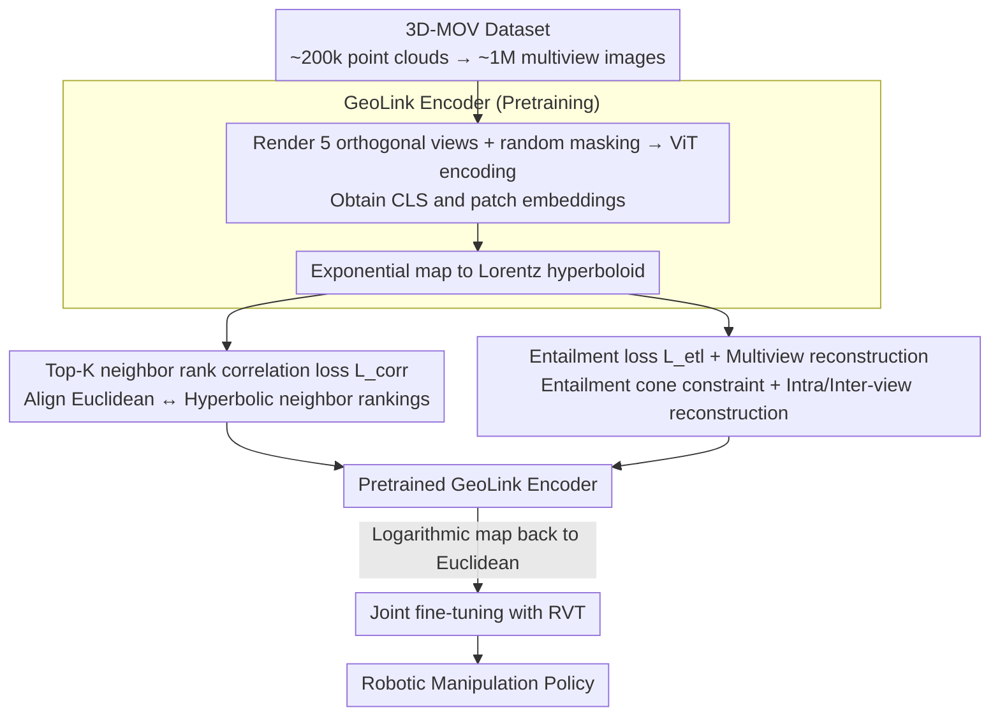

# HyperMVP: Hyperbolic Multiview Pretraining for Robotic Manipulation

**Conference**: CVPR 2026 Findings  
**arXiv**: [2603.04848](https://arxiv.org/abs/2603.04848)  
**Code**: TBD  
**Area**: 3D Vision  
**Keywords**: Hyperbolic Space, Multiview Pretraining, Robotic Manipulation, Self-supervised Learning, 3D Representation

## TL;DR

Proposes HyperMVP, the first 3D multiview self-supervised pretraining framework in hyperbolic space. By learning hyperbolic multiview representations via a GeoLink encoder and transferring them to robotic manipulation tasks, it achieves a 2.1× performance enhancement under the most challenging "All Perturbations" setting in COLOSSEUM.

## Background & Motivation

**Background**: 3D-aware visual pretraining has proven effective in enhancing downstream robotic manipulation performance.

**Limitations of Prior Work**:
- Existing methods (e.g., 3D-MVP) are confined to **Euclidean embedding spaces**, where flat geometry restricts the ability to model structural relationships between embeddings.
- Euclidean distance metrics grow linearly, making them unsuitable for representing hierarchical structures and nested relationships.
- Hyperbolic space expands exponentially, naturally suiting tree-like or nested structures, yet remains **completely unexplored** in robotic manipulation pretraining.

**Goal**: This work fills this gap by migrating the entire visual self-supervised pretraining pipeline from Euclidean space to hyperbolic space (Lorentz model). By leveraging hyperbolic geometry to learn structured representations, the study aims to improve the robustness and generalization of manipulation policies in perturbed scenarios.

## Method

### Overall Architecture

HyperMVP addresses a core problem: 3D visual pretraining is useful for manipulation, but prior methods compress representations into flat Euclidean space, failing to model the hierarchical "containment" relationships between patches. The approach involves lifting the self-supervised pretraining into hyperbolic space before transferring it to manipulation policies. The pipeline consists of two stages: first, pretraining a GeoLink encoder on the self-built 3D-MOV dataset to encode multiview images into the Lorentz hyperboloid and learn structured representations; then, connecting this encoder to a Robotic View Transformer (RVT) for joint fine-tuning on specific manipulation strategies.

The pretraining uses the 3D-MOV dataset, comprising approximately 200,000 high-quality 3D point clouds: 180,000 objects from Objaverse-XL, 6,052 scene segments from ScanNet, 3,999 general tabletop scenes, and 10,001 dense tabletop scenes (TO-Scene), totaling roughly 1 million rendered multiview images. Ablation studies indicate that the real-world scene data contributes significantly to the performance gains.

### Key Designs

**1. GeoLink Encoder: Lifting Euclidean multiview embeddings to a hyperboloid for natural semantic hierarchy.**

Following the MAE paradigm, 3D point clouds are rendered into 5 orthogonal views and processed by an $N=8$ layer ViT (hidden dim 768, 8 heads) to obtain CLS embeddings $\mathbf{f}^{\text{cls}} \in \mathbb{R}^{5 \times 1 \times D}$ and patch embeddings $\mathbf{f}^{\mathrm{p}} \in \mathbb{R}^{5 \times P \times D}$. Crucially, these Euclidean embeddings are lifted to the Lorentz hyperboloid using the exponential map:

$$\mathbf{x}_s^* = \frac{\sinh(\sqrt{c}\|\mathbf{f}^*\|)}{\sqrt{c}\|\mathbf{f}^*\|}\mathbf{f}^*$$

Hyperbolic space is utilized because its distance grows exponentially with the radius, allowing it to accommodate tree-like and nested semantic structures that "overflow" flat Euclidean space. Since downstream policies run in Euclidean space, representations are mapped back using a logarithmic map during fine-tuning to maintain compatibility with RVT.

**2. Patch-aware Top-K neighbor rank correlation loss $L_{\text{corr}}$: Aligning spaces via ranking instead of distance.**

Lifting embeddings to hyperbolic space introduces a scale mismatch: distances in Euclidean and hyperbolic spaces are not directly comparable. Direct distance alignment would lead to training instability due to geometric divergence. $L_{\text{corr}}$ bypasses this by calculating Top-K nearest neighbors in both spaces and requiring consistent ranking rather than absolute distance:

$$L_{\text{corr}} = 1 - \frac{1}{5}\sum_{i=1}^{5} g\left(|\mathbf{R}_i^{\mathcal{E}}_{\pi_i^K}|_z \odot |\mathbf{R}_i^{\mathcal{L}}_{\pi_i^K}|_z\right)$$

Ranking is a geometry-agnostic metric, allowing this loss to stably transfer semantic topology between geometries with different curvatures. Ablation results confirm this as the most significant contributor to performance.

**3. Entailment loss $L_{\text{etl}}$ with Multiview Reconstruction: Aligning locals to globals and enforcing multiview consistency.**

Topology alignment alone is insufficient; the model must categorize patches within a global semantic context. $L_{\text{etl}}$ defines an entailment cone around the hyperbolic CLS embedding, constraining patch embeddings to fall within this cone—a standard hyperbolic method for expressing "containment" relationships. Additionally, two reconstruction tasks are implemented: intra-view reconstruction (standard MAE) and inter-view reconstruction, where features from other views predict the anchor view via cross-attention to force the encoder to learn cross-view consistency.

### Loss & Training

The total pretraining loss consists of hyperbolic and reconstruction terms: $L_{\text{pretrain}} = L_{\text{hyper}} + L_{\text{recon}}$.

$$L_{\text{hyper}} = \lambda_c L_{\text{corr}} + \lambda_{e1} L_{\text{etl}}(\mathbf{x}^{\text{cls}}, \mathbf{x}^{\mathrm{p}}) + \lambda_{e2} L_{\text{etl}}(\mathbf{x}^{\text{cls}}, \mathbf{x}^{\mathrm{msk}})$$

Parameters are set as $\lambda_c=1, \lambda_{e1}=0.5, \lambda_{e2}=0.1$. The reconstruction loss $L_{\text{recon}} = \lambda_{\text{ita}} L_{\text{intra}} + \lambda_{\text{ite}} L_{\text{inter}}$ uses $\lambda_{\text{ita}}=1, \lambda_{ite}=0.5$. Pretraining runs for 100 epochs (batch size 64, masking ratio 0.75) using AdamW (lr=5.12e-4) on 8×4090 GPUs. Fine-tuning uses 50K steps (simulation) or 4K steps (real-world) with the LAMB optimizer (lr=2e-3).

## Key Experimental Results

### Main Results

| Dataset | Metric | HyperMVP | Prev. SOTA | Gain |
|--------|------|----------|----------|------|
| COLOSSEUM Avg (all perturbations) | Success Rate | 47.5% | 35.6% (3D-MVP) | +33.4% |
| COLOSSEUM All Perturbations | Success Rate | 11.2% | 5.3% (3D-MVP) | **2.1×** |
| RLBench 18-task Avg | Success Rate | **71.1%** | 68.0% (SAM2Act) | +3.1% |
| RLBench vs scratch | Success Rate | 71.1% | 62.9% (RVT) | +13.0% relative |
| Real-world Avg | Success Rate | **60.0%** | 32.9% (RVT) | +27.1% |
| Real-world All Perturbations | Success Rate | 50.0% | 22.2% (RVT) | +27.8% |

### Ablation Study

| Configuration | Key Metric (Avg Success %) | Description |
|------|---------|------|
| HyperMVP (full) | 71.11 | Full model |
| MVT (3D-MVP style) | OOM | Out of memory with quadratic attention + large-scale pretraining |
| MAE* (Euclidean) | 68.22 | Hyperbolic space provides benefit (+2.89) |
| w/o ScanNet (~194K) | 65.06 | Real-scene data is most critical |
| w/o TO-Scene (~186K) | 68.44 | Data diversity > Data scale |
| w/o $L_{\text{corr}}$ | 67.72 | Rank correlation loss is the largest contributor (-3.39) |
| w/o $L_{\text{etl}}(\mathbf{x}^{\text{cls}}, \mathbf{x}^{\mathrm{p}})$ | 70.06 | Entailment loss has slight contribution |
| w/o $L_{\text{inter}}$ | 71.00 | Inter-view reconstruction has negligible contribution |

### Key Findings

- Hyperbolic representation is superior to Euclidean (68.22 → 71.11), especially under perturbed scenarios.
- Data diversity (inclusion of real-scene data) outweighs data scale: 194K with scene data < 186K without scene data.
- The Top-K rank correlation loss $L_{\text{corr}}$ is the most critical loss component.
- Orthogonal projection ensures geometric consistency between views, reducing the marginal benefit of inter-view reconstruction tasks.

## Highlights & Insights

- **Novelty**: First to introduce hyperbolic space to visual pretraining for robotic manipulation, opening a new direction for non-Euclidean geometry in embodied AI.
- **Clever Loss Design**: The Top-K rank correlation loss elegantly solves the distance incomparability between Euclidean and hyperbolic spaces by using rank-based alignment.
- **Deep Data Insights**: Ablations reveal the importance of scene-level data over simple volume stacking.
- **Flexible Architecture**: Unlike 3D-MVP, the GeoLink encoder is scalable and can adapt to any number of input views during fine-tuning.

## Limitations & Future Work

- Limited improvement on high-precision tasks (e.g., Place Cups), constrained by the native capacity of the downstream RVT policy.
- Orthogonal projections may lose perspective information, whereas real robot cameras typically use perspective imaging.
- Lack of in-depth theoretical analysis regarding the specific mechanisms of hyperbolic gains for manipulation tasks.
- Small scale of real-world experiments (50 demonstrations per task, 10 trials for evaluation).

## Related Work & Insights

- The hyperbolic image-text alignment concept from MERU is extended here to an unsupervised multiview setting, suggesting broad potential for hyperbolic spaces in self-supervised learning.
- The multiview pretraining paradigm of 3D-MVP is refined, proving that the choice of embedding space significantly impacts downstream tasks.
- Findings regarding data diversity vs. scale provide important guidance for future pretraining data engineering.

## Rating

- Novelty: ⭐⭐⭐⭐ Innovative application of hyperbolic pretraining in robotic manipulation.
- Experimental Thoroughness: ⭐⭐⭐⭐ Comprehensive simulation and ablation, though real-world scale is limited.
- Writing Quality: ⭐⭐⭐⭐ Clear mathematical derivation and well-organized structure.
- Value: ⭐⭐⭐⭐ Opens a new direction for non-Euclidean representation learning in embodied AI.

<!-- RELATED:START -->

## Related Papers

- [\[CVPR 2026\] ConsisVLA-4D: Advancing Spatiotemporal Consistency in Efficient 3D-Perception and 4D-Reasoning for Robotic Manipulation](consisvla-4d_advancing_spatiotemporal_consistency_in_efficient_3d-perception_and.md)
- [\[CVPR 2026\] Learning Hierarchical Hyperbolic Mixture Model for Part-aware 3D Generation](learning_hierarchical_hyperbolic_mixture_model_for_part-aware_3d_generation.md)
- [\[CVPR 2026\] Minimal Constraint Relaxation for Multiview Autocalibration](minimal_constraint_relaxation_for_multiview_autocalibration.md)
- [\[CVPR 2026\] Chorus: Multi-Teacher Pretraining for Holistic 3D Gaussian Scene Encoding](chorus_multi-teacher_pretraining_for_holistic_3d_gaussian_scene_encoding.md)
- [\[CVPR 2026\] EMGauss: Continuous Slice-to-3D Reconstruction via Dynamic Gaussian Modeling in Volume Electron Microscopy](emgauss_continuous_slice-to-3d_reconstruction_via_dynamic_gaussian_modeling_in_v.md)

<!-- RELATED:END -->
