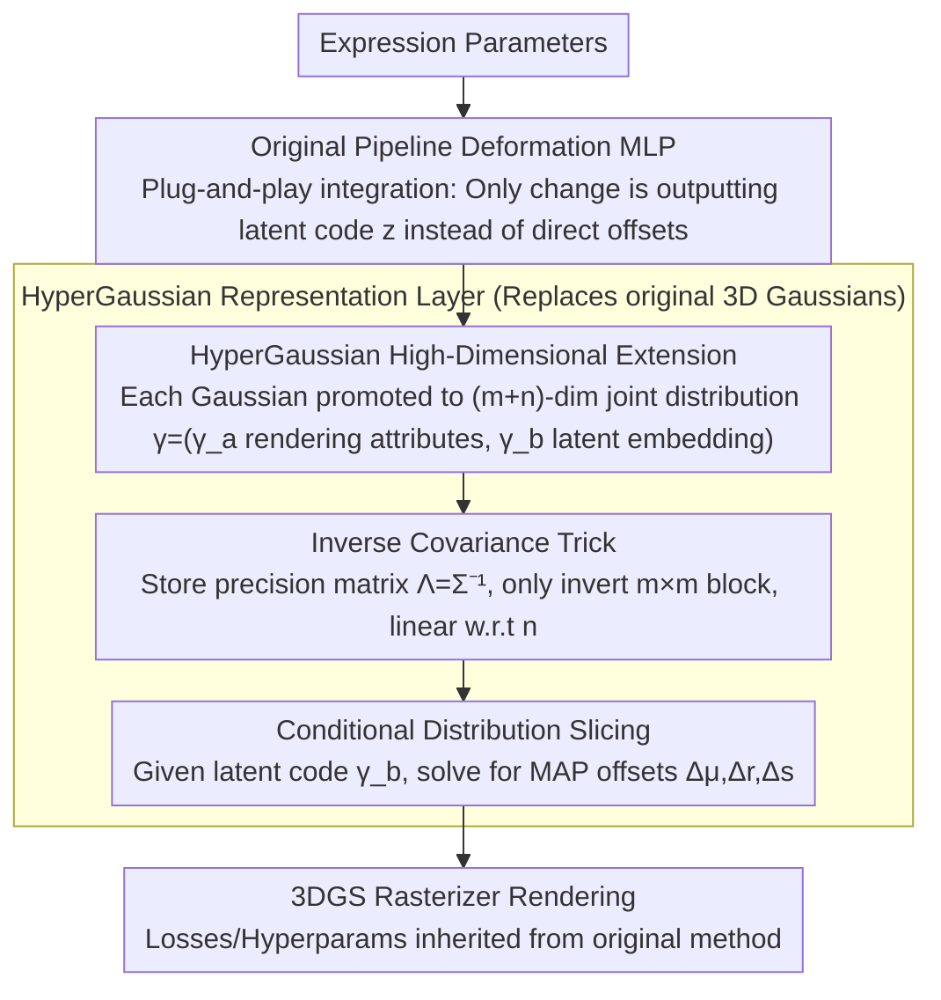

# HyperGaussians: High-Dimensional Gaussian Splatting for High-Fidelity Animatable Face Avatars

**Conference**: CVPR 2026  
**arXiv**: [2507.02803](https://arxiv.org/abs/2507.02803)  
**Code**: [https://gserifi.github.io/HyperGaussians](https://gserifi.github.io/HyperGaussians)  
**Area**: 3D Vision  
**Keywords**: Gaussian Splatting, Face Avatar, High-Dimensional Gaussians, Facial Animation, Conditional Distribution

## TL;DR
HyperGaussians is proposed to extend 3DGS to high-dimensional multivariate Gaussians. It models expression-dependent attribute variations through conditional distributions and utilizes an inverse covariance trick for efficient conditioning. As a plug-and-play module integrated into FlashAvatar and GaussianHeadAvatar, it significantly improves the quality of high-frequency details.

## Background & Motivation
1. **Background**: 3D Gaussian Splatting (3DGS) has become the standard for face avatar modeling. Current SOTA methods bind Gaussians to 3DMM meshes and handle dynamics by using MLPs to predict expression-dependent offsets.
2. **Limitations of Prior Work**: Existing methods still struggle with non-linear deformations (closing eyes, opening mouth), complex lighting effects (specular reflections on glasses), and subtle structures (teeth gaps, eyeglass frames)—high-frequency details that are critical to avoiding the "Uncanny Valley" effect.
3. **Key Challenge**: The expressiveness of 3D Gaussian primitives themselves is limited. Each Gaussian only possesses attributes such as position, rotation, scale, and color. Even with MLPs predicting expression-dependent offsets, the linear combination of attributes remains restricted in representability.
4. **Goal**: Enhance the expressiveness of the 3D Gaussian primitives to capture high-frequency dynamic effects without redesigning the entire pipeline.
5. **Key Insight**: Inspired by HyperNeRF, which handles topological changes by modeling deformation fields in high-dimensional space and slicing them. This idea is applied to Gaussian primitives: treating each Gaussian as a multivariate distribution in high-dimensional space, where expression-dependent 3D Gaussians are obtained through conditioning (slicing).
6. **Core Idea**: Extend 3D Gaussians into $(m+n)$-dimensional HyperGaussians. Dynamically adaptive 3D attributes are obtained by conditioning on an $n$-dimensional latent embedding, while maintaining efficiency using an inverse covariance trick.

## Method

### Overall Architecture
HyperGaussians is a plug-and-play representation enhancement module. In the original pipeline (e.g., FlashAvatar), the MLP outputs expression-dependent offsets $\Delta\mu, \Delta r, \Delta s$. With HyperGaussians, the MLP instead outputs a latent vector $z_\psi$, and the MAP-estimated offsets are calculated via the conditional distribution of the high-dimensional Gaussian. The process only involves replacing the Gaussian representation, leaving other parts (loss functions, hyperparameters) unchanged.

### Key Designs

**1. HyperGaussian High-Dimensional Extension: Self-adaptive Gaussian Primitives**

Standard 3D Gaussian attributes are limited (position, rotation, scale, color). Even with an external MLP predicting offsets, the modulation remains linear on fixed primitives, restricted by the primitive's own capacity. HyperGaussians upgrade the primitives: each Gaussian is no longer just $m$-dimensional but is combined with an $n$-dimensional latent embedding to form an $(m+n)$-dimensional multivariate Gaussian. Specifically, a joint distribution $\gamma = (\gamma_a, \gamma_b)^\top \sim \mathcal{N}(\mu, \Sigma)$ is defined, where $\gamma_a \in \mathbb{R}^m$ represents the rendering attributes (position/rotation/scale) and $\gamma_b \in \mathbb{R}^n$ represents the expression-driven latent embedding. When rendering a frame, the latent code $\gamma_b$ corresponding to the current expression is substituted for conditioning, "slicing" a standard 3D Gaussian from the high-dimensional distribution:

$$\mu_{a|b} = \mu_a + \Sigma_{ab}\Sigma_{bb}^{-1}(\gamma_b - \mu_b)$$

From a Bayesian perspective, this step is exactly the MAP estimate of attributes given the latent code. The prior $p(\gamma_a)$ serves as implicit regularization, preventing attributes from deviating during extrapolation. Compared to NDGS, which only builds conditional distributions for position, HyperGaussians include rotation and scale in the conditional distribution—modeling $p(\Delta r|z)$ and $p(\Delta s|z)$. Thus, Gaussians can translate, rotate, and scale simultaneously based on expression latent codes, providing strictly stronger expressiveness than previous "position-only" multi-dimensional Gaussian variants.

**2. Inverse Covariance Trick: Reducing Higher-Dimensional Conditioning Cost from Cubic to Linear**

The first design faces a critical engineering hurdle: calculating the conditional mean requires $\Sigma_{bb}^{-1}$, an $n \times n$ inversion with $O(n^3 + mn^2)$ complexity. As the latent dimension increases ($n>8$), both speed and VRAM usage become unsustainable. The solution is to store the precision matrix $\Lambda = \Sigma^{-1}$ instead of the covariance $\Sigma$. With the precision matrix, the conditional mean and conditional covariance are rewritten as:

$$\mu_{a|b} = \mu_a - \Lambda_{aa}^{-1}\Lambda_{ab}(\gamma_b - \mu_b), \qquad \Sigma_{a|b} = \Lambda_{aa}^{-1}$$

Now, only the $\Lambda_{aa} \in \mathbb{R}^{m \times m}$ block (a small $3\times3$ or $4\times4$ matrix) needs inversion, decoupling the cost from the latent dimension $n$. The complexity drops to $O(m^3 + m^2 n)$, which is linear with respect to $n$, and storage reduces from $O((m+n)^2)$ to $O(m^2 + mn)$. Consequently, at $n=8$, speed increases by ~150% and VRAM drops from 42MB to 22MB (−48%); at $n=128$, speed increases by ~15000% and VRAM reduces by over 90%. This trick makes large latent dimensions engineering-feasible.

**3. Plug-and-Play Integration: Improving Performance by Replacing Primitives Only**

HyperGaussians is designed as an orthogonal upgrade to the representation layer rather than a new architecture. Taking FlashAvatar as an example, the only modification is changing the deformation MLP output from "direct offsets $\Delta\mu, \Delta r, \Delta s$" to "latent code $z_\psi$", allowing the conditional distribution to translate the code into offsets. Loss functions, training strategies, learning rates, and iterations remain unchanged. GaussianHeadAvatar is integrated similarly. This "zero-intrusion replacement" allows it to stack with future architectural improvements—others can use stronger backbones or better deformation fields, and HyperGaussians will still provide additional gains. The overhead is minimal: only ~1% extra training time (approx. 30 mins) for FlashAvatar. Ablations show $n=8$ as the optimal balance between quality and cost.

### Loss & Training
The loss functions and hyperparameters of the original methods (FlashAvatar/GaussianHeadAvatar) are fully inherited. The learning rate for HyperGaussian parameters is set to $10^{-4}$. FlashAvatar is trained with ~15k Gaussians for 30k iterations (15-20 mins on RTX 4090), while GaussianHeadAvatar is trained for 600k iterations (approx. 2 days). HyperGaussians only adds about 1% to the training time. Key design decision: maintain three independent HyperGaussian distributions for position, rotation, and scale for each primitive, using Cholesky parameterization to ensure positive-definite covariance matrices. Latent dimension $n=8$ was determined via ablation as the best balance. Parameterizing only the $\Lambda_{aa}$ and $\Lambda_{ab}$ blocks of the precision matrix significantly reduces memory footprint. The code is open-sourced to facilitate integration into other pipelines.

## Key Experimental Results

### Main Results (29 subjects, 6 datasets)

| Method | PSNR↑ | SSIM↑ | LPIPS↓ |
|------|-------|-------|--------|
| SplattingAvatar | 28.58 | 0.9396 | 0.0902 |
| MonoGaussianAvatar | 29.94 | 0.9456 | 0.0655 |
| FlashAvatar | 29.43 | 0.9466 | 0.0511 |
| **Ours (FA)** | **29.99** | **0.9510** | **0.0498** |
| GaussianHeadAvatar | 24.10 | 0.8819 | 0.2027 |
| **Ours (GHA)** | **24.38** | **0.8819** | **0.1977** |

### Ablation Study

| Configuration | LPIPS↓ | FPS |
|------|--------|-----|
| HyperGaussians (n=8) | 0.0498 | 300 |
| Increased MLP Depth (same params) | 0.0572 (+15%) | 158 (-47%) |
| Increased MLP Width (same params) | 0.0512 (+3%) | 178 (-41%) |

### Key Findings
- HyperGaussians significantly outperforms increasing MLP capacity given the same parameter count: better LPIPS without speed loss (300 FPS vs 158 FPS).
- Improvements are most evident in high-frequency details: specular reflections, eyeglass frames, teeth gaps, and skin wrinkles—precisely where standard 3DGS is weakest.
- Even $n=1$ outperforms the baseline; $n=8$ is the optimal balance, while $n=128$ remains feasible via the inverse covariance trick but with diminishing returns.
- The inverse covariance trick is vital for practicality—without it, $n=128$ is nearly impossible (15000% speed gain, >90% memory reduction).
- Effectiveness persists in cross-reenactment scenarios, suggesting learning of general high-frequency modeling rather than over-fitting to specific expressions.
- In multi-view settings (GaussianHeadAvatar), HyperGaussians improves wrinkle and reflection quality with only 1% extra training cost.
- **Inverse Covariance Efficiency Data**: At $n=8$, naïve implementation uses 42MB/conditioning → inverse covariance uses 22MB (-48%); at $n=128$, memory reduces by >90%.
- **Cross-dataset Consistency**: Consistent performance across 6 datasets including INSTA, NerFace, IMAvatar, and NeRSemble.
- Training convergence is faster—HyperGaussians reaches baseline quality in fewer iterations.

## Highlights & Insights
- **Elegant Bayesian Unification**: Unifies multi-dimensional Gaussian extensions like NDGS/4DGS/6DGS/7DGS as special cases of conditional Gaussian distributions, while highlighting their limitations (e.g., inability to condition rotation/scale).
- **Orthogonal to Architectures**: Quality improves without modifying model design, allowing HyperGaussians to combine freely with future architectural advancements.
- **Generality of the Inverse Covariance Trick**: Applicable beyond face avatars to any scenario requiring high-dimensional Gaussian conditioning. The reduction from $O(n^3)$ to $O(n)$ is significant for real-time applications.

## Limitations & Future Work
- Effectiveness currently verified on face avatars only; results for full-body dynamics (clothes, hair movement with large non-linear deformation) are unknown.
- Conditional covariance matrix $\Sigma_{a|b} = \Lambda_{aa}^{-1}$ is unused in current implementation—it contains uncertainty information of 3D Gaussian parameters for potential active learning or quality assessment.
- Requires pre-calculating/optimizing precision matrix blocks $\Lambda_{aa}$ and $\Lambda_{ab}$; implementation is more complex than standard 3DGS.
- Extrapolation for extreme out-of-distribution expressions may be limited, as linear conditioning of multivariate Gaussians assumes linear relationships between parameters.
- Quantitative gains, though consistent, are modest (PSNR +0.56, LPIPS -0.0013); visual improvements are concentrated in high-frequency detail regions.
- The choice of $n=8$ was via ablation; different scenes may require different optimal dimensions. Adaptive dimension selection mechanisms are yet to be developed.

## Related Work & Insights
- **vs NDGS/6DGS/7DGS**: These are special cases of HyperGaussians. They cannot condition rotation/scale and are computationally infeasible at large latent dimensions. HyperGaussians solves these constraints and eliminates Gaussian "disappearance" during large deformations.
- **vs FlashAvatar**: Replacing the Gaussian representation alone drops LPIPS from 0.0511 to 0.0498 and increases PSNR from 29.43 to 29.99, proving the value of underlying representation improvements. MLP-predicted offsets in FlashAvatar are "external modulations," while HyperGaussians builds modulation into the primitive itself.
- **vs HyperNeRF**: The concept of high-dimensional deformation modeling comes from HyperNeRF, but HyperGaussians adapts this to the Gaussian Splatting framework, achieving real-time rendering (300 FPS) via the inverse covariance trick.
- **vs MonoGaussianAvatar**: Requires 100k+ Gaussians and 12h training, whereas FlashAvatar+HyperGaussians needs ~15k Gaussians and 20 mins for better performance. This suggests better representation is more important than more parameters.
- **vs SplattingAvatar**: SplattingAvatar ignores expression's effect on appearance (like specular shifts), leading to blur. HyperGaussians naturally models these dependencies.
- **Future Outlook**: The framework could apply to dynamic scenes beyond faces (full-body, animals, deformable objects).
- **Difference from 4DGS**: 4DGS adds a time dimension but requires custom CUDA kernels; HyperGaussians adds arbitrary dimensions through the inverse covariance trick compatible with standard 3DGS rasterizers.
- **Gaussian Mixture Model Perspective**: NDGS is effectively a multi-dimensional GMM extension, but density dependence on the joint distribution causes instability during large deformations; HyperGaussians avoids this via conditional distributions.

## Rating
- Novelty: ⭐⭐⭐⭐⭐ Triple innovation (high-dim Gaussians + Bayesian perspective + inverse covariance trick); strong theoretical depth.
- Experimental Thoroughness: ⭐⭐⭐⭐⭐ Extensive testing on 29 subjects across 6 datasets; includes ablations, speed comparisons, and single/multi-view settings.
- Writing Quality: ⭐⭐⭐⭐⭐ Elegant mathematical derivations; excellent unified Bayesian analysis.
- Value: ⭐⭐⭐⭐⭐ Plug-and-play representation upgrade with high versatility; inverse covariance trick has broad application potential.

<!-- RELATED:START -->

## Related Papers

- [\[CVPR 2026\] FACE: A Face-based Autoregressive Representation for High-Fidelity and Efficient Mesh Generation](face_a_face-based_autoregressive_representation_for_high-fidelity_and_efficient_.md)
- [\[CVPR 2026\] High-Fidelity Mobile Avatars with Pruned Local Blendshapes](high-fidelity_mobile_avatars_with_pruned_local_blendshapes.md)
- [\[CVPR 2026\] Depth Peeling for High-Fidelity Gaussian-Enhanced Surfel Rendering](depth_peeling_for_high-fidelity_gaussian-enhanced_surfel_rendering.md)
- [\[CVPR 2026\] Tavatar: Topology-Aware Gaussian Attribute Derivation for Animatable Human Avatars](tavatar_topology-aware_gaussian_attribute_derivation_for_animatable_human_avatar.md)
- [\[CVPR 2026\] Motion-Aware Animatable Gaussian Avatars Deblurring](motion-aware_animatable_gaussian_avatars_deblurring.md)

<!-- RELATED:END -->
