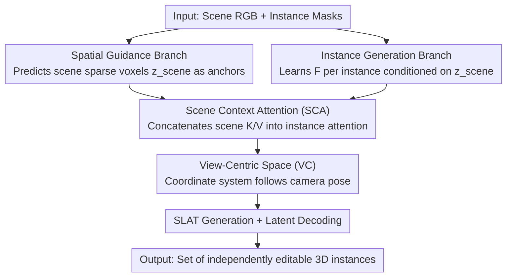

# I-Scene: 3D Instance Models are Implicit Generalizable Spatial Learners

**Conference**: CVPR 2026  
**Paper**: [CVF Open Access](https://openaccess.thecvf.com/content/CVPR2026/html/Ling_I-Scene_3D_Instance_Models_are_Implicit_Generalizable_Spatial_Learners_CVPR_2026_paper.html)  
**Code**: Publicly accessible via project page (per paper; specific URL not provided in the source ⚠️)  
**Area**: 3D Vision / Interactive 3D Scene Generation  
**Keywords**: 3D Scene Generation, Instance Prior, Reprogramming, View-centric Space, Feed-forward Generation

## TL;DR
I-Scene shifts away from using labeled scene datasets to teach models "where to place objects." Instead, it "reprograms" a pre-trained image-to-3D instance generator (TRELLIS) into a scene-level spatial learner. By utilizing Scene Context Attention and a View-centric Space, the model learns to infer spatial relationships such as adjacency, support, and symmetry in a single feed-forward pass. It can generalize to unseen layouts even when trained on non-semantic random scenes, outperforming SOTAs trained on 3D-FRONT.

## Background & Motivation
**Background**: Interactive 3D scene generation aims to produce editable object arrangements with proper affordance and spatial consistency. Recent end-to-end methods (MIDI-3D, SceneGen, PartCrafter) extend powerful image-to-3D instance priors to handle multiple objects, modeling them and their relationships in a single forward pass to avoid cascading errors from modular pipelines (detection-retrieval/generation-layout optimization).

**Limitations of Prior Work**: These learning-based methods have spatial understanding **tightly coupled with curated scene datasets**. The most common dataset, 3D-FRONT, contains only ~20,000 indoor scenes (bedrooms/living rooms), where small objects and supports are severely underrepresented. Consequently, models overfit to dataset biases and fail on rare arrangements like "small objects placed on large furniture/hidden behind" or "outdoor layouts." Modular pipelines, while semantically open, are sensitive to early perception/planning errors and require per-scene optimization, limiting throughput.

**Key Challenge**: The deadlock between generalization capability ↔ dataset coverage. Layout supervision is derived from datasets, yet available interactive scene datasets are limited in scale, diversity, and spatial variation. Thus, the path of "using more labeled scenes" is fundamentally unsustainable.

**Key Insight**: The authors observe that a pre-trained 3D instance generator, though outputting a single mesh, **implicitly encodes transferable spatial knowledge** (depth, occlusion, scale, support). Instead of annotating more scenes, one can **reprogram** this instance prior into a scene-level spatial learner, replacing "dataset-centric layout supervision" with "model-intrinsic spatial priors."

**Core Idea**: Reprogram the instance generator into a spatial learner, using model-centric supervision instead of dataset-centric supervision. By shifting the scene representation from the mainstream "canonical space" to a "view-centric space," a fully feed-forward, generalizable scene generator is achieved, capable of learning spatial relationships from non-semantic random scenes.

## Method

### Overall Architecture
Given a single scene image $I_{scene}\in\mathbb R^{H\times W\times3}$ and instance masks $\{m_i\}_{i=1}^N$, I-Scene outputs a set of independently manipulatable 3D instances $A=\{A_i\}_{i=1}^N$ placed consistently with the input image. Using TRELLIS as the backbone, **only the sparse structure transformer is modified, while other stages remain unchanged**. The model consists of two branches sharing **joint weights and joint training**: the **Spatial Guidance Branch** processes the scene RGB to predict the entire scene as a set of sparse activated voxels $f_{scene}=\{(f_i,p_i)\}_{i=1}^L$, providing a global layout to guide instance generation and establishing a shared scene coordinate system (the "anchor"); the **Instance Generation Branch** processes individual instance RGB $I_{inst}$ to learn a function $F$ that predicts voxelized instance features $f_{inst}=F(I_{inst},z_{scene})$ conditioned on the scene latent $z_{scene}$. Since $z_{scene}$ provides the layout, $F$ focuses on generating geometry while following the layout guidance. $F$ is implemented via **Scene Context Attention**, represented in **View-centric Space**, and trained using **Non-semantic Random Scenes**.

### Key Designs

**1. Dual-branch Reprogramming: Using Intrinsic Instance Priors as Scene Supervision**

To address the dependency on dataset layout supervision, I-Scene splits the pre-trained instance generator into two weight-sharing branches. The Spatial Guidance Branch predicts the scene as sparse voxels to provide a global layout anchor $z_{scene}$, while the Instance Generation Branch generates geometry conditioned on this anchor. The insight is that without this anchor, instances would be generated independently and inconsistently; with it, $F$ only handles "local geometry + layout following," preserving shape quality while deriving spatial relationships from the shared scene context. This model-centric supervision eliminates the need for labeled scenes.

**2. Scene Context Attention (SCA): Injecting Scene Information without Destroying Priors**

To condition instance generation on the scene without causing "catastrophic forgetting" of the powerful instance prior, changes to the base model must be minimal. SCA modifies standard self-attention: for instance $i$ with query/key/value $(Q_i,K_i,V_i)$ and scene guidance with $(Q_s,K_s,V_s)$, the scene key/value are concatenated to the instance's—$\tilde K_i=[K_i;K_s]$, $\tilde V_i=[V_i;V_s]$—to compute $\mathrm{SCA}(Q_i,\tilde K_i,\tilde V_i)=\mathrm{softmax}\!\big(Q_i\tilde K_i^\top/\sqrt d\big)\tilde V_i$. Effectively, instance generation looks at its own $K_i/V_i$ while attending to $K_s/V_s$. This "natural" modification does not change the latent distribution; as a limiting case, SCA reverts to original self-attention when inputs are identical, minimizing perturbation to the pre-trained prior (mathematical proof in the appendix).

**3. View-Centric Space (VC): Using Image Layout as a Strong Hint for 3D Placement**

Mainstream approaches (MIDI, SceneGen) follow the **canonical space** of image-to-3D models. However, canonical space is view-invariant—an object is mapped to the same representation regardless of camera view—meaning $F$ loses the object's relative spatial position in the view. While acceptable for sparse 3D-FRONT scenes, $F$ often collapses **identical objects** (e.g., several chairs) into the same 3D position. I-Scene adopts a view-centric space where axes align with camera pose and representations are view-dependent, strictly encoding the relationship between image and scene space. Spatial layouts vary **coherently** with camera poses—ablations show VC is critical for layout consistency; removing it leads to the largest IoU drops in OOD (BlendSwap/Scenethesis) and causes overlapping/fused instances and contact violations.

**4. Non-semantic Random Scenes (NS): Generalizing via Geometric-only Training**

3D-FRONT is domain-specific with limited assets. Even with SCA + VC, training exclusively on it can degrade instance quality as the model forgets instance priors. Since the learner $F$ learns "layout following" rather than specific dataset patterns, the **semantics of the training scene become irrelevant**. The authors sample high-quality 3D assets from Objaverse and arrange them randomly with **no-collision mechanisms**, applying basic spatial relations (right/left/front/back/on-top) and physical constraints to create non-semantic synthetic scenes. By training on this data, I-Scene learns **general spatial reasoning** agnostic to category semantics. Experiments show that purely random training (Rand-15K/25K) outperforms 3D-FT on OOD metrics and scales with data size; a mixture of 3D-FT + Rand-15K achieves the best overall performance.

### Loss & Training
The model is trained using conditional rectified flow (CFM): $\mathcal L_{CFM}(\theta)=\mathbb E_{t,x_0,\epsilon}\big\|v_\theta(x,t)-(\epsilon-x_0)\big\|_2^2$, where $v_\theta$ is the sparse structure network, $x(t)=(1-t)x_0+t\epsilon$, and $\epsilon$ is noise at timestep $t$. Both branches are trained jointly with shared weights.

## Key Experimental Results

**Metrics**: CD (Chamfer Distance, **lower is better**); F-Score (threshold $\tau=0.1$, **higher is better**), reported at scene-level (S) and object-level (O); IoU-B (Voxel IoU of axis-aligned bounding boxes, **higher is better**, measuring overall size/position/relative placement). Assets are converted to point clouds and rigidly aligned to ground truth using robust ICP before geometric evaluation.

### Main Results
Comparison with SOTA on synthetic data (3D-FRONT as ID, BlendSwap & Scenethesis as OOD):

| Dataset | Metric | Gen3DSR | SceneGen | MIDI | **I-Scene (Ours)** |
|--------|------|---------|----------|------|--------------------|
| 3D-FRONT (ID) | CD-S↓ / F-S↑ | 0.2587 / 42.31 | 0.1432 / 54.70 | 0.0175 / 90.08 | **0.0148 / 93.50** |
| 3D-FRONT (ID) | CD-O↓ / F-O↑ | 0.0697 / 57.22 | 0.0353 / 77.95 | 0.0877 / 70.10 | **0.0207 / 84.28** |
| 3D-FRONT (ID) | IoU-B↑ | 0.4838 | 0.5295 | 0.8596 | **0.8762** |
| BlendSwap & Scenethesis (OOD) | CD-S↓ / F-S↑ | 0.1429 / 45.43 | 0.1161 / 49.94 | 0.0212 / 83.13 | **0.0059 / 94.26** |
| BlendSwap & Scenethesis (OOD) | IoU-B↑ | 0.4736 | 0.4669 | 0.7412 | **0.8568** |

Notably, there is **almost no performance drop in OOD**: while all baselines degrade significantly from ID to OOD, I-Scene maintains object/scene-level performance on BlendSwap/Scenethesis close to its ID level. In terms of efficiency, it takes 15.51s per scene on an H100, which is slower than PartCrafter (7.2s) but with higher quality, and faster than MIDI (42.5s), SceneGen (26.0s), and Gen3DSR (179.0s).

### Ablation Study
Component ablation (removing SCA / VC / NS from the full model):

| SCA | VC | NS | 3D-FRONT F-S↑ / IoU-S↑ | OOD F-S↑ / IoU-S↑ | Description |
|-----|----|----|------------------------|-------------------|------|
| ✓ | ✗ | ✗ | 93.69 / 0.8598 | 79.12 / 0.7557 | SCA only; significantly weaker in OOD |
| ✓ | ✓ | ✗ | 93.77 / 0.8792 | 90.79 / 0.8222 | Adding VC improves OOD (Layout consistency) |
| ✓ | ✓ | ✓ | 93.50 / 0.8762 | **94.26 / 0.8568** | Full model; best OOD (Instance diversity) |

Training data ablation (using different training sets):

| Training Data | 3D-FRONT (ID) F-S↑ | OOD F-S↑ / IoU-B↑ | Observation |
|----------|--------------------|-------------------|------|
| 3D-FT (25K) | 93.77 | 90.79 / 0.8222 | Best in-domain layout, but weaker OOD |
| Rand-15K | 92.67 | 92.67 / 0.8445 | Non-semantic random training exceeds 3D-FT OOD |
| Rand-25K | 93.60 | 93.60 / 0.8471 | Continuous improvement with scaling |
| 3D-FT + Rand-15K | 93.50 | **94.26 / 0.8568** | Mixture yields best overall performance |

### Key Findings
- **VC is the lifeline of layout consistency**: Removing it causes the largest IoU drop in OOD and a significant decrease in scene-level F-score, leading to repeated/fused instances. This confirms that image-space object layout is a strong prompt for 3D placement.
- **Non-semantic scenes suffice for spatial reasoning**: Pure geometric cues (proximity, support, symmetry) provide strong supervision. Gain increases from 15K to 25K, suggesting a scalable "synthetic non-semantic layout" path similar to MegaSynth.
- **Labeled scenes are for calibration**: 3D-FT + Rand-15K performs best, indicating labeled scenes handle ID calibration while random scenes provide the diversity needed for generalization.

## Highlights & Insights
- **Reprogramming vs. Retraining**: Transforming a single-mesh generator into a scene-level learner by modifying only a few attention layers preserves the pre-trained prior. This "minimally invasive modification" is a transferable strategy for reusing 3D/Image foundation models.
- **The Equivalence Property of SCA**: Mathematically ensuring that SCA reverts to self-attention when inputs are identical guarantees minimal perturbation to the latent distribution—an elegant compromise between condition injection and prior preservation.
- **"Non-semantic data can teach spatiality"**: The "aha" moment that random arrangements without scene semantics yield better generalization by decoupling spatial learning from semantics, pointing towards scaling interactive 3D scene generation via synthetic data.

## Limitations & Future Work
- Performance drops under **ultra-low resolution inputs** or **single views with heavy occlusion**. Future work will explore heavy-occlusion augmentation and multi-view conditioning.
- The authors plan to investigate the scaling laws of non-semantic random scenes to handle challenging "wild" layouts.
- Note: The source text contains some LaTeX fragmentation (e.g., Eqs. 1, 3, 4, 5); specific tensor shapes should be verified against the original paper. The method is dependent on the TRELLIS backbone; generalizability to other backbones is unproven. 15.51s/scene is still overhead for large-scale batch generation.

## Related Work & Insights
- **vs. MIDI-3D / SceneGen (End-to-end multi-instance)**: These learn object poses/relationships from 3D-FRONT annotations, becoming bound by dataset bias and failing in OOD. I-Scene uses model-centric supervision and VC space to maintain performance in OOD.
- **vs. PartCrafter**: PartCrafter extends latent diffusion to joint part/object denoising. It is faster (7.2s) but lacks texture and has inferior geometric/layout quality compared to I-Scene.
- **vs. Gen3DSR / Modular Pipelines (Perception-then-assembly)**: These rely on detection/segmentation/depth for assembly, making them sensitive to early errors and requiring per-scene optimization (throughput as low as 179s). I-Scene is fully feed-forward without handoff errors.

## Rating
- Novelty: ⭐⭐⭐⭐⭐ "Reprogramming instance priors + Non-semantic data for spatiality" is a truly counter-intuitive new paradigm.
- Experimental Thoroughness: ⭐⭐⭐⭐⭐ Comprehensive evaluation across ID/OOD/Real/Stylized data with both component and data ablations.
- Writing Quality: ⭐⭐⭐⭐ Clear motivation and insights, though some technical proofs are relegated to the appendix.
- Value: ⭐⭐⭐⭐⭐ Points toward a foundation model route for interactive 3D scene generation using synthetic data scaling.

## Related Papers

- [\[CVPR 2026\] Towards Foundation Models for 3D Scene Understanding: Instance-Aware Self-Supervised Learning for Point Clouds](towards_foundation_models_for_3d_scene_understanding_instance-aware_self-supervi.md)
- [\[CVPR 2026\] Consistent Instance Field for Dynamic Scene Understanding](consistent_instance_field_for_dynamic_scene_understanding.md)
- [\[CVPR 2026\] Context-Nav: Context-Driven Exploration and Viewpoint-Aware 3D Spatial Reasoning for Instance Navigation](context-nav_context-driven_exploration_and_viewpoint-aware_3d_spatial_reasoning_.md)
- [\[CVPR 2026\] Featurising Pixels from Dynamic 3D Scenes with Linear In-Context Learners](featurising_pixels_from_dynamic_3d_scenes_with_linear_in-context_learners.md)
- [\[CVPR 2026\] Learning Spatial-Temporal Consistency for 3D Semantic Scene Completion](learning_spatial-temporal_consistency_for_3d_semantic_scene_completion.md)

<!-- RELATED:END -->

<!-- RELATED:START -->

## Related Papers

- [\[CVPR 2026\] Consistent Instance Field for Dynamic Scene Understanding](consistent_instance_field_for_dynamic_scene_understanding.md)
- [\[CVPR 2026\] Featurising Pixels from Dynamic 3D Scenes with Linear In-Context Learners](featurising_pixels_from_dynamic_3d_scenes_with_linear_in-context_learners.md)
- [\[CVPR 2026\] Learning Spatial-Temporal Consistency for 3D Semantic Scene Completion](learning_spatial-temporal_consistency_for_3d_semantic_scene_completion.md)
- [\[CVPR 2026\] 3D-IDE: 3D Implicit Depth Emergent](3d-ide_3d_implicit_depth_emergent.md)
- [\[CVPR 2026\] EvObj: Learning Evolving Object-centric Representations for 3D Instance Segmentation without Scene Supervision](evobj_learning_evolving_object-centric_representations_for_3d_instance_segmentat.md)

<!-- RELATED:END -->
