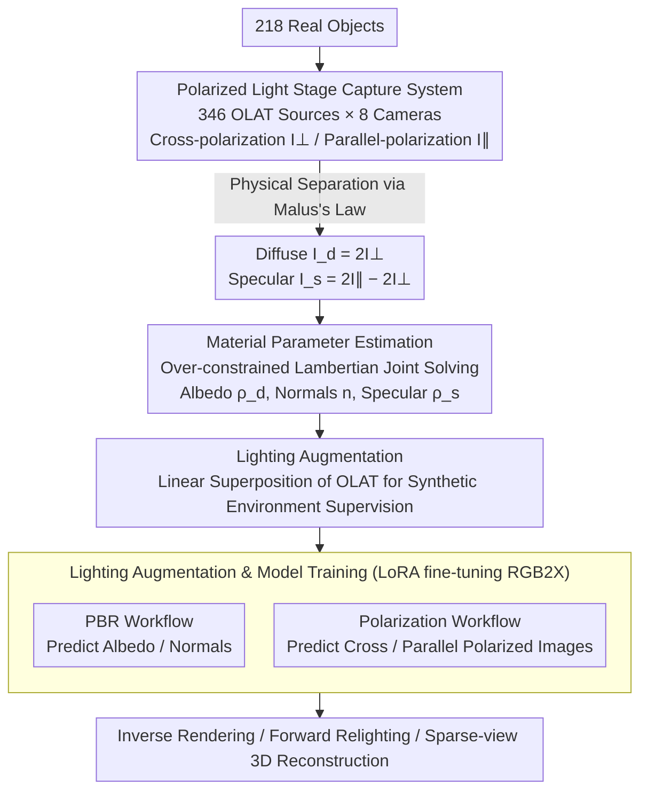

# ICTPolarReal: A Polarized Reflection and Material Dataset of Real World Objects

**Conference**: CVPR 2026  
**arXiv**: [2603.24912](https://arxiv.org/abs/2603.24912)  
**Code**: [https://jingyangcarl.github.io/ICTPolarReal](https://jingyangcarl.github.io/ICTPolarReal) (Project Page)  
**Area**: 3D Vision  
**Keywords**: Polarization imaging, Material dataset, Inverse rendering, Reflection separation, Light Stage

## TL;DR

This work constructs ICTPolarReal, the first large-scale real-world polarized reflection and material dataset. Utilizing a Light Stage system with 8 cameras and 346 light sources, cross- and parallel-polarized captures were performed on 218 daily objects. This yielded over 1.2 million high-resolution images with ground truth diffuse-specular separation, significantly enhancing the performance of inverse rendering, forward relighting, and sparse-view 3D reconstruction.

## Background & Motivation

**Background**: Inverse rendering (intrinsic image decomposition) aims to decompose an image into albedo, lighting, and specular components. Recently, diffusion-based methods (e.g., RGB2X, Diffusion Renderer) have made significant progress but rely heavily on synthetic datasets (e.g., Objaverse, Hypersim) for training.

**Limitations of Prior Work**: While synthetic data is visually realistic, it is limited by simplified lighting models and restricted material authenticity. Common shading models use analytical BRDFs or low-sample approximations for bidirectional reflection, ignoring effects like multiple scattering, polarization, and subsurface transport prevalent in real objects. Consequently, models trained solely on synthetic data struggle to generalize to real lighting and photographs.

**Key Challenge**: There is a lack of real-world reflectance measurement data. Existing real-world datasets either provide photographs under different lighting without intrinsic decomposition labels (Multi-Illumination), are limited to planar samples and two viewpoints (OpenSVBRDF), or have extremely limited object counts and lighting patterns (Open Illumination), making them unsuitable for supervising the training of material decomposition networks.

**Goal**: (1) Construct a large-scale real-world reflection dataset covering diverse materials with diffuse/specular ground truth; (2) Verify whether using measured real-world data can significantly improve the performance of inverse rendering and relighting models in real scenes.

**Key Insight**: Leveraging the principles of polarization optics, diffuse and specular reflections are physically separated using cross-polarization and parallel-polarization filters. Malus's Law ensures these two components can be precisely extracted under specific polarization configurations.

**Core Idea**: Use a polarized Light Stage system for large-scale measurement of real objects to obtain the first real-world material dataset capable of directly supervising deep inverse rendering models.

## Method

### Overall Architecture

The core of this work is not a single network but a physical measurement pipeline designed to "cleanly decompose" real object reflections. The authors argue that inverse rendering models fail on real photos because synthetic BRDFs do not capture effects like multiple scattering and subsurface transport. The approach uses polarization optics to physically separate diffuse and specular components, providing reliable material labels for real objects. The pipeline consists of three steps: capturing polarized image pairs for an object under 346 lighting directions across 8 views, solving for diffuse albedo, specular albedo, and normals from these sequences, and finally fine-tuning inverse/forward rendering models for validation.

### Key Designs

**1. Polarized Light Stage Capture System: Physical Separation via Malus's Law**

The most difficult step in inverse rendering is stripping specular highlights from the diffuse base. Instead of relying on algorithms, the authors utilize hardware-level optics. The system consists of 346 LED sources on a geodesic sphere and 8 synchronized RED Komodo 6K cameras. Linear polarizers are placed in front of LEDs and rotating polarizers on cameras. Captures use One-Light-At-a-Time (OLAT) sequences, triggering every light direction twice for one cross-polarized image $I_{\perp}$ and one parallel-polarized image $I_{\parallel}$. Based on Malus's Law, specular reflection maintains the polarization of incident light and is filtered out during cross-polarization, leaving only diffuse components in $I_{\perp}$. Components are extracted analytically:

$$I_d = 2I_{\perp}, \qquad I_s = 2I_{\parallel} - 2I_{\perp}$$

This pure physical separation provides the foundation for credible ground truth.

**2. Material Parameter Estimation: Over-constrained Joint Solving**

With the separated diffuse sequence $\Lambda_d$ and specular sequence $\Lambda_s$, the next step is to condense them into per-pixel material parameters. The diffuse component follows Lambert's Cosine Law. For each pixel, the following is minimized:

$$L = \{\rho_d\,|n \cdot \omega_k|\}_{k=0}^{N} - \Lambda_d$$

This simultaneously solves for diffuse albedo $\rho_d$ and surface normal $n$. With 346 lighting directions, the system is highly over-constrained, making the joint solution stable and free from the ambiguities found in low-lighting scenarios. Specular albedo $\rho_s$ is approximated by integrating the specular reflection function over all light directions.

**3. Lighting Augmentation: Exploiting Linear Superposition of OLAT**

To train generalizable models, the authors exploit the linear superposition property of OLAT capture: an image under arbitrary environment lighting equals the weighted sum of individual OLAT images. Given any environment map, weights are calculated for each lamp to synthesize the relighting result. Crucially, the diffuse/specular separation remains valid for the synthesized images. Training involves two workflows: the PBR workflow predicts physical material components, while the Polarization workflow predicts cross/parallel polarized images directly, effectively teaching a standard camera to "virtually" output polarization results. Both use LoRA to fine-tune RGB2X, avoiding catastrophic forgetting on small-scale real data.

### Loss & Training

Both inverse and forward rendering networks are fine-tuned using LoRA on RGB2X. Inverse rendering utilizes a prompt-based conditioning mechanism to control target component generation (e.g., "albedo" or "surface normal"). Forward rendering is supervised with L2 loss, using an additional irradiance map as input. Training data is expanded via lighting augmentation, including OLAT, synthetic HDRI, and white lighting.

## Key Experimental Results

### Main Results

**Inverse Rendering Decomposition (HDRI Lighting, Light Stage Data)**:

| Method | Albedo MSE↓ | Albedo PSNR↑ | Normal PSNR↑ | Specular PSNR↑ |
|------|-------------|--------------|--------------|----------------|
| DR-IR (Original) | 0.035 | 20.01 | 20.48 | 22.61 |
| RGB2X (Original) | 0.040 | 18.08 | 18.58 | 17.21 |
| **Ours (Fine-tuned)** | **0.005** | **33.51** | **28.09** | **31.02** |

**Forward Relighting (HDRI Lighting, Light Stage Data)**:

| Method | MSE↓ | PSNR↑ | SSIM↑ | LPIPS↓ |
|------|------|-------|-------|--------|
| DR-FR | 0.058 | 16.97 | 0.775 | 0.386 |
| RGB2X | 0.038 | 18.50 | 0.514 | 0.514 |
| **Ours-PBR** | **0.005** | **27.80** | **0.904** | **0.211** |
| **Ours-Polarization** | 0.007 | 26.13 | 0.909 | 0.200 |

### Ablation Study

**Sparse-View 3D Reconstruction (8 views input, 50 real objects)**:

| Input / Method | PSNR↑ | SSIM↑ | LPIPS↓ |
|-------------|-------|-------|--------|
| Dust3r + Original Image | 14.51 | 0.226 | 0.604 |
| Dust3r + Pred. Diffuse | 17.78 | 0.411 | 0.556 |
| **Dust3r + Pred. Albedo** | **20.30** | **0.513** | **0.506** |
| Mast3r + Original Image | 12.72 | 0.193 | 0.613 |
| **Mast3r + Pred. Albedo** | **15.57** | **0.282** | **0.603** |

### Key Findings

- Fine-tuning with real polarized data increased albedo PSNR from 20 dB to 33.5 dB (a 13.5 dB leap), highlighting the massive domain gap between synthetic and real reflectance.
- The Polarization workflow achieved the lowest LPIPS (0.200) in relighting tasks, indicating that polarization supervision helps in more accurate reflection modeling.
- Using diffuse images (specular removed) as input for 3D reconstruction improved Dust3r's PSNR from 14.5 to 20.3, proving that specular reflection is a primary distractor in sparse-view reconstruction.

## Highlights & Insights

- **Ingenious Use of Real Polarized Separation**: Malus's Law enables a purely physical-driven reflection separation without relying on learning, providing precise ground truth for the dataset. This "physics-first, learning-second" paradigm is highly effective.
- **"Virtual Polarization" Concept**: Training a model to predict polarized equivalent outputs from standard non-polarized inputs effectively grants standard cameras "polarization capabilities." This idea can be extended to other specialized imaging tasks.
- **Linear Superposition for Augmentation**: The key advantage of OLAT capture is the linear superposition property of real reflection, allowing for the generation of infinite training data under various lighting conditions with precise labels.

## Limitations & Future Work

- Data collection is limited to static objects in a controlled Light Stage environment, failing to capture highly transparent, dynamic, or strongly anisotropic materials.
- The dataset does not currently include subsurface scattering parameters.
- While 218 objects cover a wide range, the quantity is still limited, and some material categories may be underrepresented.
- Future work could explore extending polarized measurements to more complex materials and in-the-wild capture scenarios.

## Related Work & Insights

- **vs Objaverse/Hypersim (Synthetic)**: These provide large-scale labels but lack real material properties. The proposed dataset is smaller but offers the advantage of real physical measurement; both types are complementary.
- **vs Multi-Illumination**: The latter provides multi-light real photos but lacks intrinsic decomposition labels, making direct supervision for inverse rendering impossible. This work fills that gap using polarization.
- **vs OpenSVBRDF**: Limited to planar samples and two views; this work scales to full 3D objects and 8 viewpoints.

## Rating

- Novelty: ⭐⭐⭐⭐ First large-scale real-world polarized material dataset; fills a significant gap, though the core concept is straightforward.
- Experimental Thoroughness: ⭐⭐⭐⭐⭐ Covers three downstream tasks (inverse rendering, relighting, 3D reconstruction) with comparisons across multiple lighting conditions.
- Writing Quality: ⭐⭐⭐⭐ Clear structure with detailed descriptions of physical principles.
- Value: ⭐⭐⭐⭐⭐ Extremely high data value; likely to become infrastructure-level work in the inverse rendering field.

<!-- RELATED:START -->

## Related Papers

- [\[CVPR 2026\] OLATverse: A Large-scale Real-world Object Dataset with Precise Lighting Control](olatverse_a_large-scale_real-world_object_dataset_with_precise_lighting_control.md)
- [\[CVPR 2026\] Artiverse: A Diverse and Physically Grounded Dataset for Articulated Objects](artiverse_a_diverse_and_physically_grounded_dataset_for_articulated_objects.md)
- [\[CVPR 2026\] MatSpray: Fusing 2D Material World Knowledge on 3D Geometry](matspray_fusing_2d_material_world_knowledge_on_3d_geometry.md)
- [\[CVPR 2026\] Learning a Particle Dynamics Model with Real-world Videos](learning_a_particle_dynamics_model_with_real-world_videos.md)
- [\[CVPR 2026\] Learning 3D Shape Fidelity Metric from Real-world Distortions](learning_3d_shape_fidelity_metric_from_real-world_distortions.md)

<!-- RELATED:END -->
