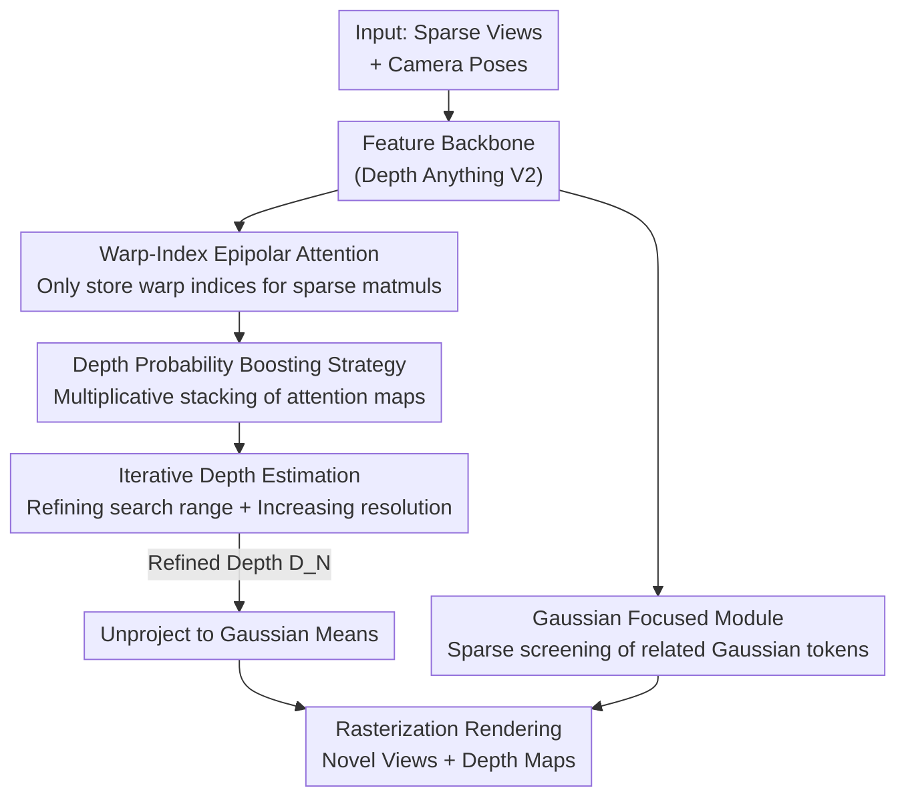

# IDESplat: Iterative Depth Probability Estimation for Generalizable 3D Gaussian Splatting

**Conference**: CVPR 2026  
**Paper**: [CVF Open Access](https://openaccess.thecvf.com/content/CVPR2026/html/Long_IDESplat_Iterative_Depth_Probability_Estimation_for_Generalizable_3D_Gaussian_Splatting_CVPR_2026_paper.html)  
**Code**: https://github.com/CVL-UESTC/IDESplat  
**Area**: 3D Vision  
**Keywords**: Generalizable 3DGS, Feed-forward Gaussian Reconstruction, Depth Probability Estimation, Iterative Warp, Sparse Attention

## TL;DR
IDESplat replaces "single-warp depth estimation" with "multi-cascade warp iterative depth probability boosting." This improves the accuracy of Gaussian center (depth) prediction for feed-forward generalizable 3DGS. On the RE10K dataset, it surpasses DepthSplat by 0.33 dB PSNR with only ~1/10 of the parameters and achieves a significant 2.95 dB gain on the cross-dataset DTU benchmark.

## Background & Motivation

**Background**: Generalizable 3D Gaussian Splatting (3DGS) uses a feed-forward network to directly predict all Gaussian parameters (mean $\mu$, opacity $\alpha$, covariance $\Sigma$, color $c$), enabling reconstruction of unseen scenes without per-scene optimization. The Gaussian mean (center position) is the most challenging to regress directly due to local gradient support. Thus, the prevailing approach involves estimating a per-pixel depth map and unprojecting it to obtain the centers.

**Limitations of Prior Work**: Existing methods (MVSplat, MonoSplat, DepthSplat) primarily rely on a **single warp** to construct a cost volume for measuring cross-view feature similarity to estimate depth probabilities. A single warp fails to fully capture multi-view geometric cues, resulting in "unreliable and coarse" depth maps. Furthermore, storing dense warp features for every depth candidate leads to high GPU memory consumption as the number of candidates $D$ increases.

**Key Challenge**: There is an information ceiling between depth accuracy and single-warp capacity. Single-round similarity measurements are inherently noisy and ambiguous (e.g., indistinguishable foreground/background textures), yet they are directly used to determine Gaussian centers, causing error propagation throughout the parameter optimization.

**Goal**: (1) Use multiple warps to progressively enhance similarity measures and suppress low-probability candidates; (2) Perform iterative refinement without exceeding memory limits; (3) Produce cleaner estimates for all other non-mean Gaussian parameters.

**Key Insight**: Drawing inspiration from the "iterative coarse-to-fine" approach in optical flow and MVS, if a single measurement is unreliable, the epipolar attention maps from multiple warps can be combined in a **multiplicative manner**. This boosts depth candidates that maintain high probability across multiple rounds while suppressing accidental high probabilities.

**Core Idea**: Replace "one-shot single warping" with "multiplicative boosting of cascaded warps + iterative shrinkage of depth search range + increasing feature resolution" to iteratively drive depth probability towards reliability, thereby obtaining accurate Gaussian means.

## Method

### Overall Architecture
IDESplat is a feed-forward generalizable 3DGS model that takes sparse views $\{(I_i, P_i)\}$ as input and outputs a set of 3D Gaussians for novel view synthesis. The pipeline consists of three main components: ① A multi-view feature extraction backbone (based on pre-trained Depth Anything V2); ② An iterative depth probability estimation process consisting of $N$ cascaded **Depth Probability Boosting Units (DPBU)**, each containing $M$ **Warp-Index Epipolar Attention (WIEA)** layers that shrink candidate ranges and increase resolution; ③ A **Gaussian Focused Module (GFM)** for other Gaussian parameters. The final depth $D_N$ is unprojected into Gaussian means, which, combined with GFM parameters, are sent to the rasterizer.

### Key Designs

**1. Warp-Index Epipolar Attention (WIEA): Storing indices to save memory from dense warp features**

Traditional cost volumes require sampling target view features $F^{j\to i}=W(F^j,P_i,P_j,G)$ for every depth candidate, consuming massive memory as $D$ grows. WIEA instead records only the **index map** $I^{j\to i}=IW(F^j,P_i,P_j,G)$ during warping. It then uses sparse matrix multiplication $C^i=\Psi(F^i,F^j,I^{j\to i})$ to fetch corresponding positions from $F^j$ to dot with $F^i$, avoiding the materialization of dense feature volumes. The correlation map is refined by a lightweight 2D U-Net to get $\tilde C^i$, and a softmax along the depth dimension yields the single-round attention (depth probability) map $A^i=\mathrm{softmax}(\tilde C^i)$. This preserves geometric constraints while reducing memory overhead.

**2. Depth Probability Boosting Strategy (DPBS): Boosting consistent high probabilities via multiplicative stacking**

Probabilities from a single WIEA layer can be unreliable. Within one DPBU, $M$ WIEA layers generate $M$ independent probability maps $A^i$. DPBS fuses them **multiplicatively**: starting from an all-ones matrix $P_0$, each layer updates as $P_m=\mathrm{Norm}(P_{m-1}\odot A_m)$ (where $\odot$ is the element-wise product and $\mathrm{Norm}$ denotes row normalization). Intuitively, depth candidates that are judged as "high probability" across multiple layers are continuously amplified, while accidental outliers are suppressed. This acts as a "soft AND" operation for multi-warp similarity evidence. Ablations show replacing DPBS with additive fusion reduces performance by 0.46 dB.

**3. Iterative Depth Estimation (IDE): Coarse-to-fine refinement with symmetric residual updates**

Multiple DPBUs are cascaded into $N$ iterations. In each round, candidates are re-sampled around the previous depth $D_{n-1}$. The first round uses uniform sampling in $[d_{min}, d_{max}]$. Subsequent rounds sample symmetrically around $D_{n-1}$ using relative offset vectors $\Delta G_n=[-kI_n,\dots,0,\dots,kI_n]$, with intervals shrinking as $I_n=I_1/n$. The residual depth $\Delta D_n=P_{M,n}\Delta G_n$ is a weighted sum of probabilities and offsets. The depth is updated as $D_n=D_{n-1}+\Delta D_n$. Crucially, feature resolution increases per round (e.g., $1/4$, $1/2$, to full resolution), making matching progressively more precise as the search range "re-centers."

**4. Gaussian Focused Module (GFM): Sparse screening of relevant tokens to filter noise**

When other Gaussian parameters interact via window attention, irrelevant tokens introduce noise and latency. GFM reuses the Gaussian correlation map from the previous layer to guide the current layer's attention. Linear layers compute $Q, K, V$, and an index matrix $I_G$ (initially all ones) tracks high-similarity tokens. Similarity is calculated as $S^l=\Psi(Q^l,K^l,I^{l-1})$, and sparse attention is applied as $A^l=\mathcal S(\mathrm{Norm}(A^{l-1}\odot\mathrm{Softmax}(S^l)))$, where $\mathcal S$ keeps only the top-half weights per row. As layers deepen, $I_G$ becomes sparser, focusing on the most important Gaussian relationships.

### Loss & Training
The setup follows DepthSplat: 8x RTX 4090 GPUs, total batch size 16, AdamW optimizer, 300k steps, cosine learning rate. The pre-trained Depth Anything V2 backbone uses a small learning rate of $2\times10^{-6}$, while other layers use $2\times10^{-4}$. Supervision is based on MSE + LPIPS losses against ground truth novel views without requiring ground truth depth.

## Key Experimental Results

### Main Results
Two-view input, $256\times256$ resolution, predicting three novel views on RE10K / ACID. **Bold** denotes first place, <u>underlined</u> denotes second place.

| Dataset | Metric | IDESplat | DepthSplat | MonoSplat | Remarks |
|---------|--------|----------|------------|-----------|---------|
| RE10K | PSNR↑ | **27.80** | 27.47 | 26.68 | +0.33 vs DepthSplat |
| RE10K | SSIM↑ / LPIPS↓ | **0.893 / 0.108** | 0.889 / 0.114 | 0.875 / 0.123 | Best across all |
| ACID | PSNR↑ | **28.94** | - | 28.63 | +0.31 vs MonoSplat |
| Params | M↓ | 37.6 | 354 | 30.3 | ~10.7% of DepthSplat |

Cross-dataset generalization (trained on RE10K, zero-shot testing):

| Transfer | Metric | IDESplat | DepthSplat | MonoSplat |
|----------|--------|----------|------------|-----------|
| RE10K→DTU| PSNR↑ / LPIPS↓ | **18.33 / 0.239** | 15.38 / 0.442 | 15.25 / 0.291 |
| RE10K→ACID| PSNR↑ | **28.79** | 28.37 | 28.24 |

A 2.95 dB gain over DepthSplat on DTU demonstrates that iterative depth probability estimation is more robust for out-of-distribution geometry. Effiency-wise, IDESplat uses 37.6M parameters and 2336M VRAM at 0.110s/frame—slightly slower than DepthSplat but significantly more efficient in parameters and memory while achieving higher PSNR.

### Ablation Study
Tested on RE10K for 20k steps with batch size 8.

| Configuration | PSNR↑ | Description |
|---------------|-------|-------------|
| Baseline | 26.31 | Single-warp baseline |
| + GFM | 26.63 | Gaussian Focused Module, +0.32 |
| + IDE(3) | 26.88 | 3-round iterative depth estimation, +0.57 |
| + IDE(3) + GFM | 27.07 | Stacking both |
| + IDE(3) + DPBS| 27.34 | Multiplicative boost, +0.46 over IDE |
| Full Model | 27.56 | All three modules enabled |

Iteration rounds (Table 6): 0 rounds (single warp) 26.63 → 1 round 27.08 (+0.45) → 3 rounds 27.56 (+0.93). 4 rounds reach 27.64 but significantly increase VRAM and latency.

### Key Findings
- **DPBS (Multiplicative Boost) offers the highest ROI**: It provides +0.46 dB gain on top of IDE, confirming that "soft AND" fusion is more effective than simple stacking.
- **3 iterations is the sweet spot**: Gains from 1→3 rounds are substantial (+0.48), while 3→4 rounds show marginal improvement (+0.08) at the cost of higher memory (2336→2745M) and latency.
- **Generalization gains outweigh in-distribution gains**: The +0.33 PSNR on RE10K vs +2.95 on DTU suggests that reliable depth probabilities primarily benefit unseen geometric distributions.

## Highlights & Insights
- **"Warp-index sparse warping" is the engineering enabler for iteration**: By removing the memory bottleneck of cost volumes, the model can afford multiple WIEA layers and full-resolution warping in later stages.
- **Multiplicative fusion = Probabilistic soft AND**: This logic is better suited for "finding a single surface point from multiple evidences" than additive averaging—a trick applicable to any multi-view similarity task (MVS, Optical Flow).
- **Symmetric residual updates**: The strategy of $\pm k I_n$ offsets and shrinking intervals $I_1/n$ ensures the network only learns small residuals while search ranges tighten, which is key for stable convergence in iterative depth estimation.

## Limitations & Future Work
- Inference speed is slightly slower than DepthSplat (0.110s vs 0.082s) due to the sequential nature of iterations. Parallelizing rounds or using adaptive iteration counts could be explored.
- Reliance on pre-trained monocular depth backbones (Depth Anything V2) means its prior quality dictates the final depth; performance may be limited in weak-texture or specular regions.
- Evaluations are concentrated on indoor, aerial, and object-centric categories. Robustness in more extreme scenarios (dynamic scenes, high reflection, extremely sparse views) requires further validation.

## Related Work & Insights
- **vs DepthSplat / MonoSplat (Single-warp + Pre-trained monocular depth)**: These rely on single-round matching and large-scale priors (hundreds of millions of parameters). IDESplat uses iterative cascaded warps to make similarity reliable, achieving better results with only 37.6M parameters.
- **vs Iterative Optical Flow/MVS (GRU/LSTM refinement)**: Traditional iterative methods often use recurrent units to update disparity fields. IDESplat proposes DPBS for multiplicative probability fusion rather than additive recurrent updates, combined with shrinking ranges and increasing resolution, making it more compatible with the Depth-to-Mean pipeline of 3DGS.

## Rating
- Novelty: ⭐⭐⭐⭐ Incorporating iterative multiplicative boosting into generalizable 3DGS depth estimation; clear logic adapting existing iterative concepts.
- Experimental Thoroughness: ⭐⭐⭐⭐⭐ Three datasets + Cross-domain + Depth evaluation + Efficiency + Dual ablations; solid evidence chain.
- Writing Quality: ⭐⭐⭐⭐ Clear methodological explanation, though some symbols (SMM, Index Matrix) are relatively brief.
- Value: ⭐⭐⭐⭐ SOTA performance with 1/10 the parameters; significant practical value for generalizable reconstruction.

<!-- RELATED:START -->

## Related Papers

- [\[CVPR 2026\] Depth Hypothesis Guided Iterative Refinement for Event-Image Monocular Depth Estimation](depth_hypothesis_guided_iterative_refinement_for_event-image_monocular_depth_est.md)
- [\[CVPR 2026\] Eulerian Gaussian Splatting using Hashed Probability Pyramids](eulerian_gaussian_splatting_using_hashed_probability_pyramids.md)
- [\[CVPR 2026\] Event Stream Filtering via Probability Flux Estimation](event_stream_filtering_via_probability_flux_estimation.md)
- [\[CVPR 2026\] iSplat: Iterative Learning for Fine-Grained Gaussian Splatting](isplat_iterative_learning_for_fine-grained_gaussian_splatting.md)
- [\[CVPR 2026\] GIFSplat: Generative Prior-Guided Iterative Feed-Forward 3D Gaussian Splatting from Sparse Views](gifsplat_generative_prior-guided_iterative_feed-forward_3d_gaussian_splatting_fr.md)

<!-- RELATED:END -->
