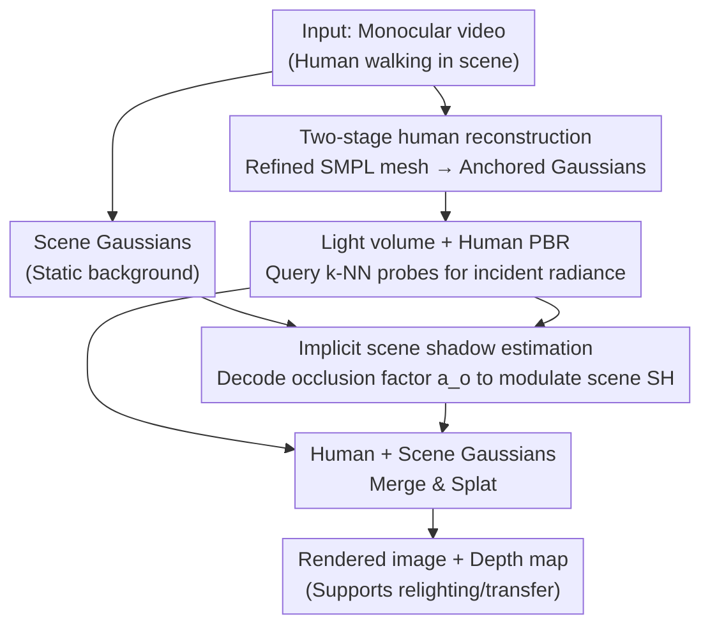

# Illumination-Consistent Human-Scene Reconstruction from Monocular Video

**Conference**: CVPR 2026  
**Paper**: [CVF Open Access](https://openaccess.thecvf.com/content/CVPR2026/html/Zheng_Illumination-Consistent_Human-Scene_Reconstruction_from_Monocular_Video_CVPR_2026_paper.html)  
**Code**: TBD  
**Area**: 3D Vision  
**Keywords**: Monocular video reconstruction, Human-scene joint, 3D Gaussian Splatting, Relightable human, Shadow estimation, Light volume

## TL;DR
This paper jointly reconstructs an animatable human and a static scene from monocular video using 3DGS. The core involves introducing a "light volume" to provide spatially-varying local illumination clues for human PBR and an implicit shadow module to decouple soft shadows cast by the human onto the scene, ensuring human-scene consistency in illumination and shadows while supporting relighting and cross-scene synthesis.

## Background & Motivation

**Background**: The mainstream for reconstructing 3D humans from monocular video (for film, games, VR) relies on NeRF or 3DGS. Existing methods either reconstruct only the dynamic human (requiring clean backgrounds and controlled lighting), reconstruct the entire scene jointly but lack explicit human modeling and animation, or reconstruct the human and scene separately before merging them.

**Limitations of Prior Work**: Methods that reconstruct then merge **ignore interactions between human and environment**—especially illumination and shadows. When a human appears in a scene, their appearance is affected by local scene lighting, and they cast dynamic shadows on the ground or nearby objects. Ignoring these relationships leads to inconsistent human appearance and reduced realism.

**Key Challenge**: Current relightable human methods typically assume light from infinity and use a **single environment map**, failing to represent spatially-varying or occluded local lighting. Meanwhile, traditional inverse rendering uses ray tracing for shadows, which is computationally prohibitive for millions of Gaussians in large scenes with dynamic humans. Thus, accurate illumination/shadow estimation conflicts with computational efficiency in large-scale dynamic scenes.

**Goal**: Jointly infer geometry, material, and spatially-varying illumination in a unified framework—ensure human appearance is consistent with local light, decouple human-cast shadows on the scene, and maintain computational efficiency.

**Key Insight**: Instead of a global environment map, lighting is localized using a grid of "light probes" distributed in space (each probe stores SH coefficients + an implicit feature for shadow reasoning). Shadows are replaced by implicit decoding rather than expensive ray tracing. The authors claim this as the first exploration of "illumination-consistent human-scene reconstruction" for in-the-wild videos.

**Core Idea**: A triplet of "light volume + two-stage human reconstruction + implicit scene shadow estimation" is used to decouple local incident light for human PBR, human geometry/material, and the human's soft shadows on the scene, followed by unified splatting.

## Method

### Overall Architecture
Inputting a monocular video, the method represents the human and scene using 3DGS. Human Gaussians are defined in a canonical space based on a refined SMPL mesh and deformed to the posed space via LBS. Before rendering, each human Gaussian queries the $k$-NN light probes from the light volume to interpolate incident radiance for PBR, resulting in illumination-dependent appearance. For scene Gaussians near the human bounding box, implicit features and spatial descriptors are retrieved from the light volume to decode an occlusion factor for soft shadow simulation. Finally, human and scene Gaussians are merged and sent to a splatting rasterizer to output images and depth maps. The training is constrained by multiple regularization terms.

### Key Designs

**1. Two-stage human reconstruction: Stabilizing geometry before PBR to avoid material-lighting ambiguity**

Decoupling material and lighting on inaccurate geometry introduces ambiguity. The authors split human reconstruction into two stages: **Stage 1 (Geometry and color initialization)** does not use PBR; it upsamples the SMPL surface to anchor Gaussians and uses two hash encoders to learn vertex offsets $\Delta v$ and color $c$, i.e., $v'=v+\mathcal F_\Delta(v),\ c=\mathcal F_c(v)$, refining the mesh indirectly. **Stage 2 (PBR appearance modeling)** introduces the PBR pipeline. Each canonical Gaussian carries $\{q,s,x,b(\text{albedo}),\alpha\}$, with normals $n$ extracted from the refined mesh and roughness/metallic values $\{m,r\}=\mathcal F_m(v)$ from hash encoders. A pose-aware visibility estimator $vis=\mathcal F_{vis}(v,\theta,\phi)$ is added to mitigate material-lighting ambiguity from self-occlusion.

**2. Light volume: Representing spatially-varying local illumination via SH light probe grids**

To address the limitation of environment maps assuming light from infinity, the authors model illumination as a **grid** where each vertex is a light probe represented by **Spherical Harmonics (SH)**. Since monocular reconstruction often misses many incident directions, SH-based probes provide smooth radiance in all directions, benefiting novel-view synthesis. For a human Gaussian, the incident radiance is interpolated from $n$ nearest probes: $L_i(x,\omega_i)\approx \frac{\sum_k w_k(x)L_k(p_k,\omega_i)}{\sum_k w_k(x)}$. The PBR color is calculated via Monte Carlo integration: $c'(\omega_o)=\sum_i (f_d+f_s(\omega_o,\omega_i))V(\omega_i)L_i(\omega_i)(\omega_i\cdot n)\Delta\omega_i$. This allows appearance to vary based on spatial position (e.g., hair highlights and local light effects).

**3. Implicit scene shadow estimation: Replacing ray tracing with decoded occlusion factors**

Since ray-tracing millions of Gaussians is impractical, the authors attach an implicit feature $z_i$ to each probe to encode local lighting context. Only scene Gaussians within the human's axis-aligned bounding box (AABB) are selected. For these, features $z$ are interpolated and concatenated with spatial descriptors—relative distance $\delta$ and orientation $r$ to the AABB center—to feed a shadow weight decoder $a_o=\mathcal F_{ao}(\gamma(r),\gamma(\delta),z)$. The resulting occlusion factor $a_o$ modulates the scene SH: $SH'=a_o\cdot SH$, simulating dynamic soft shadows without expensive computation.

### Loss & Training
The total objective is $\mathcal L=\lambda_1\mathcal L_{image}+\lambda_2\mathcal L_{depth}+\lambda_3\mathcal L_{smooth}+\lambda_4\mathcal L_{scale}$. Specifically, $\mathcal L_{image}=\lambda_h\mathcal L_{human}+\lambda_s\mathcal L_{scene}$ uses L1 + SSIM + VGG perceptual losses. $\mathcal L_{depth}$ provides L1 supervision on depth maps. $\mathcal L_{smooth}$ includes material smoothing, probe smoothing $\mathcal L_{probe}$ (constraining adjacent probe radiance), and shadow smoothing $\mathcal L_{shadows}$. Stage 1 includes Laplacian mesh smoothing $\mathcal L_{mesh}$, and $\mathcal L_{scale}$ penalizes excessively large Gaussians.

## Key Experimental Results

### Main Results
Evaluated on NeuMan (6 in-the-wild videos) and ZJU-MoCap (indoor), using PSNR/SSIM/LPIPS. Representative sequences from NeuMan whole-scene reconstruction:

| Sequence (Full Scene) | Metric | Ours | HUGS | NeuMan |
|-----------------------|--------|------|------|--------|
| Lab | PSNR↑ / LPIPS↓ | **28.604 / 0.055** | 25.994 / 0.070 | 24.960 / 0.149 |
| Bike | PSNR↑ | **29.02** | 25.454 | 25.551 |
| Seattle | PSNR↑ | **29.56** | 25.934 | 23.987 |
| Jogging | PSNR↑ | **26.125** | 23.746 | 22.697 |

Human-only region evaluation (NeuMan):

| Sequence (Human) | Metric | Ours | HUGS | NeuMan |
|------------------|--------|------|------|--------|
| Lab | PSNR↑ / LPIPS↓ | **22.106 / 0.108** | 18.789 / 0.152 | 18.756 / 0.193 |
| Bike | PSNR↑ | **22.586** | 19.476 | 19.049 |
| Parkinglot | PSNR↑ | **22.375** | 19.437 | 17.663 |

On ZJU-MoCap NVS (Table 3): Ours achieves PSNR 30.73 / SSIM 0.9705 / LPIPS 0.0284, outperforming HUGS (30.56 / 0.9703 / 0.03089), HumanNeRF, and Intrinsic Avatar. Ours leads across both whole-scene and human-region benchmarks.

### Ablation Study
Trained/rendered on the NeuMan "Lab" sequence.

| Configuration | PSNR↑ | SSIM↑ | LPIPS↓ | Description |
|---------------|-------|-------|--------|-------------|
| w/o light volume | 21.97 | 0.8055 | 0.1061 | No human PBR |
| w/o shadow | 21.59 | 0.8100 | 0.1068 | No shadow estimation |
| w/o $\mathcal L_{probe}$ | 21.87 | 0.8035 | 0.1121 | No probe smoothing |
| w/o two-stage | 22.08 | 0.8054 | 0.1130 | No two-stage reconstruction |
| Ours (full) | **22.18** | **0.8104** | **0.1049** | Full model |

### Key Findings
- **Shadow module has the highest impact on PSNR**: Removing it drops PSNR from 22.18 to 21.59 (−0.59), the largest drop among components, proving that decoupling human-cast shadows significantly improves realism.
- **Light volume (human PBR) is key for appearance consistency**: Without it, PSNR drops to 21.97, and qualitative human highlights disappear, addressing the incorrect appearance seen in NeuMan/HUGS.
- **Two-stage reconstruction stabilizes geometry**: Its removal significantly degrades LPIPS (0.1130 vs 0.1049), validating that "geometry before PBR" prevents material-lighting cross-contamination on coarse surfaces.

## Highlights & Insights
- **Replacing environment maps with SH light probe grids** is the core ingenuity: environment maps assume distant light and cannot interpolate unseen directions, whereas spatial SH probes naturally represent "local + smooth" lighting.
- **Implicit shadow decoding = ray tracing approximation**: Modeling soft shadows as $a_o\cdot SH$ bypasses the need for full scene ray tracing, making dynamic shadows in large scenes computationally feasible.
- **"Human-scene as a single illumination system"**: This perspective is transferable to any dynamic foreground-scene task (AR avatars, virtual try-ons), enabling relighting and cross-scene transfer with automatic consistent illumination.

## Limitations & Future Work
- Shadows are only estimated for scene Gaussians near the human AABB; complex shadows from distant projections or multi-person occlusions may not be covered.
- Dependency on SMPL meshes and accurate poses remains; loose clothing or extreme non-rigid deformation may limit geometry accuracy despite the two-stage improvement.
- Low-order SH in the light volume smooths radiance, which benefits novel views but may lose high-frequency or strong directional lighting details.

## Related Work & Insights
- **vs HUGS (3DGS joint human-scene, no lighting modeling)**: HUGS achieves high-quality, fast reconstruction but lacks lighting/material decoupling, leading to incorrect human appearance and missing shadows. Ours fills this gap, outperforming it on both scene and human metrics (e.g., +2.6 dB PSNR on "Lab").
- **vs Relightable Human methods (R4D / IA / IRAGA)**: These often use a single environment map and pre-extracted meshes, leading to limited material decoupling and geometric artifacts. Ours uses spatially-varying lighting and two-stage geometry for more stable relighting and richer albedo details.

## Rating
- Novelty: ⭐⭐⭐⭐ First to unify "spatially-varying illumination + implicit dynamic shadows" into monocular human-scene 3DGS.
- Experimental Thoroughness: ⭐⭐⭐⭐ Solid evaluation across two datasets, whole-scene/human regions, and relighting; lacks multi-person stress tests.
- Writing Quality: ⭐⭐⭐⭐ Logical structure, though some symbols (probe features, decoder details) are slightly brief.
- Value: ⭐⭐⭐⭐ Clear value for in-the-wild relightable human-scene synthesis in AR and film.

<!-- RELATED:START -->

## Related Papers

- [\[CVPR 2026\] PhysHO: Physics-Based Dynamic 3D Gaussian Human and Object from Monocular Video](physho_physics-based_dynamic_3d_gaussian_human_and_object_from_monocular_video.md)
- [\[CVPR 2026\] Color-Encoded Illumination for High-Speed Volumetric Scene Reconstruction](color-encoded_illumination_for_high-speed_volumetric_scene_reconstruction.md)
- [\[CVPR 2026\] 4DEquine: Disentangling Motion and Appearance for 4D Equine Reconstruction from Monocular Video](4dequine_disentangling_motion_and_appearance_for_4d_equine_reconstruction_from_m.md)
- [\[CVPR 2026\] MetricHMSR: Metric Human Mesh and Scene Recovery from Monocular Images](metrichmsr_metric_human_mesh_and_scene_recovery_from_monocular_images.md)
- [\[CVPR 2026\] Mesh4D: 4D Mesh Reconstruction and Tracking from Monocular Video](mesh4d_4d_mesh_reconstruction_and_tracking_from_monocular_video.md)

<!-- RELATED:END -->
