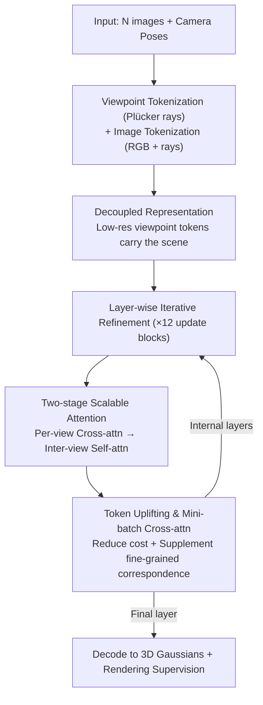

# iLRM: An Iterative Large 3D Reconstruction Model

**Conference**: CVPR 2026  
**Paper**: [CVF Open Access](https://openaccess.thecvf.com/content/CVPR2026/html/Kang_iLRM_An_Iterative_Large_3D_Reconstruction_Model_CVPR_2026_paper.html)  
**Code**: https://gynjn.github.io/iLRM/ (Project Page)  
**Area**: 3D Vision  
**Keywords**: Feed-forward 3D reconstruction, 3D Gaussian Splatting, Iterative refinement, Scalable attention, Viewpoint embedding

## TL;DR
iLRM reformulates feed-forward 3D Gaussian reconstruction from "mapping all image tokens to pixel-aligned Gaussians in a single pass" to "using low-resolution viewpoint embeddings as carriers and iteratively refining them layer-by-layer with multi-view image feedback." By combining representation decoupling and two-stage attention to reduce computational costs, it achieves high quality and speed on RE10K/DL3DV (0.5s for 32-view 540×960 inference, compared to 8 minutes for optimization-based methods).

## Background & Motivation

**Background**: Following the success of 3D Gaussian Splatting (3DGS), feed-forward 3D reconstruction has become mainstream. These methods train large networks to map multi-view images to Gaussian parameters in a single forward pass, enabling near real-time reconstruction. Among them, "pixel-aligned Gaussian" models (e.g., GS-LRM, PixelSplat, MVSplat) have become the de facto standard by directly regressing a Gaussian from each pixel.

**Limitations of Prior Work**: The pixel-aligned paradigm faces two major issues. First, the **number of Gaussians is strictly tied to image resolution**—1K resolution with 200 views produces 200 million Gaussians, whereas the same scene only needs about 500k for representation, creating massive redundancy. Second, **multi-view interaction is computationally explosive**—GS-LRM performs full attention across all tokens from all views, with complexity growing quadratically with view count and resolution. Reducing resolution to save computation results in the loss of critical geometric and appearance details.

**Key Challenge**: Existing feed-forward methods treat 3D reconstruction as a **one-time generation** "sequence-to-sequence" problem. In contrast, high-quality optimization-based methods (per-scene 3DGS) follow a different path—**iterative refinement**: rendering the current estimate, measuring error, and updating the representation to progressively recover details and ensure 3D consistency. Feed-forward models lack this feedback-driven characteristic.

**Goal**: To introduce feedback-driven iterative refinement into a feed-forward architecture while eliminating the computational burden and representation redundancy of the pixel-aligned paradigm.

**Key Insight**: Reinterpret the network as an "optimizer"—each layer is analogous to an optimization step, viewpoint tokens are analogous to the 3DGS representation being updated, and multi-view image tokens are analogous to gradient signals. This simulates the optimization process within a feed-forward architecture.

**Core Idea**: **Decouple** the scene representation from the input images (using low-resolution viewpoint embeddings to carry the scene) and perform "feedback-style" iterative refinement layer-by-layer via cross-attention with high-resolution images, finally decoding into compact 3D Gaussians.

## Method

### Overall Architecture
The input to iLRM consists of $N$ multi-view images $\{I_i\}$ and corresponding camera poses $\{C_i\}$, and the output is a set of 3D Gaussians (mean, opacity, covariance, color). The key shift in the pipeline is: **instead of regressing Gaussians directly from image pixels, the model initializes a set of "viewpoint tokens" as learnable carriers of the scene, refines them layer-by-layer through 12 update blocks using multi-view images, and finally decodes them into Gaussians**. Since the viewpoint token resolution is decoupled from the input image resolution, low-resolution viewpoint representations can produce compact Gaussians while leveraging high-resolution images for detailed guidance.

Viewpoint tokens are constructed using Plücker ray embeddings: extrinsic and intrinsic parameters for each viewpoint are encoded into Plücker coordinates, split into $p\times p$ patches, and passed through a linear layer to obtain $V_i^{(0)}\in\mathbb{R}^{H^vW^v/p^2\times d}$. Since Plücker coordinates naturally contain spatial and viewpoint information, no additional positional encoding is used. Image tokens are formed by concatenating RGB patches and Plücker ray patches followed by linear projection: $S_{ij}=\text{Linear}(\text{concat}(I_{ij},P_{ij}))$.

### Key Designs

**1. Viewpoint-Image Decoupled Representation: Decoupling Gaussian count from image resolution**

The pixel-aligned paradigm's biggest flaw is that Gaussian count equals pixel count, leading to redundancy. iLRM breaks this by **decoupling the scene representation (to be converted into Gaussians) from direct dependence on input pixels**. The scene is carried by viewpoint tokens whose spatial resolution $H^v\times W^v$ is set independently (e.g., half resolution) of the input images. This allows **compact Gaussians to be generated from low-resolution viewpoint tokens**, while **high-resolution images** provide details as keys/values in cross-attention. Ablations show that forcing image features to match viewpoint resolution (reverting to GS-LRM style) drops PSNR from 29.24 to 28.47, proving decoupling is essential for balancing compactness and high fidelity.

**2. Two-stage Scalable Attention: Splitting quadratic complexity into efficient sub-steps**

Standard methods use full attention across all tokens, which is quadratic with view count and resolution. iLRM splits multi-view interaction into two steps: **first, per-view cross-attention** (each viewpoint embedding attends only to its corresponding image, which is efficient due to one-to-one mapping); **second, inter-view self-attention** (all viewpoint tokens interact for global information exchange). Crucially, the second step runs on the **low-resolution viewpoint representation space**, keeping global interaction affordable. The authors report that the relative computational cost of (a) Full Attention : (b) Decoupled : (c) Low-res Viewpoint : (d) Two-stage is $1 : 1 : 0.25 : 0.08$.

**3. Layer-wise Iterative Refinement: Transforming "one-time generation" into optimization within feed-forward layers**

This is the source of "iterative" in iLRM. The model consists of multiple Transformer blocks where each block = one layer of cross-attention + one layer of self-attention. Viewpoint tokens are updated layer-by-layer:

$$\tilde{V}_i^{(l-1)}=\text{cross-attn}^{(l)}(V_i^{(l-1)},S_i),\quad \{V_i^{(l)}\}=\text{self-attn}^{(l)}(\{\tilde{V}_i^{(l-1)}\})$$

Note that image tokens $S$ remain fixed across all layers, repeatedly providing "visual evidence" to the viewpoint tokens. The authors interpret this as an approximation of gradient descent: $V^{(l)}\approx V^{(l-1)}-\eta\nabla_V E(V^{(l-1)};S)$, where each layer acts as a **feedback correction** rather than a simple feature transformation. Ablations replacing per-layer cross-attention with a single initial cross-attention followed by 23 self-attention layers showed a significant degradation in LPIPS (0.109 → 0.127), emphasizing the importance of continuous image evidence injection.

**4. Token Uplifting & Mini-batch Cross-attention: Fixing fine-grained correspondence & further reducing complexity**

Decoupling results in low-resolution viewpoint tokens, which makes it difficult to absorb high-resolution image details during cross-attention. **Token uplifting** uses a linear query layer to expand the feature dimension of each low-res viewpoint token by $k$ times ($k=2$), reshapes them into $k$ fine-grained query tokens for cross-attention, and projects them back. Removing this causes performance drops (29.24 → 28.90 PSNR). **Mini-batch cross-attention** addresses the bottleneck in high-resolution image tokens by sampling only a subset for each layer (e.g., Quarter Cross-attention). This reduces training step time from 1.51s to 0.94s and memory from 62.5GB to 39.0GB with minimal PSNR loss (30.39 → 30.08).

### Loss & Training
The 3D Gaussians decoded from viewpoint tokens are rasterized to produce a rendered image $\hat{I}_t$, supervised by MSE and perceptual loss against the ground truth $I_t$:

$$\mathcal{L}_\text{total}=\sum_{t\in\mathcal{T}}\mathcal{L}_\text{MSE}(\hat{I}_t,I_t)+\lambda\mathcal{L}_\text{perceptual}(\hat{I}_t,I_t)$$

where $\lambda=0.5$. The model uses 12 update layers, hidden dimension $d=768$, patch size $p=8$, 12 attention heads, and pre-norm + QK-Norm (RMSNorm).

## Key Experimental Results

### Main Results
Comparison with feed-forward and optimization-based methods on RealEstate10K (RE10K, 256×256). Inference time measured on an RTX 4090:

| Method | #Param(M) | PSNR ↑ | SSIM ↑ | LPIPS ↓ | #Gaussians | Time(s) |
|------|-----------|--------|--------|---------|-------|---------|
| pixelSplat | 125 | 25.89 | 0.858 | 0.142 | 131,072 | 0.101 |
| MVSplat | 12 | 26.39 | 0.869 | 0.128 | 131,072 | 0.047 |
| GS-LRM* | 300 | 28.10 | 0.892 | 0.114 | 131,072 | — |
| DepthSplat | 354 | 27.47 | 0.889 | 0.114 | 131,072 | 0.065 |
| Ours (2, F, F) | 171 | 28.65 | 0.900 | 0.110 | 131,072 | **0.025** |
| Ours (8, H, F) | 185 | **31.57** | **0.935** | **0.082** | 131,072 | 0.029 |

*Note: Configuration (V, H/F, F) denotes view count, viewpoint token resolution (Half/Full), and image token resolution. Even the smallest (2,F,F) config outperforms GS-LRM with fewer parameters and higher speed.*

Comparison with optimization methods in a zero-shot, wide-coverage setting (DL3DV, 540×960, 32-view trained model):

| Method | Views | Time ↓ | PSNR ↑ | SSIM ↑ | LPIPS ↓ |
|------|------|--------|--------|--------|---------|
| 3D-GS (Opt., 30k steps) | 32 | 8 min | 24.43 | 0.827 | 0.191 |
| Long-LRM | 32 | 0.84 s | 23.97 | 0.778 | 0.267 |
| Ours (32, H, F) | 32 | **0.53 s** | 24.30 | 0.803 | 0.256 |
| Ours (Unseen) (48, H, F) | 48 | 1.04 s | 24.78 | 0.820 | 0.240 |

iLRM achieves image quality close to optimization methods (8 minutes) in just 0.53 seconds and generalizes to long contexts (40/48 views) not seen during training.

### Ablation Study
Ablation of architectural components (12-layer baseline, RE10K):

| Config | PSNR ↑ | SSIM ↑ | LPIPS ↓ | Description |
|------|--------|--------|---------|------|
| Baseline (12 layers) | 29.24 | 0.907 | 0.109 | Full model |
| w/o Iterative Refinement | 28.58 | 0.893 | 0.127 | 1 initial cross-attn + 23 self-attn |
| w/o Res. Decoupling | 28.47 | 0.891 | 0.123 | Image features constrained to viewpoint res. |
| w/o Token Uplifting | 28.90 | 0.901 | 0.113 | Removed LR→fine-grained expansion |

### Key Findings
- **Resolution decoupling has the largest impact** (−0.77 PSNR), as it is the foundation for "compact Gaussians + high fidelity." Iterative refinement follows (−0.66, LPIPS degradation is particularly significant), showing continuous image evidence injection is more effective than simply stacking self-attention.
- **Layer count corresponds to optimization steps**: PSNR increases monotonically with depth (3→6→9→12 layers), aligning with the intuition that "deeper refinement = more optimization steps."
- **Attention visualization** shows that as layers deepen, the top-3 attended tokens for a query patch shift toward geometrically and semantically corresponding regions in other views, validating the "progressive refinement" motivation.

## Highlights & Insights
- **Reinterpreting feed-forward networks as optimizers** is the most significant insight: layers = optimization steps, viewpoint tokens = representation to update, image tokens = fixed gradient signals. This brings the benefits of iterative refinement into a feed-forward architecture.
- **The "decoupled representation resolution" trick is transferable**: Any regression task where the output count is tied to input resolution (e.g., point cloud upsampling, voxel generation) can adopt this—using a learnable carrier with independent resolution while using inputs as guidance.
- **Mini-batch attention** borrows the idea of stochastic sampling from optimization to apply to attention computation. It is a simple and general cost-saving measure, especially valuable for long-sequence or multi-view scenarios.

## Limitations & Future Work
- **Self-attention remains a bottleneck for massive view counts**: although compact embeddings help, inter-view self-attention still scales poorly. Future work needs more scalable global interaction alternatives.
- **Structured vs. Random sampling**: The mini-batch cross-attention uses structured sampling (Half/Quarter) for engineering efficiency. Theoretically optimal random sampling is currently harder to implement efficiently, meaning the full potential of iterative refinement may not yet be exploited.
- **Scene diversity**: Evaluation was primarily on indoor/forward-facing datasets (RE10K/DL3DV/ACID). Adaptability to large-scale outdoor or dynamic scenes remains to be tested.

## Related Work & Insights
- **vs GS-LRM / Long-LRM**: These perform full-resolution attention and generate pixel-aligned Gaussians in a one-time pass. iLRM uses decoupling, two-stage attention, and iterative refinement to be more efficient, produce 4× fewer Gaussians, and achieve higher quality.
- **vs MVSplat / DepthSplat**: These rely on cost volumes or depth priors. iLRM is data-driven, avoids explicit 3D priors, and is more scalable as view counts increase.
- **vs G3R / Gen-Den (Iterative Refinement)**: These use real gradients but incur high computational costs due to rendering during training. iLRM injects image evidence via cross-attention within feed-forward layers without explicit rendering or gradient computation.

## Rating
- Novelty: ⭐⭐⭐⭐⭐ 
- Experimental Thoroughness: ⭐⭐⭐⭐ 
- Writing Quality: ⭐⭐⭐⭐⭐ 
- Value: ⭐⭐⭐⭐⭐ 

<!-- RELATED:START -->

## Related Papers

- [\[CVPR 2026\] IDESplat: Iterative Depth Probability Estimation for Generalizable 3D Gaussian Splatting](idesplat_iterative_depth_probability_estimation_for_generalizable_3d_gaussian_sp.md)
- [\[CVPR 2026\] iSplat: Iterative Learning for Fine-Grained Gaussian Splatting](isplat_iterative_learning_for_fine-grained_gaussian_splatting.md)
- [\[CVPR 2026\] JRM: Joint Reconstruction Model for Multiple Objects without Alignment](jrm_joint_reconstruction_model_for_multiple_objects_without_alignment.md)
- [\[CVPR 2026\] Depth Hypothesis Guided Iterative Refinement for Event-Image Monocular Depth Estimation](depth_hypothesis_guided_iterative_refinement_for_event-image_monocular_depth_est.md)
- [\[CVPR 2026\] Learning Hierarchical Hyperbolic Mixture Model for Part-aware 3D Generation](learning_hierarchical_hyperbolic_mixture_model_for_part-aware_3d_generation.md)

<!-- RELATED:END -->
