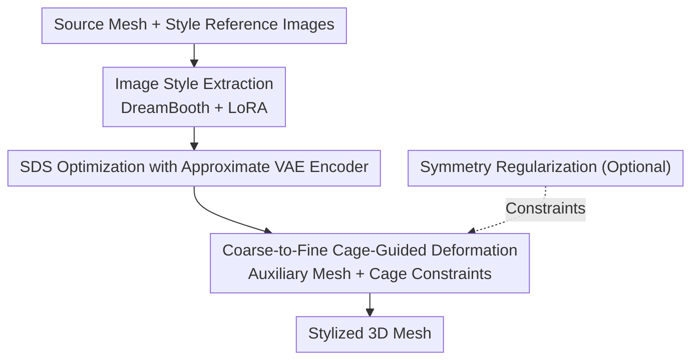

# Image-Guided Geometric Stylization of 3D Meshes

**Conference**: CVPR 2026  
**Paper**: [CVF Open Access](https://openaccess.thecvf.com/content/CVPR2026/html/Choi_Image-Guided_Geometric_Stylization_of_3D_Meshes_CVPR_2026_paper.html)  
**Code**: [Project Page GeoStyle](https://changwoonchoi.github.io/GeoStyle)  
**Area**: 3D Vision  
**Keywords**: Geometric Stylization, Mesh Deformation, SDS, Diffusion Prior, Coarse-to-fine

## TL;DR
Given a reference image and a source 3D mesh, this paper extracts the "geometric style" of the reference image into diffusion model weights using DreamBooth+LoRA. It then drives **face Jacobian** deformation via SDS loss (paired with an approximate VAE encoder). Through a "coarse-to-fine + cage constraint + optional symmetry" strategy, the mesh undergoes large-scale deformation to express high-level geometric features such as the pose and silhouette of the reference image, while maintaining the original topology and part semantics.

## Background & Motivation

**Background**: 3D generative models have succeeded in producing visually plausible objects, and 3D style transfer is highly mature. However, the vast majority of style transfer methods (whether based on point clouds, meshes, NeRF, or 3DGS) focus on high-frequency information of **surface texture/appearance**: changing colors, brushstrokes, or materials, while leaving the geometric scaffolding almost unchanged.

**Limitations of Prior Work**: Real "style" goes far beyond texture. For instance, the slender, sprawling silhouette of Bourgeois' spider sculpture, or the stocky, rigid structural feel of a fire hydrant—these **geometric-level styles** cannot be described by local texture statistics. The few works attempting geometric style transfer are either confined to the image domain, limited to specific object classes, or can only handle high-frequency geometric details (local vertex displacements) instead of large-scale structural deformations.

**Key Challenge**: Describing such geometric styles using text is inherently unreliable; text prompts like "a white rabbit sitting on a wooden table" struggle to precisely convey the desired silhouette, proportion, or pose (as shown in Fig. 2, text-driven deformation often fails to capture the geometric intent). Meanwhile, achieving large-scale deformation easily destroys mesh topology and loses part semantics.

**Goal**: Formalize "geometric stylization" as a **deformation task on a user-provided mesh**—one that can extract abstract geometric styles from a single image while performing drastic yet valid deformations (preserving manifold topology and part semantics).

**Key Insight**: Instead of generating geometry from scratch, the authors **deform existing meshes**. This choice is practical: starting from a valid mesh topology preserves valuable assets like UV maps and skeleton bindings, and remains compatible with mature geometric processing pipelines like smoothing, upsampling, and remeshing. In contrast, while voxel or implicit representations are convenient for rendering, they lack rigorous topological structures.

**Core Idea**: Extract the style of a reference image into LoRA weights using a pre-trained diffusion model to act as a "style optimizer". Then, "distill" this style onto face Jacobian-parameterized mesh deformation through SDS, and utilize a coarse-to-fine cage constraint to achieve bold yet valid geometric style transfer.

## Method

### Overall Architecture
The input consists of a source mesh and a set of style reference images, and the output is a "stylized" mesh that retains the rough structure and part semantics of the source mesh while incorporating the geometric features (pose, silhouette, structure) from the reference images. The pipeline operates in two stages: **style extraction** and **gradient-driven deformation**.

In the style extraction stage, a LoRA is trained on the reference images using a DreamBooth-style objective, embedding the abstract style of the images into the latent space of the SDXL diffusion model. In the deformation stage, instead of directly optimizing vertex coordinates (which is unstable and prone to tearing), the method optimizes the **face Jacobians** $J_i \in \mathbb{R}^{3\times3}$, reconstructing vertex positions via the Poisson equation. The optimization signal comes from the SDS loss of the stylized diffusion model. To enable fast and stable backpropagation of gradients to the geometry during SDS, an **approximate VAE encoder** is used to map the rendered images to the latent space. The deformation itself employs a **coarse-to-fine** strategy: first, a "cage" is fitted over an auxiliary mesh (sampled as spheres) to perform large-scale, part-level semantic deformations, and then the optimization transitions to face Jacobians for fine-grained adjustments, with optional symmetry constraints.

### Key Designs

**1. Image Style Extraction: Extracting "indescribable geometric style" into LoRA weights**

Since geometric style is difficult to define textually, the authors leverage the generative prior of a diffusion model to "abstract" it. Specifically, DreamBooth is used to fine-tune a pre-trained diffusion model on a small set of reference images (4–12 images) to capture the unique attributes defining the subject's appearance. The objective is:
$$L_{\text{DreamBooth}} = \mathbb{E}_{x,c,\epsilon,t}\big[w_t\,\lVert \hat{x}_\theta(\alpha_t x + \sigma_t \epsilon, c) - x \rVert_2^2\big].$$
Crucially, DreamBooth captures not just surface textures but also structural features like coherent shapes and proportions. To minimize overhead, only the Low-Rank Adaptation (LoRA, rank 16) layers inserted into the U-Net are updated, compressing the style into a compact set of weights that serve as the target for subsequent geometric alignment. This converts an otherwise hard-to-express concept (geometric style) into a differentiable optimization signal.

**2. Approximate VAE Encoder for SDS: Efficient and stable gradient backpropagation to geometry**

Mesh deformation is driven by Score Distillation Sampling (SDS). Following DreamFusion, the SDS gradient with respect to the face Jacobians is formulated as:
$$\nabla_{J_i} L_{\text{SDS}} = \mathbb{E}_{c,\epsilon,t}\Big[w_t\big(\epsilon_\theta(z_t,c,t)-\epsilon\big)\frac{\partial z_t}{\partial J_i}\Big],$$
where $z_t$ is the noisy latent variable of the rendered image. The bottleneck is that although latent diffusion models like SDXL possess strong priors, their massive VAE encoders make gradient backpropagation highly inefficient for geometric optimization. Experiments show that native SDXL VAE cannot even drive text-guided deformation (Fig. 4). To solve this, the authors replace the VAE encoder with an **affine-linear approximation**: appending a channel of all 1s to the rendered image $x$ yields $\bar{x}=[x;1]$. They fit a matrix $A\in\mathbb{R}^{4\times4}$ such that $z \simeq A\bar{x}$, using least squares on $N=500$ rendered-latent pairs:
$$A^* = \arg\min_A \sum_{i=1}^N \lVert z_i - A\bar{x}_i \rVert_2^2.$$
This simple approximation is crucial—without it, even text-guided deformation fails; with it, SDXL stably distills semantically aligned deformations back to the geometry.

**3. Coarse-to-Fine Cage-Guided Deformation: Reforming structure before refining details without destroying semantics**

Directly optimizing face Jacobians to undergo drastic deformations in a single step often ruins the overall structure when there is a significant discrepancy between the reference image and the initial geometry. The authors propose a coarse-to-fine approach. In the **coarse stage**, large-scale deformations are performed on an "auxiliary mesh" composed of spheres sampled from the source mesh's vertices. The mesh is divided into semantic parts using PartField, and each part is fitted with an oriented bounding box (OBB) $\{C_l\}$. Coarse deformation is parameterized by scale $s_l$, rotation $R_l$, and translation $T_l$, updating sphere centers as $p' = s_l R_l p + T_l$. The part-level transformations of the auxiliary mesh are propagated to the source mesh via cage coordinates $W_i=[w_{i1},\dots,w_{i8}]^\top$ (where $v_i=\sum_j w_{ij}c_{lj}$ and $\sum_j w_{ij}=1$). The target mesh is constrained to follow the auxiliary mesh's cage coordinates using:
$$L_{\text{cage}} = \frac{1}{L}\sum_{l=1}^L \frac{1}{|C_l|}\sum_{v_i\in C_l}\lVert W_i^{\text{aux}}-W_i^{\text{tgt}}\rVert_2^2$$
This preserves part-level semantics and stabilizes large deformations. Subsequently, the weight of $L_{\text{cage}}$ is **gradually decayed** ($\lambda_6(t)=\lambda_6(1-0.99\,t/N_1)$), shifting the optimization focus to $L_{\text{SDS}}$ over face Jacobians for fine geometry. The coarse stage objective is $L^{\text{aux}}=\lambda_1 L^{\text{aux}}_{\text{SDS}}+\lambda_2 L^{\text{aux}}_{\text{sym}}$, while the fine stage objective is $L_{\text{tgt}}=\lambda_3 L_{\text{SDS}}+\lambda_4 L_{\text{reg}}+\lambda_5 L_{\text{sym}}$, where $L_{\text{reg}}$ is the Jacobian regularization from TextDeformer (encouraging $J_i$ to stay close to the identity matrix). This combination of "auxiliary mesh + cage + weight annealing" is core to achieving drastic yet stable deformations.

**4. Symmetry Regularization: Optionally preserving intrinsic symmetry of the source mesh**

Many objects exhibit reflective symmetry, which can be easily broken during drastic deformation, leading to unnatural results. The authors perform PCA on the source mesh vertices to obtain the principal axes $\{a_k\}$. For each axis, a reflection plane $\Pi_k$ passing through the centroid is defined. Mirroring each vertex and finding its nearest neighbor determines whether $\Pi_k$ is a valid symmetry plane based on point-wise and global thresholds $\tau_1$ and $\tau_2$ (Eq. 8), yielding a set of symmetric pairs $P_k$. Once symmetry is detected, two loss terms are introduced: one keeps the midpoints of symmetric pairs on the common plane $L_{\text{mid}}=\sum_k \frac{1}{|P_k|}\sum |\tilde{n}_k^\top(m_{i,k}-\bar{v})|^2$, and the other ensures that the direction vector of the symmetric pairs is orthogonal to the plane norm $L_{\text{dir}}=\sum_k \frac{1}{|P_k|}\sum (1-|\tilde{n}_k^\top \hat{d}_{i,k}|)$, formulated together as $L_{\text{sym}}=L_{\text{mid}}+L_{\text{dir}}$, which is also applied to the auxiliary mesh. This is an **optional** constraint, activated only when both the source mesh and the target style possess symmetric structures, rendering more coherent results.

### Loss & Training
- Style Extraction: Train a rank-16 LoRA with the DreamBooth objective in Eq. (1) using 4–12 reference images.
- Coarse Stage ($t\in(0,N_1]$): $L^{\text{aux}}=\lambda_1 L^{\text{aux}}_{\text{SDS}}+\lambda_2 L^{\text{aux}}_{\text{sym}}$ optimizes cage OBB parameters, and then $L_{\text{cage}}$ is computed. The target mesh is optimized using $L_{\text{tgt}}(t)=\lambda_3 L_{\text{SDS}}+\lambda_4 L_{\text{reg}}+\lambda_5 L_{\text{sym}}+\lambda_6(t)L_{\text{cage}}$ with linear annealing of $\lambda_6$.
- Fine Stage ($t\in(N_1,N_2]$): The cage constraint is removed: $L_{\text{tgt}}=\lambda_3 L_{\text{SDS}}+\lambda_4 L_{\text{reg}}+\lambda_5 L_{\text{sym}}$.
- Others: Differentiable rasterization is used for rendering. The source mesh has approximately 2k–20k vertices. The approximate encoder is fitted using least squares on $N=500$ sample pairs.

## Key Experimental Results

> ⚠️ The experiments in this paper mainly consist of **user study rankings** and **qualitative comparisons**; the main text does not provide numerical results that can be directly listed in tables. The tables below summarize qualitative findings from Fig. 5/6/8, etc. Please refer to the original paper for exact details.

### Main Results (User Study, 3 Eval Criteria)
32 participants ranked the outputs of different methods on 8 sample sets across three criteria, converted to mean ranks. Baselines include Paparazzi, Neural 3D Mesh Renderer, MeshUp, Text2Mesh, and TextDeformer (where Text2Mesh and TextDeformer replace CLIP text embeddings with CLIP image embeddings of the reference images to adapt to this task).

| Evaluation Metric | Ours | Baseline Performance | Note |
|----------|--------------|----------|------|
| Geometry Alignment | Best | Generally weak | Ours succeeds in transferring the pose/silhouette of the reference image onto the mesh |
| Aesthetic Style Transfer | Best | Generally weak | Ours conveys the style most effectively |
| Content Preservation | Fair but not first | Some baselines score higher | ⚠️ Baselines score higher because they barely deform, keeping the mesh very close to the source |

### Ablation Study (Qualitative, effects of removing each component)

| Configuration | Key Observation | Conclusion |
|------|---------|------|
| Full model | Large-scale valid deformation + details + preserved semantics | Full model is optimal |
| w/o Approx. VAE Encoder (using native SDXL VAE) | Fails to generate reasonable deformation; mesh barely changes | The approximate encoder is crucial for driving meaningful deformation |
| w/o Auxiliary Mesh / Cage Regularization | Geometric distortion; fails to capture reference geometric style | Cage constraint enables large deformations while stabilizing the process |
| w/o Symmetry Loss | Symmetrical objects lose symmetry after deformation, leading to poor coherence | This constraint is beneficial when both source and target are symmetric |

### Key Findings
- **The approximate VAE encoder is the hidden bottleneck**: It is not just minor polish; without it, even text-driven deformation fails. It ensures SDXL's strong prior is actually usable for geometric optimization.
- **Face Jacobian is superior to direct vertex optimization**: Directly optimizing vertex coordinates (e.g., in Text2Mesh) produces noisy artifacts, while TextDeformer (which uses Jacobians but relies on CLIP guidance) fails to capture complex geometric styles, highlighting that both "good deformation parameterization" and "accurate style signals" are indispensable.
- **Interpret "Content Preservation" metrics carefully**: Baselines scoring higher on "content preservation" actually reflect their failure to deform appropriately. This is a negative indicator that requires caveats, rather than proving baselines are superior.
- **Extra Controllability**: The method can incorporate text conditions (e.g., changing the source mesh into a "giraffe" while transferring a sculpture's style), and can perform local deformation by backpropagating gradients only to Jacobians of parts selected via PartField while keeping other regions stationary.

## Highlights & Insights
- **Establishing "geometry as style"**: Moving beyond traditional texture transfer, this work explicitly leverages large-scale geometric deformation (silhouette, pose, structure) to carry style, using images rather than text as a more concrete styling medium.
- **LoRA as a "Style Optimizer"**: DreamBooth+LoRA is not just an engineering trick to save VRAM; it is a key mechanism to convert abstract geometric styles into differentiable gradient sources, a concept transferable to other optimization tasks driven by hard-to-describe targets.
- **Affine-Linear Approximate VAE Encoder**: Replacing a massive VAE encoder with a simple $4\times4$ matrix fitted via least squares significantly accelerates and stabilizes SDS. This simple yet critical trick is highly reusable for other latent-space diffusion-based SDS geometric optimizations.
- **Coarse-to-fine + Cage Annealing**: Deforming at a part-level coarse stage on a sphere mesh before fine-tuning with face Jacobians represents an effective decoupling strategy for any task requiring drastic but structure-preserving deformation.

## Limitations & Future Work
- **Dependency on Part Segmentation & Symmetry Detection**: Coarse deformation relies on PartField semantic parts and OBBs, while symmetry constraints rely on PCA + thresholding. If segmentation or symmetry detection fails, the benefits of these constraints diminish.
- **Qualitative Bias in Evaluation**: Evaluation heavily relies on user studies and qualitative figures, lacking standardized quantitative geometric metrics (e.g., objective deformation plausibility or style consistency), leading to limited hard numerical comparisons between methods.
- **Optimization-based rather than Feed-forward**: Every mesh-style pair requires running a full SDS optimization (including LoRA training + coarse-to-fine stages), making the single-generation cost high and unsuitable for real-time applications.
- **Boundary between Geometry and Texture Styles**: This method focuses purely on geometric deformation and does not generate textures; when desired styles contain specific materials/textures, additional texture-transfer methods must be integrated.

## Related Work & Insights
- **vs. Image/3D Texture Style Transfer (Gatys et al., various NeRF/3DGS stylization methods)**: These match patch statistics and transfer high-frequency appearance (color/texture/brushstrokes) while leaving geometric scaffolds unchanged. This work does the opposite: **focuses on geometric deformation** so that the structure itself carries the style, making them complementary rather than mutually exclusive.
- **vs. Text2Mesh / TextDeformer (Text-driven mesh deformation)**: These rely on CLIP text/image embedding guidance, whereas this work upgrades to SDXL+LoRA SDS guidance. Text2Mesh suffers from artifacts due to direct vertex optimization, and TextDeformer with CLIP fails to capture complex shapes. This work achieves bolder and semantically consistent deformations through stronger diffusion priors, approximate encoders, and a coarse-to-fine pipeline.
- **vs. MeshUp**: While MeshUp also uses SDS, it relies on a pixel-space diffusion model (DeepFloyd-IF) and lacks the approximate encoder as well as the proposed coarse-to-fine/symmetry constraints, yielding sub-optimal results. The performance gain here stems from the combination of SDXL, the approximate VAE, and coarse-to-fine regularization.
- **vs. Handcrafted Regularization-driven Large Deformation Methods**: Early works relied on handcrafted heuristic regularizations to drive large deformations, which could only describe specific styles. This method automatically extracts style from reference images, generalizing to diverse geometric styles.

## Rating
- Novelty: ⭐⭐⭐⭐⭐ Successfully connects "geometry as style + image-driven + mesh deformation" with a clear and novel perspective.
- Experimental Thoroughness: ⭐⭐⭐ Qualitative comparisons and user studies are extensive, but standard quantitative metrics and numerical data are limited.
- Writing Quality: ⭐⭐⭐⭐ Motivations are progressive, explanations of each component are clear, and formulas are comprehensive.
- Value: ⭐⭐⭐⭐ Provides a practical framework for reference-image-driven 3D content creation, with highly reusable components like the approximate VAE encoder.

<!-- RELATED:START -->

## Related Papers

- [\[CVPR 2026\] MatE: Material Extraction from Single-Image via Geometric Prior](mate_material_extraction_from_single-image_via_geometric_prior.md)
- [\[CVPR 2026\] WorldStereo: Bridging Camera-Guided Video Generation and Scene Reconstruction via 3D Geometric Memories](worldstereo_bridging_camera-guided_video_generation_and_scene_reconstruction_via.md)
- [\[CVPR 2026\] Radiance Meshes for Volumetric Reconstruction](radiance_meshes_for_volumetric_reconstruction.md)
- [\[CVPR 2026\] Parallelised Differentiable Straightest Geodesics for 3D Meshes](parallelised_differentiable_straightest_geodesics_for_3d_meshes.md)
- [\[CVPR 2026\] SGSoft: Learning Fused Semantic-Geometric Features for 3D Shape Correspondence via Template-Guided Soft Signals](sgsoft_learning_fused_semantic-geometric_features_for_3d_shape_correspondence_vi.md)

<!-- RELATED:END -->
