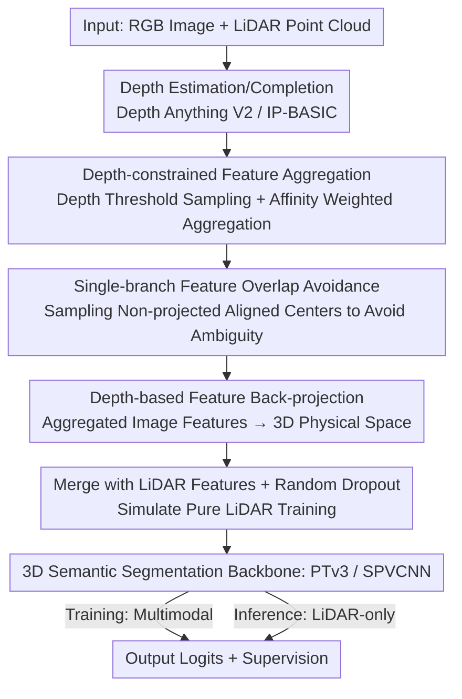

# Image-to-Point Cloud Feature Back-Projection for Multimodal Training of 3D Semantic Segmentation

**Conference**: CVPR 2026  
**Paper**: [CVF Open Access](https://openaccess.thecvf.com/content/CVPR2026/html/Han_Image-to-Point_Cloud_Feature_Back-Projection_for_Multimodal_Training_of_3D_Semantic_CVPR_2026_paper.html)  
**Code**: To be confirmed  
**Area**: 3D Vision  
**Keywords**: Multimodal fusion, 3D semantic segmentation, feature back-projection, single-branch network, LiDAR-only inference

## TL;DR
IPFP proposes a "training-only" image-LiDAR fusion strategy: aggregated image features are **back-projected into the 3D physical space** based on estimated depths, residing in the same coordinate system as LiDAR features and sharing a single-branch backbone for training. At inference time, the image branch is disabled for pure LiDAR deployment. Ours consistently improves SOTA segmentation models like PTv3 and SPVCNN on nuScenes/KITTI/Waymo datasets with almost no additional inference cost.

## Background & Motivation

**Background**: 3D semantic segmentation in autonomous driving/robotics requires assigning semantic labels to each 3D point. LiDAR provides precise geometry while images offer rich texture and color. Since they are complementary, multimodal fusion has become a popular research direction for significant performance gains.

**Limitations of Prior Work**: Mainstream multimodal methods adopt a **dual-branch architecture**—running independent networks for images and point clouds before fusing features at a high level. This introduces three issues: ① **High training cost** (dual backbone networks); ② Some methods are forced to downsample images, losing texture details; ③ More fundamentally, there is an **FOV (Field of View) inconsistency** between cameras and LiDAR. LiDAR usually covers 360° horizontally with limited vertical range, while cameras have a narrow, dense forward view. Consequently, many LiDAR points (side/rear) fall outside the image plane, making point-pixel mapping non-existent. Early fusion/feature concatenation/knowledge distillation methods relying on strict cross-modal alignment are bottlenecked by the FOV overlap.

**Key Challenge**: The choice between strict alignment (restricted by FOV overlap, discarding non-overlapping points) or dual-branching (expensive training and mandatory camera presence during inference). The fundamental contradiction is: **fusion requires pixel-point correspondence, but FOV inconsistency leaves many points without correspondence**; furthermore, tight coupling to multimodal input causes failure if the camera is absent during deployment.

**Goal**: Design a fusion method that 1) does not rely on strict pixel-point correspondence to bypass FOV inconsistency, 2) uses a single branch with low training cost, and 3) utilizes multimodal data during training while allowing pure LiDAR inference.

**Key Insight**: Since the problem stems from "alignment in the 2D image plane or BEV space," the approach **switches to a unified battlefield**—back-projecting image features into the 3D physical space based on depth. This allows features from both modalities to "naturally coexist" in the same 3D coordinate system, eliminating the need for explicit pixel-point correspondence.

**Core Idea**: Use estimated depth to back-project **aggregated image feature centers** into the point cloud feature set (IPFP), enabling image and point cloud features to share the same 3D space. This facilitates natural fusion during the forward pass of a single-branch backbone. This process can be toggled on/off—enabled during training and disabled during inference if images are unavailable.

## Method

### Overall Architecture
IPFP defines the task as standard 3D semantic segmentation $P\to L$ (where $P=\{p\in\mathbb{R}^3\}$ is the point cloud and $L$ represents semantic labels). The core workflow involves: estimating a depth map for each image → sampling clustering centers under depth constraints and aggregating image features based on feature affinity → **back-projecting** aggregated features to 3D physical space using depth → **merging** with LiDAR point cloud features for input into a single 3D segmentation backbone. The key point is: **the entire image branch is only attached during training and detached during inference; the backbone architecture remains identical to the pure LiDAR baseline**—this is the fundamental reason it supports "multimodal training but pure LiDAR inference."

### Key Designs

**1. Depth-constrained Feature Aggregation: Sampling clustering centers within LiDAR measurable depth and compressing image features into sparse centers via affinity.**

Directly back-projecting every pixel would generate massive redundant points, many of which are unreliable outside the LiDAR range. IPFP first estimates/completes a metric depth map $D_m$: sparse LiDAR is projected onto the image plane to get projected depth $d_m^p$, then the Gauss–Markov theorem is used for scale recovery $D_m=sD_r+t$ on monocular relative depth (removing residual outliers to improve accuracy). Lower and upper bounds $d_{\alpha_l},d_{\alpha_u}$ are calculated using quantiles of the projected depth distribution to generate a depth mask $S=\{(x,y)\mid d_{\alpha_l}\le D_m(x,y)\le d_{\alpha_u}\}$. **Clustering centers $(u_r,v_r)$ are sampled uniformly without replacement within the mask**. This ensures the 3D coordinates of centers fall strictly within the LiDAR range while capturing valid information outside the LiDAR FOV and filtering low-entropy areas like repetitive ground textures in the near field. Aggregated features for each center are weighted by **pixel-center cosine similarity**:

$$f_c=\frac{1}{N}\Big(f_v+\sum_{i\in p(f_v)}\text{sigmoid}(\beta_0 S_i+\beta_1)\cdot F^p_{vi}\Big),\quad S_i=\|F^p_{si}\|_2\cdot\frac{f_s^\top}{2}$$

where $\beta_0,\beta_1$ are learnable scaling/offset parameters and $N$ is a normalization factor. Similarity calculations are performed region-wise to maintain locality and improve efficiency.

**2. Single-branch Feature Overlap Avoidance: Sampling non-projected aligned centers to avoid feature ambiguity at the same 3D position.**

If clustering centers are taken at positions "aligned with point cloud projections," the back-projected image features will **completely overlap** with the original point cloud. Having two different features at the same spatial position creates ambiguity for 3D networks relying on positional indexing and causes the network to "lazily" over-rely on the easier-to-learn image modality while ignoring geometry. This results in significant performance drops during pure LiDAR inference. IPFP's solution is to **deliberately sample non-overlapping clustering centers** (randomly within the mask rather than at point cloud projection points or predefined patch centers). The paper also verifies that even if modalities are processed independently ($Z=f(F;\theta)$, $Z_c=f(F_c;\theta)$) with online knowledge distillation (KDCL), the cosine similarity of image and point cloud alignment logits remains very high (from 15% to 100% of training), suggesting strict alignment adds little. **Instead, back-projecting non-aligned image features better enhances multimodal training.** This forms the theoretical basis for the unified single-branch architecture.

**3. Depth-based Feature Back-projection and LiDAR-adapted Training: Lifting features to 3D, merging with point clouds, and randomly dropping them to simulate image-free scenarios.**

After obtaining aggregated image features $F_c=\{f_c\}$, they are back-projected to 3D using their metric depth $d_m^r=D_m(u_r,v_r)$:

$$[p_c,1]^\top=T^{-1}K^{-1}(d_m^r\odot[u_r,v_r,1])^\top$$

where $T$ is the camera extrinsics (calculated via chained coordinate transformations for sensors like nuScenes). Subsequently, LiDAR point cloud $P$ and back-projected set $P_c$ are merged, and feature sets $F\cup F_c$ are combined—$F$ is computed by the segmentation model's embedding layer (e.g., SubMConv3D in PTv3), with dimensions aligned to $F_c$. **The inherent spatial neighborhood aggregation mechanism of 3D segmentation models naturally supports this multimodal fusion without explicit fusion modules.** To simulate image-free inference, a dropout operator is applied during training: $s\sim\text{Bernoulli}(\gamma)$ determines if dropout is enabled, and $M_i\sim\text{Bernoulli}(1-\delta)$ drops $F_c$ point-wise to explicitly train the model's adaptation to sparse LiDAR-only input.

### Loss & Training
The final merged features predict logits $Z\cup Z_c'=f(F\cup F_c';\theta)$, supervised by a joint Lovász-Softmax and Cross-Entropy loss:

$$\mathcal{L}=\frac{1}{C}\sum_{c=1}^C\Delta J_c(m_c)-\frac{1}{N_p}\sum_{i=1}^{N_p}\log\!\Big(\frac{\exp(Z_{i,L_i})}{\sum_c\exp(Z_{i,c})}\Big)$$

The first term is the Lovász extension ($\Delta J_c$ is the gradient operator, $m_c$ is the error vector for class $c$), and the second is CE. Point cloud data augmentation is applied **after** image feature back-projection, with the same transformations applied to back-projected points to maintain geometric consistency.

## Key Experimental Results

### Main Results
IPFP was integrated with PTv3 and SPVCNN on three major datasets (mIoU; L=LiDAR, C=camera, L(C)=multimodal training/LiDAR-only inference; mean±std of three runs):

| Method | Modality | nuScenes | KITTI | Waymo |
|------|------|----------|-------|-------|
| PTv2 | L | 80.2 | 70.3 | 70.6 |
| 2DPASS | L(C) | 79.5 | 69.3 | — |
| MSeg3D | LC | 80.0 | 66.7 | 69.6 |
| PTv3* (Baseline) | L | 80.3 | 68.6 | 71.2 |
| **IPFP(PTv3)** | L(C) | **81.4 (↑1.1)** | **71.1 (↑2.5)** | **72.4 (↑1.2)** |
| SPVCNN | L | — | 63.8 | — |
| **IPFP(SPVCNN)** | L(C) | — | **65.1 (↑1.3)** | — |

Ours consistently improves baselines across all three datasets, achieving a 2.5 mIoU gain over PTv3 on KITTI. On nuScenes/Waymo, gains were achieved using only 3 images per scene.

Efficiency comparison (RTX 4090, batch=1, 1 image):

| Method | Training (s/it) | VRAM (GiB) | Params (M) | mIoU |
|------|-----------|-----------|---------|------|
| Baseline-PTv3* | 0.196 | 10.13 | 46.16 | 68.6 |
| PointPainting(PTv3) | 0.397 | 12.02 | 89.66 | 69.0 |
| 2DPASS(PTv3) | 0.381 | 11.69 | 70.75 | 69.6 |
| **IPFP(PTv3)-Offline** | **0.204** | 11.46 | **46.16** | **71.1** |

Ours has nearly the same parameters as the baseline (46.16M vs. 89.66M for PointPainting), with training steps taking only 0.204s (compared to nearly 0.4s for dual-branch methods), while achieving the highest mIoU.

### Ablation Study

| Configuration | Setting | Key Metric (mIoU) | Note |
|----------|------|----------------|------|
| Depth Method | IP-BASIC / DepthAnythingV2 / Unidepth / UnidepthV2 | 70.87 / 70.95 / 71.13 / 71.04 | Robust to depth model choice; Unidepth is slightly better |
| Depth Lower Bound $\alpha_l$ | 20/30/40/50/60 | 70.7/70.6/70.8/**71.1**/70.9 | $\alpha_l=50$ is optimal |
| # Images | 1→6 (nuScenes) | 81.0→81.5 | Multiple images yield small gains; 3 is sufficient |
| Dropout Prob $\gamma$ | 0.0/0.3/0.5/0.7 | 70.6/70.8/**71.1**/70.5 | $\gamma=0.5$ is optimal; too high or low drops performance |

### Key Findings
- **Non-aligned back-projection is critical**: Experiments show logit similarity between strictly aligned modalities is high from the start, meaning alignment learns no new info; sampling non-aligned centers instead improves fusion.
- **Efficient image usage**: Only 3 images per scene are required on nuScenes/Waymo for major gains, validating that Ours does not rely on dense pixel-point correspondence.
- **Dropout $\gamma$ sweet spot at 0.5**: Low values cause distribution mismatch for LiDAR-only inference; high values lose too much image evidence (inverted U-shape).
- **Robustness to depth**: mIoU varies only between 70.87–71.13 despite RMS errors ranging from 1.29m to 1.86m across different depth methods.

## Highlights & Insights
- **"Changing the battlefield to 3D physical space" to bypass FOV inconsistency** is the most clever aspect: it stops obsessing over pixel-point correspondence, allowing modalities to coexist in the same 3D coordinate system so points outside the FOV also benefit.
- **"Switchable training-phase fusion"** has high practical value: training uses multimodal data while inference detaches the image branch. Since the backbone is identical to the LiDAR baseline, legacy LiDAR-only vehicles can directly deploy the enhanced model.
- **Reusing 3D network neighborhood aggregation for fusion**: No explicit fusion modules are needed; image features are "disguised as geometric signals" and added to the point cloud set. This is transferable to any 3D task with spatial neighborhood aggregation (Detection, Completion).
- **Random dropout training** is a universal trick: to prevent a "train with A+B, infer with A" model from collapsing, drop B probabilistically during training to simulate its absence.

## Limitations & Future Work
- Dependency on **depth estimation/completion**: Although experiments show robustness, depth errors in extreme scenes (long range, reflections, fog) could pollute back-projection positions, potentially introducing geometric noise ⚠️.
- Scale recovery assumes a Gauss–Markov linear relationship between relative and metric depth, which may not hold for non-rigid or complex depth distributions.
- Research focuses on driving scenarios (nuScenes/KITTI/Waymo); indoor/non-driving multimodal segmentation remains unvalidated, and coverage is limited to semantic segmentation (not detection/panoptic).
- Personal Observation: The back-projected point set size and sampling strategy are hyperparameters; while ablated, optimal values may change with different sensors/datasets, requiring retuning for new platforms.

## Related Work & Insights
- **vs. PointPainting**: It projects image logits into LiDAR space (BEV/Spherical) onto points, restricted by FOV overlap and requiring strict projection; IPFP back-projects image features into 3D using non-aligned centers, bypassing FOV issues with fewer parameters.
- **vs. 2DPASS / CMDFusion (Knowledge Distillation)**: These inject image semantic priors into LiDAR networks to remove multimodal dependence at inference; IPFP also supports pure LiDAR inference but via 3D feature coexistence + dropout training, offering a lighter single-branch approach.
- **vs. MSeg3D / PMF (Dual-branch Optimization)**: These use independent branches to mitigate FOV mismatch; IPFP is single-branch without modal-specific subnets, significantly reducing training cost (46M vs. 70–90M in dual-branch).
- **vs. Early Fusion/Feature Concatenation**: Strict cross-modal alignment is restricted by partial FOV overlap; IPFP operates in a unified 3D space without needing explicit pixel-point correspondence.

## Rating
- Novelty: ⭐⭐⭐⭐ "Back-projecting image features to 3D + non-aligned sampling + switchable training-phase fusion" is a consistent new fusion paradigm.
- Experimental Thoroughness: ⭐⭐⭐⭐⭐ Three major driving datasets, two backbones, and comprehensive ablations (efficiency/depth/sampling/dropout) with mean±std reporting.
- Writing Quality: ⭐⭐⭐⭐ Motivations and FOV contradictions are clear, formulas are complete; some notation (e.g., $\alpha_l$ relation to mask) is a bit dense.
- Value: ⭐⭐⭐⭐⭐ Plug-and-play improvements for SOTA models, nearly zero inference overhead, and support for pure LiDAR deployment make it highly valuable for production.

<!-- RELATED:START -->

## Related Papers

- [\[CVPR 2026\] PointGS: Semantic-Consistent Unsupervised 3D Point Cloud Segmentation with 3D Gaussian Splatting](pointgs_semantic-consistent_unsupervised_3d_point_cloud_segmentation_with_3d_gau.md)
- [\[CVPR 2026\] Adapting Point Cloud Analysis via Multimodal Bayesian Distribution Learning](adapting_point_cloud_analysis_via_multimodal_bayesian_distribution_learning.md)
- [\[CVPR 2026\] GeoFree-CoSeg: Unsupervised Point Cloud-Image Cross-Modal Co-Segmentation Without Geometric Alignment](geofree-coseg_unsupervised_point_cloud-image_cross-modal_co-segmentation_without.md)
- [\[CVPR 2026\] C-GenReg: Training-Free 3D Point Cloud Registration by Multi-View-Consistent Geometry-to-Image Generation with Probabilistic Modalities Fusion](c-genreg_training-free_3d_point_cloud_registration_by_multi-view-consistent_geom.md)
- [\[CVPR 2026\] Multimodal Semantic Bias Mitigation for Diverse Text-To-3D Generation](multimodal_semantic_bias_mitigation_for_diverse_text-to-3d_generation.md)

<!-- RELATED:END -->
