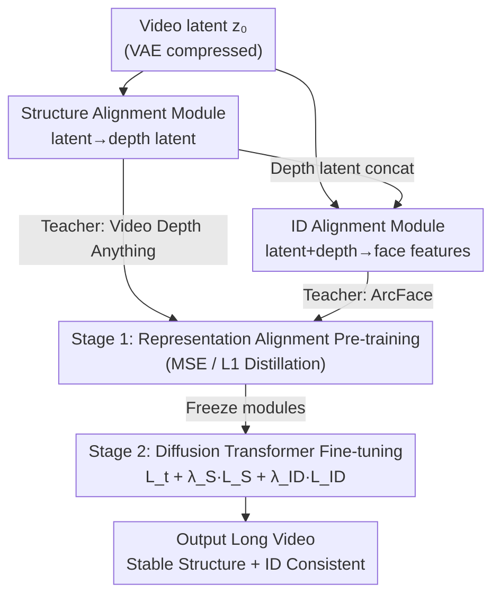

# Improving Human Image Animation via Semantic Representation Alignment

**Conference**: CVPR 2026  
**arXiv**: [2605.10523](https://arxiv.org/abs/2605.10523)  
**Code**: To be confirmed  
**Area**: 3D Vision / Video Generation / Human Animation  
**Keywords**: Human Image Animation, Representation Alignment, Depth Distillation, ID Consistency, Diffusion Transformer  

## TL;DR
SemanticREPA converts semantic representations—such as depth and facial features—from "extra input conditions" into "training-phase supervision signals." By using two pre-trained alignment modules to distill 3D structural and identity priors while fine-tuning a Diffusion Transformer, it significantly mitigates limb distortion and facial inconsistencies in long videos or large-scale motions.

## Background & Motivation
**Background**: Image-to-Video (I2V) generation can already produce high-quality videos spanning hundreds of frames. Human image animation, a specialized task focusing on "single portrait + motion," typically injects various motion control conditions—dense/3D pose sequences, optical flow, camera trajectories, etc.—into the generation process.

**Limitations of Prior Work**: Existing methods still rely primarily on RGB pixel-level supervision and lack explicit proxy tasks to force the model to learn 3D geometry, physical plausibility, and long-range consistency. Consequently, long videos and intense motions often suffer from limb distortion, blurring, or disappearance (especially for fine-grained parts like fingers), and facial identity drift from the reference image.

**Key Challenge**: Treating semantic representations (pose, ID embeddings) as **conditions** sacrifices generation flexibility by forcing constraints on the output. Furthermore, pixel supervision alone does not compel the network to learn internal geometric and temporal structures. In short, "adding conditions" treats the symptoms, but the internal representation remains suboptimal.

**Goal**: To enable the I2V backbone to internally encode 3D human geometry (to fix limb distortion) and temporal identity consistency (to fix facial distortion) without sacrificing flexibility.

**Key Insight**: Drawing inspiration from REPA in image generation—where internal diffusion features are strong semantic representations—the authors propose optimizing them through knowledge distillation using discriminative (self-supervised) features. This is extended to video human animation: using **depth estimation features** to align structural representations and **face recognition features** to align ID representations.

**Core Idea**: Use semantic representations as "supervision" rather than "conditions." Two lightweight alignment modules are trained to predict depth/facial features directly from VAE latents. These modules are then frozen to supervise the fine-tuning of the Diffusion Transformer, distilling 3D motion and identity priors into the backbone.

## Method

### Overall Architecture
SemanticREPA aims to let the model learn 3D structure and identity consistency internally without relying on additional conditions. The process involves two stages: **Stage 1** pre-trains two alignment modules—the Structure Alignment Module learns to predict depth latents from video latents, and the ID Alignment Module learns to predict facial embeddings from video latents (concatenated with depth). **Stage 2** freezes these modules and uses them to apply an additional structural loss $\mathcal{L}_S$ and identity loss $\mathcal{L}_{ID}$ to the Diffusion Transformer backbone (CogVideoX), alongside the standard diffusion loss $\mathcal{L}_t$. During inference, the alignment modules are not used; the priors are already "imprinted" into the backbone, requiring no extra conditions.

### Key Designs

**1. Semantic Representation Alignment as Supervision, Not Condition: Teaching Internal Representations**

The addressable pain point is that existing methods use poses/IDs as input conditions, restricting flexibility without improving internal geometric/temporal representations. Ours reverses this by making semantic representations the training targets. Specifically, for a noisy latent $\mathbf{z}_t$, the Diffusion Transformer predicts noise $\tilde{\boldsymbol{\epsilon}}_\theta(\mathbf{z}_t,t,\mathbf{c})$ to derive a clean latent $\tilde{\mathbf{z}}_0$. The frozen alignment modules then predict depth/face features from $\tilde{\mathbf{z}}_0$ to align with ground truth. The final objective is $\mathcal{L}_{\text{final}}=\mathcal{L}_t+\lambda_S\mathcal{L}_S+\lambda_{ID}\mathcal{L}_{ID}$. This requires no extra conditions at inference, maintaining flexibility while the backbone is forced to learn 3D geometry and identity—a key distinction of "supervision over conditioning."

**2. Structure Alignment Module: Correcting Limb Distortion via Depth Distillation**

Limb distortion stems from insufficient 3D human motion modeling. Ours formalizes structural representation prediction as a "human-centric video depth estimation" proxy task. A depth-pruned CogVideoX Transformer acts as the Structure Alignment Module $f_{\text{SAM}}$, predicting depth latents from video latents: $\tilde{\mathbf{d}}_0(\mathbf{z}_0)=f_{\text{SAM}}(\mathbf{z}_0)$. The teacher, Video Depth Anything, provides temporally consistent depth maps which are colorized as RGB and VAE-encoded into ground truth depth latents $\mathbf{d}_0$. Training minimizes MSE: $\mathcal{L}_{\text{MSE}}=\|\mathbf{d}_0-\tilde{\mathbf{d}}_0(\mathbf{z}_0)\|^2$. Depth supervision directs attention toward 3D geometry rather than texture, suppressing limb distortion. Ablations showed that while $\mathcal{L}_S(\mathbf{z}_t)$ yielded better motion scores due to noise destroying texture, it caused loss of facial detail; thus, $\mathcal{L}_S(\mathbf{z}_0)$ was chosen for stable structure.

**3. ID Alignment Module: Face Feature Distillation + Depth Latents as Implicit Face Masks**

Facial distortion occurs when the model fails to maintain fine-grained temporal consistency during large motions. Ours uses a ResNet-based ID Alignment Module $f_{\text{ID}}$ to predict face embeddings from clean video latents. A key innovation is concatenating depth latents along the channel dimension as input: $\tilde{\mathbf{f}}(\mathbf{z}_0,\mathbf{d}_0)=f_{\text{ID}}(\mathbf{z}_0,\mathbf{d}_0)$. The depth latent serves as an "implicit face mask," helping the module locate the face area. The teacher is an Arc2Face-version of ArcFace, using L1 loss to align normalized facial embeddings: $\mathcal{L}_1=\|\mathbf{f}-\tilde{\mathbf{f}}(\mathbf{z}_0,\mathbf{d}_0)\|$. Verification using inter-class/intra-class feature distances showed a larger gap (0.1299 vs. 0.0417) with depth input, indicating stronger discriminative power.

### Loss & Training
A **two-stage training** strategy is used instead of direct RGB supervision to overcome memory constraints. Decoding long videos to supervise pixels is prohibitively expensive even with frozen VAE parameters. Thus, Stage 1 pre-trains alignment modules via knowledge distillation (MSE for depth latents, L1 for facial embeddings) to extract semantic features directly from VAE latents. Stage 2 freezes these modules and fine-tunes only the Diffusion Transformer backbone with $\mathcal{L}_{\text{final}}=\mathcal{L}_t+\lambda_S\mathcal{L}_S+\lambda_{ID}\mathcal{L}_{ID}$. Weights are set at $\lambda_S=0.01$ and $\lambda_{ID}=1$ to avoid destroying the generation prior. The base model is CogVideoX 1.0 (T5 text encoder, 480×720, 49 frames @ 8fps).

## Key Experimental Results

### Main Results
Testing included 200 unseen videos with large motions, compared against SOTA I2V models (CogVideoX as the non-fine-tuned base).

| Model | SSIM↑ | PSNR↑ | LPIPS↓ | FID↓ | Motion Score↓ | Text Score↑ | ID Score↑ |
|------|-------|-------|--------|------|---------------|-------------|-----------|
| SEINE | 0.3424 | 29.14 | 0.5275 | 556.29 | 28.08 | 0.2879 | 0.1702 |
| SVD | 0.3888 | 29.60 | 0.4590 | 467.95 | 18.58 | 0.2778 | 0.3818 |
| CogVideoX (Base) | 0.7482 | 32.40 | 0.1972 | 247.37 | 0.9426 | 0.2942 | 0.5087 |
| **SemanticREPA** | **0.7502** | **32.51** | 0.2011 | **213.09** | **0.4012** | **0.2956** | **0.6339** |

SemanticREPA achieved optimal scores in nearly all metrics: FID dropped from 247.37 to 213.09, Motion Score improved from 0.9426 to 0.4012 (closest to GT distribution), and ID Score rose from 0.5087 to 0.6339 (GT is 0.6465). LPIPS showed a negligible regression (0.2011 vs. 0.1972).

### Ablation Study
Based on Table 2 (CogVideoX_F is the base fine-tuned only on our data).

| Configuration | FID↓ | Motion↓ | ID↑ | Description |
|------|------|---------|-----|------|
| CogVideoX_F (Fine-tuned) | 210.99 | 0.7481 | 0.5098 | No alignment supervision baseline |
| w/ $\mathcal{L}_S(\mathbf{z}_t)$ | 212.97 | 0.4427 | 0.5751 | Noisy latent: Good motion, poor ID/clarity |
| w/ $\mathcal{L}_S(\mathbf{z}_0)$ | 212.21 | 0.5352 | 0.6118 | Clean latent: Stable structure/ID, final choice |
| w/ $\mathcal{L}_{ID}$ | 219.90 | 0.5397 | 0.6223 | Significant ID Score improvement |
| w/ $\mathcal{L}_S+\mathcal{L}_{ID}$ (Full) | 213.09 | 0.4012 | 0.6339 | Best structure stability + ID consistency |

ID Module Input Ablation (Table 3): Depth input gap (Inter-Intra) was 0.0882 vs. 0.0597 without depth, proving depth latents effectively act as implicit face masks.

### Key Findings
- **Structural loss primarily reduces Motion Score and CPBD (clarity), while ID loss primarily boosts ID Score.** Their effects are decoupled and complementary.
- **The choice between clean and noisy latents for structural alignment involves a trade-off.** Noisy $\mathcal{L}_S(\mathbf{z}_t)$ ignores texture to focus on motion but degrades facial ID and clarity; clean $\mathcal{L}_S(\mathbf{z}_0)$ is more reliable.
- **Loss weights are sensitive**: $\lambda_S$ and $\lambda_{ID}$ must be precisely tuned (0.01 / 1) to balance supervision effect against the generation prior.

## Highlights & Insights
- **Paradigm shift of "Representation as Supervision"**: Successfully extends REPA (distilling internal representations with discriminative features) from images to video human animation, specifically targeting depth (limbs) and faces.
- **Depth latent as an implicit face mask**: Concatenating depth latents in the ID module improves facial localization and discriminability without explicit segmentation—a low-cost, reusable trick.
- **Bypassing the VAE "Memory Wall"**: Pre-training lightweight modules to extract semantics from latents and then freezing them avoids the high memory cost of VAE gradient storage during long video backpropagation.

## Limitations & Future Work
- **Dependency on CogVideoX 1.0**: Validated only on a specific base and resolution; transferability to newer DiT architectures remains unproven.
- **Limited test set and lack of FVD**: The 200-video test set is small, and the study omits FVD, relying on a proxy Motion Score (optical flow FID).
- **Slight LPIPS regression**: Small drop in perceptual similarity compared to the base suggests a minor trade-off between structural/ID supervision and pixel-wise fidelity.
- **Qualitative results in supplement**: The main text lacks side-by-side distortion comparisons, making visual improvement difficult to judge directly.

## Related Work & Insights
- **vs. Pose/Flow Guidance**: Unlike methods that use semantic representations as input conditions to constrain motion, Ours uses them as supervision. This maintains inference flexibility and improves internal backbone representations.
- **vs. REPA (Image Domain)**: REPA uses self-supervised features to distill image diffusion latents. Ours applies this to video and adds the temporal identity consistency dimension via dual-path supervision.
- **vs. Joint Depth/Segmentation Generation**: Concurrent works generate and supervise depth/segmentation simultaneously but often ignore face consistency and require backbone modifications; Ours covers ID and keeps the backbone architecture unchanged.

## Rating
- Novelty: ⭐⭐⭐⭐ Systematically migrates the REPA paradigm to video human animation with clear task-specific mappings.
- Experimental Thoroughness: ⭐⭐⭐ Comprehensive ablations, but limited test set size and lack of FVD weaken the evidence.
- Writing Quality: ⭐⭐⭐⭐ Logical flow from motivation to method, with well-defined formulas.
- Value: ⭐⭐⭐⭐ The "supervision vs. condition" insight and the two-stage memory-saving approach are highly transferable.

<!-- RELATED:START -->

## Related Papers

- [\[CVPR 2026\] HumanNOVA: Photorealistic, Universal and Rapid 3D Human Avatar Modeling from a Single Image](humannova_photorealistic_universal_and_rapid_3d_human_avatar_modeling_from_a_sin.md)
- [\[CVPR 2026\] CrowdGaussian: Reconstructing High-Fidelity 3D Gaussians for Human Crowd from a Single Image](crowdgaussian_reconstructing_high-fidelity_3d_gaussians_for_human_crowd_from_a_s.md)
- [\[CVPR 2026\] GeoFree-CoSeg: Unsupervised Point Cloud-Image Cross-Modal Co-Segmentation Without Geometric Alignment](geofree-coseg_unsupervised_point_cloud-image_cross-modal_co-segmentation_without.md)
- [\[CVPR 2026\] Energy-GS: Image Energy-guided Pose Alignment Gaussian Splatting with redesigned pose gradient flow](energy-gs_image_energy-guided_pose_alignment_gaussian_splatting_with_redesigned_.md)
- [\[CVPR 2026\] LumiMotion: Improving Gaussian Relighting with Scene Dynamics](lumimotion_gaussian_relighting_dynamics.md)

<!-- RELATED:END -->
