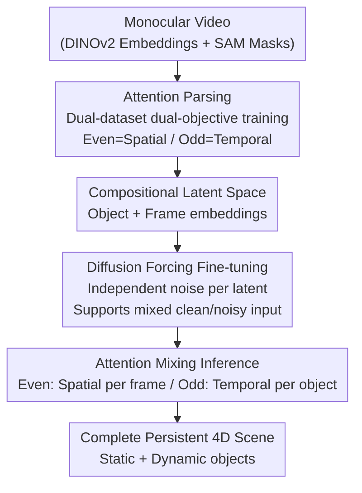

# Inferring Compositional 4D Scenes without Ever Seeing One

**Conference**: CVPR 2026  
**Paper**: [CVF Open Access](https://openaccess.thecvf.com/content/CVPR2026/html/Gokmen_Inferring_Compositional_4D_Scenes_without_Ever_Seeing_One_CVPR_2026_paper.html)  
**Code**: https://github.com/insait-institute/COM4D  
**Area**: 3D Vision / 4D Reconstruction  
**Keywords**: 4D Scene Reconstruction, Compositional Generation, Diffusion Transformer, Attention Mixing, Monocular Video

## TL;DR
COM4D reconstructs complete, persistent 4D scenes comprising "multiple static objects + multiple dynamic objects" from a single monocular video. The key lies in decoupling spatial compositional reasoning and single-object temporal dynamics into two distinct attention mechanisms learned from two types of readily available data, then combining them via **Attention Mixing** during inference—all without ever being exposed to 4D compositional training samples.

## Background & Motivation

**Background**: Real-world scenes consist of multiple static and dynamic objects whose structures, compositional relationships, and spatiotemporal configurations evolve continuously over time. Simultaneously achieving "reconstruction + decomposition + temporal reasoning" is extremely difficult; thus, existing works often settle for simpler setups: processing only one object at a time or applying category-specific parametric shape models (e.g., SMPL for humans) to dynamic entities.

**Limitations of Prior Work**: (1) Parametric models only cover modeled categories and fail once an object exceeds the prior; (2) Reconstructing objects individually and then stitching them often leads to geometric inconsistencies and inter-penetrations; (3) Many 4D full-scene methods rely on test-time optimization, which is inefficient; (4) When objects are occluded, undergo complex interactions, or experience large viewpoint changes, the 4D structure is often lost, making representations fragile—failing to maintain "consistency" and "persistence."

**Key Challenge**: Learning compositional 4D reconstruction should ideally require 4D compositional data containing "multiple objects + static/dynamic elements + temporal sequences." However, such in-the-wild data is extremely scarce, making the learning process severely under-constrained. Consequently, multi-object 4D scene reconstruction has significantly lagged behind simpler settings like single-object or static scenes.

**Goal**: Infer complete and persistent 4D representations containing multiple interacting objects from monocular video **without relying on any 4D compositional training data and without test-time optimization**.

**Key Insight**: The authors observe that the required spatiotemporal reasoning can be decomposed into two types of "attention" that can be learned from **easily obtainable** data—static multi-object observations (3D-FRONT) for spatial structure, and single-object animations (DeformingThings) for temporal dynamics. This is coupled with a simple yet powerful physical assumption: **at every instant, all scene elements are instantaneously static, and dynamics are unrolled by propagating object states forward in time**.

**Core Idea**: During training, **Attention Parsing** is used to learn decoupled spatial compositional attention and temporal dynamic attention within different layers of the same DiT. During inference, **Attention Mixing** alternates the scheduling of these two attention types to compose multi-object 4D scenes never seen during training.

## Method

### Overall Architecture
COM4D is built upon the 21-layer DiT backbone of the image-to-mesh generative model TripoSG (where object geometry is represented by VAE latent $z$, conditioned on DINOv2 image embeddings). A scene is represented as a set of $N$ static object latents $S=\{z_i\}$ and $M$ dynamic object per-frame latents $D=\{{}_fz_j\}$. The pipeline is divided into training and inference: The training phase uses an **Attention Parsing** dual-objective strategy, where even blocks of the DiT learn spatial multi-instance attention (from static multi-object 3D-FRONT data) and odd blocks learn temporal multi-frame attention (from single-object animation DeformingThings data), utilizing object/frame embeddings in a **Compositional Latent Space** to distinguish tokens. This is followed by **Diffusion Forcing** fine-tuning, allowing the model to handle mixed inputs where some latents are clean and others are noisy, paving the way for history-guided generation. The inference phase employs **Attention Mixing**, which alternates between frames for spatial composition in even blocks and per-object temporal propagation in odd blocks within a single denoising step.

### Key Designs

**1. Attention Parsing: Decoupling Spatial and Temporal Learning**

To bypass the lack of 4D compositional training data, a single DiT (21 blocks, shared weights) is trained alternately on two datasets: 3D-FRONT (static scenes + object-level decomposition) and DeformingThings (single-object dynamic sequences). Block roles are assigned by parity: When training on 3D-FRONT, **even blocks** perform multi-instance attention, where each object latent $z_i$ attends to other objects $\{z_l\}_{l=1}^N$ to reason about spatial relations: $\mathbf{z}^{i_\text{out}} = \text{Attention}(\mathbf{z}^i, \{\mathbf{z}^l\}_{l=1}^N)$. When training on DeformingThings, **odd blocks** perform multi-frame attention, where each latent attends to other frames $\{{}_lz\}_{l=1}^F$ of the same object to capture temporal dependencies. Unassigned blocks revert to local self-attention. This allows spatial and temporal reasoning to be decoupled into different layers of the same weights without interference, sharing a single backbone.

**2. Compositional Latent Space: Object and Frame Embeddings**

A scene is represented as $N+M$ latents, where each token is a tensor $z\in\mathbb{R}^{K\times C}$. To distinguish between different objects and frames in multi-instance/multi-frame attention, learnable embeddings are added: object embeddings $e_i$ for 3D-FRONT and frame embeddings ${}_fe$ for DeformingThings. Cross-injection is also performed—adding a single-frame embedding to 3D-FRONT latents and a single-object embedding to DeformingThings latents—to align the representations for seamless mixing during inference. The training uses a rectified flow objective, sampling time steps $t_i$ independently for each latent: $\mathbf{z}_{t_i}^i = t_i\mathbf{z}_0^i + (1-t_i)\boldsymbol{\epsilon}^i$. The loss is the sum of velocity prediction errors: $\mathcal{L}_S = \mathbb{E}[\sum_{i=1}^N \|(\boldsymbol{\epsilon}^i - \mathbf{z}_0^i) - \mathbf{v}_\theta(\mathbf{z}_{t_i}^i, t_i, \mathbf{y})\|^2]$, where $\mathbf{y}$ is the background-removed static object image embedding.

**3. Attention Mixing: Single-step Spatiotemporal Scheduling**

In a single denoising step, DiT blocks alternate roles: **Even blocks (Spatial)** receive all static object latents + the current frame latent of each dynamic object to form a "snapshot," performing multi-instance attention with cross-attention keys/values from the global scene image $\mathbf{y}$ to ensure correct relative positioning. **Odd blocks (Temporal)** process the sequence of latents for each dynamic object individually, performing multi-frame attention with keys/values from per-frame mask conditional embeddings (extracted via SAM) to capture specific motion. Static object latents pass through temporal blocks without motion processing. This routing allows the model to satisfy both spatial constraints from 3D-FRONT and temporal dynamics from DeformingThings. For videos of arbitrary length, temporal blocks use a sliding window to propagate attention sequentially, maintaining long-range consistency.

**4. Diffusion Forcing: History-Guided Temporal Consistency**

Standard diffusion applies the same noise to all latents. Diffusion Forcing applies independent noise to different latents and denoises them together, enabling the model to handle mixed inputs where some latents are clean ($t=0$). This is essential for: (1) stable static conditioning (generating dynamic latents conditioned on fully denoised static objects); and (2) **history-guided generation**—treating the denoised frame $f-1$ as a clean context ($t=0$) to generate frame $f$, ensuring temporal coherence. This is introduced via a two-stage fine-tuning process.

### Loss & Training
The objective is a rectified flow velocity matching loss, consisting of static $\mathcal{L}_S$, temporal $\mathcal{L}_T$, and regularization loss $\mathcal{L}_R$ from TripoSG. Degenerate samples (single part/frame) are trained with 0.3 probability to retain object priors. Spatial and temporal paths are capped at 8 parts/8 frames. Training (20k steps, batch 50) takes approximately 2 days on a single NVIDIA H200.

## Key Experimental Results

### Main Results: Single-Object 4D Reconstruction
Comparison with generative (L4GM, GVFD), mesh-based (V2V4), and per-frame TripoSG baselines.

| Dataset | Method | CD ↓ | F-Score ↑ | IoU ↑ |
|--------|------|------|-----------|-------|
| DeformingThings | TripoSG | 0.1558 | 0.5179 | 0.1784 |
| DeformingThings | **Ours** | **0.1144** | **0.8388** | **0.4191** |
| Objaverse | TripoSG | 0.1107 | 0.6585 | 0.2874 |
| Objaverse | **Ours** | 0.1205 | **0.7349** | **0.3413** |

Ours leads across all metrics on DeformingThings, with IoU significantly outperforming the second best.

### 3D Scene Reconstruction (3D-FRONT)
Comparison with MIDI and PartCrafter.

| Dataset | Method | CD ↓ | F-Score ↑ |
|--------|------|------|-----------|
| 3D-FRONT | MIDI | 0.1445 | 0.7829 |
| 3D-FRONT | **Ours** | **0.0909** | **0.8069** |
| 3D-FRONT-Occluded | **Ours** | **0.1256** | **0.7521** |

### Ablation Study
| Configuration | DT: CD ↓ | DT: F ↑ | DT: IoU ↑ |
|------|----------|---------|-----------|
| + Static/Dynamic Emb. | 0.1284 | 0.9350 | 0.4034 |
| + Diffusion Forcing | 0.1488 | 0.8189 | 0.4271 |
| **Ours** | **0.1144** | **0.8388** | **0.4191** |

### Key Findings
- **Static/Dynamic Embeddings are the biggest contributors**: Adding these embeddings nearly doubled the IoU on DeformingThings, proving that decoupled representations are key to compositional reasoning.
- **Diffusion Forcing improves temporal consistency**: Significant impact on IoU, validating its role in history-guided generation.
- **Attention Mixing is critical for composition**: User studies show an 87% preference for reconstructions with Mixing vs. 6.9% without. On CMU Panoptic, Mixing reduced the mean CD for first-frame registration from 35.91 cm to 7.42 cm.

## Highlights & Insights
- **Bypassing data barriers via "Learn Separate, Use Combined"**: Decomposing compositional 4D into "spatial composition" and "single-object temporal" sub-tasks is a valuable strategy for any problem where the target distribution lacks training data but its factor distributions are available.
- **Simple, effective physical assumption**: The assumption of instantaneous rest reduces the 4D problem to "per-frame 3D + temporal propagation," naturally implemented via Diffusion Forcing.
- **Parity-based DiT role assignment**: Reusing TripoSG's DiT by alternating roles per layer without adding parameters is an elegant way to multi-task a single backbone.

## Limitations & Future Work
- **Lack of GT compositional 4D data**: Evaluation of the main task relies heavily on user studies and indirect CD metrics due to the absence of ground truth datasets.
- **Dependency on SAM masks**: Temporal reasoning relies on SAM-extracted masks; failures in segmentation or heavy occlusion can degrade results.
- **Supervision caps**: Trained on up to 8 parts/8 frames; scalability to extremely large scenes remains to be fully verified.

## Related Work & Insights
- **vs MIDI**: MIDI uses multi-instance attention for static 3D but requires GT masks at inference; COM4D extends this to 4D without needing inference masks.
- **vs L4GM/GVFD**: These produce textures that look correct from input views but lack geometric consistency; COM4D produces explicit per-object meshes with better cross-view consistency.
- **vs Test-time Optimization**: COM4D is purely feed-forward, offering significantly higher efficiency.

## Rating
- Novelty: ⭐⭐⭐⭐⭐ Decoupling spatial/temporal attention to bypass 4D data scarcity is an original and effective strategy.
- Experimental Thoroughness: ⭐⭐⭐⭐ Extensive across three tasks with clear ablations, though constrained by the lack of ground truth for compositional 4D.
- Writing Quality: ⭐⭐⭐⭐ Clear logic from motivation to implementation.
- Value: ⭐⭐⭐⭐⭐ Provides a practical, feed-forward solution for the long-standing challenge of in-the-wild multi-object 4D reconstruction.

<!-- RELATED:START -->

## Related Papers

- [\[CVPR 2026\] Efficiently Reconstructing Dynamic Scenes One D4RT at a Time](efficiently_reconstructing_dynamic_scenes_one_d4rt_at_a_time.md)
- [\[CVPR 2026\] MoVieS: Motion-Aware 4D Dynamic View Synthesis in One Second](movies_motion-aware_4d_dynamic_view_synthesis_in_one_second.md)
- [\[CVPR 2026\] JRM: Joint Reconstruction Model for Multiple Objects without Alignment](jrm_joint_reconstruction_model_for_multiple_objects_without_alignment.md)
- [\[CVPR 2026\] EventHub: Data Factory for Generalizable Event-Based Stereo Networks without Active Sensors](eventhub_data_factory_for_generalizable_event-based_stereo_networks_without_acti.md)
- [\[CVPR 2026\] 4D Primitive-Mâché: Glueing Primitives for Persistent 4D Scene Reconstruction](4d_primitive-mache_glueing_primitives_for_persistent_4d_scene_reconstruction.md)

<!-- RELATED:END -->
