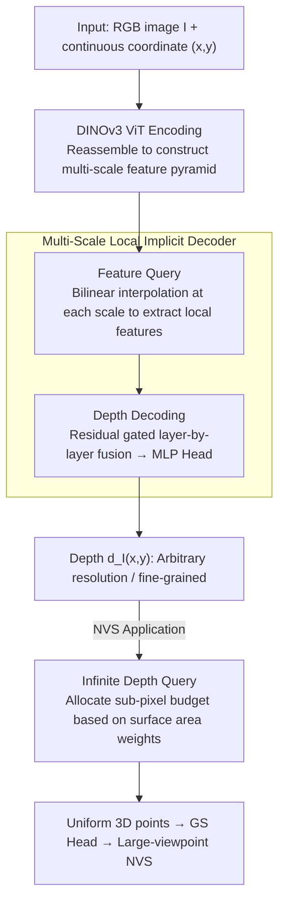

# InfiniDepth: Arbitrary-Resolution and Fine-Grained Depth Estimation with Neural Implicit Fields

**Conference**: CVPR 2026  
**Paper**: [CVF Open Access](https://openaccess.thecvf.com/content/CVPR2026/html/Yu_InfiniDepth_Arbitrary-Resolution_and_Fine-Grained_Depth_Estimation_with_Neural_Implicit_Fields_CVPR_2026_paper.html)  
**Code**: https://github.com/zju3dv/InfiniDepth  
**Area**: 3D Vision  
**Keywords**: Monocular Depth Estimation, Neural Implicit Fields, Arbitrary Resolution, Fine-Grained Geometry, Novel View Synthesis

## TL;DR
InfiniDepth reformulates depth from "pixel-wise values on a discrete grid" to a "neural implicit field from continuous 2D coordinates to depth." Using a multi-scale local implicit decoder, it queries depth at any $(x,y)$ coordinate, thereby bypassing training resolution limits to directly predict razor-sharp depth maps at arbitrary resolutions. It also introduces a query strategy that allocates sampling budgets based on surface area to improve novel view synthesis (NVS) under large viewpoints.

## Background & Motivation

**Background**: The mainstream monocular depth estimation methods (e.g., DepthAnything, MoGe, Marigold) model the depth map as a **discrete 2D grid** of the same size as the input image, as this representation naturally fits the tensor operations of convolutions/Transformers.

**Limitations of Prior Work**: Discrete grid representations impose two fundamental limitations. First, **the resolution is locked to the training size**—networks can only output depth at fixed grid locations. To obtain higher resolutions, one must rely on convolutional upsampling or linear projections from the latent space to depth patches. The former blurs edges, leading to over-smoothing, while the latter struggles to capture local geometric variations; both sacrifice high-frequency details. Second, predictions are inaccurate in **regions with sharp geometric variations** (thin structures, edges, occlusion boundaries), causing the reconstructed point clouds to blur when viewed up close.

**Key Challenge**: There is an inherent conflict between high-resolution + fine-grained geometry and discrete grid representations. As long as depth remains anchored to fixed grid points, the output resolution is capped by the training image size, and details remain limited by sampling precision.

**Goal**: Enable depth prediction to output arbitrary resolutions while preserving sharp geometry in detailed areas, thereby facilitating downstream 3D tasks (such as novel view synthesis).

**Key Insight**: Implicit neural representations (e.g., NeRF, LIIF, PiFU) have already demonstrated that "modeling signals as functions of continuous coordinates" can capture fine-grained geometry in a resolution-agnostic manner. The authors transfer this approach from 3D reconstruction/image super-resolution to depth estimation: since depth is essentially a continuous function over the image plane, why discretize it into a grid?

**Core Idea**: Represent depth as a neural implicit field instead of a discrete grid, formulating depth estimation as a mapping $d_I(x,y)=N_\theta(I,(x,y))$. This allows querying depth values at any continuous coordinate $(x,y)$, fundamentally removing constraints on resolution and detail.

## Method

### Overall Architecture

Given an RGB image $I$ and **any** continuous coordinate $(x,y)\in[0,W]\times[0,H]$ on the image plane, InfiniDepth directly outputs the depth $d_I(x,y)$ at that point instead of outputting an entire grid depth map at once. The overall pipeline is: the image is first encoded by a DINOv3 ViT encoder, and a reassemble block extracts multi-layer features to construct a multi-scale feature pyramid. For a query coordinate $(x,y)$, bilinear interpolation is applied at each pyramid scale to extract locally aligned features (Feature Query). Then, the multi-scale local features are fused layer-by-layer via residual gating from shallow (high-resolution/detail) to deep (low-resolution/semantics). Finally, a lightweight MLP Head decodes the fused features into depth (Depth Decoding). Users can sample as many coordinates as desired to achieve any target resolution, completely decoupling resolution from the network architecture.

This paradigm of "continuous coordinate query $\rightarrow$ local features $\rightarrow$ MLP-based depth output" yields a valuable by-product: because the depth field is differentiable with respect to image coordinates, surface normals can be computed directly via autograd. Consequently, this enables an **Infinite Depth Query** strategy that allocates sub-pixel sampling budgets based on surface area. This ensures that the back-projected point cloud is uniformly distributed over the object surface, significantly improving novel view synthesis (NVS) under large viewpoints.

### Key Designs

**1. Modeling depth as a neural implicit field: replacing discrete grids with continuous functions**

This step directly addresses the fundamental pain point of "resolution frozen by training sizes and details bottlenecked by grid sampling". Implicit neural representations express a signal $y$ as a function of continuous coordinates $x$: $y=F_\theta(x)$ (where $F_\theta$ is typically an MLP). Compared to explicit representations like voxels or grids, whose fidelity is bound to discretization accuracy, implicit methods capture fine-grained geometry with fewer parameters in a resolution-agnostic manner. The authors apply this concept to depth, defining:

$$d_I(x,y)=N_\theta\big(I,(x,y)\big),\quad (x,y)\in[0,W]\times[0,H],$$

which means that given an input image $I$, depth can be queried at any continuous coordinate. The most fundamental difference from discrete grid methods is that while conventional approaches generate a fixed-size map all at once, this method queries depth at arbitrary coordinates on demand—requiring 4K queries for 4K resolution and 16K queries for 16K resolution, without requiring model retraining or being constrained by training resolution. Localized step-by-step point predictions are also inherently better at capturing geometric variations, producing sharper point clouds in detailed regions (see Paper Fig. 1b).

**2. Multi-Scale Local Implicit Decoder: Residual gated fusion of shallow details and deep semantics**

The "continuous coordinates $\rightarrow$ depth" paradigm is insufficient on its own; how $N_\theta$ is instantiated to preserve both fine details and global semantics is crucial. The authors instantiate $N_\theta$ as a lightweight decoder consisting of two modules: **Feature Query** and **Depth Decoding**. On the Feature Query side: after the image is processed by ViT, a reassemble block extracts features from multiple layers and projects them into different latent dimensions. Shallow features (details) are upsampled to higher spatial resolutions, while deep features (semantics) retain their original resolution, forming a pyramid $\{f^k\}_{k=1}^L$. For a given query coordinate, it is first mapped to each scale $(x_k,y_k)=\big(x\cdot\frac{w_k}{W},\,y\cdot\frac{h_k}{H}\big)$, and the local feature $f^k_{(x,y)}$ is obtained via bilinear interpolation in its 4-neighborhood. On the Depth Decoding side: starting from the shallowest scale (highest resolution/details) $h_1:=f^1_{(x,y)}$, the fusion is performed scale-by-scale using residual gated connections:

$$h_{k+1}=\mathrm{FFN}_k\big(f^{k+1}_{(x,y)}+g_k\odot\mathrm{Linear}(h_k)\big),$$

where $g_k\in(0,1)^{C_{k+1}}$ is a learnable channel-wise gate, $\odot$ denotes element-wise multiplication, and $\mathrm{FFN}_k$ is a two-layer feed-forward network with non-linearities. Fusing from $k=1$ to $L-1$ yields the deepest fused feature $h_L$, which is decoded by an MLP Head to yield the final depth $d_I(x,y)=\mathrm{MLP}(h_L)$. The design intent of "fusing layer-by-layer from high resolution to low resolution + gating" is clear: letting detail features dominate while using semantic features as conditional constraints preserves local high-frequency geometry without losing global structure—which is exactly what convolutional upsampling or linear projection on discrete grids fails to achieve. In practice, DINOv3 ViT-Large is utilized, extracting features from the 4th, 11th, and 23rd layers, and projecting them to 256, 512, and 1024 dimensions. The 4th and 11th layers are upsampled by 4× and 2×, respectively.

**3. Infinite Depth Query: Allocating sub-pixel query budgets by 3D surface area to obtain uniform point clouds**

This design targets the critical pain point of downstream NVS: when back-projecting "pixel-wise discrete depth maps" into point clouds, prospective projection and surface orientations cause highly uneven point cloud density—distant and slanted regions occupy larger actual surface areas per pixel, leading to holes and artifacts under large viewpoint changes. The authors' insight is that the 3D surface element $\Delta S(x,y)$ corresponding to each pixel depends on two geometric factors: **squared-depth scaling** (areas covered by distant pixels $\propto d^2$) and **surface orientation** (projection is compressed when the normal deviates from the viewing direction, such that a single pixel covers a larger surface area). Thus, each pixel is assigned an adaptive weight:

$$w(x,y)=\frac{d_I(x,y)^2}{\,\lvert n(x,y)\cdot v(x,y)\rvert\,}+\varepsilon\ \propto\ \Delta S(x,y),$$

where $d_I(x,y)^2$ accounts for the squared-depth scaling, $\lvert n(x,y)\cdot v(x,y)\rvert$ compensates for the surface orientation, $v$ is the unit viewing direction, and $\varepsilon$ is a numerical stability term. Crucially, the surface normal $n(x,y)$ is not estimated separately; instead, leveraging the differentiability of the implicit depth field with respect to continuous image coordinates, it is directly computed using the Jacobian of the back-projected point $X(x,y)$:

$$n(x,y)=\frac{\partial_x X(x,y)\times\partial_y X(x,y)}{\lVert\partial_x X(x,y)\times\partial_y X(x,y)\rVert}\in\mathbb{R}^3.$$

By allocating sub-pixel query budgets to each pixel according to $w(x,y)$, uniformly querying continuous coordinates within pixel patches, and back-projecting them, a point cloud with nearly uniform surface coverage is obtained (see Paper Fig. 3b). Using these uniform points as Gaussian centers to feed a lightweight GS head enables rendering cleaner novel views with fewer holes under large viewpoints. This design is possible precisely because of "continuous coordinate queryability + differentiability" from Design 1—discrete grid depth maps cannot support sub-pixel queries, nor can they yield analytical
normals.

### Loss & Training

Because depth is modeled as an implicit field, it can be supervised on sparsely sampled points instead of the entire image. The authors randomly sample $N$ coordinate-depth pairs per iteration and compute the $\ell_1$ loss:

$$L=\frac{1}{N}\sum_{i=1}^{N}\lvert d_i-\hat d_i\rvert,$$

where $d_i$ is the ground-truth and $\hat d_i$ is the prediction. To achieve fine-grained geometry, the model is **trained solely on synthetic data** (as real-world depth is noisy and incomplete), using Hypersim, VKITTI, TartanAir, IRS, and high-resolution datasets like UnrealStereo4K and UrbanSyn. The optimization uses AdamW with a learning rate of $1\times10^{-5}$, trained for 800k steps on 8 A800 GPUs with a batch size of 4 per GPU. The metric depth version (Ours-Metric) leverages the depth prompt module from PromptDA to incorporate sparse depth inputs.

## Key Experimental Results

Evaluation covers two tasks: **relative depth estimation** with RGB-only input, and **metric depth estimation** with additional sparse depth inputs. Alongside five real-world datasets (KITTI, ETH3D, NYUv2, ScanNet, DIODE), the authors construct **Synth4K**—a dataset of 4K RGB-D images from 5 video games (Synth4K-1 to 5). They employ a multi-scale Laplacian energy map to construct a high-frequency (HF) mask specifically for evaluating detailed regions. $\delta_t$ denotes the percentage of pixels satisfying $\max(d/d^*, d^*/d) < 1.25^t$.

### Main Results

Relative depth on Synth4K ($\delta_1$, %; Full = entire 4K image, HF = high-frequency detailed regions):

| Region | Method | S4K-1 | S4K-2 | S4K-3 | S4K-4 | S4K-5 |
|------|------|-------|-------|-------|-------|-------|
| Full | DepthAnything | 83.8 | 88.2 | 88.6 | 92.8 | 93.0 |
| Full | MoGe-2 | 84.2 | 86.6 | 85.3 | 95.3 | 92.4 |
| Full | **Ours** | **89.0** | **92.2** | **93.9** | **95.5** | **96.3** |
| HF | MoGe-2 | 66.5 | 62.5 | 63.4 | 78.2 | 77.3 |
| HF | **Ours** | **67.5** | **65.6** | **69.0** | **78.2** | **79.5** |

The model leads across all subsets on the full images, with an even more pronounced advantage in HF detail regions—for instance, the HF $\delta_1$ on S4K-3 improves from 63.4 (MoGe-2) to 69.0, validating the claim that localized continuous predictions excel at geometric transitions.

Metric depth on Synth4K ($\delta_{0.01}$, stricter threshold of $1.01$):

| Region | Method | S4K-1 | S4K-2 | S4K-3 | S4K-4 | S4K-5 |
|------|------|-------|-------|-------|-------|-------|
| Full | PromptDA | 65.0 | 66.3 | 72.0 | 78.8 | 69.2 |
| Full | **Ours-Metric** | **78.0** | **76.6** | **83.8** | **87.2** | **83.1** |
| HF | PromptDA | 21.1 | 15.3 | 24.7 | 32.0 | 27.3 |
| HF | **Ours-Metric** | **33.2** | **24.0** | **37.2** | **45.5** | **38.8** |

For metric tasks, the performance improvement is even more significant than in relative tasks: the HF $\delta_{0.01}$ nearly doubles compared to PromptDA (e.g., S4K-4 increases from 32.0 to 45.5). This aligns with the authors' explanation that sparse depth significantly reduces metric ambiguity, making the accuracy gains from the proposed representation more apparent.

On real-world datasets, InfiniDepth is highly competitive with state-of-the-art methods like MoGe-2 in relative tasks ($\delta_1$) (e.g., scoring slightly higher at 99.1 on ETH3D), as RGB-only relative depth ambiguity is high and metrics tend to saturate. However, it leads comprehensively in metric tasks ($\delta_{0.01}$):

| Task | Method | KITTI | ETH3D | NYUv2 | ScanNet | DIODE |
|------|------|-------|-------|-------|---------|-------|
| Metric $\delta_{0.01}$ | PromptDA | 58.3 | 92.8 | 83.6 | 87.0 | 97.3 |
| Metric $\delta_{0.01}$ | **Ours-Metric** | **63.9** | **96.7** | **86.9** | **90.4** | **98.4** |

### Ablation Study

Component ablation on metric depth ($\delta_{0.01}$) over selected datasets:

| Configuration | S4K-1 | KITTI | ETH3D | NYUv2 | ScanNet | DIODE |
|------|-------|-------|-------|-------|---------|-------|
| Full Model | 72.7 | 61.7 | 93.9 | 84.7 | 88.5 | 97.6 |
| w/o Neural Implicit Fields | 62.4 | 49.0 | 88.9 | 81.2 | 84.2 | 95.4 |
| w/o Multi-Scale Query | 66.6 | 59.7 | 88.7 | 82.5 | 86.2 | 95.6 |
| w/o DINOv3 | 63.8 | 57.9 | 90.1 | 80.8 | 83.2 | 95.8 |

Removing the Neural Implicit Fields (w/o Neural Implicit Fields)—which replaces the implicit representation with a discrete grid DPT decoder using the same encoder and training data—results in the most severe performance drop (S4K-1 72.7 $\rightarrow$ 62.4, KITTI 61.7 $\rightarrow$ 49.0). This directly demonstrates that the implicit representation itself is the primary driver of performance. Multi-scale queries and the DINOv3 encoder also show significant contributions.

### Key Findings
- **Implicit representation is the cornerstone of performance**: Swapping it out for a discrete grid (w/o NIF) causes the largest drop in metric tasks. The authors note that while relative task gains are moderate, metric task gains are substantial—since resolving depth ambiguity with sparse depth allows the detail precision of this representation to shine without being obscured by absolute scale ambiguity.
- **Multi-scale residual gated fusion is effective**: Removing multi-scale queries and using only the final scale feature of the encoder (w/o Multi-Scale Query) degrades performance across all datasets, confirming that fusing "shallow details + deep semantics" scale-by-scale is critical for detailing fine-grained geometry.
- **Greatest gains in detailed regions**: The performance margin in HF-masked areas is significantly larger than in full-image evaluations, matching the core assertion that localized continuous predictions excel at sharp geometric transitions.
- **"Free" normals from differentiable fields**: Normals are computed directly from the Jacobian of the depth field with respect to coordinates (Fig. 4 shows highly detailed normal maps) without requiring an auxiliary normal network; this is also the foundation of the uniform sampling in Infinite Depth Query.
- **Downstream benefits for NVS**: Compared to ADGaussian which predicts pixel-wise discrete depths, using the proposed uniform point clouds as Gaussian centers significantly reduces holes and artifacts under large viewpoints (Fig. 1c, Fig. 8).

## Highlights & Insights
- **Redefining depth estimation as implicit function query**: The most compelling "aha" moment is breaking free of the mental model of "depth map = a fixed-size tensor." Since depth is naturally continuous across the image plane, it should be queried by coordinate rather than outputted via a grid, lifting the dual constraints on resolution and detail.
- **Derived dividends of a differentiable representation**: Because $d_I(x,y)$ is differentiable with respect to coordinates, analytical normals are obtained for free using autograd. This enables an adaptive sampling budget based on surface area—elegant design synergy where a representation choice directly resolves a seemingly unrelated NVS problem (uneven point cloud density).
- **Flexibility of sparse supervision**: The implicit field can be supervised on $N$ randomly sampled coordinates rather than full images, which is inherently suited for high-resolution training and drastically reduces GPU memory overhead—a feat difficult to achieve with grid representations.
- **Transferable methodology**: This decoding paradigm of "multi-scale local features + coordinate-based implicit query" is highly transferable to other tasks involving "continuous field prediction over the image plane," such as normal estimation, surface reconstruction, and semantic segmentation.

## Limitations & Future Work
- **Acknowledged limitations**: Since the model is trained strictly on single-view depth datasets, applying it to video sequences without explicit temporal consistency constraints can result in flickering. The authors plan to extend this to multi-view setups to enhance temporal stability and 3D consistency.
- **Sole reliance on synthetic training data**: To prioritize fine-grained geometry, the training uses only synthetic data. Real-world domain gaps, as well as performance under complex materials and transparent objects, require further validation (the paper primarily highlights detail advantages on synthetic Synth4K).
- **Crucial design details relegated to the supplementary material**: Key evaluations such as offset learning vs. bilinear interpolation, cross-attention vs. shared MLP, GS head configurations, and computational overhead/parameter counts are in the supplementary material, making them unavailable for direct inspection in the main text. Replicating the work requires referencing the supplementary material (subject to the original text ⚠️).
- **Future improvements**: Integrating surface-area weights from the Infinite Depth Query explicitly into the training loss (rather than just during inference sampling) or combining them with multi-view geometric constraints could further reduce novel view artifacts.

## Related Work & Insights
- **vs. DepthAnything / MoGe / MoGe-2 (Discrete Grid Relative Depth)**: These employ ViT + convolutional decoders to regress fixed-size grid depths. They show strong generalization but are constrained by training resolutions, leading to blurred details. This work achieves comparable full-image performance but yields significantly better fine-grained details by switching to continuous implicit field queries.
- **vs. Marigold / PPD (Diffusion-based Depth)**: Diffusion-based methods model the distribution of depth maps, relying on pre-trained priors or semantic prompts to refine boundaries. However, they still produce discrete grids, limiting resolution scalability; Marigold-DC's metric accuracy is also bottlenecked by VAE quantization loss.
- **vs. PromptDA / PriorDA / Omni-DC (Sparse Depth Completion/Metric)**: These use depth prompts or sparse inputs to improve metric accuracy, but recovering fine-grained geometry remains challenging. When utilizing matching prompt modules (Ours-Metric), this method substantially outperforms them in HF detail regions under the $\delta_{0.01}$ metric.
- **vs. LIIF / AnyFlow / DeFiNe (Implicit Representation Migration)**: LIIF addresses continuous image super-resolution, AnyFlow models arbitrary-scale optical flow, and DeFiNe learns implicit multi-view scenes but is constrained to low-resolution outputs by its architecture. This work successfully adapts implicit fields to depth, enabling true arbitrary-resolution + fine-grained estimation via a multi-scale local decoder.

## Rating
- Novelty: ⭐⭐⭐⭐⭐ Formulating depth estimation from discrete grids to neural implicit fields, yielding "free" differentiable normals and uniform sampling, is highly cohesive and impactful.
- Experimental Thoroughness: ⭐⭐⭐⭐ Covers synthetic Synth4K and five real-world datasets, relative/metric dual tasks, HF detail analysis, and NVS applications, though some crucial design comparisons are relegated to the supplementary material.
- Writing Quality: ⭐⭐⭐⭐⭐ Progression from motivation to representation, decoder design, and query strategy is logical and clearly illustrated (Figs. 2, 3, 4).
- Value: ⭐⭐⭐⭐⭐ Provides a reusable "continuous-field depth" paradigm and a 4K fine-grained evaluation benchmark, actively driving high-resolution 3D perception and reconstruction.

<!-- RELATED:START -->

## Related Papers

- [\[CVPR 2026\] iSplat: Iterative Learning for Fine-Grained Gaussian Splatting](isplat_iterative_learning_for_fine-grained_gaussian_splatting.md)
- [\[CVPR 2026\] Animator-Centric Skeleton Generation on Objects with Fine-Grained Details](animator-centric_skeleton_generation_on_objects_with_fine-grained_details.md)
- [\[CVPR 2026\] Fresco: Frequency-Spatial Consistent Optimization for Fine-Grained Head Avatar Modeling](fresco_frequency-spatial_consistent_optimization_for_fine-grained_head_avatar_mo.md)
- [\[CVPR 2026\] LiteSense: Lifting Lightweight ToF with RGB for High-Resolution Metric Depth Estimation](litesense_lifting_lightweight_tof_with_rgb_for_high-resolution_metric_depth_esti.md)
- [\[CVPR 2026\] NTK-Guided Implicit Neural Teaching](ntk-guided_implicit_neural_teaching.md)

<!-- RELATED:END -->
