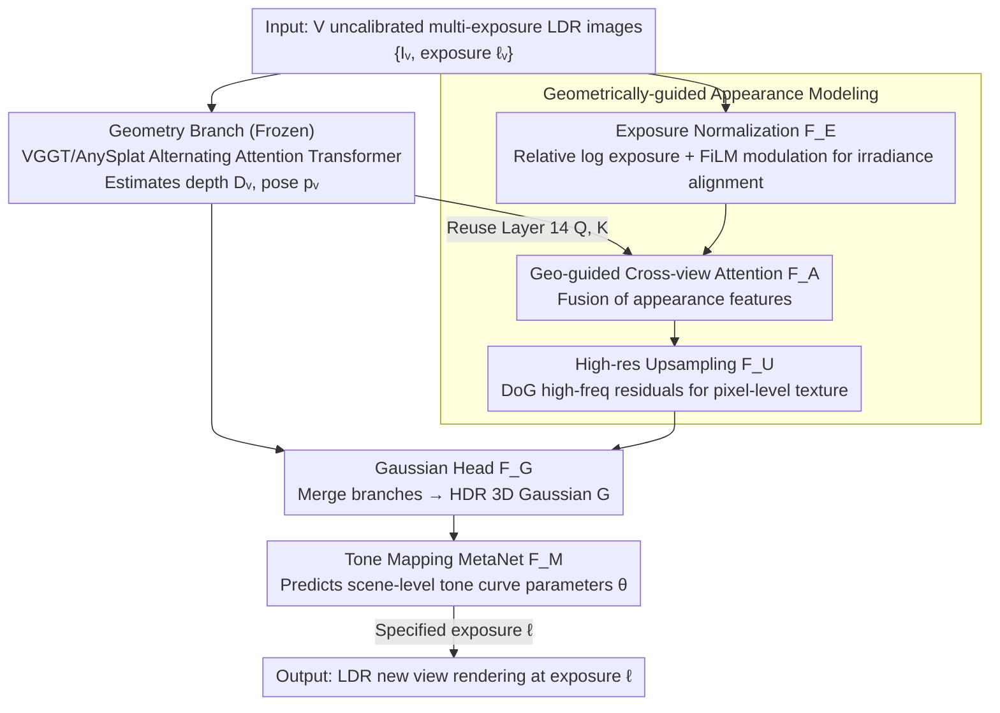

# InstantHDR: Single-forward Gaussian Splatting for High Dynamic Range 3D Reconstruction

**Conference**: CVPR 2026  
**arXiv**: [2603.11298](https://arxiv.org/abs/2603.11298)  
**Code**: None (To be released after review)  
**Area**: 3D Reconstruction / High Dynamic Range Imaging  
**Keywords**: HDR New View Synthesis, Feed-forward 3D Reconstruction, 3D Gaussian Splatting, Multi-exposure Fusion, Tone Mapping Meta-network

## TL;DR

Ours proposes InstantHDR, the first feed-forward HDR new view synthesis method. It introduces a geometrically-guided appearance modeling module to address appearance inconsistencies in multi-exposure fusion and utilizes a MetaNet to predict scene-specific tone mapping parameters for generalization. It achieves second-level HDR 3D Gaussian scene reconstruction from uncalibrated multi-exposure LDR images, outperforming GaussianHDR by +2.90 dB PSNR in sparse 4-view settings while being approximately 700 times faster.

## Background & Motivation

**Background**: HDR New View Synthesis (HDR-NVS) aims to reconstruct HDR scenes from multi-exposure LDR images and render new views at arbitrary exposures. Existing methods (HDR-GS, GaussianHDR) follow an optimization-based paradigm and can produce high-quality results.

**Limitations of Prior Work**:

1.  Optimization methods rely heavily on known camera poses, SfM dense point cloud initialization, and per-scene optimization (GaussianHDR requires ~30 minutes/scene), limiting practical deployment.
2.  Multi-exposure leads to appearance inconsistency $\rightarrow$ SfM point cloud collapse $\rightarrow$ complete failure of optimization methods under sparse views.
3.  Feed-forward 3D models (e.g., AnySplat) assume appearance consistency; direct application to multi-exposure inputs produces severe ghosting (e.g., the same white wall having drastically different brightness across exposures).
4.  Different cameras apply different tone curves (AgX/Filmic/Standard), making it difficult to learn a unified tone mapping.
5.  Public HDR datasets are extremely scarce (HDR-NeRF reflects only 12 scenes), insufficient for pre-training feed-forward models.

**Key Challenge**: The speed advantage of the feed-forward paradigm vs. exposure inconsistency, CRF diversity, and data scarcity in HDR scenes.

**Goal**: How to rapidly reconstruct high-quality HDR 3D scenes from uncalibrated, exposure-inconsistent multi-view LDR images without per-scene optimization?

**Key Insight**: Decouple geometry and appearance using a frozen geometry backbone and a trainable appearance branch; reuse intermediate attention maps from the geometry encoder for cross-view fusion guidance; employ a Meta-network to predict CRF parameters for single-forward adaptation to various cameras.

**Core Idea**: Geometrically-guided appearance modeling to solve exposure-inconsistent fusion + Meta-network for tone mapping generalization = single-forward HDR reconstruction.

## Method

### Overall Architecture

Input $V$ uncalibrated multi-exposure LDR images $\{I_v, \ell_v\} \rightarrow$ Dual-branch architecture: ① Geometry Branch (frozen VGGT/AnySplat pre-trained alternating-attention Transformer) estimates depth $D_v$ and pose $p_v \rightarrow$ ② Appearance Branch: Exposure Normalization $F_E \rightarrow$ Geometrically-guided Cross-view Attention Fusion $F_A \rightarrow$ DoG High-resolution Upsampling $F_U \rightarrow$ Gaussian Head $F_G$ merges outputs from both branches into HDR 3D Gaussians $\rightarrow$ MetaNet $F_M$ predicts tone mapping parameters $\theta \rightarrow$ LDR rendering for arbitrary exposure $\ell$.

### Key Designs

1.  **Geometrically-guided Appearance Modeling**
    A three-stage pipeline:
    -   **(a) Exposure Normalization $F_E$**: Computes relative log exposure $\tilde{\ell}_v = \ell_v - \bar{\ell}$, encodes it via sinusoidal positional encoding into a $d$-dimensional embedding $\mathbf{e}_v$. FiLM layers generate view-wise affine parameters $(\gamma_v, \beta_v) = \text{FiLM}(\mathbf{e}_v, \bar{a}_v, \bar{a})$ to modulate appearance tokens, aligning all views to a consistent irradiance level.
    -   **(b) Geometrically-guided Cross-view Attention $F_A$**: Key finding—the $Q, K$ matrices from the 14th layer of the frozen geometry encoder already encode reliable cross-view geometric correspondences (matching the same object precisely even with exposure differences from 0.5s to 32s). Directly reusing these $Q, K$ to guide cross-view fusion of appearance features $\tilde{t}_v^A = \text{softmax}(QK^\top/\sqrt{d}) \hat{t}_v^A$ results in zero additional computational overhead.
    -   **(c) DoG High-resolution Upsampling $F_U$**: Patch-level features lose high-frequency texture. A shallow CNN extracts full-resolution features $g_v$, and high-frequency residuals $(g_v - g_v\downarrow\uparrow)$ are added to the upsampled irradiance features to restore pixel-level detail.

2.  **Tone Mapping Meta-network (MetaNet)**
    -   The tone mapper $g_\theta$ is a two-layer MLP ($3\rightarrow h\rightarrow 3$, ReLU+sigmoid) that maps log-irradiance to $[0,1]$ LDR values.
    -   Unlike optimization methods that overfit an MLP per scene, MetaNet predicts all weights and biases of $g_\theta$ from scene context (LDR features $g_v$ + exposure embedding $\mathbf{e}_v$ + predicted HDR Gaussians $G$).
    -   Concatenated inputs are encoded via strided convolutions and global pooling into a scene-level descriptor $\theta \in \mathbb{R}^{d_\theta}$.
    -   Supports single-forward adaptation to different camera tone curves (AgX/Filmic/Standard) without per-scene optimization.

3.  **HDR-Pretrain Dataset**
    -   168 Blender-rendered indoor scenes based on HSSD open-source indoor assets.
    -   Each scene features a 5×7 view grid ($2.5^\circ/5^\circ$ steps), 5-level exposure bracketing, 32-bit HDR GT, depth, and normal maps.
    -   Randomly applied 3 tone mapping operators (AgX/Filmic/Standard) to increase CRF diversity.
    -   448×448 resolution, rendered with Cycles path tracing.
    -   Fills the community gap for feed-forward HDR pre-training data (previous largest HDR dataset had only 16 scenes).

### Loss & Training

-   $\mathcal{L} = \mathcal{L}_{\text{RGB}} + \lambda_g \mathcal{L}_g$, where $\mathcal{L}_{\text{RGB}} = \text{MSE}(I_v, L_v(\ell_v)) + \lambda_{\text{perc}} \mathcal{L}_{\text{perc}}$.
-   $\mathcal{L}_g$ is a depth consistency loss, supervised only on the top 30% confidence pixels to avoid unreliable regions like reflections or sky.
-   Geometry encoder and decoder head are fully frozen; only the appearance branch, Gaussian head, and MetaNet are trained.
-   AdamW + cosine lr, peak 2e-4, 1K warmup, 30K iterations, bf16, trained on 8×A6000 for ~2 days.
-   $\lambda_{\text{perc}}=0.05, \lambda_g=0.1$, sampling 2~10 context views per iteration.
-   Post-optimization: MSE+SSIM joint optimization for 1K iterations after pruning low opacity Gaussians ($\sigma < 0.01$).

## Key Experimental Results

### Main Results (HDR-NeRF Real Dataset)

| Method | 4-view PSNR↑ | 4-view SSIM↑ | 8-view PSNR↑ | 18-view PSNR↑ | Time↓ |
| :--- | :--- | :--- | :--- | :--- | :--- |
| AnySplat | 12.10 | 0.517 | 13.30 | 13.91 | ~1-2s |
| GaussianHDR | ~19.26 | ~0.691 | ~24.96 | ~29.36 | ~1833s |
| HDR-GS | ~15.40 | - | - | ~28.90 | ~910s |
| InstantHDR (Zero-shot) | 18.44 | 0.721 | 18.95 | 19.48 | ~1-2s |
| **InstantHDR_1K** | **22.16** | **0.762** | **25.32** | 29.19 | ~30-40s |

### Ablation Study (HDR-NeRF Real, 8-view)

| Configuration | PSNR↑ | SSIM↑ | LPIPS↓ |
| :--- | :--- | :--- | :--- |
| Full InstantHDR | **18.95** | **0.724** | **0.269** |
| w/o Exp. Normalization | 13.72 | - | - |
| w/o MetaNet | 16.32 | - | - |
| w/o Cross-view Attn | 17.63 | - | - |
| w/o High-res Upsampling | - | - | 0.386 |

### Key Findings

-   The zero-shot mode is +5.65 to +8.07 dB PSNR higher than AnySplat—exposure normalization and cross-view fusion are the core differentiators.
-   In sparse 4-view settings, InstantHDR_1K outperforms GaussianHDR by +2.90 dB (22.16 vs 19.26)—the feed-forward geometric prior effectively compensates for sparse inputs.
-   Speed: InstantHDR_1K is ~30-40s/scene vs GaussianHDR ~1833s $\rightarrow$ ~50x acceleration.
-   Ablation shows exposure normalization has the largest impact (-5.23 dB)—brightness inconsistency completely breaks cross-view fusion.
-   Removing MetaNet leads to training instability (16.32 dB)—the model cannot adapt to different CRFs.
-   In dense 18-view settings, performance is close to GaussianHDR (29.19 vs 29.36) but ~50x faster.

## Highlights & Insights

-   **First to introduce the feed-forward 3D reconstruction paradigm to HDR-NVS**: A qualitative leap in speed from 30 minutes to the 1-second range.
-   **Elegant reuse of intermediate attention maps** from a frozen geometry encoder—reliable cross-view geometric correspondence guidance is obtained at zero additional computational cost.
-   **MetaNet predicting all CRF parameters** enables "one network for multiple cameras"—a paradigm shift from per-scene MLPs to meta-learned parameters.
-   **Construction of the HDR-Pretrain dataset** fills a community gap—with 168 scenes, it is more than 10 times larger than the previous largest HDR dataset.

## Limitations & Future Work

-   Zero-shot HDR output tends to be overly bright—extreme radiance values are difficult to predict accurately in a single forward pass.
-   A PSNR gap remains compared to GaussianHDR in dense views of synthetic scenes (~2-6 dB)—the latter uses specialized 3D-2D dual-branch tone mapping.
-   Uses only a simple single-branch tone mapper (two-layer MLP); more refined CRF modeling is a direction for improvement.
-   Requires fine-tuning on HDR-Plenoxels real scenes to generalize effectively to HDR-NeRF real scenes—indicating an inter-domain gap.
-   Dynamic scene HDR reconstruction has not been explored.

## Related Work & Insights

-   **vs GaussianHDR**: Optimization-based, requires ~30 min/scene and relies on SfM initialization; point cloud collapse in sparse views leads to artifacts. InstantHDR requires no poses or point clouds and surpasses it by +2.90 dB PSNR in sparse 4-view settings.
-   **vs AnySplat**: Feed-forward 3D reconstruction but assumes appearance consistency; multi-exposure inputs cause severe ghosting. InstantHDR zero-shot outperforms it by +5.65 dB, with core differences being exposure normalization and cross-view attention fusion.
-   **vs HDR-GS**: Optimization method with strong performance but slow speed. InstantHDR_1K significantly outperforms it in sparse settings (22.16 vs 15.40).
-   Insight: The idea of reusing frozen backbone intermediate attention maps for cross-view guidance can be extended to tasks like multi-view segmentation and cross-view editing; the MetaNet paradigm for modules can be extended to adaptive dehazing/white balance.

## Rating

-   Novelty: ⭐⭐⭐⭐ First feed-forward HDR-NVS; Geo-guided appearance modeling and MetaNet designs are novel.
-   Experimental Thoroughness: ⭐⭐⭐⭐ Multi-view settings, LDR/HDR dual evaluation, complete ablation, and rich qualitative results.
-   Writing Quality: ⭐⭐⭐⭐ Problem statement is clear, method illustrations are intuitive, and experiments are well-organized.
-   Value: ⭐⭐⭐⭐ Pioneers the feed-forward HDR-NVS direction; speed improvements have significant practical value, although a gap with optimization methods remains in dense views.

<!-- RELATED:START -->

## Related Papers

- [\[CVPR 2026\] AeroDGS: Physically Consistent Dynamic Gaussian Splatting for Single-Sequence Aerial 4D Reconstruction](aerodgs_physically_consistent_dynamic_gaussian_splatting_for_single-sequence_aer.md)
- [\[CVPR 2026\] FastEventDGS: Deformable Gaussian Splatting for Fast Dynamic Scenes from a Single Event Camera](fasteventdgs_deformable_gaussian_splatting_for_fast_dynamic_scenes_from_a_single.md)
- [\[CVPR 2026\] AnchorSplat: Feed-Forward 3D Gaussian Splatting with 3D Geometric Priors](anchorsplat_feed-forward_3d_gaussian_splatting_with_3d_geometric_priors.md)
- [\[CVPR 2026\] Bringing a Personal Point of View: Evaluating Dynamic 3D Gaussian Splatting for Egocentric Scene Reconstruction](bringing_a_personal_point_of_view_evaluating_dynamic_3d_gaussian_splatting_for_e.md)
- [\[CVPR 2026\] $L^{2}DGS$: Low-Light Dynamic Gaussian Splatting](l2dgs_low-light_dynamic_gaussian_splatting.md)

<!-- RELATED:END -->
