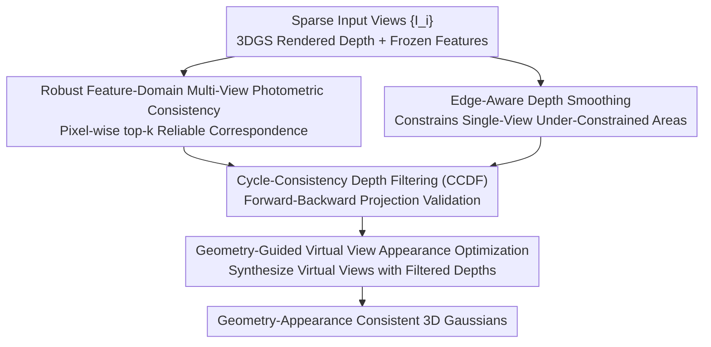

# Intrinsic Geometry-Appearance Consistency Optimization for Sparse-View Gaussian Splatting

**Conference**: CVPR 2026  
**Paper**: [CVF Open Access](https://openaccess.thecvf.com/content/CVPR2026/html/Xiong_Intrinsic_Geometry-Appearance_Consistency_Optimization_for_Sparse-View_Gaussian_Splatting_CVPR_2026_paper.html)  
**Code**: [Project Page ICO-GS](https://KaiqiangXiong.github.io/ICO-GS/)  
**Area**: 3D Vision / Sparse-View New View Synthesis  
**Keywords**: Sparse-view, 3D Gaussian Splatting, Geometry-Appearance Consistency, Multi-view Photometric Consistency, Virtual Views

## TL;DR
ICO-GS attributes the degradation of sparse-view 3DGS to "loss of intrinsic consistency between geometry and appearance." It first constrains geometry using feature-domain multi-view photometric consistency (enhanced by pixel-wise top-k selection and edge-aware smoothing), then filters reliable depths via cycle-consistency to synthesize virtual views for supervising appearance. It consistently outperforms existing sparse-view baselines on LLFF/DTU/Blender, particularly in textureless regions.

## Background & Motivation

**Background**: 3DGS represents scenes as a collection of anisotropic 3D Gaussians, enabling high-fidelity real-time rendering of novel views, making it a mainstream approach for New View Synthesis (NVS). Each Gaussian carries **geometry attributes** (position $\mu$, covariance $\Sigma$, opacity $\alpha$) and **appearance attributes** (view-dependent color $c(d)$).

**Limitations of Prior Work**: Standard 3DGS optimization minimizes rendering losses independently for each view. While effective for dense views, sparse views allow appearance to "cheat"—fitting training views perfectly by adjusting color to compensate for erroneous geometry, leaving geometry severely under-constrained. The authors illustrate this with a control group (15→9→6→3 views of the same scene): as views decrease, training view RGB remains well-fitted, but rendered depth collapses rapidly, leading to floaters and blur in test views.

**Key Challenge**: There is a lack of **intrinsic consistency** between geometry and appearance. Geometry should accurately characterize 3D structure, while appearance should reflect surface photometry consistently across viewpoints. Sparse supervision allows both to diverge, exacerbated in textureless regions where appearance cues are scarce.

**Goal**: Restore the coupling correctness between geometry and appearance without relying on external depth priors, decomposed into two dependent sub-problems: (1) how to robustly constrain geometry under sparse observations; (2) how to use reliable geometry to guide appearance optimization and prevent over-fitting.

**Key Insight**: The authors observe that "faithful geometry and appearance result from mutual reinforcement"—well-constrained geometry guides appearance to learn viewpoint-consistent photometry, and reliable appearance supervision further refines geometry. Existing attempts like BinocularGS construct binocular virtual views using rendered depth, but since rendered depth itself is unreliable, it creates a vicious cycle of "bad depth → bad virtual view → worse geometry."

**Core Idea**: Use **feature-domain multi-view photometric consistency** to first constrain geometry, then apply **cycle-consistency filtering** to retain only trustworthy depths for synthesizing virtual views to supervise appearance. This "propagates" geometric correctness to appearance, breaking the aforementioned cyclic dependency.

## Method

### Overall Architecture
ICO-GS (Intrinsic Geometry-Appearance Consistency Optimization) is built upon BinocularGS. The pipeline consists of two collaborative components: **Robust Geometry Regularization** fixes under-constrained geometry under sparse views, and **Geometry-Guided Appearance Optimization** uses validated geometry to synthesize virtual views for supervising appearance. The input consists of $n$ sparse training views $\{I_i\}$, and the output is geometry-appearance consistent 3D Gaussians for real-time NVS. "Cycle-consistency filtering" acts as a gate: only depths passing the forward-backward projection self-consistency test are allowed for appearance supervision, preventing contaminated appearance from bad geometry. Training follows a three-stage curriculum learning approach.

### Key Designs

**1. Robust Feature-Domain Multi-View Photometric Consistency: Resisting Lighting and Occlusion via Feature Matching + Pixel-wise top-k**

This component addresses "under-constrained geometry" using multi-view geometry common sense: a 3D point should exhibit photometric consistency across viewpoints. Given a reference view $I_0$, reference pixel $p$ is projected to source view $p'_j = K T_{0\to j}(D_0(p)\cdot K^{-1}p)$ based on rendered depth, then warped back to the reference view to obtain reconstruction $I_{j\to 0}$. Ideally, these should match for Lambertian surfaces. To handle lighting, shadows, and specularities, the authors match features from a **frozen pre-trained feature network**: $L=\frac{1}{n-1}\sum_j \frac{\|\frac{1}{2}(1-\cos(F_0, F_{j\to 0}))\odot M_j\|_1}{\|M_j\|_1}$. Features are pre-computed once and frozen, providing zero additional training overhead while being robust to lighting changes. Crucially, **pixel-wise top-k selection** handles occlusion: for each reference pixel, only the $k$ most consistent correspondences across all source views are aggregated $L^{\text{Fea}}_{\text{mpc}}(p)=\frac{1}{k}\sum_{j\in T_k(p)}\frac{1}{2}(1-\cos(F_0(p),F_{j\to 0}(p)))$. If a pixel is occluded in half the views, the remaining visible views still provide valid supervision—this is identified as the most critical ablation component.

**2. Edge-Aware Depth Smoothing: Filling Dead Zones Visible Only from Single Views**

Multi-view consistency fails in areas visible to only one view, leaving geometry unconstrained. The authors add edge-aware depth smoothing $L_{\text{smooth}}=\sum_p \|\nabla D_0(p)\|_1\cdot \exp(-\alpha\|\nabla I_0(p)\|_1)$: penalties on depth gradients are relaxed where image gradients are high (object boundaries) and enforced in flat (textureless) areas. This provides smooth depth in textureless regions while preserving sharp structures at object boundaries.

**3. Cycle-Consistency Depth Filtering (CCDF): A Gate for Trustworthy Depth in Virtual View Supervision**

This is the core mechanism to break the "bad depth → bad virtual view" cycle. Before synthesizing virtual views, rendered depth self-consistency is verified: pixel $p$ is warped forward to source view $p'_j$ using $D_0(p)$, then warped back to reference via source depth $D_j(p'_j)$ to get reprojected depth $\tilde D_j(p)$. The error $e_j(p)=|D_0(p)-\tilde D_j(p)|$ measures geometric self-consistency. A pixel is deemed reliable if at least $m$ source views satisfy $e_j(p)<\tau_d$ ($\tau_d=0.01\cdot\max(D_0)$), i.e., $M_{\text{reliable}}(p)=\mathbb{I}[\sum_j \mathbb{I}[e_j(p)<\tau_d]\ge m]$. This binary mask identifies regions where rendered depth is backed by cycle-consistency, ensuring synthesized virtual views align with true structures. Ablations show removing CCDF drops performance by 0.52 dB on DTU and introduces rendering artifacts.

**4. Geometry-Guided Virtual View Appearance Optimization: Propagating Correctness to Appearance**

Using reliable depths verified by CCDF, virtual views are synthesized to supervise appearance. Unlike previous binocular-only methods, the authors **randomly sample** virtual poses $\{P_v\}$ within a sphere of radius $r$ centered at the reference camera, ensuring greater viewpoint diversity. For each virtual view, training images are forward-warped based on masked depths $\{M^{\text{reliable}}_i\odot D_i\}$ to synthesize a virtual image $I_v$ (with validity mask $M_v$). Photometric consistency $L_{\text{app}}=\sum_{p\in M_v}\|I_v(p)-I^R_v(p)\|_1$ is applied to the rendered virtual view $I^R_v$. This provides extra appearance observations for unseen viewpoints to prevent over-fitting while backward-constraining geometry. Since the virtual image originates from filtered reliable depths, the supervision remains "clean."

### Loss & Training
The total loss adds four terms to the baseline: $L_{\text{total}}=L_{\text{3DGS}}+L_{\text{consis}}+\lambda_{\text{mpc}}L^{\text{Fea}}_{\text{mpc}}+\lambda_{\text{smooth}}L_{\text{smooth}}+\lambda_{\text{app}}L_{\text{app}}$, where $L_{\text{consis}}$ is the binocular consistency term inherited from BinocularGS. Weights are $\lambda_{\text{mpc}}=0.1, \lambda_{\text{smooth}}=0.01, \lambda_{\text{app}}=1.0$. Training uses **three-stage curriculum learning**: Stage 1 runs only $L_{\text{3DGS}}$ for coarse geometry; Stage 2 activates geometry regularization ($\lambda_{\text{mpc}}L^{\text{Fea}}_{\text{mpc}}+\lambda_{\text{smooth}}L_{\text{smooth}}$); Stage 3 adds virtual view appearance supervision $\lambda_{\text{app}}L_{\text{app}}$.

## Key Experimental Results

### Main Results
Experiments were conducted on LLFF (forward-facing), DTU (textureless objects), and Blender (360° objects). Comparisons include 3/6/9 training views for LLFF/DTU and 8 views for Blender. Metrics include PSNR↑, SSIM↑, and LPIPS↓.

| Dataset | Setting | PSNR↑ (Ours) | PSNR↑ (BinocularGS) | PSNR↑ (ComapGS/Best Baseline) |
|--------|------|------|------|------|
| LLFF | 3-view | **22.20** | 21.44 | 21.11 |
| LLFF | 6-view | **25.37** | 24.87 | 25.20 |
| LLFF | 9-view | 26.45 | 26.17 | **26.73** |
| DTU | 3-view | **21.77** | 20.71 | 20.21 (NexusGS) |
| DTU | 9-view | **27.19** | 26.70 | 27.18 (CoR-GS) |
| Blender | 8-view | **25.56** | 24.71 | 25.42 (DropGaussians) |

Ours achieves +0.76 dB Gain on LLFF 3-view and +1.06 dB on DTU 3-view. The advantage is more pronounced as views become sparser. On Blender, PSNR is optimal, though SSIM/LPIPS are slightly lower than specific methods, which the authors attribute to prioritizing geometric accuracy over purely perceptual optimization.

### Ablation Study
Ablations on LLFF and DTU (3-view) removing components starting from the BinocularGS baseline.

| Configuration | LLFF-3 PSNR↑ | DTU-3 PSNR↑ | Description |
|------|------|------|------|
| Baseline | 21.44 | 20.71 | BinocularGS |
| w/o $L^{\text{Fea}}_{\text{mpc}}$ | 21.82 | 21.31 | Removing robust multi-view consistency (causes largest drop) |
| w/o $L_{\text{smooth}}$ | 22.16 | 21.67 | Removing edge-aware smoothing |
| w/o CCDF | 21.86 | 21.25 | Removing cycle-consistency filtering |
| w/o $L_{\text{app}}$ | 21.79 | 21.20 | Removing virtual view appearance supervision |
| **Full** | **22.20** | **21.77** | Full model |

### Key Findings
- **Robust Multi-View Consistency ($L^{\text{Fea}}_{\text{mpc}}$) is the most significant contributor**: Removing it causes a sharp drop in both RGB and depth quality, demonstrating that feature-domain + top-k geometry constraints are foundational.
- **CCDF and $L_{\text{app}}$ are critical for textureless data like DTU**: Removing CCDF drops PSNR by 0.52 dB; virtual view supervision without the "filtering gate" introduces artifacts.
- **Gains scale with sparsity**: Improvement on DTU is +1.06 dB for 3-view but only +0.01 dB for 9-view, highlighting the method's value in extreme sparse scenarios.

## Highlights & Insights
- **Principle of Geometry-Appearance Consistency**: Instead of simply adding losses, the authors diagnose the root cause of sparse 3DGS degradation (appearance compensating for geometry) and design a pipeline focused on mutual reinforcement.
- **CCDF as a Reusable Gate**: The forward-backward reprojection check uses only camera parameters and rendered depth. This can be adopted by any work using rendered depth for self-supervision to filter out erroneous data.
- **Cost-effective Feature Matching**: Using pre-trained frozen features once during pre-processing adds almost no training cost while significantly improving robustness to lighting compared to raw RGB matching.

## Limitations & Future Work
- **Lambertian Appearance Assumption**: Synthesizing virtual views via warping assumes view-independent appearance, which may provide incorrect supervision in regions with strong specularities or reflections.
- **Lack of Explicit View-Dependent Modeling**: Future work could introduce uncertainty weighting or view-dependent terms for materials like glass or metal in virtual view supervision.
- **Baseline Dependency**: The method is built atop BinocularGS, inheriting its $L_{\text{consis}}$ term; its independent effectiveness in extreme (e.g., 2-view) cases without the baseline terms was not explicitly isolated.

## Related Work & Insights
- **vs BinocularGS**: Both use virtual views, but BinocularGS trusts rendered depth blindly. Ours uses CCDF as a gate and expands the sampling range to a sphere for increased diversity.
- **vs DNGaussian / FSGS**: These rely on external monocular depth priors, which suffer from scale ambiguity and noise. Ours achieves geometry constraints through multi-view self-consistency without external priors.
- **vs CoR-GS / DropGaussians**: Ours shows the strongest advantage on the textureless DTU dataset because the feature-domain top-k consistency specifically compensates for regions lacking appearance cues.

## Rating
- Novelty: ⭐⭐⭐⭐ Diagnosing degradation through the lens of geometry-appearance consistency and using CCDF to break cyclic errors is clear and effective.
- Experimental Thoroughness: ⭐⭐⭐⭐ Solid results across three datasets and multiple view settings with extensive ablations.
- Writing Quality: ⭐⭐⭐⭐ Clear motivation, well-described formulas, and excellent visual evidence.
- Value: ⭐⭐⭐⭐ Stable improvements for sparse and textureless scenes; CCDF gate has general utility.

<!-- RELATED:START -->

## Related Papers

- [\[CVPR 2026\] SGS-Intrinsic: Semantic-Invariant Gaussian Splatting for Sparse-View Indoor Inverse Rendering](sgs-intrinsic_semantic-invariant_gaussian_splatting_for_sparse-view_indoor_invers.md)
- [\[CVPR 2026\] DropAnSH-GS: Dropping Anchor and Spherical Harmonics for Sparse-view Gaussian Splatting](dropping_anchor_and_spherical_harmonics_for_sparse-view_gaussian_splatting.md)
- [\[CVPR 2026\] TWINGS: Thin Plate Splines Warp-aligned Initialization for Sparse-View Gaussian Splatting](twings_thin_plate_splines_warp-aligned_initialization_for_sparse-view_gaussian_s.md)
- [\[CVPR 2026\] DirectFisheye-GS: Enabling Native Fisheye Input in Gaussian Splatting with Cross-View Joint Optimization](directfisheye-gs_enabling_native_fisheye_input_in_gaussian_splatting_with_cross-.md)
- [\[CVPR 2026\] Faster-GS: Analyzing and Improving Gaussian Splatting Optimization](faster-gs_analyzing_and_improving_gaussian_splatting_optimization.md)

<!-- RELATED:END -->
