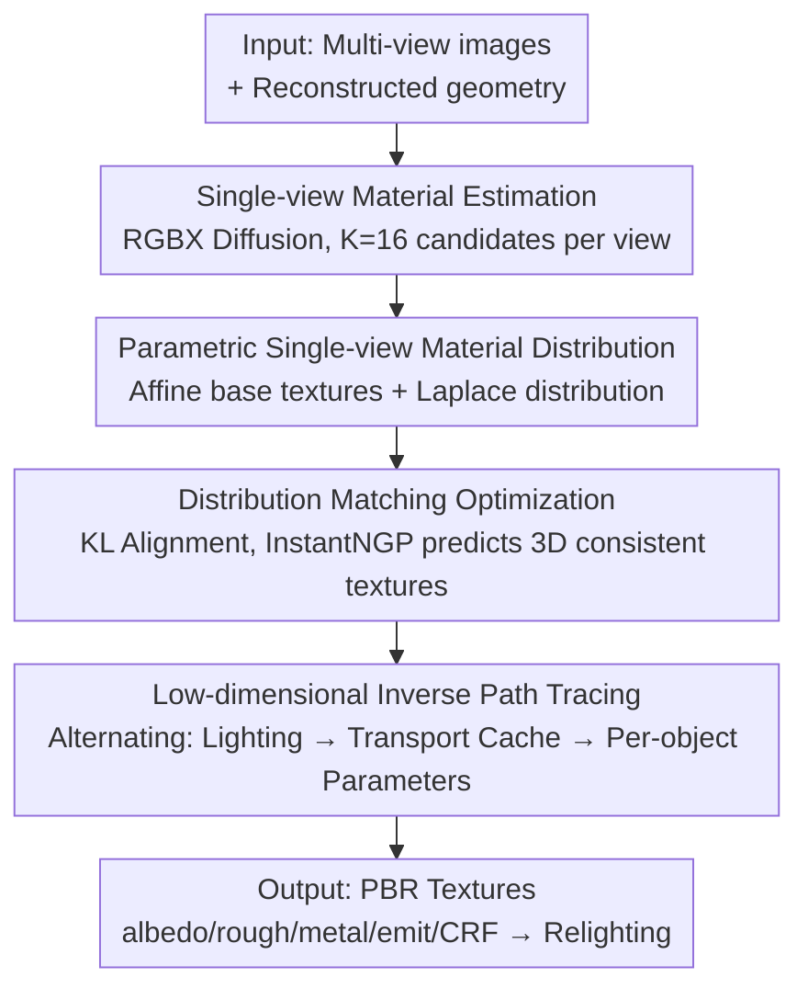

# Intrinsic Image Fusion for Multi-View 3D Material Reconstruction

**Conference**: CVPR 2026  
**Paper**: [CVF Open Access](https://openaccess.thecvf.com/content/CVPR2026/html/Kocsis_Intrinsic_Image_Fusion_for_Multi-View_3D_Material_Reconstruction_CVPR_2026_paper.html)  
**Code**: [Project Page](https://peter-kocsis.github.io/IntrinsicImageFusion/)  
**Area**: 3D Vision / Inverse Rendering / Material Reconstruction  
**Keywords**: PBR material reconstruction, inverse rendering, path tracing, single-view prior distillation, distribution matching

## TL;DR
Intrinsic Image Fusion (IIF) distills single-view priors from a 2D diffusion material estimator into multi-view inverse rendering. It uses a parametric distribution to aggregate multiple inconsistent PBR predictions per view into a low-dimensional consistent space, achieves 3D consistent textures via distribution matching, and finally performs inverse path tracing fine-tuning on only a few parameters per object. This significantly outperforms existing inverse rendering methods in material decoupling quality on synthetic and real indoor scenes.

## Background & Motivation
**Background**: Decomposing indoor scenes into Physically Based Rendering (PBR) components—albedo, roughness, metallic, and lighting—is a core task in graphics and vision, supporting applications such as relighting, material editing, and virtual object insertion. Mainstream inverse rendering follows the "analysis-by-synthesis" approach, using path tracing to simulate light transport and infer material properties.

**Limitations of Prior Work**: Realistic rendering via path tracing is computationally expensive and introduces Monte-Carlo noise, which propagates into the optimization and destabilizes material estimation. Furthermore, appearance decomposition is inherently ambiguous—diffuse, specular, and lighting effects are tightly coupled, especially in complex indoor scenes. This frequently results in lighting being "baked" into the albedo or incorrect specular parameters. Alternatively, 2D single-image material estimators (e.g., RGBX, based on diffusion models) demonstrate strong generalization and can sample multiple possible solutions. However, due to their probabilistic nature, **predictions within or across views are inconsistent**, making them unsuitable for direct 3D application.

**Key Challenge**: Inverse path tracing is "physically correct but noisy with many parameters," while 2D priors offer "sharp details but are 3D inconsistent and non-physical." How can the strengths of both be leveraged?

**Goal**: Embed strong 2D single-view priors into inverse rendering optimization to distill high-quality PBR textures for entire scenes that are both **3D consistent and re-renderable**.

**Key Insight**: Instead of averaging multiple inconsistent 2D predictions (which blurs details), it is better to explicitly model the "solution space of possible materials" as a **low-dimensional parametric distribution** and perform distribution matching. This selects the most consistent predictions and reduces the free parameters for inverse path tracing to a minimum, fundamentally suppressing rendering noise.

**Core Idea**: Distill 2D priors into 3D consistent textures using parametric distributions and distribution matching, then fine-tune only a few affine parameters per object using inverse path tracing.

## Method

### Overall Architecture
The input consists of multi-view images with poses and reconstructed geometry; the output is the scene's PBR textures (albedo/roughness/metallic + emission + camera response function CRF), suitable for direct re-rendering and relighting. The process is sequential: first, a single-view probabilistic estimator (RGBX) samples $K$ candidate PBR decompositions per view. Second, these candidates are aggregated into a **parametric distribution** (affine base textures + Laplace distribution) to form a 3D consistent texture via **distribution matching optimization**. Finally, a few free parameters per object are fine-tuned using **inverse path tracing** to achieve physically correct decoupling.

### Key Designs

**1. Parametric Single-View Material Distribution: Aggregating ambiguous 2D predictions into a low-dimensional consistent space**

RGBX samples $K$ candidates for albedo/roughness/metallic per observation, but these exist in an inherently ambiguous solution space. Direct averaging leads to inconsistency and over-smoothing. The primary ambiguity is **scale invariance**—whether observed RGB intensities stem from reflectance or lighting (e.g., a kettle can have multiple valid albedos). Inspired by color calibration, the authors introduce learnable **affine transforms** for each prediction per object to align them to an "ambiguity-invariant" base texture: $\bar{\mathbf{a}}_{i,k}=T^a_{i,k}[\mathbf{a}_{i,k},1]$, where albedo $T^a\in\mathbb{R}^{3\times4}$, and roughness/metallic each $T\in\mathbb{R}^{1\times2}$. Since affine transforms only correct global inconsistencies per object rather than high-frequency patterns, the authors further model the single-view solution space as a **per-image per-object Laplace distribution**. Learnable assignment logits via temperature softmax yield pixel-wise mixture weights $\alpha^a_{i,k}=\frac{\exp(z^a_{i,k}/\tau)}{\sum_j \exp(z^a_{n,j}/\tau)}$. The mixture mean serves as the distribution location $\mu^{\mathrm{ref}}_i$, and the median deviation of candidates from the mean serves as the scale $b^{\mathrm{ref}}_i$, such that $p^{\mathrm{ref}}_i\sim\mathrm{Laplace}(\mu^{\mathrm{ref}}_i,b^{\mathrm{ref}}_i)$.

**2. Distribution Matching Optimization: Selecting the most consistent prediction over averaging for 3D consistency**

To distill per-image per-object 2D distributions into a single 3D texture for the entire scene, an InstantNGP-based BRDF network $f_\theta$ predicts material properties and their uncertainty at 3D points $\mathbf{x}_n$, forming a predicted Laplace distribution $p^{\mathrm{pred}}_n\sim\mathrm{Laplace}(\mu^{\mathrm{pred}}_n,\mathbf{b}^{\mathrm{pred}}_n)$. The objective is to align these distributions when rendered back to 2D. The **data loss** uses KL divergence: $\mathcal{L}_{\mathrm{data}}=\frac{1}{N}\sum_n D_{\mathrm{KL}}(p^{\mathrm{ref}}_{i_n}\parallel p^{\mathrm{pred}}_n)$. To stabilize assignment logits, a **label loss** is added—soft labels $q_{n,k}$ are derived from $L_2$ errors between rendered materials and candidates via softmax, followed by cross-entropy regularization on mixture weights. Combined with identity regularization for affine transforms $\mathcal{L}_{\mathrm{reg}}(T)$, the total loss is $\mathcal{L}_{\mathrm{total}}=w_{\mathrm{data}}\mathcal{L}_{\mathrm{data}}+w_{\mathrm{label}}\mathcal{L}_{\mathrm{label}}+w_{\mathrm{reg}}\mathcal{L}_{\mathrm{reg}}$. The key intuition is that distribution matching seeks to **select the most consistent single prediction** across views rather than averaging them, meaning more predictions lead to less over-smoothing.

**3. Low-Dimensional Inverse Path Tracing: Optimizing few parameters per object to suppress rendering noise**

The aggregation yields an "ambiguity-invariant" base distribution—consistent across views but still just an independent sample. Physical decoupling is achieved via analysis-by-synthesis, performing inverse path tracing (solving the rendering equation with Cook-Torrance microfacet model $f_r=f_{\mathrm{diff}}+f_{\mathrm{spec}}$) only on the **per-object PBR affine parameters** $T^a_o, T^r_o, T^m_o$. Since Monte-Carlo noise in path tracing can propagate as "baked-in" shadows, **reducing trainable parameters from full BRDF textures to a few per-object transforms** serves as a powerful denoising regularizer. Following FIPT, a three-step **alternating optimization** is used: ① lighting optimization (uniform emission per triangle, back-solved with fixed $f_\theta$), ② light transport caching (rendering pre-integrated diffuse/specular shading maps with higher samples), and ③ BRDF parameter fitting (optimizing per-object transforms and jointly optimizing CRF for LDR inputs).

### Loss & Training
$K=16$ predictions are taken per view. Optimization uses Adam (bs=65536, lr=1e-2, 0.5 decay every 2 epochs) with weights $w_{\mathrm{data}}=w_{\mathrm{label}}=1, w_{\mathrm{reg}}=10^{2}$. Temperature $\tau$ is annealed by 0.85 every 100 iterations. Distribution matching runs for 10 epochs (~5 mins); parameter fitting is implemented via Mitsuba 3 and converges in ~55 mins on a single A6000.

## Key Experimental Results

### Main Results
Average results on four synthetic scenes (PSNR/SSIM/LPIPS for albedo re-rendering quality, last three columns for L2 errors of albedo/rough/metal):

| Method | PSNR ↑ | SSIM ↑ | LPIPS ↓ | Albedo L2 ↓ | Rough L2 ↓ | Metal L2 ↓ |
|------|------|------|------|------|------|------|
| NeILF++ | 13.18 | 0.733 | 0.375 | 0.103 | 0.047 | N/A |
| FIPT | 10.63 | 0.661 | 0.403 | 0.110 | 0.006 | 2.208 |
| IRIS | 15.86 | 0.735 | 0.307 | 0.056 | 0.040 | 2.046 |
| **Ours (IIF)** | **20.72** | **0.846** | **0.201** | **0.028** | 0.007 | **0.384** |

IIF outperforms the runner-up IRIS by nearly 5 dB in PSNR, halves the albedo L2 error, and reduces metallic L2 from the 2.0 range to 0.38. Real-world evaluation on ScanNet++ using laser-scanned meshes with 3D-consistent instance segmentation (MaskClustering/SAM) qualitatively shows that IIF avoids the projection artifacts (e.g., chair boundaries printed onto walls) seen in prior methods.

### Ablation Study
Impact of different aggregation methods on single-view RGBX predictions (synthetic scenes):

| Configuration | PSNR ↑ | SSIM ↑ | LPIPS ↓ | Albedo L2 ↓ |
|------|------|------|------|------|
| RGBX (Raw Predictions) | 13.11 | 0.787 | 0.228 | 0.187 |
| Per-Object Mean | 13.21 | 0.641 | 0.563 | 0.169 |
| Per-Texel Mean | 13.43 | 0.753 | 0.42 | 0.170 |
| w/ Parametric Model (§3.1) | 29.53 | 0.909 | 0.176 | 8.16e-4 |
| **Ours full (+Dist. Matching §3.2)** | **30.79** | **0.931** | **0.160** | **7.86e-4** |

Influence of the number of predictions (Distribution Matching):

| #Preds | PSNR ↑ | SSIM ↑ | LPIPS ↓ |
|------|------|------|------|
| 1 | 29.62 | 0.908 | 0.177 |
| 4 | 30.37 | 0.926 | 0.160 |
| 8 | 30.72 | 0.930 | 0.160 |
| **16 (Ours)** | **30.79** | **0.931** | **0.160** |

### Key Findings
- **Parametric modeling is the primary driver of quality**: Shifting from per-object/per-texel averaging (PSNR ~13) to a parametric model (29.53) provides comprehensive improvements across SSIM, LPIPS, and L2. Aligning predictions to a low-dimensional affine base space preserves details far better than averaging.
- **Distribution matching adds further gains**: Adding distribution matching (§3.2) on top of the parametric foundation pushes PSNR to 30.79 and SSIM to 0.931, validating that selecting the most consistent prediction is superior to continued averaging.
- **More predictions improve results without over-smoothing**: Increasing #Preds from 1 to 16 monotonically increases PSNR (29.62 to 30.79). This indicates that distribution matching effectively finds the most consistent solution rather than blurring, making more samples beneficial.
- **Per-image-per-object > per-image**: Modeling only at the image level leads to underfitting (output tends toward scene-average colors) due to relative reflectance mismatches between objects. Segmented per-object modeling offers significantly higher expressivity.

## Highlights & Insights
- **"Select Most Consistent" instead of "Average"**: Modeling the ambiguity of probabilistic 2D predictions as a Laplace distribution and using matching to select the most consistent solution is the most ingenious design of this work—it directly bypasses the over-smoothing/seaming issues common in multi-view aggregation.
- **Low-dimensional parameterization as a denoising regularizer**: Compressing the trainable parameters for inverse path tracing from full textures to a few affine parameters per object effectively imposes a strong constraint. This cleanly suppresses "baked-in" shadows; the concept of "regularization through reduced degrees of freedom" can be transferred to any noisy analysis-by-synthesis optimization.
- **Hybrid Paradigm of 2D Generative Priors × Physical Inverse Rendering**: This approach leverages the sharp details and generalization of diffusion models while maintaining physical re-renderability, providing a clean template for safely integrating strong 2D priors into 3D optimization.

## Limitations & Future Work
- **Dependency on fixed geometry**: The method inherits artifacts from the underlying mesh; joint optimization of geometry is a promising but unexplored direction.
- **Computational cost of sampling multiple predictions**: Directly incorporating pre-trained priors into the optimization, rather than repeated sampling, might be more compact.
- **Sensitivity to 2D estimator quality**: Incorrect predictions can contaminate results; the authors suggest introducing prediction uncertainty to ignore poor samples.
- **Observations**: The evaluation scale is relatively small (four synthetic scenes + few ScanNet++ samples). Robustness on larger-scale real data and the ~1 hour optimization cost per scene remain barriers to deployment.

## Related Work & Insights
- **vs IRIS**: IRIS also uses single-view estimators for regularization, but it employs "per-object single-color aggregation" as a material proxy and still optimizes full-texture rendering loss, leading to lost patterns and baked shadows. IIF preserves patterns via parametric distributions and limits optimization to low-dimensional parameters.
- **vs FIPT / NeILF++ (Pure Inverse Path Tracing)**: These methods optimize full textures directly on noisy light transport, making it difficult to separate shading from reflectance and leading to biased specular parameters. IIF constrains optimization to low dimensions and introduces 2D priors, nearly doubling PSNR.
- **vs RGBX (Pure 2D Diffusion Estimation)**: RGBX provides sharp pattern priors but lacks 3D consistency and physicality. IIF distills it into a consistent and re-renderable 3D texture.

## Rating
- Novelty: ⭐⭐⭐⭐⭐ The parametric distribution + distribution matching for "most consistent selection" is a novel path for injecting probabilistic 2D priors into 3D inverse rendering.
- Experimental Thoroughness: ⭐⭐⭐⭐ Comprehensive ablations on aggregation and prediction counts across synthetic and real data, though the number of evaluation scenes is limited.
- Writing Quality: ⭐⭐⭐⭐ Clear three-stage pipeline and motivation.
- Value: ⭐⭐⭐⭐ Provides a high-quality, re-renderable practical solution for indoor PBR material reconstruction and relighting.

<!-- RELATED:START -->

## Related Papers

- [\[CVPR 2026\] MatMart: Material Reconstruction of 3D Objects via Diffusion](matmart_material_reconstruction_of_3d_objects_via_diffusion.md)
- [\[CVPR 2026\] SMVRT: Implicit Human 3D Modeling Using Sparse Multi-View Volumetric Reconstruction with Transformer Fusion](smvrt_implicit_human_3d_modeling.md)
- [\[CVPR 2026\] EfficientMonoHair: Fast Strand-Level Reconstruction from Monocular Video via Multi-View Direction Fusion](efficientmonohair_fast_strand-level_reconstruction_from_monocular_video_via_mult.md)
- [\[CVPR 2026\] C-GenReg: Training-Free 3D Point Cloud Registration by Multi-View-Consistent Geometry-to-Image Generation with Probabilistic Modalities Fusion](c-genreg_training-free_3d_point_cloud_registration_by_multi-view-consistent_geom.md)
- [\[CVPR 2026\] MuM: Multi-View Masked Image Modeling for 3D Vision](mum_multi-view_masked_image_modeling_for_3d_vision.md)

<!-- RELATED:END -->
