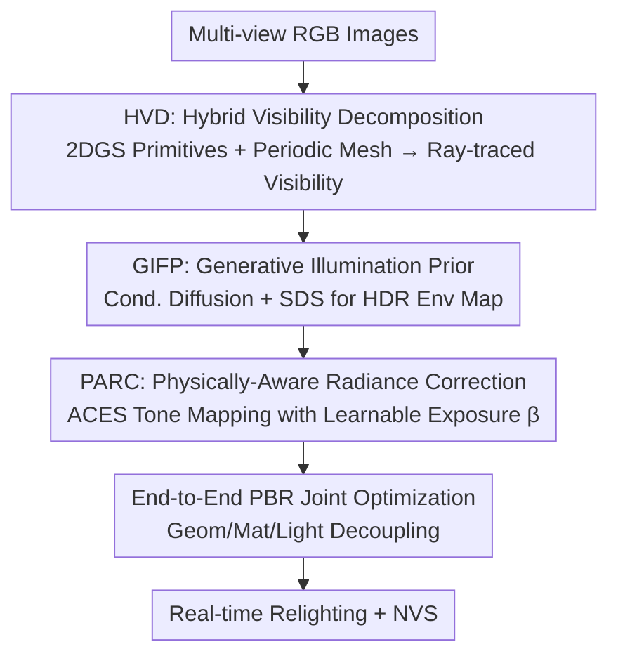

# IR-HGP: Physically-Aware Gaussian Inverse Rendering for High-Illumination Scenes via Generative Priors

**Conference**: CVPR 2026  
**Paper**: [CVF Open Access](https://openaccess.thecvf.com/content/CVPR2026/html/Zhang_IR-HGP_Physically-Aware_Gaussian_Inverse_Rendering_for_High_Illumination_Scenes_via_Generative_CVPR_2026_paper.html)  
**Code**: To be confirmed  
**Area**: 3D Vision / Inverse Rendering / Gaussian Splatting / Relighting  
**Keywords**: 3D Gaussian Splatting, Inverse Rendering, High-Illumination Scenes, Visibility Decomposition, Diffusion Illumination Priors, HDR Tone Mapping

## TL;DR
IR-HGP utilizes three collaborative modules—Hybrid Visibility Decomposition (HVD), Generative Illumination Prior (GIFP), and Physically-Aware Radiance Correction (PARC)—to extend 3DGS inverse rendering to high-illumination and strong specular reflection scenes. It solves the challenge of "baked-in shadows and highlights" in materials, achieving SOTA results (mean PSNR 33.61 on synthetic sets) in relighting and novel view synthesis while maintaining real-time rendering.

## Background & Motivation

**Background**: Inverse rendering aims to decouple geometry, material, and lighting from multi-view images to support physically consistent relighting and editing. NeRF-based methods (e.g., TensoIR) integrate BRDF into volume rendering with acceptable accuracy but low speed. Following the real-time efficiency of 3D Gaussian Splatting (3DGS), several works (GShader, R3DG, GS-IR, DeferredGS, DiscretizedSDF, etc.) have attempted to extend it to inverse rendering.

**Limitations of Prior Work**: 3DGS excels at modeling radiance for novel view synthesis but lacks the **physical interpretability** required for inverse rendering. This failure is amplified in scenes with strong illumination and specular highlights where "lighting-material coupling" is significant—leading to incorrect environment map decomposition, poor NVS quality, and shadows or highlights being "baked-in" to the material albedo.

**Key Challenge**: The authors attribute these failures to three tightly coupled conflicts: ① **Rendering-Geometry Disconnect**: 3DGS uses unstructured point clouds without explicit surface definitions, making visibility and shadow reasoning unreliable. ② **Lighting-Material Coupling**: Estimating both material and lighting from sparse 2D views is an ill-posed problem, often resulting in non-physical solutions. ③ **Radiance-Optimization Conflict**: Radiance values in specular areas span several orders of magnitude, causing unstable photometric gradients, while existing heuristic regularizations or tone mapping often violate physical consistency.

**Goal**: To restore physical interpretability to 3DGS while retaining its real-time efficiency, allowing for reliable geometry/material/lighting decoupling even in high-illumination scenes.

**Key Insight**: Address the three pain points respectively—provide an explicit mesh proxy for visibility, inject a generative prior for ill-posed environment light estimation, and implement a learnable radiance correction for unstable HDR optimization.

**Core Idea**: The synergy of HVD (Hybrid Visibility), GIFP (Diffusion Illumination Prior), and PARC (Physically-Aware Radiance Correction) modules re-injects physical fidelity into 3DGS inverse rendering.

## Method

### Overall Architecture
Given multi-view RGB images, IR-HGP performs physically-aware inverse rendering through a unified pipeline. The **HVD** module reconstructs geometry and appearance—2D Gaussian primitives handle efficient rasterization, while an explicit mesh periodically extracted provides high-fidelity visibility. Visibility modulates PBR shading, lit by a learnable HDR environment map. **GIFP** uses a conditional diffusion model to regularize this environment map onto the "real HDR image manifold," mitigating the ill-posed nature of lighting-material coupling. **PARC** uses a global learnable exposure parameter $\beta$ to compute photometric loss in a non-linear, gradient-friendly correction space, stabilizing HDR optimization and removing baked-in shadows. Finally, all learnable parameters (Gaussian geometry, environment map, exposure $\beta$) are optimized end-to-end.

### Key Designs

**1. HVD Hybrid Visibility Decomposition: Adding an Explicit Mesh as a "Geometric Ruler"**

To address the "Rendering-Geometry Disconnect"—where 3DGS lacks explicit surfaces for reliable visibility/shadow calculation—HVD splits the scene into two parts: a set of **2D Gaussian primitives** $\mathcal{G}$ carrying appearance attributes for efficient rasterization, and an **explicit surface mesh** $\mathcal{M}$ periodically extracted for high-fidelity visibility. Primitives are constrained to 2D planes (scaling matrix $S=\text{Diag}(s_x,s_y,0)$) to form flat disks, and attributes are blended into the G-buffer during splatting:

$$X_{pixel}=\sum_{i=1}^{N} x_i T_i \alpha_i$$

where $X_{pixel}=[A,N]^\top$ represents the final appearance and normal maps, and $T_i=\prod_{j=1}^{i-1}(1-\alpha_j)$ is the accumulated transmittance for correct occlusion. Crucially, the authors **periodically** (every 5k iterations, accounting for ~18% of training time) extract a topologically sound proxy mesh from the primitives using robust TSDF fusion. Ray tracing is then performed on this mesh to calculate the visibility term $V(p,d_{in})\in\{0,1\}$, determining if a shading point $p$ is occluded in direction $d_{in}$. The final radiance is decomposed into direct and indirect components:

$$L(p,\omega_o)=V\cdot L_{dir}(p,\omega_o)+L_{ind}(p,\omega_o)$$

Direct light $L_{dir}$ is computed via G-buffer attributes, and indirect light $L_{ind}$ is approximated using trainable Spherical Harmonic coefficients. 2D primitives ensure cleaner normals, while the mesh makes occlusion reasoning physically reliable without sacrificing real-time performance.

**2. GIFP Generative Illumination Prior: Anchoring Environment Maps to the "Real HDR Manifold"**

To address the ill-posed nature of "Lighting-Material Coupling"—where recovering an HDR environment map $\hat{L}_{env}$ from multi-view images is under-constrained—GIFP introduces a pre-trained conditional diffusion model $\mathcal{D}_{HDR}$ as a **persistent prior**. This constrains $\hat{L}_{env}$ to the manifold of real HDR images throughout optimization. Specifically, a lightweight encoder extracts coarse-grained lighting features from multi-view images as a condition:

$$L_{Coarse}=\text{Encoder}(\{I_i\}_{i=1}^N)$$

This captures dominant features like primary light directions and ambient tones. The Score Distillation Sampling (SDS) approach is used to construct the generative loss $L_g$: at each step, scaled Gaussian noise $z$ is injected into the current $\hat{L}_{env}$ to get $\hat{L}_{env}^{(t)}$, and the diffusion model predicts the noise $z_{pred}=\mathcal{D}_{HDR}(\hat{L}_{env}^{(t)}, t \mid L_{Coarse})$. Since the exact scalar loss is intractable, its gradient is estimated:

$$\nabla_{\hat{L}_{env}} L_g \propto (z_{pred}-z)$$

This distills the diffusion model's prior into the environment map, ensuring perceptual realism and preventing the optimizer from over-fitting unreasonable high-frequency details to the training views. Physical correctness emerges naturally from the tightly coupled joint optimization. This is, to the authors' knowledge, the **first use of diffusion models for environment map inference in 3DGS high-illumination scenes**.

**3. PARC Physically-Aware Radiance Correction: Stabilizing HDR Optimization via Learnable Exposure**

To address the "Radiance-Optimization Conflict"—where HDR radiance values span orders of magnitude and standard losses are dominated by few extreme specular pixels—PARC calculates photometric loss in a **non-linear, gradient-friendly correction space**. Based on the ACES tone mapping curve, the authors define a radiance correction function $C_{PARC}$ with a global, learnable per-scene exposure parameter $\beta\in\mathbb{R}^+$:

$$L_{corr}=C_{PARC}(L_{in},\beta)=\frac{x(2.51x+0.03)}{x(2.43x+0.59)+0.14},\quad x=L_{in}\cdot\beta$$

During training, both the rendered and target images pass through PARC before calculating the L1 loss:

$$L_c=\|C_{PARC}(L_{rendered},\beta)-C_{PARC}(L_{target},\beta)\|_1$$

The gradient propagates back to $\beta$, allowing it to find the optimal exposure. The advantage is that, unlike pixel-wise tone mapping networks with high degrees of freedom (which act as "black boxes" absorbing errors), PARC adds only **one degree of freedom** per scene. This forces the optimizer to stabilize rather than hide errors, mandating better material-light decoupling and fundamentally solving the "baked-in shadow" problem.

### Loss & Training
The final radiance $L(p,\omega_o)$ uses PBR shading (Cook-Torrance microfacet + metallic-roughness workflow), with incident light sampled from the learnable $\hat{L}_{env}$. Total loss is minimized end-to-end:

$$L_{total}=L_c+\lambda_g L_g+\lambda_n L_n+\lambda_{smooth}L_{smooth}$$

Where $L_c$ is the radiance-corrected photometric loss, $L_g$ is the GIFP generative prior loss, and $L_n/L_{smooth}$ are normal consistency and edge-aware normal smoothness terms. Weights are $\lambda_g=1.0, \lambda_n=0.2, \lambda_{smooth}=0.05$. Optimization uses Adam with an initial learning rate of 0.001, training for 30k iterations on a single RTX 4090.

## Key Experimental Results

### Main Results
The dataset is derived from the Relightable Objects benchmark: 10 objects (6 from NeRF Synthetic, 4 high-specular from Shiny Blender), each rendered under 6 strong-light HDR environment maps (60 configurations total). The table below shows the **mean values across all configurations**:

| Method | Paradigm | PSNR ↑ | SSIM ↑ | LPIPS ↓ | Train Time | FPS |
| :--- | :--- | :--- | :--- | :--- | :--- | :--- |
| TensoIR | NeRF-based | 28.22 | 0.9353 | 0.0840 | 5.4h | <1 |
| GS-IR | 3DGS | 29.25 | 0.9278 | 0.0880 | 0.6h | 208 |
| R3DG | 3DGS+RayTracing | 29.81 | 0.9645 | 0.0493 | 1.1h | 51 |
| DSDF | 3DGS+SDF | 32.12 | 0.9700 | 0.0453 | 1.2h | 139 |
| **IR-HGP (Ours)** | 3DGS+Hybrid | **33.61** | **0.9761** | **0.0369** | 1.5h | 92 |

The method outperforms others in all quality metrics. While training takes 1.5h and rendering reaches 92 FPS, it remains within a practical real-time range. The periodic mesh extraction and visibility calculation account for roughly 18% of training time. Gains are particularly stark on high-specular objects like the "Helmet" (PSNR 35.00 vs. DSDF 30.29).

### Ablation Study
Leave-one-out results (Table 2, using Ficus and Car):

| Configuration | Ficus PSNR ↑ | Ficus LPIPS ↓ | Car PSNR ↑ | Car LPIPS ↓ | Description |
| :--- | :--- | :--- | :--- | :--- | :--- |
| w/o 2DGS (in HVD) | 36.14 | 0.0123 | 34.01 | 0.0224 | Reverts to 3DGS, noisy normals |
| w/o visibility (in HVD)| 35.58 | 0.0243 | 33.78 | 0.0339 | No mesh visibility, wrong shadows |
| w/o GIFP | 34.77 | 0.0395 | 32.95 | 0.0452 | No diffusion prior, blurred env map |
| w/o PARC | 35.15 | 0.0179 | 33.43 | 0.0254 | No radiance correction, baked-in artifacts |
| **IR-HGP (Full)** | **36.86** | **0.0102** | **34.63** | **0.0209** | All modules |

### Key Findings
- **GIFP is the most impactful module**: Removing it causes the sharpest drop in LPIPS, proving that diffusion priors provide a stronger inductive bias for under-constrained light estimation than standard L2 or smoothness priors.
- **2DGS ensures cleaner normals**: Decoupling 2D primitives from 3D points reduces normal noise, directly improving visibility reasoning.
- **PARC cures "baked-in" shadows**: The learnable $\beta$ adapts to various scene brightness levels better than fixed ACES mapping, resulting in cleaner albedo.
- **Balanced Quality and Efficiency**: Achieves NeRF-level quality while maintaining real-time 92 FPS rendering.

## Highlights & Insights
- **"Explicit Mesh as a Visibility Ruler"**: Instead of struggling with point cloud occlusions, periodically extracting a mesh for ray-traced visibility while keeping Gaussian Splatting for rendering provides the best of both worlds.
- **Diffusion as a Persistent Prior**: Rather than using diffusion for image generation, employing SDS gradients to pull the environment map back to the real HDR manifold acts as a robust regularizer for ill-posed inverse problems.
- **Philosophy of Restraint in PARC**: Limiting PARC to a single learnable degree of freedom per scene is a counter-intuitive but profound design choice that prevents it from becoming a black box that hides errors, thereby forcing physically correct decomposition.
- **Tackling the High-Illumination Corner Case**: While most 3DGS inverse rendering methods fail under extreme highlights, this work specifically targets these pain points.

## Limitations & Future Work
- **Mesh Extraction Overhead**: Periodic TSDF fusion and visibility ray tracing take up ~18% of training time, and FPS (92) is lower than pure GS-IR (208).
- **Dependency on Pre-trained Priors**: The effectiveness of GIFP is limited by the quality and domain coverage of the pre-trained HDR diffusion model.
- **Real-scene PSNR**: On datasets like Mip-NeRF 360, PSNR (26.92) is slightly lower than 2DGS, indicating that pixel-level fidelity under real sensor noise is not yet universally optimal despite better perceptual metrics.
- **Future Directions**: Adaptive frequency for mesh extraction to save time; exploring lightweight priors to reduce dependency on large models; extending PARC to spatially-varying exposure.

## Related Work & Insights
- **vs. GS-IR / R3DG**: These use simplified visibility and unconstrained SH for indirect light, failing in physical decomposition under high light. IR-HGP leads by ~4 PSNR.
- **vs. DiscretizedSDF (DSDF)**: DSDF uses SDF for geometric accuracy and is a strong baseline; IR-HGP outperforms it in all quality metrics, especially for high-specular objects.
- **vs. TensoIR**: NeRF routes are significantly slower (<1 FPS vs. 92 FPS) and achieved lower quality in these specific high-illumination tests.

## Rating
- Novelty: ⭐⭐⭐⭐ Innovative use of diffusion priors in 3DGS inverse rendering; clever hybrid visibility mechanism.
- Experimental Thoroughness: ⭐⭐⭐⭐ Comprehensive evaluation on synthetic and real datasets with robust ablation; though the synthetic set size is modest.
- Writing Quality: ⭐⭐⭐⭐ Clear mapping between pain points and solutions; logically structured.
- Value: ⭐⭐⭐⭐ Pushes the boundaries of 3DGS into difficult high-illumination scenarios while maintaining real-time usage.

<!-- RELATED:START -->

- **GS-IR**: Gaussian Splatting for Inverse Rendering, CVPR 2024
- **DiscretizedSDF**: Discretized Signed Distance Fields for 3DGS Inverse Rendering, ECCV 2024
- **TensoIR**: Tensorial Inverse Rendering, CVPR 2023
- **2DGS**: 2D Gaussian Splatting for Geometrically Accurate Radiance Fields, SIGGRAPH 2024

<!-- RELATED:END -->

## Related Papers

- [\[CVPR 2026\] SunFaded: Illumination-Aware Gaussian Splatting for Dark Scenes with Camera-Mounted Active Lighting](sunfaded_illumination-aware_gaussian_splatting_for_dark_scenes_with_camera-mount.md)
- [\[ICCV 2025\] GeoSplatting: Towards Geometry Guided Gaussian Splatting for Physically-based Inverse Rendering](../../ICCV2025/3d_vision/geosplatting_towards_geometry_guided_gaussian_splatting_for_physically-based_inv.md)
- [\[CVPR 2025\] SVG-IR: Spatially-Varying Gaussian Splatting for Inverse Rendering](../../CVPR2025/3d_vision/svg-ir_spatially-varying_gaussian_splatting_for_inverse_rendering.md)
- [\[CVPR 2026\] MVInverse: Feed-forward Multiview Inverse Rendering in Seconds](mvinverse_feed-forward_multiview_inverse_rendering_in_seconds.md)
- [\[CVPR 2026\] VAD-GS: Visibility-Aware Densification for 3D Gaussian Splatting in Dynamic Urban Scenes](vad-gs_visibility-aware_densification_for_3d_gaussian_splatting_in_dynamic_urban.md)

<!-- RELATED:END -->
