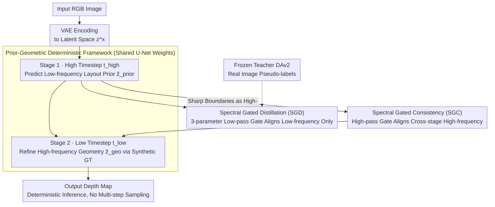

# Iris: Bringing Real-World Priors into Diffusion Model for Monocular Depth Estimation

**Conference**: CVPR 2026  
**arXiv**: [2603.16340](https://arxiv.org/abs/2603.16340)  
**Code**: [https://github.com/NUST-Machine-Intelligence-Laboratory/Iris](https://github.com/NUST-Machine-Intelligence-Laboratory/Iris)  
**Area**: 3D Vision / Monocular Depth Estimation  
**Keywords**: Monocular Depth Estimation, Diffusion Models, Spectral Gated Distillation, Prior-Geometric Framework, Deterministic Diffusion

## TL;DR

Iris proposes a deterministic diffusion framework that injects real-world priors into diffusion models through a two-stage "Prior-to-Geometric" (PGD) schedule. The first stage utilizes Spectral Gated Distillation (SGD) at high timesteps to extract low-frequency layout priors from a teacher model. The second stage refines high-frequency geometric details using synthetic data at low timesteps, while introducing Spectral Gated Consistency (SGC) for cross-stage high-frequency alignment. It achieves SOTA zero-shot depth estimation performance under limited data and computational budgets.

## Background & Motivation

1.  **Background**: Monocular Depth Estimation (MDE) is a fundamental computer vision task. Existing methods are divided into feed-forward models (e.g., Depth Anything V2) and diffusion-based models (e.g., Marigold, Lotus). Feed-forward models rely on massive training data, while diffusion methods leverage pre-trained visual priors.
2.  **Limitations of Prior Work**: Although Depth Anything V2 generalizes well, it relies on large-scale training pipelines that are hard to replicate, and it falls short in fine details and boundary precision. Current diffusion methods often perform poorly in synthetic-to-real domain transfer, showing limited generalization.
3.  **Key Challenge**: There exists a "frequency-reliability mismatch." Pseudo-labels from teacher models on real images provide reliable low-frequency structures but inaccurate high-frequency details. Conversely, synthetic ground truth provides precise high-frequency details but lacks the real-world distribution. Concurrent training on both signals leads to gradient interference.
4.  **Goal**: To build a model that preserves fine-grained details, offers strong cross-domain generalization, and reaches the accuracy of large-scale training methods within a limited budget.
5.  **Key Insight**: It is observed that diffusion models correspond to different Signal-to-Noise Ratios (SNR) across timesteps. High timesteps are suitable for learning global layouts, while low timesteps are optimal for fine geometry.
6.  **Core Idea**: Decouple prior injection and geometric refinement into two diffusion states, using a spectral gating mechanism to precisely control the frequency range of knowledge transfer.

## Method

### Overall Architecture

Iris addresses the core challenge of enabling a diffusion model to learn both real-world global layout priors and synthetic-level geometric details under limited data and compute. The difficulty lies in the conflict between supervision signals: teacher pseudo-labels for real images have reliable global layouts but inaccurate high frequencies, while synthetic GT has accurate high frequencies but lacks realistic distributions. Iris decouples these tasks into different diffusion timesteps.

The workflow is as follows: The input RGB image is encoded by a VAE into the latent space. A shared set of U-Net weights performs two stages. Stage one stops at a high timestep $t_{\text{high}}$ (low SNR), where the model naturally favors global structures to distill low-frequency layout priors from a frozen teacher model. Stage two switches to a low timestep $t_{\text{low}}$ (high SNR), starting from the output of stage one to refine high-frequency geometric details using synthetic ground truth. Inference is deterministic and does not require multi-step sampling; timesteps serve as conditional indices to distinguish the two stages.

### Key Designs

**1. Prior-Geometric Deterministic (PGD) Framework: Decoupling "Prior Learning" and "Geometric Refinement"**

Simultaneous regression of real pseudo-labels and synthetic ground truth in a single step causes gradient conflict: the former pulls towards global layout while the latter focuses on local textures, hindering clean learning for both. Iris observes that different timesteps in diffusion models correspond to different SNRs: at high timesteps with high noise, the predictor focuses on global layouts and large-scale boundaries; at low timesteps with low noise, it can sculpt fine geometry. Consequently, Stage 1 predicts a layout representation with real-world priors $\hat{z}^y_{\text{prior}} = f_\theta(z^x, t_{\text{high}})$, and Stage 2 uses this result as input to refine geometry $\hat{z}^y_{\text{geo}} = f_\theta(\hat{z}^y_{\text{prior}}, t_{\text{low}})$ using synthetic ground truth. Shared weights naturally shunt these frequencies based on the timestep.

**2. Spectral Gated Distillation (SGD): Distilling Reliable Low-frequency Priors Only**

Teacher models (DAv2) yield reliable pseudo-labels in low frequencies (global layout) but inaccurate high-frequency details. Standard distillation on the whole image suppresses the diffusion model's inherent high-frequency generation capability. SGD designs a lightweight low-pass gate $\mathcal{G}^{\text{low}}_\phi$ with only three learnable parameters $\phi = \{\kappa, \beta, s\}$, implementing a soft truncation curve in the Fourier domain via Sigmoid ($\kappa$ for cutoff, $\beta$ for steepness, $s$ for scaling). The distillation loss only compares the gated low-frequency components:

$$\mathcal{L}_{\text{sgd}} = \|\mathcal{G}^{\text{low}}_\phi(\hat{z}^y_{\text{prior}}) - \mathcal{G}^{\text{low}}_\phi(z^y_{\text{teach}})\|^2$$

This ensures the model aligns with the teacher only in reliable frequency bands, leaving high frequencies to be generated by the diffusion prior.

**3. Spectral Gated Consistency (SGC): Utilizing Stage 1 Sharp Boundaries as High-frequency Teacher**

An intuitive finding is that Stage 1, despite being supervised by low-pass signals at high timesteps, actually produces sharper boundary transitions. This occurs because low-pass alignment focuses on stable global structures and avoids "pollution" from blurry high-frequency pseudo-labels. SGC exploits this high-frequency signal by designing a differentiable high-pass gate to align Stage 2 high-frequency output with Stage 1. Simultaneously, an auxiliary constraint suppresses over-activation in Stage 1 high frequencies to prevent noise propagation.

### Loss & Training

The total training objective combines the SGD loss (Stage 1, real images), synthetic supervision loss (Stage 2, synthetic data), and SGC consistency loss. Weights are shared across stages and executed sequentially from high to low timesteps. Depth Anything V2 is used as the teacher, and training is conducted on Hypersim and Virtual KITTI datasets.

## Key Experimental Results

### Main Results

| Dataset | Metric (AbsRel↓) | Iris | DAv2-L | Lotus | Gain |
| :--- | :--- | :--- | :--- | :--- | :--- |
| NYUv2 | AbsRel | 4.6 | 4.3 | 5.5 | Comparable to DAv2, better than Lotus |
| KITTI | AbsRel | 5.4 | 5.5 | 7.3 | Superior to DAv2 and Lotus |
| ETH3D | AbsRel | 4.8 | 5.3 | 5.6 | Significantly superior to both |
| DIODE-Indoor | AbsRel | 14.1 | 16.0 | 18.8 | Significant lead |

Iris achieves the best overall performance on most real-image benchmarks, particularly outperforming other diffusion methods in cross-domain generalization.

### Ablation Study

| Configuration | AbsRel (NYU) | Description |
| :--- | :--- | :--- |
| Full Iris | 4.6 | Complete model |
| w/o SGD (Direct Distillation) | 5.2 | Contribution of low-frequency gating |
| w/o SGC | 4.9 | Contribution of high-frequency consistency |
| Single-stage Training | 5.4 | Contribution of PGD decoupling |
| w/o Teacher Distillation | 5.8 | Importance of real-world priors |

### Key Findings

- SGD is the most critical module; its removal leads to the largest performance drop, proving spectral-aware prior injection is vital.
- The unintended generation of sharp boundaries in Stage 1 at high timesteps is a key finding that inspired the SGC design.
- Compared to DAv2, Iris uses 1-2 orders of magnitude less training data while reaching or exceeding performance on most datasets.
- Iris significantly outperforms DAv2 in terms of boundary and detail fidelity.

## Highlights & Insights

- **Frequency-Reliability Mismatch**: The observation that teacher labels vary in reliability across different frequency bands is an important insight applicable to other distillation scenarios.
- **3-Parameter Spectral Gate**: A minimalist design accomplishes precise frequency-selective knowledge transfer, making it elegant and efficient.
- **Counter-intuitive Sharp Boundaries**: The fact that models perform better in high frequencies under low-pass constraints reveals interesting internal characteristics of diffusion models.

## Limitations & Future Work

- Performance still depends on the reconstruction quality of the pre-trained VAE; extreme details may be limited by VAE resolution.
- The teacher model is currently fixed as DAv2; a stronger teacher might yield further gains.
- The two-stage training increases hyperparameter complexity (selection of two timesteps).
- The PGD framework could be extended to other dense prediction tasks like surface normal estimation or optical flow.

## Related Work & Insights

- **vs. Depth Anything V2**: DAv2 relies on massive data distillation; Iris achieves similar effects on small data using spectral gating.
- **vs. Marigold/Lotus**: These diffusion methods fine-tune only on synthetic data, lacking real-world prior injection and showing weak domain transfer.
- **vs. GenPercept**: GenPercept also uses single-step diffusion but does not decouple prior injection from geometric refinement.

## Rating

- Novelty: ⭐⭐⭐⭐⭐ (Novel idea of decoupling priors and geometry in the spectral domain)
- Experimental Thoroughness: ⭐⭐⭐⭐ (Extensive evaluation across datasets and detailed ablation)
- Writing Quality: ⭐⭐⭐⭐ (Clear motivation and detailed methodology)
- Value: ⭐⭐⭐⭐⭐ (Significant practical value in matching large-scale performance with small data)

<!-- RELATED:START -->

## Related Papers

- [\[CVPR 2026\] Iris: Integrating Language into Diffusion-based Monocular Depth Estimation](iris_integrating_language_into_diffusion-based_monocular_depth_estimation.md)
- [\[CVPR 2026\] DuoMo: Dual Motion Diffusion for World-Space Human Reconstruction](duomo_dual_motion_diffusion_for_world-space_human_reconstruction.md)
- [\[CVPR 2026\] Depth Any Panoramas: A Foundation Model for Panoramic Depth Estimation](depth_any_panoramas_a_foundation_model_for_panoramic_depth_estimation.md)
- [\[CVPR 2026\] Learning a Particle Dynamics Model with Real-world Videos](learning_a_particle_dynamics_model_with_real-world_videos.md)
- [\[CVPR 2026\] MD2E: Modeling Depth-to-Edge Cues for Monocular Metric Depth Estimation](md2e_modeling_depth-to-edge_cues_for_monocular_metric_depth_estimation.md)

<!-- RELATED:END -->
