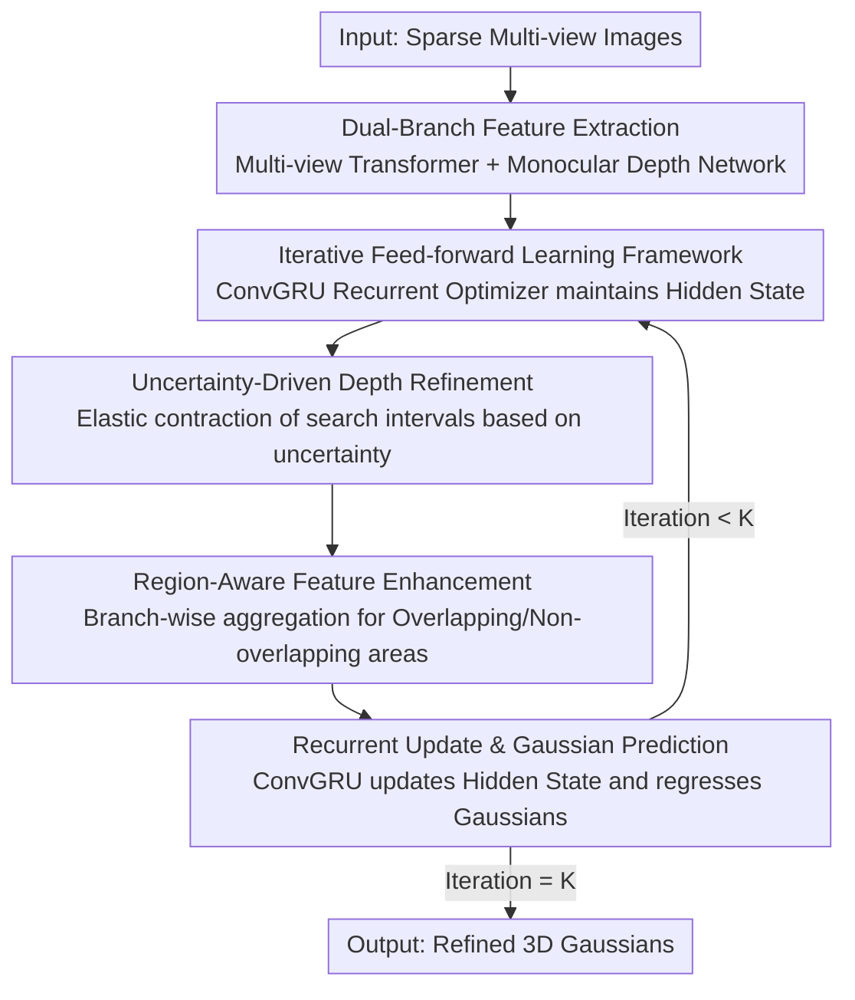

# iSplat: Iterative Learning for Fine-Grained Gaussian Splatting

**Conference**: CVPR 2026  
**Paper**: [CVF Open Access](https://openaccess.thecvf.com/content/CVPR2026/html/Wu_iSplat_Iterative_Learning_for_Fine-Grained_Gaussian_Splatting_CVPR_2026_paper.html)  
**Code**: https://github.com/haifengwu205/iSplat  
**Area**: 3D Vision  
**Keywords**: Feed-forward Gaussian Splatting, Iterative Refinement, GRU Recurrent Optimization, Uncertainty Depth, Cross-domain Generalization

## TL;DR
iSplat transforms feed-forward 3D Gaussian Splatting from "one-shot prediction" into "recurrent iterative refinement via GRU." By leveraging uncertainty-driven depth refinement and region-aware feature enhancement for progressive self-correction, it outperforms the 354M-parameter DepthSplat on RealEstate10K with only 42.6M parameters and improves PSNR by 2.88 dB on the cross-domain DTU dataset.

## Background & Motivation
**Background**: Feed-forward 3DGS (e.g., pixelSplat, MVSplat, DepthSplat) predicts all Gaussian parameters (position, rotation, scale, color, opacity) from sparse multi-view inputs in a single forward pass. This paradigm enables real-time high-fidelity rendering without the need for per-scene optimization, making it the mainstream for generalizable reconstruction.

**Limitations of Prior Work**: Existing methods predominantly follow a "single-pass cascaded pipeline" where a depth map is first estimated as a geometric backbone, followed by one-step Gaussian regression. This one-shot structure has a critical flaw: it creates a fragile dependency on the initial depth backbone. Once depth estimation fails, errors propagate irreversibly to appearance attributes with no mechanism for correction. In weakly constrained non-overlapping or textureless regions, coarse initial geometry dictates the final quality of detail.

**Key Challenge**: Optimization-based methods (per-scene fitting) achieve high fidelity through gradual error correction during long iterations but at a massive computational cost. Feed-forward methods are efficient but lack this "iterative correction" loop. A trade-off exists between efficiency and fidelity; this work aims to capture the benefits of both.

**Goal**: To inject "progressive self-correction" capabilities into feed-forward 3DGS while maintaining inference efficiency, specifically by refining both geometry and appearance repeatedly within a learnable loop.

**Key Insight**: The authors adapt the "iterative refinement" strategy (weight-sharing recurrent updates + contextual feedback) popularized in optical flow and stereo matching to the task of feed-forward Gaussian reconstruction.

**Core Idea**: A GRU-based recurrent optimizer rewrites the "one-shot prediction" as a process of "typically 3 iterations of feed-forward refinement." Each step refines geometry and appearance simultaneously, allowing improved geometry to provide a more reliable backbone for appearance, while enhanced features guide more accurate geometric corrections in a virtuous cycle.

## Method

### Overall Architecture
iSplat takes sparse multi-view images as input and outputs a progressively refined set of 3D Gaussians. It consists of two main components: a dual-branch feature extraction module and a recurrent learning module that performs $K$ iterations. While original methods follow a strict cascade $D_i=f_D(F_i),\ G_i=f_G(F_i,D_i)$, iSplat maintains a hidden state tensor $H_k$ as "memory." In each round, it updates via $H_k=f_{GRU}(H_{k-1},F,G_{k-1})$, $D_k=f_D(H_k)$, and $G_k=f_G(H_k,F,D_k)$. This shared hidden state tightly couples geometry and appearance estimation into a collaborative refinement loop.

Inside each iteration, three sequential steps occur: uncertainty-driven depth refinement, Region-Aware Feature enhancement (RAE), and ConvGRU-based state updates with Gaussian prediction.

### Key Designs

**1. Iterative Feed-forward Learning Framework: Reformulating one-shot prediction into GRU-based recurrent refinement**

This is the fundamental change addressing the inability to correct errors. A ConvGRU-based recurrent optimizer is introduced to accumulate geometric and photometric context across iterations using hidden state $H_k$. Starting from an initial state $H_0$ (projected from concatenated multi-view and monocular features), the process iterates $K$ times (default $K=3$). Each step updates the "memory" $H_k$, which in turn drives the depth head $f_D$ and Gaussian head $f_G$. The hidden state enables a bidirectional information flow: providing refined depth for the geometry head and updating appearance given the latest geometry.

**2. Uncertainty-Driven Depth Refinement (UDR): Dynamically adjusting depth search space via prior uncertainty**

To address the fragile dependency on static geometry, the depth search interval contracts dynamically across iterations, with the contraction magnitude determined by the model's self-estimated uncertainty. The first iteration discretizes the global depth range $[d_{min},d_{max}]$ into $B$ bins, with depth calculated as the expectation $D_1(u)=\sum_b P_{1,b}(u)B^c_{1,b}$ over the probability distribution $P_1$. In subsequent rounds, geometric uncertainty is quantified as the standard deviation of the previous probability distribution: $U_{k-1}(u)=\sqrt{\sum_b P_{k-1,b}(u)\,(B^c_{k-1,b}(u)-D_{k-1}(u))^2}$. The search interval for the next step is elastically expanded around the previous bin as $[B^e_{k-1,b^\star}-\varphi U_{k-1},\,B^e_{k-1,b^\star+1}+\varphi U_{k-1}]$ (where $\varphi=0.5$). This allows the model to "zoom in" for precision in confident regions while maintaining a wider search in uncertain areas to recover from large errors.

**3. Region-Aware Feature Enhancement (RAE): Branch-wise fusion of multi-view and monocular features**

Multi-view features provide strong correspondence in overlapping regions but degrade in textureless or non-overlapping areas, where monocular features provide better semantic/geometric priors. RAE uses the refined depth $D_k$ to project reference pixels to source views; pixels falling within boundaries are marked in a binary overlap mask $M_k$. For overlapping regions ($M_k=1$), warped source features $\tilde F^h_m$ and their correspondence errors $F^h_m-\tilde F^h_m$ are processed by sub-module $f_O$. For non-overlapping regions ($M_k=0$), sub-module $f_N$ utilizes monocular priors $F^h_s$. The results are concatenated as $F^{RAE}_k$. This adaptive allocation avoids texture blurring caused by indiscriminate feature fusion.

**4. Recurrent State Update & Multi-stage Supervision: ConvGRU information aggregation and per-stage losses**

ConvGRU receives the previous state $H_{k-1}$ and context-motion input $X_k$ (static context features, cost volumes, $F^{RAE}_k$, and previous Gaussian features $G_{k-1}$). The updated $H_k$ predicts the next depth distribution and, combined with $F^{RAE}_k$ and $D_k$, regresses opacity, covariance, and color. Since every stage produces a set of Gaussians, the entire $K$ stages are supervised during training: $L_{total}=L^{render}_1+\sum_{k=2}^{K}\gamma^{K-k}L^{render}_k$, with an exponential decay $\gamma=0.85$ giving higher weight to later, more refined stages. The per-stage loss is a combination of L1 and LPIPS.

## Key Experimental Results

### Main Results

In-domain reconstruction quality (RealEstate10K / ACID, 256×256):

| Method | Re10K PSNR↑ | Re10K SSIM↑ | Re10K LPIPS↓ | ACID PSNR↑ | Parameters (M)↓ |
|------|------|------|------|------|------|
| MVSplat | 26.39 | 0.869 | 0.128 | 28.25 | 12.0 |
| MonoSplat | 26.68 | 0.875 | 0.123 | 28.63 | 30.3 |
| DepthSplat$^2_S$ | 27.12 | 0.884 | 0.119 | – | 41.0 |
| DepthSplat$^2_L$ | 27.47 | 0.889 | 0.114 | – | 354.0 |
| **iSplat (Ours)** | **27.67** | **0.891** | **0.110** | **29.01** | 42.6 |

Regarding parameter efficiency: iSplat uses only 42.6M parameters (~1/8 of DepthSplat$^2_L$) while exceeding it by 0.2 dB PSNR.

Cross-domain zero-shot generalization (trained on RealEstate10K only):

| Method | Re10K→DTU PSNR↑ | DTU SSIM↑ | DTU LPIPS↓ | Re10K→ACID PSNR↑ |
|------|------|------|------|------|
| MonoSplat | 15.25 | 0.605 | 0.291 | 28.24 |
| DepthSplat | 15.38 | 0.415 | 0.442 | 28.37 |
| **iSplat (Ours)** | **18.26** | **0.698** | **0.256** | **28.65** |

A significant Gain of 2.88 dB PSNR is observed on the DTU dataset (indoor-to-object shift), demonstrating that iterative learning acquires geometric/appearance priors that are more robust to distribution shifts.

### Ablation Study

| Configuration | PSNR↑ | SSIM↑ | LPIPS↓ | Description |
|------|------|------|------|------|
| iSplat (Full) | 27.67 | 0.891 | 0.110 | 3-iteration full model |
| w/o UDR | 27.10 | 0.883 | 0.120 | Fixed search range instead of adaptive, loss of 0.57 dB |
| w/o RAE | 27.42 | 0.886 | 0.115 | Removal of region-aware fusion, loss of 0.25 dB |
| w/o IL | 26.95 | 0.880 | 0.119 | Degrades to one-shot, loss of 0.72 dB (largest impact) |

### Key Findings
- **Iterative Learning (IL) provides the highest contribution**: Removing the iterative loop results in the largest performance drop (−0.72 dB), validating the core argument that one-shot prediction is insufficient for resolving ambiguities.
- **Training and testing iterations should match**: Performance is optimal when the number of test iterations equals training iterations; mismatches disrupt the optimization trajectory learned by the model.
- **UDR is more critical than RAE**: The drop from removing uncertainty-driven search (−0.57 dB) is greater than that of region-aware fusion (−0.25 dB), emphasizing that accurate geometry is a prerequisite for appearance enhancement.

## Highlights & Insights
- **Clean integration of iterative refinement into 3DGS**: By converting one-shot to recurrent using a weight-sharing GRU, the model gains self-correction capabilities similar to optimization-based methods without the per-scene overhead.
- **Uncertainty as a search "valve"**: Using the standard deviation of probability distributions to elastically adjust depth bins is a highly replicable trick for any method involving probabilistic depth/disparity heads.
- **Explicit multi-view vs. monocular trade-off**: RAE uses refined geometry to explicitly decide when to enforce multi-view consistency versus when to fall back on learned monocular priors, avoiding texture blurring from "blind fusion."
- **Parameter Efficiency**: Surpassing 354M parameters with 42.6M suggests that the bottleneck in feed-forward 3DGS is the lack of a correction mechanism, not model capacity.

## Limitations & Future Work
- **Fixed Iterations**: Training and testing must match, and the model lacks a mechanism to adaptively change iteration counts based on scene complexity during inference.
- **Reliance on Pre-trained Monocular Depth**: Quality and bias of the monocular branch affect priors in non-overlapping areas; failure boundaries are not fully explored.
- **Simplified Uncertainty Modeling**: Relying solely on the standard deviation may not distinguish between true geometric ambiguity and high entropy caused by model underfitting.
- **Resolution Constraints**: Experiments were conducted at 256×256; the trade-off between memory/time and quality gain at higher resolutions remains to be analyzed.

## Related Work & Insights
- **Comparison to DepthSplat/MonoSplat (One-shot 3DGS)**: These methods suffer from irreversible error propagation; iSplat uses the GRU loop to create a correctable process, surpassing them with ~1/8 of the parameters.
- **Comparison to HiSplat/ReSplat**: While these also introduce refinement, they often rely on explicit rendering errors which are computationally expensive. iSplat achieves a better balance through hidden state and uncertainty-guided refinement.
- **Comparison to RAFT-style refinements**: iSplat extends the paradigm of "weight-sharing recurrent updates + context feedback" from 2D correspondence tasks (optical flow/stereo) to 3D Gaussian reconstruction.

## Rating
- Novelty: ⭐⭐⭐⭐ Systematically introduces iterative refinement to feed-forward 3DGS with well-integrated UDR/RAE designs.
- Experimental Thoroughness: ⭐⭐⭐⭐⭐ Comprehensive in-domain and cross-domain benchmarks, detailed ablations, and runtime analysis.
- Writing Quality: ⭐⭐⭐⭐ Clear logic, motivation aligns well with method, though mathematical notation is dense.
- Value: ⭐⭐⭐⭐ High parameter efficiency (42.6M vs 354M) and strong generalization have significant practical value for deployable reconstruction.

<!-- RELATED:START -->

## Related Papers

- [\[CVPR 2026\] Fresco: Frequency-Spatial Consistent Optimization for Fine-Grained Head Avatar Modeling](fresco_frequency-spatial_consistent_optimization_for_fine-grained_head_avatar_mo.md)
- [\[CVPR 2026\] IDESplat: Iterative Depth Probability Estimation for Generalizable 3D Gaussian Splatting](idesplat_iterative_depth_probability_estimation_for_generalizable_3d_gaussian_sp.md)
- [\[CVPR 2026\] iLRM: An Iterative Large 3D Reconstruction Model](ilrm_an_iterative_large_3d_reconstruction_model.md)
- [\[CVPR 2026\] Learning Explicit Continuous Motion Representation for Dynamic Gaussian Splatting from Monocular Videos](learning_explicit_continuous_motion_representation_for_dynamic_gaussian_splattin.md)
- [\[CVPR 2026\] Depth Hypothesis Guided Iterative Refinement for Event-Image Monocular Depth Estimation](depth_hypothesis_guided_iterative_refinement_for_event-image_monocular_depth_est.md)

<!-- RELATED:END -->
