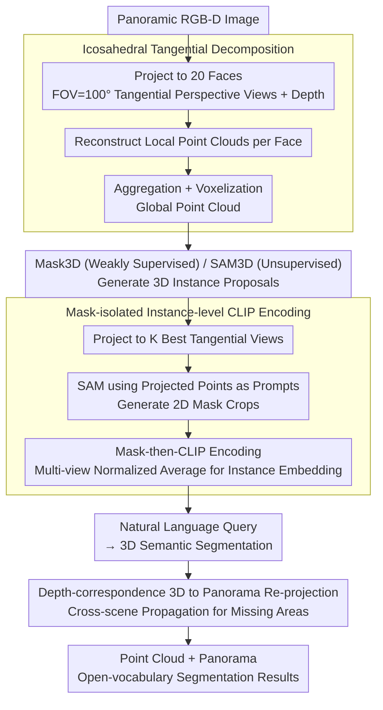

# JOPP-3D: Joint Open Vocabulary Semantic Segmentation on Point Clouds and Panoramas

**Conference**: CVPR 2026  
**arXiv**: [2603.06168](https://arxiv.org/abs/2603.06168)  
**Code**: None  
**Area**: 3D Vision  
**Keywords**: Open-vocabulary 3D segmentation, Point cloud-panorama joint segmentation, Icosahedral Tangential Decomposition, SAM+CLIP semantic alignment, 3D-Panorama re-projection

## TL;DR

JOPP-3D is proposed as the first open-vocabulary semantic segmentation framework to jointly process 3D point clouds and panoramas. By decomposing panoramas into 20 perspective views via icosahedral tangential decomposition to adapt to SAM/CLIP, the method extracts mask-isolated instance-level CLIP embeddings for 3D segmentation and re-projects them to the panoramic domain via depth correspondence. This training-free approach achieves 80.9% mIoU on S3DIS, surpassing all supervised methods.

## Background & Motivation

**Background**: 3D semantic segmentation traditionally relies on large-scale annotations and fixed category sets. Vision-language models like CLIP perform exceptionally in 2D open-vocabulary segmentation, but their direct application to panoramas (spherical distortion) and 3D point clouds (lack of pre-training) yields poor results.

**Limitations of Prior Work**:

1. Spherical distortion in panoramas prevents foundation models like CLIP/SAM, pre-trained on perspective views, from being directly applied.
2. Cubemaps (6 faces x 90°) suffer from boundary discontinuity artifacts; DAN-based adapters require supervised training.
3. Cross-modal alignment from 2D vision-language features to 3D is challenging—direct point-wise CLIP encoding introduces significant semantic noise.
4. Joint open-vocabulary semantic segmentation of panoramas and point clouds remains unexplored.

**Key Challenge**: The need to extend CLIP/SAM capabilities to both panoramas and 3D point clouds in a training-free manner, despite their distinct geometric challenges.

**Goal**: Establish a unified framework to achieve concurrent open-vocabulary semantic segmentation for point clouds and panoramas.

**Key Insight**: Project panoramas onto 20 tangential planes of an icosahedron to obtain perspective views (compatible with CLIP/SAM), reconstruct 3D point clouds from these views for instance-level semantic alignment, and finally re-project back to the panoramic domain.

**Core Idea**: Tangential decomposition - 3D instance extraction - Masked CLIP semantic alignment - Depth-correspondence panoramic re-projection.

## Method

### Overall Architecture

A three-stage training-free pipeline: (1) **Tangential Decomposition**—Each panoramic RGB-D image is projected onto 20 faces of an icosahedron, generating 20 tangential perspective views (640x480, FOV=100°) and corresponding depth maps. 3D points from all views are aggregated and voxelized into a global point cloud. (2) **3D Instance Extraction + Semantic Alignment**—3D instance proposals are generated using Mask3D (weakly supervised) or SAM3D (unsupervised). Each instance is projected onto its $K$ best tangential views. SAM generates 2D mask crops, which are encoded by CLIP. A multi-view average of these embeddings provides the instance semantic feature. (3) **Language Query + 3D-to-Panorama Re-projection**—Natural language queries yield 3D semantic segmentation, which is then re-projected back to the panoramic domain via depth correspondence.

### Key Designs

1. **Icosahedral Tangential Decomposition**
    - Projects spherical panoramas onto 20 icosahedral faces with FOV=100° (surpassing Eder et al.'s 73.1° and Cubemap’s 90°).
    - Overlapping fields of view between adjacent faces eliminate boundary discontinuity artifacts found in Cubemaps.
    - Pixel ray directions are calculated via face rotation matrices and mapped to equirectangular coordinates for bilinear RGB sampling and nearest-neighbor depth sampling.
    - Fecal length is determined by the horizontal FOV to maximize context within stable geometric limits.

2. **Mask-isolated Instance-level CLIP Encoding**
    - For each 3D instance, it is projected onto all tangential views to select the $K$ views with the most projected points.
    - SAM generates 2D instance masks and crops using the projected points as prompts.
    - **Masking before CLIP encoding**: Applying the mask to the crop before feeding it to CLIP prevents large-area categories (e.g., floor/ceiling) from contaminating instance semantics. Ablations show Open mIoU drops from 74.6% to 33.6% without masking.

3. **Depth-correspondence 3D-to-Panorama Re-projection**
    - Each pixel in the panoramic depth map is back-projected to a 3D point, which then retrieves a label from the semantic point cloud via nearest neighbor.
    - **Cross-scene depth correspondence propagation**: For depth overlaps in viewpoints (e.g., doorways/corridors), labels are propagated from neighboring panoramas to missing regions in the current panorama.
    - This resolves incomplete semantics in areas of high depth discontinuity.

### Loss & Training

JOPP-3D is a **fully training-free** inference pipeline: frozen Mask3D/SAM3D for 3D proposals, frozen SAM for 2D segmentation, frozen CLIP for semantic encoding, and natural language for open-vocabulary classification. The weakly supervised version uses Mask3D pre-trained on S3DIS Areas 1, 2, 3, 4, 6. Inference takes 4.8 min per panorama (on one RTX A6000), with a 1.7s latency for language queries.

## Key Experimental Results

### Main Results

**3D Point Cloud Semantic Segmentation**

| Dataset | Method | Supervision | mIoU(%) | mAcc(%) |
|--------|------|------|---------|---------|
| S3DIS | PointTransformerV3 | Full | 73.4 | 78.9 |
| | Concerto | Full | 77.4 | 85.0 |
| | OpenMask3D | Weak | 36.7 | 43.6 |
| | JOPP-3D(u) | Unsupervised | 59.4 | 70.1 |
| | **JOPP-3D** | **Weak** | **80.9** | **87.0** |
| ToF-360 | SFSS-MMSI | Unsupervised | 23.2 | 46.3 |
| | **JOPP-3D(u)** | **Unsupervised** | **30.9** | **47.5** |

**Panoramic Semantic Segmentation**

| Dataset | Method | mIoU(%) | Open mIoU(%) |
|--------|------|---------|-------------|
| Stanford-2D-3D-s | PanoSAMic (Full) | 61.7 | -- |
| | OPS (Weak) | 41.1 | 42.6 |
| | SAM3 (Unsupervised) | 54.2 | 62.8 |
| | **JOPP-3D** | **70.1** | **74.6** |
| ToF-360 | HoHoNet | 27.5 | -- |
| | **JOPP-3D(u)** | **30.7** | **47.4** |

### Ablation Study

| Configuration | Open mIoU(%) | Gain |
|------|-------------|------|
| Full JOPP-3D | **74.6** | -- |
| w/o SAM Mask (Direct CLIP) | 33.6 | -41.0 |
| w/o Tangential Decomp. (Direct Pano) | 41.4 | -33.2 |
| w/o Depth Correspondence | 67.0 | -7.6 |

### Key Findings

- Masked CLIP encoding is critical: improving performance from 33.6% to 74.6% (+41.0%) as unmasked features are heavily polluted by background classes.
- Tangential decomposition is indispensable: boosting performance from 41.4% to 74.6% (+33.2%) as CLIP/SAM fail on distorted spherical images.
- Depth correspondence improves results by 7.6%, with most gains in doorway/corridor regions.
- Open-vocabulary retrieval identifies fine-grained objects (clocks, posters) labeled as "clutter" in Ground Truth, demonstrating practical utility.

## Highlights & Insights

- First framework for joint point cloud and panorama open-vocabulary segmentation; training-free yet outperforms supervised methods.
- Icosahedral tangential decomposition provides better context coverage (100° FOV) and fewer artifacts than Cubemaps.
- The +41.0% gain from masked CLIP encoding highlights the significant impact of simple instance isolation.
- The concept of using 3D as a consistency "anchor" for 2D labels can be extended to video understanding or multi-view consistency tasks.

## Limitations & Future Work

- Dependency on RGB-D input limits application in RGB-only panoramic scenarios.
- The weakly supervised version depends on pre-trained Mask3D; cross-domain generalization (e.g., outdoors) is yet to be validated.
- Inference speed (4.8 min/image) remains a bottleneck for real-time applications.
- Generic labels like "clutter" in evaluation datasets penalize the fine-grained recognition capability of open-vocabulary methods.

## Related Work & Insights

- **vs OpenMask3D**: Both target open-vocabulary 3D segmentation, but JOPP-3D uses panoramic+point cloud scenes rather than perspective RGB-D sequences, achieving 80.9 vs 36.7 mIoU.
- **vs OPS**: While OPS requires training a DAN adapter for distortion, JOPP-3D’s training-free tangential decomposition is superior (70.1 vs 41.1 mIoU).
- **vs SAM3**: An RGB-only method (54.2% mIoU); JOPP-3D reaches 70.1% by introducing depth and 3D alignment.
- **Inspiration**: Tangential decomposition combined with foundation models is a robust paradigm for panoramas; mask-crops with CLIP alignment is a generalizable strategy for instance-level feature extraction.

## Rating

- Novelty: ⭐⭐⭐⭐ first joint pan-3D open-vocab framework.
- Experimental Thoroughness: ⭐⭐⭐⭐⭐ dual datasets, dual tasks, comprehensive ablations.
- Writing Quality: ⭐⭐⭐⭐ clear framework and systematic methodology.
- Value: ⭐⭐⭐⭐⭐ training-free performance exceeds supervised baselines.

<!-- RELATED:START -->

## Related Papers

- [\[CVPR 2026\] EmbodiedSplat: Online Feed-Forward Semantic 3DGS for Open-Vocabulary 3D Scene Understanding](embodiedsplat_online_feed-forward_semantic_3dgs_for_open-vocabulary_3d_scene_und.md)
- [\[CVPR 2026\] LightSplat: Fast and Memory-Efficient Open-Vocabulary 3D Scene Understanding in Five Seconds](lightsplat_fast_and_memory-efficient_open-vocabulary_3d_scene_understanding_in_f.md)
- [\[CVPR 2026\] 3D sans 3D Scans: Scalable Pre-training from Video-Generated Point Clouds](3d_sans_3d_scans_scalable_pre-training_from_video-generated_point_clouds.md)
- [\[CVPR 2026\] GaussianGrow: Geometry-aware Gaussian Growing from 3D Point Clouds with Text Guidance](gaussiangrow_geometry-aware_gaussian_growing_from_3d_point_clouds_with_text_guid.md)
- [\[CVPR 2026\] Ghosts in the Point Clouds: De-glaring LiDAR in the Transient Domain](ghosts_in_the_point_clouds_de-glaring_lidar_in_the_transient_domain.md)

<!-- RELATED:END -->
