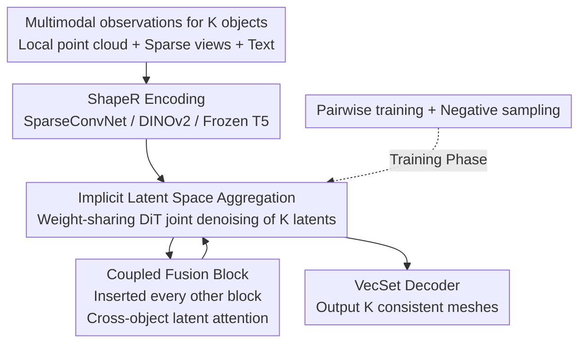

# JRM: Joint Reconstruction Model for Multiple Objects without Alignment

**Conference**: CVPR 2026  
**Paper**: [CVF Open Access](https://openaccess.thecvf.com/content/CVPR2026/html/Wu_JRM_Joint_Reconstruction_Model_for_Multiple_Objects_without_Alignment_CVPR_2026_paper.html)  
**Code**: Project Page https://qiruiw.github.io/jrm  
**Area**: 3D Vision  
**Keywords**: Object-centric reconstruction, Flow-matching generation, Repeated objects, Implicit aggregation, Articulated objects  

## TL;DR
JRM reformulates the reconstruction problem of "the same object being repeatedly observed in a scene" as **personalized generation**. By using a 3D flow-matching model to implicitly aggregate multiple unaligned observations in the latent space, it jointly reconstructs a group of objects without explicit matching or rigid registration. This approach is more robust to association errors and articulated deformations, outperforming independent reconstruction and alignment-based baselines.

## Background & Motivation
**Background**: Object-centric 3D reconstruction represents a scene as a set of complete individual objects, naturally supporting object-level editing and interaction. Recent 3D generative models (e.g., ShapeR) can reconstruct high-fidelity single objects from clean single or sparse views.

**Limitations of Prior Work**: In real-world scenes, objects rarely appear in isolation, and independent reconstruction discards significant contextual cues. The authors focus on two types of wasted strong signals: **spatial repetition** (identical chairs surrounding a dining table, each partially occluded) and **temporal repetition** (the same object repeatedly seen across multiple sparse scans, even if moved or deformed). Integrating these repeated observations could potentially complete the occluded parts of each instance.

**Key Challenge**: Existing integration methods (e.g., LivingScenes / MORE², Splat-and-Replace) follow an "explicit matching $\rightarrow$ rigid alignment $\rightarrow$ registration $\rightarrow$ reconstruction" pipeline. Errors at each step accumulate; more critically, the rigid alignment assumption fails for **sub-object level changes** (e.g., a drawer being opened between scans), causing articulated object reconstruction to fail.

**Goal**: To allow observations of a set of related objects to complement each other without explicit alignment, while remaining tolerant to matching errors and scalable to non-rigid deformations.

**Key Insight**: The authors draw inspiration from personalized image generation (e.g., JeDi), where multiple images share a single "subject" that must be generated consistently. Analogously, the target object is the "subject" shared across multiple observations; it should be reconstructed consistently across all observations while respecting its specific pose and state.

**Core Idea**: Utilize a flow-matching 3D generative model to **implicitly aggregate unaligned observations in its high-dimensional latent space**, allowing the data-driven model to learn how to aggregate across instances rather than relying on handcrafted hard constraints.

## Method

### Overall Architecture
JRM uses the single-object generative model ShapeR as its backbone. ShapeR first trains a VecSet-based VAE to encode a 3D mesh $S$ into $n$ latent tokens $z\in\mathbb{R}^{n\times L}$ of dimension $L$. A decoder $D$ restores the mesh by predicting the signed distance $s=D(z,x)$ of query points. Then, a denoising DiT is trained using rectified flow-matching to transport samples from a standard normal distribution $z_1\sim\mathcal N(0,I)$ to the training shape manifold $z_0$. The denoising process takes multimodal observation conditions $C$ as input: segmented local point clouds, sparse views, and VLM-generated text descriptions, encoded by SparseConvNet, frozen DINOv2, and pre-trained T5, respectively.

JRM expands this from "single object" to "joint multi-object" in two ways: ① Using a **weight-sharing DiT** to simultaneously denoise a set of $K$ object latents $Z=\{z_k\}_1^K$; ② Inserting **Coupled Fusion Blocks** inside the DiT to allow shape latents of different objects to attend to each other, achieving implicit aggregation. The model is trained using **pairwise training + negative sampling**, enabling it to generalize to an arbitrary number of objects at inference time despite being trained only on pairs. The entire process moves "alignment" from the observation space into the latent space.

### Key Designs

**1. Implicit Latent Space Aggregation: Moving "Alignment" from Observation to Latent Space**  
The target is to avoid the error accumulation of explicit pipelines (matching $\rightarrow$ alignment $\rightarrow$ registration) and the failure on articulated objects. JRM does not align multiple observations in the input space; instead, it uses a **weight-sharing DiT** to denoise the latent tokens of a group of objects simultaneously—each object $z_k$ and its own condition $C_k$ pass through the same network. Aggregation occurs in the high-dimensional denoising latent space, where "how to fuse cross-instance information" is entirely learned from data without explicit hard constraints. This provides robustness: when the source and target are only "similar" or even "mismatched," explicit alignment baselines are contaminated by incorrect associations, whereas JRM adaptively decides how much information to borrow, exhibiting significantly better robustness.

**2. Coupled Fusion Block: Allowing Cross-Object Latent Attention**  
This is the mechanism for implicit aggregation. The original DiT consists of single-stream blocks. JRM replaces **every other** single-stream block with a coupled fusion block. In this block, latent tokens for all objects are concatenated $z_O=\oplus\{z_k\}_1^K$ and processed by a single-stream block, allowing all objects to attend to each other before being split back. A key design choice: **standard single-stream blocks process both latents and their respective observation tokens, while coupled attention only acts between shape latents of the objects**. The motivation is that the generated "subject" (shape latent) should be consistent within the group, while each instance must respect its own observation; thus, latents are coupled while observation conditions remain isolated.

**3. Pairwise Training and Negative Sampling: Generalizing to Arbitrary Numbers from Pairs**  
Strict object-level methods often require large-scale datasets of single isolated objects, while full scene or multi-scan datasets are scarce. JRM bypasses this by training on **pairs of independently observed objects**. Thanks to the attention-based coupling strategy, it scales to any number of objects during inference. Training pairs can be similar or different—DuoDuoCLIP is used to extract shape embeddings from 12 random views to calculate cosine similarity; $>0.9$ is considered a positive pair (similar), otherwise a negative pair. During training, negative pairs are sampled with a $0.1$ probability to force the model to learn "adaptive judgment of whether to borrow information." Each object follows the standard flow-matching objective, predicting the velocity field $v_t^k=\mathrm dz_t^k/\mathrm dt$ with a conditional optimal transport path $z_t^k=(1-t)z_0^k+t\varepsilon^k$ and $v_t^k=z_0^k-\varepsilon^k$. The loss is:

$$\mathcal L(\theta)=\mathbb E_{z^k,C^k,\varepsilon^k}\Big[\textstyle\sum_{k=1}^{2}\|v_t^k-v_\theta(z_t^k,t,C^k)\|^2\Big].$$

Ablations show that a ratio of 0 (similar pairs only) makes the model hypersensitive to matching errors, while 1 (negative pairs only) leads the model to ignore support objects; $0.1$ achieves the best balance.

### Loss & Training
The foundation FM backbone is pre-trained on 400,000 high-quality 3D objects from ObjaverseXL, Amazon Berkeley Objects, and Wayfair. A subset of 80,000 is used for the pairwise training. The loss is the flow-matching MSE, with weight-sharing across pairs.

## Key Experimental Results

### Metrics
- **CD (Chamfer Distance, cm)**: Bidirectional nearest point distance; lower is better.
- **NC (Normal Consistency)**: Higher is better.
- **F1 / F-Score**: Completeness under a distance threshold; higher is better.
- Gray numbers in tables represent the "ideal upper bound" for FM baselines given **oracle alignment**.

### Main Results: Temporal Repetition (with ground truth matching)
| Method | Modality | Target-only CD↓ | 1 Recap CD↓ | 3 Recaps CD↓ |
|------|------|------|------|------|
| MORE² | Point Cloud | 10.43 | 9.89 | 10.04 |
| FM (PC) | Point Cloud | 3.07 | 3.71 | 4.43 |
| **JRM** (PC) | Point Cloud | 3.46 | **2.95** | **3.07** |
| FM (Full) | PC/Img/Txt | 3.12 | 3.50 | 3.62 |
| **JRM** (Full) | PC/Img/Txt | 2.84 | **2.55** | **2.49** |

Key Finding: **FM performance degrades as scans increase** (CD 3.07$\rightarrow$4.43) due to sensitivity to alignment errors; **JRM improves steadily with more context** (3.46$\rightarrow$3.07, and 2.84$\rightarrow$2.49 for full modality).

### Spatial Repetition (Different source object types)
| Method | Identical CD↓ | Similar CD↓ | Negative CD↓ |
|------|------|------|------|
| FM | 2.77 | 4.78 | 8.83 |
| **JRM** | **2.49** | **2.72** | **3.04** |

When source objects change from "identical" to "negative," FM's CD jumps from 2.77 to 8.83 (contaminated by unmatched information), whereas JRM remains stable at 3.04.

### Articulated Object Reconstruction
| Method | State0 CD↓ | State1 CD↓ | State2 CD↓ |
|------|------|------|------|
| FM-align (Rigid) | 5.83 | 5.37 | 5.49 |
| FM-ind. (Indep.) | 4.92 | 5.44 | 4.92 |
| **JRM** | **4.69** | **3.66** | **3.66** |

Rigidly aligned FM-align performs worst, confirming that rigid alignment cannot transfer across deformations. JRM jointly reconstructs three states with significant leads in CD and F1.

### Real-World Scenes
| Method | Replica CD↓ / F1↑ | ScanNet++ CD↓ / F1↑ |
|------|------|------|
| DPRecon | 4.65 / 71.95 | 5.53 / 65.98 |
| FM | 3.74 / 79.21 | 4.20 / 72.96 |
| **JRM** | **3.21 / 81.78** | **2.69 / 85.53** |

JRM generalizes to real-world captures despite being trained only on synthetic pairs.

### Ablation Study: Negative Sampling Ratio
| Negative Ratio | Identical F1↑ | Similar F1↑ | Negative F1↑ |
|------|------|------|------|
| 0.0 | 88.30 | 83.52 | 72.42 |
| **0.1** | **91.15** | **88.34** | **88.69** |
| 0.5 | 86.97 | 86.39 | 86.52 |
| 1.0 | 88.07 | 87.92 | 88.63 |

A ratio of 0.1 provides the best compromise between aggregation capability and mismatch resistance.

### Key Findings
- **Implicit vs. Explicit** is the primary theme: JRM's stability compared to FM's failure demonstrates the benefit of moving alignment to the latent space.
- **Harder Scenarios, Greater Gains**: JRM's advantage over FM increases as source objects become more mismatched, scan counts grow, or deformations occur.
- **Scalability**: Training on pairs generalizes to arbitrary numbers of objects and real scenes.

## Highlights & Insights
- **Problem Reformulation**: Framing "repeated object reconstruction" as "shared subjects in personalized generation" replaces the fragile explicit alignment pipeline.
- **Latent-only Coupling**: Coupled attention only acts on shape latents, isolating observation conditions. This maintains instance independence while sharing "subject consistency."
- **Efficiency**: Pairwise training allows the model to utilize vast single-object assets to solve multi-object problems.

## Limitations & Future Work
- **Upstream Dependence**: Reconstruction quality is inherited from input camera poses, depth/point clouds, and instance segmentation.
- **Limited Cues**: Only tested for repeated observations; JRM could potentially utilize other scene cues like spatial support or intersection.
- **Group Constraints**: While scalable, large groups currently require splitting (inference uses up to 9 objects per group).
- Sensitivity to hyperparameters like the negative sampling ratio.

## Related Work & Insights
- **vs. LivingScenes / MORE²**: These use multi-stage explicit pipelines sensitive to alignment errors and unable to handle articulated deformation; JRM is implicit and deformation-tolerant.
- **vs. Splat-and-Replace**: Uses rigid transforms to realign repeated objects in 3DGS; JRM avoids observation-space alignment entirely.
- **vs. MIDI-3D / SceneGen**: These improve spatial layout through multi-instance attention but require full scene training; JRM scales via single-object assets.
- **vs. DPRecon**: Per-scene optimization using SDS loss is noisy and slow; JRM is feed-forward and more accurate.

## Rating
- Novelty: ⭐⭐⭐⭐⭐ 
- Experimental Thoroughness: ⭐⭐⭐⭐ 
- Writing Quality: ⭐⭐⭐⭐ 
- Value: ⭐⭐⭐⭐ 

<!-- RELATED:START -->

## Related Papers

- [\[CVPR 2026\] GeoFree-CoSeg: Unsupervised Point Cloud-Image Cross-Modal Co-Segmentation Without Geometric Alignment](geofree-coseg_unsupervised_point_cloud-image_cross-modal_co-segmentation_without.md)
- [\[CVPR 2026\] iLRM: An Iterative Large 3D Reconstruction Model](ilrm_an_iterative_large_3d_reconstruction_model.md)
- [\[CVPR 2026\] LASER: Layer-wise Scale Alignment for Training-Free Streaming 4D Reconstruction](laser_layer-wise_scale_alignment_for_training-free_streaming_4d_reconstruction.md)
- [\[CVPR 2026\] Inferring Compositional 4D Scenes without Ever Seeing One](inferring_compositional_4d_scenes_without_ever_seeing_one.md)
- [\[CVPR 2026\] GenMatter: Perceiving Physical Objects with Generative Matter Models](genmatter_perceiving_physical_objects_with_generative_matter_models.md)

<!-- RELATED:END -->
