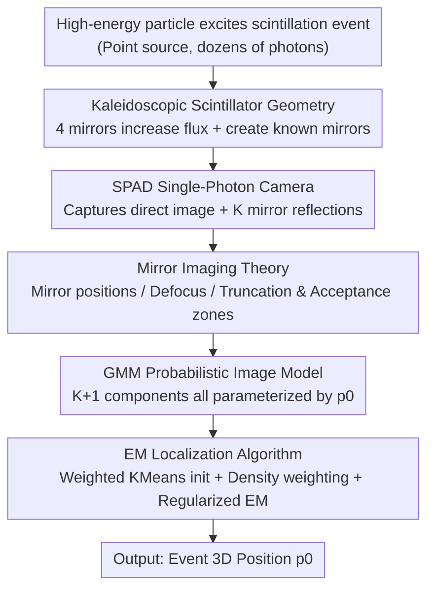

# Kaleidoscopic Scintillation Event Imaging

**Conference**: CVPR 2026  
**Paper**: [CVF Open Access](https://openaccess.thecvf.com/content/CVPR2026/html/Bocchieri_Kaleidoscopic_Scintillation_Event_Imaging_CVPR_2026_paper.html)  
**Code**: [Project Page](https://bocchs.github.io/kaleidoscopic_scintillator)  
**Area**: 3D Vision / Computational Imaging  
**Keywords**: Scintillators, Single-photon camera, Kaleidoscope imaging, 3D localization, Gaussian Mixture Model

## TL;DR
This work reformulates radiation detection as a computer vision problem: using a "kaleidoscope-shaped" (four-sided mirrored pyramid) scintillator, a single scintillation event is captured as a "direct image + multiple mirrored reflections" on a single-photon camera. A Gaussian Mixture Model (GMM), where all components are parameterized by the event's 3D coordinates $p_0$, is solved via an EM algorithm. In extreme photon-starved conditions (dozens of photons per event), this approach reduces 3D localization error from approximately 0.8 mm to about 0.14 mm.

## Background & Motivation
**Background**: High-energy particle detection (e.g., $\gamma$-rays) relies on scintillators—transparent crystals that emit visible light when excited by ionizing radiation. To measure the position, time, and energy of a "scintillation event" excited by a single particle, conventional methods use either single-pixel fast detectors (fast but lacking spatial resolution) or standard cameras (spatial resolution but limited to averaging over many events, unable to resolve single events). Emerging Single-Photon Avalanche Diode (SPAD) cameras provide both speed and spatial resolution, making it possible to capture an image of a single scintillation event and analyze it via machine vision.

**Limitations of Prior Work**: A single event is extremely dim—each event emits a limited number of photons, and SPADs suffer from dark count noise. Existing single-camera 3D localization solutions rely on "depth from defocus + perspective projection" to estimate depth, but such designs have low light collection efficiency, are sensitive to dark counts, and offer weak depth encoding. Furthermore, detection prefers large, thick scintillators (higher interaction probability), but increasing volume makes 3D localization of single events harder.

**Key Challenge**: In photon-starved environments, increasing exposure time does not increase the photon count of a "single event" but instead lowers the signal-to-noise ratio. The only solution is to geometrically maximize light flux—yet conventional methods for increasing light collection often destroy the spatial information of the event (blending multiple views). How to simultaneously maximize light collection while preserving spatial/depth cues is the core tension.

**Goal**: To design a geometry that allows a single-photon camera to collect more photons while preserving spatial information, and to provide a probabilistic model and algorithm to estimate the 3D position of events under extremely low photon counts.

**Key Insight**: The authors noted that "kaleidoscope/light trap" geometries (planar mirrors arranged in a pyramid) are used in traditional imaging to obtain multi-view images of extended objects from a single frame, but they have never been used for "reconstructing a point source under photon starvation." Mirrors generate reflected images at known positions—equivalent to providing multiple views of the same event for free and encoding depth information into the geometric relationship between images.

**Core Idea**: Rewriting the radiation detection problem as a computer vision problem—using a kaleidoscopic scintillator to transform a single event into a multi-view image of "direct + multiple mirrors," building a GMM constrained by the event's 3D coordinates, and solving for the 3D position via EM for maximum likelihood.

## Method

### Overall Architecture
The system input is an extremely sparse single-photon image captured by a SPAD camera (one real scintillation event + several mirrored reflections + small amount of dark counts), and the output is the 3D coordinates $p_0=(x_0,y_0,z_{w0})$ of the event within the scintillator. The pipeline consists of four steps: ① **Kaleidoscopic Scintillator Geometry** uses four mirrors to reflect event light into the camera multiple times, increasing light flux and creating mirrors at known positions; ② **Mirror Imaging Theory** provides the sensor position, circle of confusion (defocus), and the "truncation/acceptance zones" formed by the edges of adjacent mirrors; ③ **GMM Probabilistic Image Model** builds a $K{+}1$ component mixture for the "event + K mirrors," where the mean/variance of every component are constrained by the same $p_0$; ④ **EM Localization Algorithm** initializes via weighted KMeans (determining the number and orientation of mirrors) followed by EM iterations with density weighting and regularization to solve for $p_0$.

### Key Designs

**1. Kaleidoscopic Scintillator Geometry: Multi-view from a Single Event via Mirrors**

To address the challenge of increasing light collection while preserving spatial information, the authors designed the scintillator as a **regular four-sided pyramid (frustum)**, where the four side faces are mirrored. A scintillation event is approximated as an isotropically emitting point source. Light enters the camera directly and via reflections from the four mirrors, appearing as a "direct image" plus several "mirrored images." The geometry is strictly known: for a real position $p_0$, the $k$-th mirror generates a mirrored position $p_k=T_k p_0$, where the mirror transform $T_k=I_{3\times3}-2 n_k n_k^{\top}$ ($n_k$ is the mirror normal). These reflections provide **multiple views** of the same event, encoding depth into the relative geometry, making the system more robust to dark counts and low photon counts. Compared to non-kaleidoscopic designs relying on a single defocus depth, multi-view imaging significantly improves depth observability.

**2. Mirror Imaging Theory and Truncation Zones: Modeling Acceptance**

Since mirrors have finite sizes, when $p_k$ is viewed from the camera as being behind another mirror's edge, the image is truncated. The authors define **truncation zones** on the sensor where photons from a mirror cannot arrive, and the complement as **acceptance zones**. Mirror $k$ essentially acts as an **aperture** for point source $p_k$. The theory further defines "reflection order"; light from multiple reflections (e.g., $p_l=T_l p_k$) is truncated by each mirror edge along the path. Ray-tracing and thin-lens simulations verify that the theoretically derived acceptance zones align with photon distributions. This theory dictates whether a GMM component exists and where its photons should land.

**3. GMM Probabilistic Image Model: Unified Constraints on $p_0$**

To fuse multi-view information under sparse (dozens of photons) and noisy conditions, the camera Point Spread Function (PSF) is modeled as an isotropic 2D Gaussian $N(t;\mu,\sigma^2)$ with covariance $\Sigma=\sigma^2 I$. The images of the event and its mirrors are Gaussians centered at $\mu_k$ with standard deviation $\sigma_k$, where $\mu_k=\big[\tfrac{S_2}{z^{(a)}_{ck}}x_k,\ \tfrac{S_2}{z^{(a)}_{ck}}y_k\big]$ comes from perspective projection and $\sigma_k$ is proportional to the circle of confusion (CoC) diameter. The entire image is modeled as a $K{+}1$ component **Gaussian Mixture Model**. Crucially, since $p_k=T_k p_0$, **the $\mu_k, \sigma_k$ of all components are constrained by the same $p_0$**, turning the multi-view problem into a global maximum likelihood estimation:

$$\arg\max_{x_0,y_0,z_{w0},\pi}\ Q-\lambda\sum_{k=0}^{K}\lVert \mu_k-\mu_k'\rVert_2^2$$

where $Q$ is the expected complete-data log-likelihood, $r_{ik}$ is the posterior responsibility, $\mu_k'$ are initialization anchors, and $\lambda$ is the regularization coefficient.

**4. EM Localization Algorithm: Initialization, Weighting, and Regularization**

To handle the non-convex GMM, sparsity, and dark counts, the authors employ: (a) **Density Weighting** $w_i=\sum_{j\in S^q_i}\exp(-\lVert t_i-t_j\rVert_2^2/\nu)$, assigning low weights to sparse dark counts and high weights to dense photon clusters; (b) **Initialization**: Weighted KMeans on $C\in\{3,4,5\}$ clusters is used to find centroids, then mirror orientations are assigned based on relative positions (using alignment checks along x/y). Candidate event positions are sampled along depth, selecting the best fit; (c) **Regularization** $\lambda\sum_k\lVert\mu_k-\mu_k'\rVert_2^2$ pulls component means toward their anchors, preventing the algorithm from merging mirror clusters or drifting to empty regions.

### Loss & Training
This is a computational imaging and probabilistic inference task without network training. The optimization objective is the regularized maximum likelihood of the GMM solved via EM. Experimentally, $\lambda=10$; $\sigma_k$ is clipped to a minimum of 10 pixels to handle non-ideal point sources and focus errors.

## Key Experimental Results

### Main Results (3D Localization Accuracy, mm)
Tested on 463 valid event positions with hardware-matched geometry, comparing against three algorithms at brightness levels $N_0\in\{10,20,30\}$ (mean Poisson photons per component). Metrics include 3D error (Euclidean distance) and spatial resolution (FWHM defined as $2.355\sigma_e$).

| Brightness $N_0$ | Algorithm | 3D Error | x Res | y Res | z Res |
|---|---|---|---|---|---|
| 30 | Kaleidoscope (Ours) | **0.14** | 0.16 | 0.14 | 0.14 |
| 30 | Non-Kaleid (Ours) | 0.83 | 1.36 | 1.41 | 1.32 |
| 30 | Denoising [8] | 0.64 | 1.04 | 1.02 | 1.04 |
| 20 | Kaleidoscope (Ours) | **0.16** | 0.15 | 0.17 | 0.16 |
| 20 | Non-Kaleid (Ours) | 0.79 | 1.17 | 1.24 | 1.21 |
| 20 | Denoising [8] | 0.68 | 1.05 | 1.03 | 1.06 |
| 10 | Kaleidoscope (Ours) | **0.29** | 0.27 | 0.31 | 0.27 |
| 10 | Non-Kaleid (Ours) | 0.95 | 1.36 | 1.33 | 1.28 |
| 10 | Denoising [8] | 0.80 | 1.20 | 1.13 | 1.14 |

**Key Findings**: The kaleidoscopic design achieves 3D errors **an order of magnitude lower** than non-kaleidoscopic or prior denoising methods across all brightness levels ($N_0{=}30$: 0.14 vs 0.83 vs 0.64 mm). The advantage holds even at $N_0{=}10$, proving the robustness of mirror-based multi-view imaging.

### Cross-Validation (Real Hardware, No Ground Truth)
Since real event positions are uncontrolled, the authors use "consistency of position estimation after removing mirrors" for validation. For a frame with an event + four mirrors, 1 or 2 mirrors are removed (11 combinations). Consistency is measured by the distance between each sub-estimate and the mean.

| Metric | Value | Description |
|---|---|---|
| Test Frames | 1,606 | With 4 mirrors and $\ge 60$ counts |
| Distance Median/Mean/SD | 0.10 / 0.17 / 0.22 mm | Good consistency |
| Removed Photon Ratio (1 mirror) | 0.19 / 0.18 / 0.07 | Expected $\approx 1/5$ |
| Removed Photon Ratio (2 mirrors) | 0.38 / 0.37 / 0.08 | Expected $\approx 2/5$ |

The ratios of removed photons align with expectations (1/5 and 2/5), suggesting mirrors are correctly identified and isolated.

## Highlights & Insights
- **Radiation Detection as Computer Vision**: The "Aha!" moment is using kaleidoscope geometry to turn "single point source + photon starvation" into "multi-view + known geometric constraints," using GMM/EM to resolve 3D—physical and algorithmic designs complement each other.
- **Geometry as Regularization**: Mirror positions are strictly determined by $T_k$. Constraining all GMM components to $p_0$ embeds a strong structural prior into the likelihood, which is key to precision under low light.
- **Density Weighting + Anchor Regularization**: These anti-sparsity/noise techniques are valuable for any photon-level sparse EM fitting problems (e.g., single-photon LiDAR, fluorescence localization).

## Limitations & Future Work
- **First-order Reflection Only**: The algorithm assumes $\ge 2$ mirrors and only first-order reflections; events near視场 edges with fewer mirrors are discarded.
- **Missing Ground Truth**: Real events cannot be generated at controlled locations. Quantitave accuracy relies on simulation after hardware calibration.
- **Apex Angle Trade-off**: The 120° angle suppresses complex second-order reflections but limits mirror count and geometric diversity.
- **Dark Count Complexity**: Measured dark counts were higher than baseline; possible sources like crosstalk or fluorescence were listed but not definitively concluded.

## Related Work & Insights
- **vs. Denoising method [8]**: [8] estimates depth via DDF on single-view images, which is less observable and more noise-sensitive. This work reduces error by 10x using multi-view coding.
- **vs. Stereo Scintillators [11]**: [11] uses two objectives to project two views. This work uses a single commercial CMOS SPAD with mirrors to provide more views more efficiently.
- **vs. Kaleidoscope Reconstruction [29, 35]**: Traditional methods reconstruct extended objects under sufficient light; this work is the first to apply it to single point source reconstruction under photon starvation.

## Rating
- Novelty: ⭐⭐⭐⭐⭐ 
- Experimental Thoroughness: ⭐⭐⭐⭐ 
- Writing Quality: ⭐⭐⭐⭐ 
- Value: ⭐⭐⭐⭐

<!-- RELATED:START -->

<!-- RELATED:END -->

## Related Papers

- [\[CVPR 2026\] Unsupervised 3D Motion Estimation Using Event Camera](unsupervised_3d_motion_estimation_using_event_camera.md)
- [\[CVPR 2026\] Geometric-Photometric Event-based 3D Gaussian Ray Tracing](geometric-photometric_event-based_3d_gaussian_ray_tracing.md)
- [\[CVPR 2026\] From Corners to Fiducial Tags: Revisiting Checkerboard Calibration for Event Cameras](from_corners_to_fiducial_tags_revisiting_checkerboard_calibration_for_event_came.md)
- [\[CVPR 2026\] Bidirectional Cross-Modal Prompting for Event-Frame Asymmetric Stereo](bidirectional_cross-modal_prompting_for_event-frame_asymmetric_stereo.md)
- [\[CVPR 2026\] AIMDepth: Asymmetric Image-Event Mamba for Monocular Depth Estimation](aimdepth_asymmetric_image-event_mamba_for_monocular_depth_estimation.md)

<!-- RELATED:END -->
