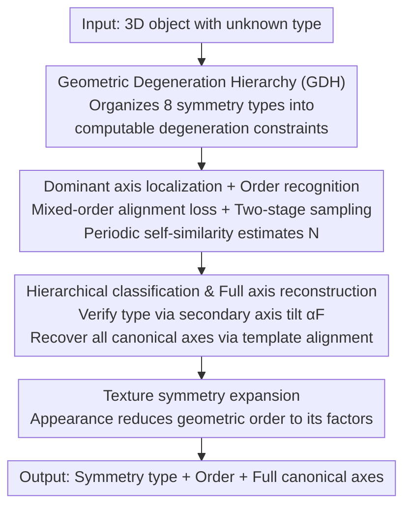

# KASALv2: Fully Automatic 3D Rotational Symmetry Classification and Axis Localization

**Conference**: CVPR 2026  
**Paper**: [CVF Open Access](https://openaccess.thecvf.com/content/CVPR2026/html/Zhang_KASALv2_Fully_Automatic_3D_Rotational_Symmetry_Classification_and_Axis_Localization_CVPR_2026_paper.html)  
**Code**: https://github.com/WangYuLin-SEU/KASAL  
**Area**: 3D Vision  
**Keywords**: Rotational Symmetry, 6D Pose Estimation, Axis Localization, Geometric Prior, Reference-free Analysis

## TL;DR
KASALv2 proposes a fully automatic framework that identifies rotational symmetry types, rotation orders, and all canonical axes of 3D objects at once without any reference geometry. It covers all 8 canonical rotational symmetry types, achieving 94.75% accuracy on 438 symmetric objects from GSO. Feeding the estimated symmetry priors into FoundationPose training improves pose estimation accuracy by up to 0.9% across 5 BOP datasets.

## Background & Motivation

**Background**: Rotational symmetry is a crucial geometric prior in 6D pose estimation—it resolves pose ambiguity, stabilizes optimization, and supports "symmetry-aware" evaluation metrics such as ADD-S, MSSD, and MSPD. Recent systems like HccePose(BF) and ZebraPose use symmetry priors to map canonical poses to their nearest equivalent representation to improve precision.

**Limitations of Prior Work**: Obtaining symmetry annotations currently relies almost entirely on manual or semi-automatic methods, which often **require pre-specifying the symmetry type or order**. Manual annotation is impractical for datasets with tens of thousands of 3D models (e.g., large-scale synthetic training for unseen objects, mesh generation, or 3D asset processing). Existing automatic methods either cover only partial symmetry types or depend on geometric references like centroids/keypoints, making them sensitive to noise and occlusion. Wang et al., although closest to full coverage, still requires manual specification of type and order.

**Key Challenge**: 3D rotational symmetry structures are highly diverse—corresponding to orientation-preserving subgroups of SO(3), including continuous types $C_\infty/D_\infty$, finite cyclic groups $C_n$, dihedral groups $D_n$, and rotational groups of Platonic solids $A_4/S_4/A_5$, totaling 8 canonical types. Each has different axis counts, orders, and inter-axis relations. Achieving "fully automatic + full coverage" necessitates a unified framework that jointly reasons about type and axis structure rather than applying per-type rules.

**Goal**: Upgrade the task from "locating axes given a type" to "automatically determining symmetry type + rotation order + all canonical axes without types or references."

**Key Insight**: The authors observe that high-order symmetry axes naturally satisfy the periodicity of low-order rotations. Consequently, they form deeper "descent basins" in alignment loss—optimization is automatically attracted toward dominant high-order axes without needing a prior order.

**Core Idea**: Organize the 8 symmetry types into a top-down "Geometric Degeneration Hierarchy" (GDH). First, lock dominant high-order axes and estimate orders in a reference-free manner using self-consistency. Then, use inter-axis tilt angles constrained by the GDH to verify the type and reconstruct all canonical axes. Finally, handle order degeneration caused by appearance through texture expansion.

## Method

### Overall Architecture
The input is a 3D object (point cloud/mesh) with an unknown symmetry type, and the output is its symmetry type, rotation order, and a full set of canonical axes. The "theoretical foundation" is the Geometric Degeneration Hierarchy (GDH): it reorganizes all SO(3) rotational subgroups into a computable hierarchical tree based on how the "number of axes/order decreases with geometric degeneration," providing constraints on feasible types and inter-axis tilts. Guided by GDH, the system follows: dominant high-order axis localization → order estimation → candidate type narrowing and verification via secondary axis tilt → full canonical axis reconstruction → texture symmetry expansion. The entire pipeline is reference-free and requires no human input.

### Key Designs

**1. Geometric Degeneration Hierarchy (GDH): Turning 8 symmetry types into a computable tree**

Existing "all-type" methods require manual type specification because they lack a structured prior for unified reasoning. GDH reorganizes SO(3) orientation-preserving subgroups into a hierarchy: the top is the isotropic sphere (any direction is an axis), branching into two degeneration lineages—**Dihedral-Cyclic** and **Platonic**. The Dihedral-Cyclic lineage starts from cylindrical $D_\infty$ and degenerates via two paths: discretization of continuous rotation ($D_\infty\Rightarrow D_n, C_\infty\Rightarrow C_n$ for $n\ge2$) and loss of orthogonal 2-fold axes ($D_\infty\Rightarrow C_\infty, D_n\Rightarrow C_n$). The Platonic lineage describes discrete degeneration of multi-high-order axis structures ($A_5\Rightarrow A_4, S_4\Rightarrow A_4$). The key to GDH is that it encodes "how axis counts, orders, and inter-axis relations evolve with degeneration" into **computable constraints**. Locating a dominant axis narrows sub-classes; estimated orders further compress the candidate set; finally, verifying a secondary axis satisfying the required tilt locks the type.

**2. Dominant high-order axis localization + Order recognition: "Automatically sucking out" high-order axes via periodic self-consistency**

Locating axes without reference is difficult because alignment error cannot be defined without knowing the order. The authors use a **mixed-order alignment loss** to aggregate alignment errors across multiple candidate orders: $L_\text{mix}(a)=\sum_{n\in N}L_n(a)$, where $L_n(a)=\sum_{k=1}^{n-1}\text{Chamfer}(P,\,R(a,\theta_k)P)$ and $\theta_k=2\pi k/n$. Since high-order axes satisfy low-order periodicity, they yield lower aggregated loss and form deeper basins, naturally biasing optimization toward dominant high-order directions (candidate set $N=\{3,4,5,6\}$). Localization is two-stage: coarse uniform sampling on the upper hemisphere (128 directions) to find top-$k_\text{cand}$ low-loss regions, followed by fine sampling within a $10^\circ$ spherical cap and Adam optimization (lr=0.04, 5 steps). After locking the dominant axis $a^*$, a rotation self-similarity signal is generated by calculating Chamfer distances over dense rotations (typically 360 angles). The main frequency gives a coarse estimate $N_\text{fft}$, and $N_\text{est}$ is selected from $\{N_\text{fft}, N_\text{fft}\pm1\}$ based on minimum reconstruction error. Ambiguous cases are verified hierarchically ($N_\text{est}\ge3$ is discrete rotational; $=2$ uses a $180^\circ$ test to distinguish 2-fold from reflection; $\le1$ uses a $45^\circ$ test to distinguish continuous from asymmetric).

**3. Hierarchical type classification and full axis reconstruction: Finalizing via tilt angle $\alpha_F$ and template alignment**

With the main axis and order, GDH narrows the hypothesis space to subsets compatible with $N_\text{est}$. Remaining ambiguity lies in the orientation of secondary axes relative to the main axis. Each candidate type in GDH specifies a characteristic inter-axis tilt $\alpha_F$ (invariant to pose and scale). A secondary axis is searched along a circular trajectory centered at $a^*$ with radius $\alpha_F$: $b^*=\arg\min_{b\in S(\alpha_F)}L_\text{Chamfer}(b;N)$, followed by 1D gradient refinement of top-k seeds. The type is determined by the order pair $(N_{a^*},N_{b^*})$ and the measured tilt: continuous $C_\infty/D_\infty$ checks for discrete periodicity or orthogonal 2-fold axes; discrete $C_n/D_n$ checks for orthogonal 2-fold axes; Platonic types are identified by comparing measured tilts to theoretical constants: $70.53^\circ$ ($A_4$), $90^\circ$ ($S_4$), and $63.43^\circ$ ($A_5$). Once the type is fixed, GDH provides a canonical axis template. A rigid transformation $Q$ is estimated to align the template pair $(\hat a,\hat b)$ to the detected pair $(a^*,b^*)$, and full axes are recovered as $u_i^\text{final}=Q\,\hat u_i$.

**4. Texture symmetry expansion: Modeling appearance as second-order geometric degeneration**

Real object geometry is rarely perfectly regular, and surface texture/color can break rotational invariance in the image domain. The authors treat texture as **secondary order degeneration** superimposed on geometric symmetry: it only changes the effective order of axes, not their orientation, and the effective order must be a factor of the geometric order—$n_\text{tex}\in\{d\mid d\text{ divides }n_\text{geo}\}\cup\{1\}$. Thus, a 6-fold geometric object might appear 3-fold or 2-fold under periodic texturing. Given the recovered geometric type and axis configuration, texture refinement is calculated by analytically evaluating appearance consistency around each axis.

### Loss & Training
The method is **training-free geometric optimization**: all alignment losses are based on Chamfer distance, with Adam used for few-step refinement (main axis lr=0.04, 5 steps; secondary axis lr=0.05, 5 steps). The sampling budget is driven by a single parameter, the spherical cap radius $r$. The coarse sampling lower bound is derived from the area ratio $N_\text{min}=\frac{2}{1-\cos r}$ (limited to the upper hemisphere, rounded to multiples of 8). The experiments ran on i5-13400F + RTX 3050 + 32GB, taking ~1.3–1.8s per object. The only "training" involved is downstream: FoundationPose is trained on ~1M rendered images using KASALv2-generated priors injected via ZebraPose-style symmetry-aware normalization.

## Key Experimental Results

### Main Results
Evaluation across DSRSTO, BOP, and GSO datasets using type accuracy $acc_t$, order accuracy $acc_o$, total accuracy $acc_T$, normalized axis alignment error $e_{ADI}/d$ ($d$ is object diameter), and runtime.

| Dataset | Scale | $acc_T$ | $e_{ADI}/d$ (Ours / Wang et al.) | Time (s) |
| :--- | :--- | :--- | :--- | :--- |
| GSO (438 symmetric) | 438 of 944 scans | **94.75%** | 0.00262 / 0.00256 | 1.37 |
| BOP (50 re-annotated) | Real-world objects | **84.00%** (80.00% orig) | 0.00256 / 0.00290 | 1.61 |
| DSRSTO | 38 CAD, all types | 81.48% | 0.00212 / 0.00172 | 1.46 |
| DSRSTO$_\text{tex}$ (texture) | 11 texture models | 72.32% | 0.00195 / 0.00181 | 1.16 |

On GSO, $acc_t$ reached 96.58% and $acc_o$ 98.10%. Following BOP re-annotation, $e_{ADI}/d$ dropped from 0.00290 to 0.00256, indicating localization precision superior to Wang et al. $C_n$ remains the lowest accuracy category (e.g., 83.53% on GSO).

### Ablation Study
Investigation of the candidate order set $N$ on DSRSTO (optimal $r=10^\circ$ gives $acc_T=81.48\%$):

| Order Set $N$ | $acc_T$ | $e_{ADI}/d$ | Time (s) | Description |
| :--- | :--- | :--- | :--- | :--- |
| {3,4} | 70.37% | 0.00419 | 1.02 | Insufficient set |
| {3,4,5} | 77.78% | 0.00423 | 1.20 | Still lacking |
| {3,5,6} | 77.78% | 0.00411 | 1.69 | Misclassifies Cubic/Dihedral without 4-fold |
| **{3,4,5,6}** | **81.48%** | 0.00418 | 1.46 | Minimum effective config (Default) |
| {3,4,5,6,7} | 81.48% | 0.00419 | 1.77 | Expansion yields no gain |
| {2,3,4,5,6} | 77.78% | 0.00659 | 2.28 | 2-fold introduces instability |

### Key Findings
- **{3,4,5,6} is the minimum effective configuration**: Removing any key order (especially 4-fold) makes it difficult to distinguish Platonic from Dihedral symmetry; further expansion to 7 or 9 only increases time.
- **2-fold is harmful**: Trivial half-turn alignment dominates optimization, misclassifying 3-fold high-order models as 2-fold, worsening $e_{ADI}/d$ from 0.00418 to 0.00659. This justifies starting the set from 3.
- **Downstream Pose Improvement**: FoundationPose trained with KASALv2 priors improved by up to 0.9% on 5 BOP datasets, proving the real-world value of automatically estimated rotation priors.

## Highlights & Insights
- **"High-order axes naturally fall into deeper loss basins"**: This is the pivot of the paper. Because high-order rotations satisfy low-order periodicity, the mixed-order loss can "suck out" the dominant axis without a prior order, elegantly bypassing the chicken-and-egg problem.
- **GDH turns classification into computable constraints**: Unlike works that merely list the 8 types, KASALv2 encodes branch relations into step-by-step constraints (Main Axis → Order → Secondary Tilt), making fully automatic reasoning operational.
- **Factor-based texture modeling**: Formalizing "appearance reduces 6-fold symmetry to 3-fold/2-fold" as "effective order must divide geometric order" is a clean approach that preserves axis orientation while avoiding re-optimization for textures.
- **Near-zero deployment cost**: No training and ~1–2s per object on an RTX 3050 makes batch-processing symmetry labels for tens of thousands of models feasible.

## Limitations & Future Work
- **$C_n$ category weakness**: Accuracy for $C_n$ remains significantly lower across datasets, attributed to difficult distinctions between high-order and visual ambiguities.
- **Dependence on geometric regularity**: The core is Chamfer self-alignment; robustness to scan noise, incomplete point clouds, or severe occlusion was not fully stress-tested in the paper.
- **Idealized texture expansion**: Modeling texture strictly as factor-based periodicity might not apply to non-periodic/local textures or pseudo-symmetries caused by lighting.
- **Modest downstream gain**: A 0.9% improvement is limited; exploring more powerful symmetry-aware training methods beyond simple label normalization might amplify the benefits.

## Related Work & Insights
- **vs Wang et al. (Key-axis localization)**: Direct extension. Wang handles all types but **requires manual type/order specification** and uses exhaustive direction enumeration. KASALv2 automates this via GDH constraints and outperforms it on BOP ($e_{ADI}/d$ 0.00256 vs 0.00290).
- **vs Reference-based methods (Centroids/PCA)**: Reference-based methods are sensitive to surface noise and occlusion; KASALv2 is reference-free and relies on global spherical alignment.
- **vs Limited-coverage reference-free methods (e.g., Hruda et al., Rajkumar et al.)**: Prior works often fail on continuous symmetry (cylinders/cones) or specific discrete types. KASALv2 covers all 8 canonical types in one framework.
- **vs Pose-end symmetry utilization (HccePose, ZebraPose)**: These use **pre-defined** symmetry for pose normalization; KASALv2 provides the **automatic upstream annotation** to enable this.

## Rating
- Novelty: ⭐⭐⭐⭐⭐ GDH + high-order self-consistent localization enables fully automatic analysis for the first time.
- Experimental Thoroughness: ⭐⭐⭐⭐ Three datasets + dual ablations + downstream verification, though $C_n$ failure analysis is relatively brief.
- Writing Quality: ⭐⭐⭐⭐ Clear progression from theory to operation; symbols are well-standardized.
- Value: ⭐⭐⭐⭐ Transforms symmetry annotation from a manual bottleneck into a batch-automated process for 6D pose and 3D asset pipelines.

<!-- RELATED:START -->

## Related Papers

- [\[CVPR 2026\] Towards Visual Query Localization in the 3D World](towards_visual_query_localization_in_the_3d_world.md)
- [\[CVPR 2026\] Long-SCOPE: Fully Sparse Long-Range Cooperative 3D Perception](long_scope_fully_sparse_long_range_cooperative_3d_perception.md)
- [\[CVPR 2026\] Sparse-View Localization via Online Neural 3D Regression](sparse-view_localization_via_online_neural_3d_regression.md)
- [\[CVPR 2026\] PP-Brep: Few-Shot B-rep Classification with Hybrid Graph Representation](pp-brep_few-shot_b-rep_classification_with_hybrid_graph_representation.md)
- [\[ICML 2025\] Symmetry-Robust 3D Orientation Estimation](../../ICML2025/3d_vision/symmetry-robust_3d_orientation_estimation.md)

<!-- RELATED:END -->
