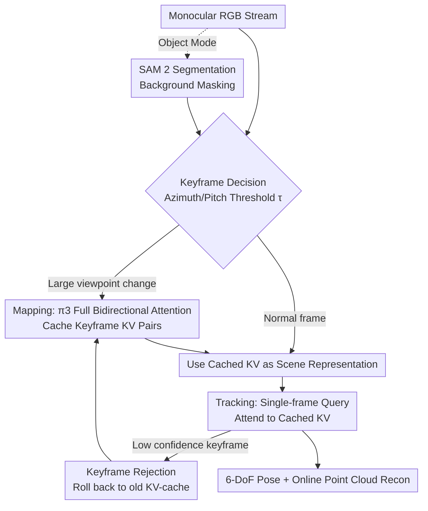

# KV-Tracker: Real-Time Pose Tracking with Transformers

**Conference**: CVPR 2026  
**Paper**: [CVF Open Access](https://openaccess.thecvf.com/content/CVPR2026/html/Taher_KV-Tracker_Real-Time_Pose_Tracking_with_Transformers_CVPR_2026_paper.html)  
**Code**: Project Page https://marwan99.github.io/kv_tracker/ (Code not explicitly open-sourced)  
**Area**: 3D Vision  
**Keywords**: Multi-view geometry, Real-time pose tracking, KV-cache, Online reconstruction, Object tracking

## TL;DR
KV-Tracker transforms offline multi-view geometry large models (π3) into real-time systems: the Key-Value pairs calculated by keyframes during the global attention of the mapping phase are cached as a scene representation. During tracking, only a single-frame query is used to attend to this cache, reducing per-frame inference complexity from $O((NM)^2)$ to $O(M^2(N+1))$. It achieves drift-free 6-DoF camera and zero-prior object tracking at approximately 27 FPS on TUM/7-Scenes/ARCTIC/OnePose.

## Background & Motivation

**Background**: Feed-forward multi-view geometry networks based on Transformers—such as DUSt3R, MASt3R, VGGT, π3, and MapAnything—are reshaping 3D vision. Given a set of images, a single forward pass can regress camera poses, point clouds, and confidence for each frame, providing powerful calibration-free geometric priors. They rely on **global all-to-all bidirectional self-attention** to allow patch tokens from all views to interact, producing globally consistent 3D outputs.

**Limitations of Prior Work**: The cost of global attention grows quadratically with the number of input frames $N$ ($O((NM)^2)$, where $M$ is the number of patches per frame). While two-view networks ($N=2$) can be used as real-time SLAM frontends (e.g., MASt3R-SLAM), multi-view models ($N \ge 2$) are "powerful but monolithic" giants. After reconstructing 50 frames, it is unscalable to recalculate all 51 frames from scratch when the 51st frame arrives.

**Key Challenge**: One option is to use streaming models (Spann3R / CUT3R / TTT3R / Long3R) that compress history into a continuously updated implicit memory/hidden state—but these states are overwritten with every new frame, leading to **drift and catastrophic forgetting** over long sequences, making "loop closure" impossible. The other option is to recalculate global attention for every frame, which is accurate online but too slow for real-time. This conflict is particularly acute in object tracking, where rotating objects frequently return to previously seen relative poses, requiring stable global memory.

**Goal**: Enable off-the-shelf multi-view geometry large models to ingest streaming images and output 6-DoF poses in real-time without **retraining or fine-tuning**, while ensuring that seen history is not "contaminated."

**Key Insight**: The authors observe a key structural property in networks like π3—**tokens $X_n$ for each frame are decoded independently**, and global attention is essentially a query retrieving keys and values. Once the geometry of certain frames is "settled," the K and V pairs they contribute are fixed and do not need to be recalculated every frame.

**Core Idea**: Cache the Key-Value pairs $(\tilde K^l_{1:B}, \tilde V^l_{1:B})$ generated by keyframes in each global self-attention layer during the mapping phase, and **use this KV-cache directly as the scene representation**. During tracking of a new frame, only that frame is encoded to compute its own query to attend to the cached KV. This reuses multi-view priors and is naturally drift-free since the cache is not overwritten.

## Method

### Overall Architecture
KV-Tracker splits the system into two interleaved processes that can run in parallel like PTAM: **Mapping** and **Tracking**. In the Mapping phase, a set of keyframes $KF_{1:B}$ is automatically selected from the input stream. π3 runs **full all-to-all bidirectional global attention**, and the resulting Key-Value pairs $(\tilde K^l_{1:B}, \tilde V^l_{1:B})$ are cached as an implicit scene representation. In the Tracking phase, only single-frame encoding and single-frame query attention are performed on the latest frame $I_t$. It uses the cached KV as the scene for relocation, estimating 6-DoF pose and geometry in real-time (~27 FPS) **without overwriting the cache**. When the camera moves to a sufficiently new viewpoint, a new keyframe is inserted, and the KV-cache is refreshed. In object mode, SAM 2 segmentation is added to mask out the background.

### Key Designs

**1. KV-cache as Scene Representation: Freezing "Settled" Keyframes into Reusable Memory**

The limitation addressed is the quadratic bottleneck of multi-view networks: global self-attention concatenates tokens from all frames into $X \in \mathbb{R}^{NM \times d_k}$ to project $Q, K, V$, with the attention map growing quadratically $O((NM)^2)$. The authors' approach is to run full bidirectional attention only on keyframes $KF_{1:B}$ during mapping and store $\tilde K^l_{1:B}, \tilde V^l_{1:B}$. This cache serves as a "scene representation" because it is the product of full multi-view information exchange—similar to using sparse 3D points or MLPs as scene primitives in SLAM. Given a query frame, geometry and pose can be recovered. Crucially, it is **read-only**: tracking frames attend to it but do not update it, preventing the gradual contamination found in CUT3R/TTT3R, which is the root of its drift-free and "loop-closing" behavior.

**2. Cached Attention for Single-frame Query: Linearizing Quadratic Complexity**

This is the mechanism that makes the representation fast. When a new frame $I_t$ arrives, only it is encoded $X_t = \text{Enc}(I_t)$. Intra-frame self-attention is performed only on $X_t$ during feature aggregation. In global attention layers, $X_t$ is projected into $Q_t, K_t, V_t$, and it attends to the cached keys/values:

$$\text{Attention}(Q_t,\ [\tilde K, K_t],\ [\tilde V, V_t])$$

The attention map becomes:

$$Q K^T = \underbrace{Q_t}_{M \times d_k}\ \underbrace{\big[\tilde K^T_{kf_1}\ \cdots\ \tilde K^T_{kf_M}\ \tilde K^T_t\big]}_{d_k \times M(N+1)}$$

Complexity drops from $O((NM)^2)$ to $O(M^2(N+1))$, becoming linear with respect to the number of keyframes. Intuitively: keyframes with known geometry no longer act as queries that "re-ask questions"; they only act as "retrieved memory" providing K and V. Mapping is bidirectional; tracking degrades to "single query unidirectional cross-attention to cache + self-attention." Combined with π3's independent decoding heads, point cloud and confidence heads can be disabled during tracking for further speedup (without affecting tracking quality). This brings up to 15× speedup, reaching 27 FPS.

**3. Angular Threshold Keyframe Selection + Confidence Rejection: Comprehensive and Non-redundant Caching**

The cost of using a cache as memory is that VRAM grows linearly with the number of keyframes. The authors use a **viewpoint-angle-based keyframe criterion**: a frame is set as a new keyframe only when its minimum azimuth or pitch angle difference from **all** existing keyframes exceeds a threshold $\tau$:

$$\min_{kf \in KF}|\phi_t - \phi_{kf}| > \tau \quad \text{or} \quad \min_{kf \in KF}|\theta_t - \theta_{kf}| > \tau$$

where $\phi, \theta$ are camera azimuth and pitch. Unlike "only comparing to the last frame," comparing to all keyframes ensures no duplicate frames are added when the camera returns to an old viewpoint, naturally adapting to motion speed. To improve robustness, a **Keyframe Rejection** strategy is used: if a new keyframe's predicted confidence is too low, it is discarded, and the system rolls back to the previous KV-cache. In object mode, $\tau$ is set to 10°; typically 50–60 keyframes suffice to cover an object's full view while maintaining high frame rates.

**4. Zero-prior Online Object Tracking: Extending to CAD-less/Depth-less Objects**

Object tracking is harder than scene tracking—objects occupy small pixel areas and rotate/move quickly relative to the camera. Traditional methods usually require CAD models (DeepIM/FoundationPose) or depth (BundleTrack/BundleSDF). The authors apply the KV-cache mechanism directly: after an initial mask from SAM 2, segmentation is propagated. All methods mask the background to black, then online object mapping and real-time tracking are performed using the angular keyframe strategy. The magic is that π3’s general geometric priors transfer zero-shot to masked objects—even though these networks were never trained on masked images—obviating the need for **CAD models, depth, or offline reconstruction**, relaxing the constraints of methods like OnePose.

### Loss & Training
Ours **does not involve any training or fine-tuning**; it is a training-free inference-time adaptation method reusing off-the-shelf π3 weights. π3 was chosen over VGGT because it removes camera register tokens and is less sensitive to reference views (trained with permutation invariant loss); however, when caching, the authors cache the KV pairs of register tokens for each frame alongside patch tokens. This strategy is model-agnostic and can be applied to isomorphic networks like VGGT or MapAnything.

## Key Experimental Results

### Main Results

Camera Tracking (ATE RMSE in meters, lower is better), compared with streaming reconstruction methods. Ours leads across the board even at lower resolution (350×266) compared to baselines at higher resolutions:

| Dataset | Point3R | CUT3R | TTT3R | DPVO | Ours |
|:---|:---:|:---:|:---:|:---:|:---:|
| TUM-RGBD (Avg) | 0.331 | 0.272 | 0.132 | 0.095 | **0.098** |
| 7-Scenes (Avg) | 0.439 | 0.205 | 0.143 | — | **0.059** |

Ours improves 25% over the strongest baseline TTT3R on TUM-RGBD (winning 6/8 scenes) and 58% on 7-Scenes (winning 7/7). Competitors like CUT3R/TTT3R requires state resets every 100 frames to avoid drift. Improvements in difficult cases are significant: "teddy" 0.057m vs TTT3R 0.214m. DPVO is a sparse patch odometry (no dense geometry); ours is only 0.003m behind its avg ATE.

Object Tracking: ARCTIC dataset (egocentric, hand-manipulated objects), ATE RMSE (m):

| Method | Mean ATE |
|:---|:---:|
| CUT3R | 0.305 |
| TTT3R | 0.303 |
| Ours @308 | **0.228** |

OnePose / OnePose-LowTexture (Recall %, baselines use offline 3D reconstruction + 3D Bbox, Ours is pure online):

| Method | Input | OnePose 5cm5° | LowTex 5cm5° | FPS |
|:---|:---:|:---:|:---:|:---:|
| OnePose | 3D Bbox | 84.1 | 45.4 | 15 |
| OnePose++ | 3D Bbox | 87.7 | 72.1 | 11 |
| Ours @518 | 2D Bbox | **92.9** | **94.4** | 16 |

At the loose 5cm/5° threshold, Ours (online, no offline reconstruction) outperforms offline baselines; however, it lags significantly at the strict 1cm/1° threshold (Ours with seg-mask 10.7% vs OnePose++ 51.1%), as offline methods have more complete 3D models.

### Ablation Study

Core ablation of KV-cache adaptation — compared with "recalculating full bidirectional attention for all keyframes every frame" (308×308 synthetic load):

| Config | Behavior | FPS Performance |
|:---|:---:|:---|
| Full Bidirectional (fresh KV) | $O(N^2)$ recalculate all KV | Decays quadratically, slows down quickly |
| KV-cache (Ours) | Single query attend to cache | Steady 30 FPS at 50 frames; 25 FPS at 70; >20 FPS at 110 |

Tested until 24GB VRAM was exhausted. This ablation confirms that "cache reuse" is the source of acceleration.

### Key Findings
- **Drift-free tracking originates from "read-only cache" rather than update-based states**: CUT3R/TTT3R must reset every 100 frames; Ours is anchored to keyframes and does not write back, remaining naturally stable when returning to old views.
- **Speedup is purely contributed by KV reuse**: Runtime ablation shows quadratic slowdown for full attention, while the cached version linearizes complexity, enabling 27 FPS.
- **2D Bbox is slightly better than seg-mask**: Across OnePose datasets, dilated 2D boxes outperform pure segmentation masks. Authors attribute this to the background context around object boundaries providing extra discriminative features.
- **Precision-Latency trade-off is clear**: Ours wins on flexibility/speed at coarse thresholds (5cm/5°) but offline models still dominate at fine thresholds (1cm/1°).

## Highlights & Insights
- **Elevating KV-cache from an "acceleration trick" to a "scene representation"**: In LLM inference, KV-cache just saves computation; here, it is reinterpreted as a scene primitive in the SLAM sense, bridging "multi-view large models" and "real-time tracking against a model."
- **Training-free and model-agnostic**: No weight changes or fine-tuning. It leverages the structural property of π3 (independent decoding + attention as retrieval), allowing easy transfer to networks like VGGT/MapAnything.
- **Elegant drift mitigation**: Drift is caused by "states being overwritten every frame." The solution is to not update and anchor memory to keyframes—eliminating the problem at the mechanism level.
- **Transferable logic**: Any structure with a "heavy bidirectional encoder + independent decoder" can freeze settled input representations to linearize cost.

## Limitations & Future Work
- **VRAM is a hard ceiling**: Cache grows linearly with keyframes. Currently limited to small static workspaces or single objects; 24GB VRAM is exhausted near 110 keyframes, preventing large-scale SLAM.
- **Cache is non-incremental; high refresh cost**: Inserting a new keyframe requires a full recalculation of the KV-cache; cache pruning, compression, and incremental KV computation are listed as future work.
- **Fine-grained precision lags behind offline methods**: Structurally disadvantaged at strict thresholds (1cm/1°) compared to methods with complete 3D models.
- **Dependency on external segmentation**: Object mode depends on SAM 2 propagation quality; segment-mask drift can contaminate the map.

## Related Work & Insights
- **vs CUT3R / TTT3R (Update-based implicit memory)**: They compress history into a hidden state that drifts over long sequences; Ours anchors memory to read-only keyframe KV-caches, leading in ATE performance without needing resets.
- **vs Point3R / StreamingVGGT (Trained streaming networks)**: They rely on retraining or causal attention; Ours is training-free adaptation using existing weights.
- **vs OnePose / OnePose++ (Offline object reconstruction)**: Baselines require offline scanning and 3D Bbox; Ours is online with just an initial mask, outperforming at coarse thresholds.
- **vs MASt3R-SLAM (Two-view frontend)**: It uses $N=2$ networks; Ours solves the harder problem of online-izing multi-view ($N \ge 2$) models by breaking the quadratic wall.

## Rating
- **Novelty**: ⭐⭐⭐⭐⭐ Reinterpreting KV-cache as a SLAM scene representation to bridge large models and real-time tracking is a brilliant conceptual cross-over.
- **Experimental Thoroughness**: ⭐⭐⭐⭐ Covers 4 datasets and runtime/complexity ablations; however, lacks sensitivity analysis for hyperparameters like $\tau$.
- **Writing Quality**: ⭐⭐⭐⭐⭐ Motivation for online-izing multi-view models is logical; complexity analyses and diagrams are clear.
- **Value**: ⭐⭐⭐⭐ Makes off-the-shelf geometric models plug-and-play for real-time applications; however, VRAM limits keep it within small-scale scenarios.

<!-- RELATED:START -->

## Related Papers

- [\[CVPR 2026\] GHPT: Real-Time Relightable Gaussian Splatting using Hybrid Path Tracing](ghpt_real-time_relightable_gaussian_splatting_using_hybrid_path_tracing.md)
- [\[CVPR 2026\] Changes in Real Time: Online Scene Change Detection with Multi-View Fusion](changes_in_real_time_online_scene_change_detection_with_multi-view_fusion.md)
- [\[CVPR 2026\] AnthroTAP: Learning Point Tracking with Real-World Motion](anthrotap_learning_point_tracking_with_real-world_motion.md)
- [\[CVPR 2026\] Fast Spatial Tracking with Visual Geometry Transformer](fast_spatial_tracking_with_visual_geometry_transformer.md)
- [\[CVPR 2026\] Fast-FoundationStereo: Real-Time Zero-Shot Stereo Matching](fast-foundationstereo_real-time_zero-shot_stereo_matching.md)

<!-- RELATED:END -->
