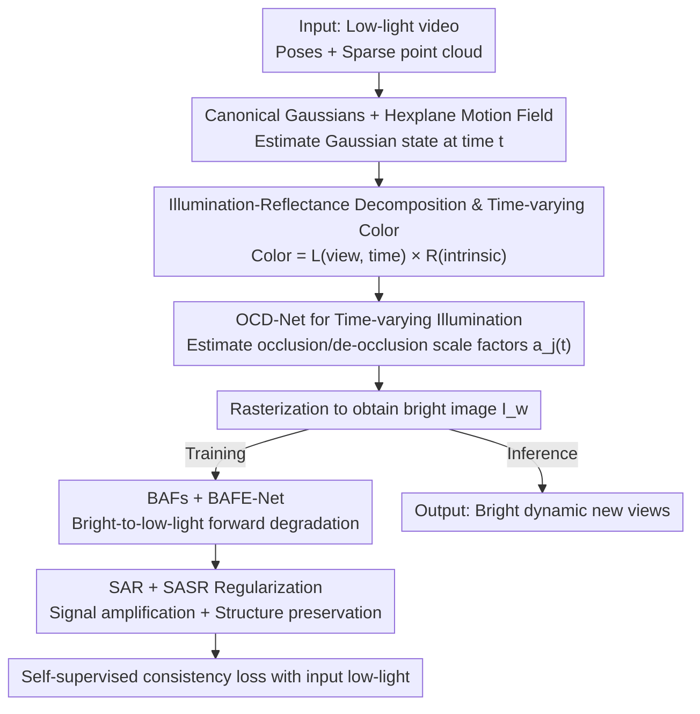

# $L^{2}DGS$: Low-Light Dynamic Gaussian Splatting

**Conference**: CVPR 2026  
**Paper**: [CVF Open Access](https://openaccess.thecvf.com/content/CVPR2026/html/Kumar_L2DGS_Low-Light_Dynamic_Gaussian_Splatting_CVPR_2026_paper.html)  
**Code**: https://github.com/akumar005/L2DGS  
**Area**: 3D Vision  
**Keywords**: 4D Gaussian Splatting, Low-light Reconstruction, Dynamic Scenes, Self-supervised, Illumination-Reflectance Decomposition

## TL;DR
L2DGS is the first 4D Gaussian Splatting framework to self-supervise the reconstruction of "bright dynamic scenes" directly from low-light videos. It decomposes the color of each Gaussian into "view- and time-dependent illumination $\times$ intrinsic scene reflectance." By utilizing OCD-Net to model motion-induced time-varying illumination and a forward degradation pipeline (BAFs + BAFE-Net) to transform bright scenes back into low-light versions for self-supervision, it significantly outperforms existing methods on both synthetic and real-world low-light dynamic data.

## Background & Motivation
**Background**: NeRF and 3DGS have achieved high-fidelity new-view synthesis from images/videos and have been extended to dynamic (4D) scenes. Simultaneously, several works focus on low-light reconstruction. however, these two research paths have rarely intersected.

**Limitations of Prior Work**: Existing low-light reconstruction methods (Lighting-up NeRF, Aleth-NeRF, Luminance-GS, etc.) almost exclusively handle **static** scenes and mostly focus on "brightening" while neglecting the underlying scene structure. Conversely, dynamic scene methods assume the input is **well-lit**. Chaining "low-light enhancement" and "dynamic new-view synthesis" as independent steps leads to loss of consistency and lacks robustness under motion.

**Key Challenge**: In low-light scenes with moving objects, reconstruction is inherently highly underdetermined. Changing camera exposure introduces motion blur; single-camera setups provide only one observation per time step, resulting in natural sparsity; most importantly, object motion causes shifting cast shadows on the background and self-shadows on the objects themselves. This makes it difficult to determine whether a region is inherently dark or darkened by occlusion. Such motion-induced shadows and occlusion/de-occlusion create severe texture and brightness ambiguities.

**Goal**: To reconstruct bright dynamic scenes directly from low-light sRGB videos using a single end-to-end, fully self-supervised model capable of spatio-temporal new-view synthesis—without relying on motion masks, camera metadata, or explicit supervision from bright reference images.

**Key Insight**: The authors advocate for joint "enhancement + dynamic synthesis" rather than a two-step approach, as a unified model can learn a common geometric-photometric feature space. This allows the enhancement mechanism to naturally extend to view synthesis while ensuring motion consistency across frames.

**Core Idea**: Instead of assigning each Gaussian a view-dependent color as in standard GS, each Gaussian is associated with two attributes: a view- and time-dependent illumination $l$ and an intrinsic scene reflectance $r$. The final color is the product of the two. A "bright-to-low-light" forward degradation pathway is designed to enable self-supervision from low-light inputs without bright ground truth (GT).

## Method

### Overall Architecture
The input consists of $N$ low-light observation frames $\{I^t_d\}$, corresponding camera poses and intrinsics, and a sparse point cloud. L2DGS uses 4DGS as a baseline: starting from a set of canonical Gaussians $G^c_i(\mu^c_i,\Sigma^c_i)$, a Hexplane motion field transforms them to the state $G^t_i(\mu^t_i,\Sigma^t_i)$ at query time $t$. Each Gaussian no longer carries "view-dependent color" but instead view-dependent illumination $l^c_i(v)$ (encoded with Spherical Harmonics), view-invariant reflectance $r_i$, and opacity $o_i$. After rasterization, an illumination map $L_w(v,t)$ and a reflectance map $R_w$ are obtained. Their Hadamard product yields the bright image $I_w(v,t)=L_w\circ R_w$.

The key lies in self-supervision during training: due to the absence of bright GT, the authors perform "bright-to-low-light" forward degradation, converting the estimated bright image $I_w$ into a low-light estimate $\hat I^t_d$ to align with the real low-light input $I^t_d$. This pathway is implemented via two Brightness Attenuation Features (BAFs) $b_{1i},b_{2i}$ per Gaussian and a BAFE-Net. During inference, BAFs and BAFE-Net are discarded, rendering only the bright new views at $30+$ FPS.

### Key Designs

**1. Illumination-Reflectance Decomposition and Time-Varying Color Modeling: Splitting Color into "View-Time Illumination × Intrinsic Reflectance"**

Standard GS/NeRF models pixel color only as a function of the viewing angle, failing to account for color changes caused by motion. L2DGS associates each Gaussian with view-dependent illumination $l^c_i(v)=\sum_{j=1}^{(k+1)^2} b_j B_j(v)$ (where $B_j$ are SH bases and $b_j$ are coefficients) and view-invariant reflectance $r_i$. The color is the product of the two, making the color of each Gaussian a function of both time and viewpoint. During rasterization, alpha-blending is performed on $l^t_i$ and $r_i$ to get the illumination map $L_w(v,t)$ and reflectance map $R_w$, which are multiplied to produce the bright image. The authors emphasize that this differs from static Retinex-like decomposition as it explicitly introduces the time dimension to absorb color variations caused by extrinsic factors like object motion.

**2. OCD-Net (Occlusion-De-occlusion Network): Modeling Motion-Induced Time-Varying Illumination**

Observed intensity changes due to object motion. The authors attribute these extrinsic intensity variations to the time-varying term of the illumination $l^t_i=\sum_j a_j(t)\,b_j B_j(v)$, where $a_j(t)\in\mathbb{R}^+$ is a scale factor controlling time-variance (occlusion/de-occlusion). This factor is estimated by OCD-Net: $a_j(t)=\mathcal{F}_2(\mathcal{F}_1(G^t_i,G^t_m;t))=\text{OCD-Net}(f(\mu^t_i))$, where $\mathcal{F}_1$ relates to all other Gaussians $G^t_m$ affecting the illumination of $G^t_i$, and $\mathcal{F}_2$ estimates the effective light increase/decrease. The network input is the spatio-temporal features $f(\mu^t_i)$ aggregated from the motion field (product of features from Hexplane's six planes: $XY, Zt, YZ, Xt, ZX, Yt$), and it outputs $a_j(t)$, implicitly learning $\mathcal{F}_1$ and $\mathcal{F}_2$. Thus, motion-induced shadow drifting and self-shadowing are explicitly absorbed into the illumination term rather than being misinterpreted as intrinsic darkness of the scene.

**3. BAFs + BAFE-Net: Forward Degradation for Self-Supervision**

Lacking bright GT, the low-light input itself must serve as the supervisory signal. The authors opt for "forward modeling"—synthesizing low-light from estimated bright images—rather than backward enhancement (which amplifies noise). Specifically, each Gaussian is assigned two randomly initialized, jointly optimized Brightness Attenuation Features (BAFs) $b_{1i}, b_{2i}$, which are rasterized into 2D maps $\hat B_1, \hat B_2$. To complete the degradation, a convolutional BAFE-Net processes the concatenated $[\hat B_1, \hat B_2]$ ($H\times W\times2$) to produce the final $B_1, B_2$. The low-light estimate is then synthesized as $\hat I^t_d=L_w(v,t)^{\circ B_2}\circ R_w^{\circ B_1}$ (where $a^{\circ b}$ denotes element-wise power, inspired by differentiable gamma correction). This forward pathway provides stronger control over scene components and allows selective enhancement for higher SNR without increasing deployment costs.

**4. SAR + SASR Regularization: Amplifying Signals and Preserving Structure**

Bright scene estimation is underdetermined—multiple combinations of $L_w, R_w, B_1, B_2$ can produce the same low-light observation. **Signal Amplification Regularization (SAR)** addresses photon scarcity and high noise in low light by pushing the illumination map toward maximum: $\mathcal{L}_L=\frac{1}{HW}\sum_{i,j}|1-[L_w(v,t)]_{i,j}|$, as $L_w$ must increase brightness while $R_w\in[0,1]$. Interestingly, maximizing $R_w$ is ineffective because $R_w$ is view- and time-invariant, allowing noise to be averaged out during multi-view aggregation. **Scene-Adaptive Structure Regularization (SASR)** ensures degradation respects scene structure: since $B_1, B_2$ act on $R_w, L_w$, their gradients are constrained to align: $\mathcal{L}_{B1}=\|\beta_1\nabla B_1-\nabla R_w\|_1$ and $\mathcal{L}_{B2}=\|\beta_2\nabla B_2-\nabla L_w\|_1$. This forces BAFs to capture structural consistency. Combined with a photometric term $\mathcal{L}_{photo}$ (L1+SSIM, where the SSIM weight $\eta$ decays from $0.95$ to $0.5$), exposure regularization $\mathcal{L}_{exp}$ (constraining mean $R_w$ in $16\times16$ windows to $e=0.6$), and edge-aware depth smoothing $\mathcal{L}_D$, the total objective is $\mathcal{L}=\mathcal{L}_{photo}+\lambda_1\mathcal{L}_{exp}+\lambda_2\mathcal{L}_{L}+\lambda_3\mathcal{L}_{B1}+\lambda_4\mathcal{L}_{B2}+\lambda_5\mathcal{L}_D$.

### Loss & Training
Using 4DGS as the baseline, the motion field resolutions are $64$ for $X,Y,Z$ axes and $N/2$ for the $t$ axis. Training follows two stages: 3000 steps of coarse training (motion field and OCD-Net inactive), followed by 20,000 steps of fine training (all components active). Scene decomposition occurs in both stages with end-to-end self-supervision. BAFE-Net learning rate decays from $0.0016$ to $0.00016$, OCD-Net from $0.00016$ to $0.000016$, BAFs and reflectance are fixed at $1e-5$, and illumination at $0.0025$. Hyperparameters: $\beta_1=\beta_2=0.5$, $\lambda_{1..5}=\{0.01,0.05,1.0,1.0,0.001\}$. Training takes approximately 90 minutes for $450\times800$ resolution on a single RTX 3090.

## Key Experimental Results

### Main Results
Comparison on synthetic low-light dynamic scenes (metrics calculated on bright images; ⚠️ regions: Dynamic/Static/Overall). Results for Mochi and Apple scenes vs. the strongest competitor, Luminance-GS:

| Scene/Region | Method | PSNR↑ | SSIM↑ | LPIPS↓ |
|------|------|------|------|------|
| Mochi · Dynamic | Luminance-GS | 14.06 | 0.59 | 0.14 |
| Mochi · Dynamic | **L2DGS** | **21.00** | **0.78** | **0.07** |
| Mochi · Overall | Luminance-GS | 14.51 | 0.66 | 0.32 |
| Mochi · Overall | **L2DGS** | **17.61** | **0.77** | **0.16** |
| Apple · Overall | Luminance-GS | 12.50 | 0.43 | 0.44 |
| Apple · Overall | **L2DGS** | **13.31** | **0.63** | **0.24** |

Gains in dynamic regions are particularly significant (+6.94 dB for Mochi), confirming better handling of motion-induced shadows. For comparison, running the bright dynamic method 4DGS on low-light data fails completely (only 7.03 dB in Mochi dynamic regions).

User study on real-world L2DyV data (62 participants, pairwise preference% / 1–5 average score):

| Dimension | LLNeRF | Luminance-GS | **L2DGS** |
|------|------|------|------|
| (i) Natural Brightness | 23.14 / 3.05 | 0.02 / 2.39 | **75.20 / 4.05** |
| (ii) Foreground Recon. | 2.01 / 2.97 | 2.01 / 2.81 | **93.57 / 4.33** |
| (iii) Structure Preserv. | 1.12 / 2.91 | 1.10 / 2.36 | **94.34 / 4.08** |
| (iv) Color Naturalness | 25.80 / 2.84 | 0.001 / 2.67 | **72.36 / 4.36** |
| (v) Fewest Artifacts | 6.03 / 2.83 | 6.11 / 2.55 | **80.41 / 4.28** |

L2DGS significantly outperforms other methods across all 5 dimensions.

### Ablation Study
Removing components individually on a single scene (Overall metrics):

| Configuration | PSNR↑ | SSIM↑ | LPIPS↓ | Note |
|------|------|------|------|------|
| W/o SSIM | 13.20 | 0.49 | 0.49 | Decreased visibility/sharpness |
| W/o $\mathcal{L}_{exp}$ | 7.65 | 0.27 | 0.31 | Output remains dark, significant drop |
| W/o $\mathcal{L}_D$ | 14.27 | 0.60 | 0.25 | Unconstrained depth, blurry output |
| W/o $\mathcal{L}_B$ | 14.56 | 0.62 | 0.26 | Lacks dynamic adaptation; edge smearing |
| W/o $\mathcal{L}_L$ (SAR) | 6.99 | 0.22 | 0.37 | Extremely low visibility, near total failure |
| W/o BAFE-Net | 6.14 | 0.19 | 0.68 | Degradation path fails; results stay low-light |
| W/o OCD-Net | ⚠️ Significant drop | – | – | Failure to model time-varying light |

### Key Findings
- **SAR ($\mathcal{L}_L$) and BAFE-Net are foundational components**: Without them, PSNR drops to the 6–7 dB range. SAR boosts the signal, and BAFE-Net correctly degrades the scene to provide supervision.
- **Maximizing $L_w$ is effective, maximizing $R_w$ is not**: Since $R_w$ is view-time independent, noise is averaged out during aggregation, explaining why SAR only targets the illumination map.
- **Setting $B_1=1$ or $B_2=1$ leads to color shifts**: This proves the dual-feature design of BAFs is necessary to suppress color distortion.

## Highlights & Insights
- **"Color = View-Time Illumination × Intrinsic Reflectance" Decomposition**: Explicitly introducing the time dimension into color modeling addresses motion-induced shadow drifting and self-shadowing, making it more suitable for dynamic low-light than static Retinex.
- **Forward Degradation instead of Backward Enhancement**: Synthesizing low-light from bright estimates (via BAFs+BAFE-Net) avoids noise amplification.
- **Zero-cost Self-supervised Scaffold**: BAFs and BAFE-Net are only used during training and discarded at inference, allowing for real-time performance (30+ FPS).
- **First Real-world Low-light Dynamic Video Dataset (L2DyV)**: Consists of 12 handheld sequences (100–300 frames) with various dynamic objects, filling a benchmark gap.

## Limitations & Future Work
- **Selection Bias in Synthetic Data**: Bright videos were degraded using Led-Net. The authors admit some synthetic results were manually discarded due to unrealistic color shifts or flickering, ⚠️ which may make synthetic benchmarks overly optimistic.
- **Lack of Real GT**: L2DyV has no bright ground truth, restricting quantitative evaluation to synthetic sets; objective assessment for real scenes remains difficult.
- **Dependence on Regularization and Hyperparameters**: $\lambda_{1..5}$, $\beta_{1,2}$, and the target exposure $e=0.6$ require "extensive experimentation." Cross-scene robustness and automation are not fully discussed.
- **Network Details in Supplement**: Architectures for OCD-Net and BAFE-Net, along with some ablation values, are relegated to the supplementary materials.

## Related Work & Insights
- **vs Lighting-up NeRF**: It separates static scenes into view-dependent/independent parts. L2DGS jointly transforms light and reflectance, uses SASR for structural consistency, and models light as time-view dependent to handle motion.
- **vs Luminance-GS / Lita-GS**: These focus on view-dependent color mapping or light-invariant priors for static scenes. L2DGS leads significantly in dynamic regions by explicitly modeling motion-induced illumination changes.
- **vs 4DGS**: L2DGS uses it as a backbone, but 4DGS alone fails (single-digit PSNR) when fed low-light data directly. L2DGS extends dynamic reconstruction to the low-light domain via decomposition and forward degradation.

## Rating
- Novelty: ⭐⭐⭐⭐⭐ The first low-light dynamic 4D-GS, combining time-view color decomposition, forward degradation, and OCD-Net.
- Experimental Thoroughness: ⭐⭐⭐⭐ Synthetic quant-results + real user study + detailed ablation, though real data lacks GT and some OCD-Net values are in the supplement.
- Writing Quality: ⭐⭐⭐⭐ Logical progression from motivation to design; formal notation is consistent despite the complexity.
- Value: ⭐⭐⭐⭐ Expands low-light reconstruction to dynamic scenes and provides a real-world dataset, offering practical utility for nighttime NVS.

<!-- RELATED:START -->

## Related Papers

- [\[CVPR 2026\] eRetinexGS: Retinex Modeling for Low-Light Scene Enhancement via Event Streams and 3D Gaussian Splatting](eretinexgs_retinex_modeling_for_low-light_scene_enhancement_via_event_streams_an.md)
- [\[CVPR 2026\] Disco-GS: Gaussian Splatting in Dynamic Color Lighting](disco-gs_gaussian_splatting_in_dynamic_color_lighting.md)
- [\[CVPR 2026\] MSCD-GS: Motion-Separated Cooperative Deblurring Dynamic Reconstruction via Gaussian Splatting](mscd-gs_motion-separated_cooperative_deblurring_dynamic_reconstruction_via_gauss.md)
- [\[CVPR 2026\] Layered 4D-Rotor Gaussian Splatting: A Compressed Representation for Long Dynamic Scenes](layered_4d-rotor_gaussian_splatting_a_compressed_representation_for_long_dynamic.md)
- [\[CVPR 2026\] MotionScale: Reconstructing Appearance, Geometry, and Motion of Dynamic Scenes with Scalable 4D Gaussian Splatting](motionscale_reconstructing_appearance_geometry_and_motion_of_dynamic_scenes_with.md)

<!-- RELATED:END -->
