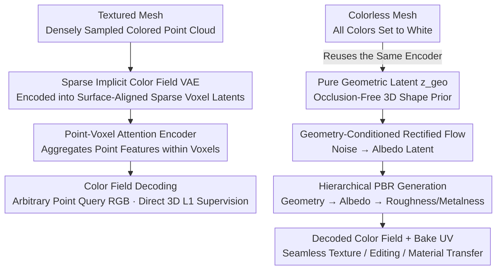

# Lafite: A Generative Latent Field for 3D Native Texturing

**Conference**: CVPR 2026  
**Paper**: [CVF Open Access](https://openaccess.thecvf.com/content/CVPR2026/html/Chen_Lafite_A_Generative_Latent_Field_for_3D_Native_Texturing_CVPR_2026_paper.html)  
**Code**: None  
**Area**: 3D Vision  
**Keywords**: 3D texture generation, sparse latent space, variational autoencoder, rectified flow, PBR materials  

## TL;DR
Lafite models 3D textures as a "sparse implicit color field." It first uses a VAE to compress colored point clouds sampled from the mesh surface into surface-aligned sparse voxel latent codes, which are then decoded into a continuous color field queryable at any arbitrary point (achieving a reconstruction PSNR over 10 dB higher than previous SOTA). Subsequently, a rectified flow model is employed to generate new textures within this latent space conditioned on "pure geometric latent codes," completely sidestepping the seam and distortion issues associated with multi-view projection and UV unwrapping.

## Background & Motivation
**Background**: For texturing 3D meshes, current mainstream methods follow two 2D-based approaches. The first is "multi-view projection," which generates images from multiple viewpoints using a 2D diffusion model and projects them back onto the mesh surface. The second is "UV space generation," which first unwraps the mesh into a 2D UV map and directly generates textures on the UV plane.

**Limitations of Prior Work**: Both paths are inherited from 2D paradigms and suffer from inherent limitations. Multi-view projection requires reconciling multiple inconsistent 2D images (due to occlusions and view-dependent lighting) into a coherent 3D surface, which is fundamentally an ill-posed problem. Consequently, conspicuous seams and artifacts inevitably arise, requiring complex post-processing to remediate. UV generation relies heavily on the mesh's UV parameterization; however, UV mappings are non-unique and often highly distorted, leading to stretched textures or seams at UV island boundaries. These methods merely treat the symptoms rather than curing the disease.

**Key Challenge**: The ultimate solution is to generate textures directly in 3D space (native texturing), which naturally guarantees spatial coherence and seamlessness. However, the native approach has not yet become dominant, primarily due to the **lack of an appropriate 3D texture representation**. An ideal representation must satisfy three criteria simultaneously: sufficient expressiveness to capture high-frequency details, decoupling from mesh topology/UV, and a compact, structured format that can be effectively learned by generative models. Existing native methods (mesh-surface learning, 3D texture fields, colored point clouds/3DGS) are constrained by the capacity limits of their respective representations, leading to either blurry details or token explosion.

**Goal**: The goal is to first construct a high-fidelity, topology-agnostic, and generative 3D texture representation, and then perform conditional texture generation on top of it.

**Key Insight**: The core observation is that "a powerful texture generation model must first learn a strong texture representation." Therefore, full effort is dedicated to the representation—learning a **sparse implicit color field** using a VAE. It is also discovered that the same encoder, when fed with "colorless point clouds," can naturally output clean geometric latent codes, which serve perfectly as generation conditions.

**Core Idea**: To model textures as a "3D generative sparse implicit color field," learning its structure from dense colored point clouds using a VAE, and then using rectified flow to synthesize textures in this latent space conditioned on pure geometric latent codes.

## Method

### Overall Architecture
Lafite consists of two main components. **The upper half (representation)**: A textured mesh is densely sampled into a colored point cloud (position + normal + color) and fed into a VAE encoder to be compressed into sparse voxel latent codes $\{z_k\}$ aligned with the object surface. The decoder reconstructs a continuous color field $C(p)$ from these latent codes—returning the RGB values for any arbitrary query point $p$ in space. This VAE serves as the "representation base" for Lafite, with its reconstruction fidelity setting the upper bound for subsequent generation. **The lower half (generation)**: When texturing a new untextured mesh, it is first sampled into a **colorless point cloud** (with all colors set to white), and the same encoder is used to extract the **pure geometric latent code** $z_{geo}$. Then, a conditional rectified flow model is employed, conditioned on $z_{geo}$ (as well as text/image prompts), to sample a new texture latent code from Gaussian noise, which is finally decoded and baked into the final texture. Throughout this pipeline, texture and geometry consistently reside in the same latent space and are naturally aligned, eliminating the need for an additional geometry encoder.

### Key Designs

`**1. Sparse Implicit Color Field VAE: Thoroughly Freeing Texture from Topology and UV Mapping**`

The limitation lies in the fact that 2D projection/UV representations are either plagued by view inconsistency and projection ambiguity, or tied down by the mesh's UV parameterization. Lafite shifts to a direct 3D representation—discretizing space into a voxel grid and storing information **only in the active voxels near the object surface** (sparsity), with each active voxel defining a local color field using a continuous implicit function. The VAE encoder $E$ maps the dense colored point cloud to sparse latent codes $E:\{\{x_j\}_{j=1}^{N_i}\}_{i=1}^{L}\to\{z_k\}_{k=1}^{L}$, and the decoder $D$ retrieves colors for given query points via $D:\{z_k\}\times p_j\to c_j$. This "sparse + locally continuous" structure concentrates modeling capacity near the surface, allowing high-frequency details to be queried at any point, and is completely decoupled from discrete mesh connectivity and UV coordinates. This is the root cause of its reconstruction PSNR being over 10 dB higher than projection-based representations.

`**2. Point-Voxel Attention Encoding + Direct Point Cloud Input: Unbiased Surface Appearance Capture from the Source Without 2D Feature Projection**`

Prior 3D generative models (e.g., TRELLIS) encode texture by projecting pre-trained 2D features (such as DINO) from multiple camera views onto surface voxels. The authors highlight three critical weaknesses of this approach: projection depends heavily on views, leading to ambiguity in occluded areas; the resolution of 2D features is limited, restricting high-frequency details; and features are tied to 2D fundamental knowledge, which may not adapt well to fine-grained 3D properties like PBR. Lafite instead **directly uses colored point clouds** $P=\{x_i=(p_i,n_i,c_i)\}$ densely sampled from the textured mesh as input, providing native, occlusion-free, and view-independent surface information. The encoder adopts the SparseFlex structure but replaces PointNet with **point-voxel attention**: First, intra-voxel self-attention is performed to let points within the same voxel aggregate local geometry and appearance, $\tilde{x}_i=\sum_{j=1}^{n}\mathrm{softmax}(Q_{x_i}K_{x_j}^{T}/\sqrt{d})\cdot V_{x_j}$. Then, point-voxel cross-attention is conducted, using a learnable voxel feature $v_k$ to attend to all point features within the voxel, aggregating them into voxel-level features $\tilde{v}_k=\sum_{i=1}^{n}\mathrm{softmax}(Q_{v_k}K_{\tilde{x}_i}^{T}/\sqrt{d})\cdot V_{\tilde{x}_i}$. Compared to PointNet's max/average pooling, attention preserves local surface appearance more robustly instead of smoothing it out. Removing point-level attention in the ablation study drops PSNR from 32.69 to 30.83.

`**3. Implicit Geometry Encoding: The Same Encoder Naturally Produces Occlusion-Free Geometric Conditions, Eliminating Independent Geometry Networks**`

During generation, the model requires a 3D shape prior as a condition. The conventional approach is to train another geometry encoder or use 2D position/normal map projections (returning to the old problems of occlusion and cross-view inconsistency). The authors' ingenious trick is that while encoding colors, the **point cloud positions themselves already implicitly encode high-fidelity geometry**. Ergo, by setting all colors of the input colored point cloud to white $(1,1,1)$—essentially "wiping out texture and leaving only shape"—the same encoder $E$ yields the **pure geometric latent code** $z_{geo}=E(\{p_i,n_i,1\})$. This code is occlusion-free, naturally aligned, and resides in the exact same latent space as the texture latent codes, yielding a perfect geometric condition at no extra cost. This is also the core of the "unified framework": utilizing one encoder for dual purposes.

`**4. Geometry-Conditioned Rectified Flow + Hierarchical Decoupled PBR: Geometry → Albedo, Then Albedo → Material**`

With the representation defined, the generation end employs conditional rectified flow to sample texture latent codes in the latent space. Albedo (base color) generation is primarily conditioned on $z_{geo}$, using the conditional flow matching objective $L_{albedo}=\mathbb{E}\lVert v(x_t;t,z_{geo})-(\epsilon-x_0)\rVert$, where $x_t=(1-t)x_0+t\epsilon$, and $z_{geo}$ is concatenated with $x_t$ for progressive denoising. The training adopts a progressive curriculum, starting first at $64^3$ voxel resolution and then fine-tuning to $128^3$. For PBR materials (roughness/metalness, RM), **hierarchical decoupled** generation is used: as the authors observe that RM is physically strongly correlated with albedo, they no longer condition solely on geometry. Instead, they fine-tune an RM generator conditioned on **albedo latent code $z_{albedo}$**, forming a hierarchical chain of "geometry → albedo → RM" that more faithfully captures physical dependencies. In implementation, the texture VAE is directly reused by simply replacing the three color channels with "roughness, metalness, and zero padding," requiring virtually zero extra architecture.

### Loss & Training
The VAE is trained end-to-end, with the target being 3D volumetric reconstruction L1 plus KL regularization: $L=\mathbb{E}_{x_i\sim M}[|D(E(\{\hat{x}_i\}),p_j)-\hat{c}_j|]+L_{KL}$, where $\hat{x}_i=(p_i,n_i,\hat{c}_i)$ and $\hat{c}_i=c_i+\epsilon$ represents colors augmented with slight Gaussian noise (to encourage learning robust high-frequency representations). The authors deliberately **avoid rendering-based losses** (like LPIPS/SSIM) because they introduce blurriness and bias; instead, supervision is performed directly in the 3D volume, ensuring that the representation remains faithful to the surface texture. On the data side, a "Principled Data Curation" pipeline is designed: resolving material ambiguities (using emission as base color for self-emitting surfaces and tone mapping composition for semi-self-emitting surfaces), filtering out non-standard geometries (such as outline shells that pollute sampling), and employing high-density surface sampling (2 million points for VAE training, and caching latent codes of 5 million points for diffusion training) to approach lossless ground truth.

## Key Experimental Results

### Main Results
Conditional texture generation is evaluated on approximately 800 "in-the-wild" meshes generated by commercial AI tools plus 200 prompt images. Metrics include FID / FD / KD (in CLIP and DINO feature spaces), categorized into Unshaded / Shaded configurations (lower is better).

| Setting | Method | FID↓ | FD_CLIP↓ | FD_DINO↓ | KD_CLIP↓ | KD_DINO↓ |
|------|------|------|----------|----------|----------|----------|
| Shaded | SyncMVD*（Text） | 119.38 | 66.87 | 80.99 | 0.058 | 0.047 |
| Shaded | UniTEX*（Image） | 105.75 | 51.62 | 69.65 | 0.038 | 0.034 |
| Shaded | MaterialMVP（Image） | 101.66 | 48.71 | 66.83 | 0.035 | 0.032 |
| Shaded | **Lafite（Image）** | **101.91** | **46.28** | **64.19** | **0.026** | **0.027** |

Lafite achieves optimal or near-optimal performance across almost all metrics in the image-conditioned generation task, with a notable lead in FD_CLIP and KD_DINO under the shaded configuration. In user studies (20 participants, 600 evaluations), Lafite is selected as the best method in 58.5% of cases, vastly outperforming MaterialMVP (24.7%) and UniTEX (16.8%).

VAE Reconstruction Fidelity (Compared to projection-based TRELLIS):

| Method | PSNR↑ | SSIM↑ | LPIPS↓ |
|------|-------|-------|--------|
| TRELLIS-RF128* | 23.07 | 0.880 | 0.127 |
| **Ours-128** | **34.62** | **0.967** | **0.039** |

With a PSNR increase of over 10 dB, these results directly validate that "directly encoding flawless 3D colored point clouds" is far superior to "projecting and aggregating 2D features."

### Ablation Study

| Configuration | PSNR↑ | SSIM↑ | LPIPS↓ | Explanation |
|------|-------|-------|--------|------|
| Full model | 32.69 | 0.962 | 0.063 | Full VAE |
| w/o point attn | 30.83 | 0.952 | 0.071 | Without point-voxel attention, PSNR −1.86 |
| w/o augmentation | 31.62 | 0.958 | 0.067 | Without color noise augmentation, PSNR −1.07 |

Supervision strategy ablation (Fig. 7): Direct 3D color supervision converges faster and achieves higher final PSNR compared to intermediate rendering supervision (3DGS, NeRF), demonstrating that direct 3D supervision provides a more stable and unbiased signal. Point density ablation (Tab. 3): Scaling input points from 20k to 4M steadily increases PSNR from 26.07 to 34.45, proving that the representation scales effectively with denser inputs.

### Key Findings
- The most significant contribution comes from the **representation itself**: the 10 dB lead in VAE reconstruction is the cornerstone of the entire pipeline; point-voxel attention ($-1.86$) is more critical than color augmentation ($-1.07$).
- **Avoiding rendering losses yields better results**: Rendering supervisions such as LPIPS/SSIM introduce blurriness and bias. Direct L1 supervision within the 3D volume converges faster and with higher accuracy.
- The representation is highly sensitive to and benefits monotonically from sampling density, elevating "dense sampling" from code-level implementation details to a prerequisite for high fidelity.

## Highlights & Insights
- **"Representation First, Generation Second" Methodology**: The authors attribute the entire bottleneck to "the lack of a good representation" and invest their primary efforts into the VAE, allowing the generative model to reap the rewards easily. This paradigm of identifying core bottlenecks and tackling them sequentially is highly referenceable.
- **Dual-Purpose Encoder**: The same encoder yields texture latents when fed with colored point clouds, and geometric latents when fed with white point clouds. This gracefully obtains an occlusion-free, naturally aligned geometric condition at zero additional cost, bypassing independent geometric networks.
- **Hierarchical PBR Modeling Aligned with Physical Dependencies**: Material generation is decoupled into "geometry → albedo → RM" rather than conditioning everything bluntly on geometry. By merely substituting the three VAE channels to reuse the architecture, this expands to PBR at virtually zero cost.
- **Transferable Sparse Implicit Field**: This representation, which "stores latents only in surface voxels and queries continuous values at any point," can be transferred to other tasks requiring surface attribute fields (such as surface material, normal, or semantic fields).

## Limitations & Future Work
- **The authors acknowledge**: 3D-native texturing lacks the rich semantic priors of large-scale 2D models, rendering it difficult to generate specific 2D patterns such as text. Future work aims to distill 2D knowledge into 3D representations to balance geometric completeness and semantic richness.
- **High computational barrier**: Training the VAE for 600k steps requires 16×A100, and training the albedo rectified flow for 500k steps requires 32×A100. Combined with the 2M-5M point sampling per asset and latent code caching, the reproduction cost is quite high.
- **Dependence on high-quality textured meshes as ground truth**: The entire representation learning framework assumes that densely sampled colored point clouds can describe surfaces without information loss. Its robustness to scanning noise, thin shells, and semi-transparent assets depends heavily on heuristic data curation rules, and its generalization boundaries remain to be further validated.

## Related Work & Insights
- **vs. Multi-View Projection (SyncMVD / MaterialMVP / UniTEX)**: These methods paint in multiple 2D views and project back to the surface, struggling to reconcile view inconsistencies which easily introduces seams. Lafite generates directly within the 3D latent space, bypassing occlusion and cross-view ambiguities entirely; when baking UVs, simply querying the continuous field guarantees seamless results.
- **vs. UV Space Generation (TEXGen / SeqTex)**: These approaches are chained to the mesh's UV parameterization, suffering from distortions and seams along island boundaries. Lafite's implicit color field is completely decoupled from UV mapping, where UVs only serve as query coordinates in the final baking stage.
- **vs. Projective 3D Representation (TRELLIS)**: While both use sparse voxel latents, TRELLIS projects 2D DINO features onto voxels as input, which is limited by 2D resolution and views. Lafite directly encodes colored point clouds, achieving a reconstruction PSNR over 10 dB higher, which represents a crucial difference in the input of the representation.

## Rating
- Novelty: ⭐⭐⭐⭐⭐ First to learn a "generative 3D implicit color field" with a VAE for native texturing; the dual-purpose encoder design that extracts geometric conditions is highly ingenious.
- Experimental Thoroughness: ⭐⭐⭐⭐ Comprehensively covers main results, VAE reconstruction, multiple ablation studies, and user studies, though it lacks code and the evaluation meshes are mostly synthetic AI outputs rather than real-world scans.
- Writing Quality: ⭐⭐⭐⭐⭐ Clear positioning of the problem (representation bottleneck), step-by-step methodology narrative, and excellent cohesion with figures and tables.
- Value: ⭐⭐⭐⭐⭐ Significantly raises the ceiling of native texturing while offering high generalizability across downstream applications like representation, editing, and material transfer.

<!-- RELATED:START -->

## Related Papers

- [\[CVPR 2026\] UniTEX: Universal High Fidelity Generative Texturing for 3D Shapes](unitex_universal_high_fidelity_generative_texturing_for_3d_shapes.md)
- [\[CVPR 2026\] TEXTRIX: Latent Attribute Grid for Native Texture Generation and Beyond](textrix_latent_attribute_grid_for_native_texture_generation_and_beyond.md)
- [\[CVPR 2026\] CUPID: Generative 3D Reconstruction via Joint Object and Pose Modeling](cupid_generative_3d_reconstruction_via_joint_object_and_pose_modeling.md)
- [\[CVPR 2026\] NaTex: Seamless Texture Generation as Latent Color Diffusion](natex_seamless_texture_generation_as_latent_color_diffusion.md)
- [\[CVPR 2026\] PointCNN++: Performant Convolution on Native Points](pointcnn_performant_convolution_on_native_points.md)

<!-- RELATED:END -->
