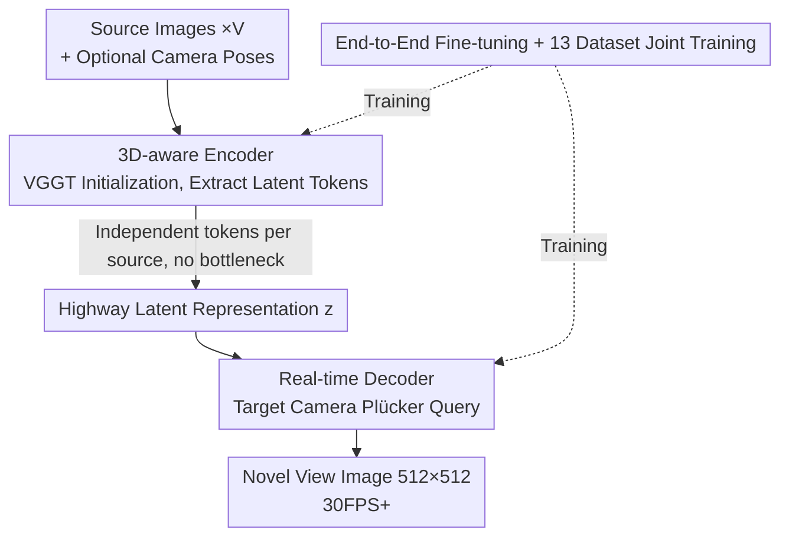

# LagerNVS: Latent Geometry for Fully Neural Real-time Novel View Synthesis

**Conference**: CVPR 2026  
**Paper**: [CVF Open Access](https://openaccess.thecvf.com/content/CVPR2026/html/Szymanowicz_LagerNVS_Latent_Geometry_for_Fully_Neural_Real-time_Novel_View_Synthesis_CVPR_2026_paper.html)  
**Code**: https://szymanowiczs.github.io/lagernvs (project page, including code/models)  
**Area**: 3D Vision  
**Keywords**: Novel View Synthesis, feed-forward rendering, implicit geometry, VGGT, real-time rendering

## TL;DR
LagerNVS avoids explicit 3D reconstruction and instead uses a pre-trained network for 3D reconstruction (VGGT) as an encoder to extract "3D-aware" latent features, coupled with a lightweight decoder for end-to-end fine-tuning to perform novel view synthesis directly using neural networks. It achieves a 31.4 PSNR on RealEstate10k (an improvement of +1.7dB over the previous SOTA LVSM) and runs in real-time (30FPS+) on a single H100 GPU at $512\times512$ resolution. It is applicable regardless of whether camera poses are provided and can be integrated with a diffusion decoder for generative extrapolation.

## Background & Motivation

**Background**: The mainstream pipeline for Novel View Synthesis (NVS) first fits an **explicit 3D representation** of the scene via optimization (NeRF, 3DGS) and then renders from the target viewpoint. While this path offers high quality, it is slow and prone to overfitting when source views are scarce. Recent feed-forward methods use a network to predict 3D representations (e.g., pixel-wise 3D Gaussians) in a single pass, which is much faster. A more radical step is taken by "reconstruction-free" methods such as SRT/LVSM/RayZer, which **forgo 3D reconstruction entirely** and let the network directly generate novel views.

**Limitations of Prior Work**: The authors observe that bypassing explicit 3D reconstruction **does not mean** all 3D inductive biases can be discarded. In purely reconstruction-free models like LVSM, the 3D prior is reduced to only "how to encode camera parameters", whereas the features themselves are general-purpose 2D features (such as DinoV2) that have not been tailored for 3D tasks. Meanwhile, their "bottleneck" encoder-decoder or "decoder-only" architectures either compress information into a fixed-dimensionality bottleneck (limiting representation power) or require running the entire network for every rendered novel view (slowing down speed).

**Key Challenge**: There is a trade-off between quality (strong 3D priors, uncompressed information) and speed (lightweight decoder, single-run encoding). Pure neural rendering lacks a way to inject 3D knowledge into latent features to achieve "geometry awareness like explicit reconstruction" without paying the cost of explicit representations.

**Goal**: (1) Inject a strong 3D bias into the network without performing explicit 3D reconstruction; (2) identify the optimal encoder-decoder architecture for quality/speed trade-offs; (3) design a decoder that is truly real-time and robust to the presence of camera poses and in-the-wild data.

**Key Insight**: Given the existence of readily available reconstruction networks pre-trained with explicit 3D supervision like VGGT, instead of using their explicit output (depth, cameras), **one can harness the latent features from their intermediate layers**. Although these features are not explicitly "3D", they are trained on 3D tasks and inherently carry geometric awareness.

**Core Idea**: Replace "explicit 3D reconstruction + rendering" with "3D-aware latent features + highway encoder-decoder + lightweight decoder" to embed 3D priors into the latent space, achieving both accurate and fast fully neural NVS.

## Method

### Overall Architecture

The formally defined goal of NVS is: given $V$ source images $I_1,\dots,I_V \in \mathbb{R}^{3\times H\times W}$ and a target camera parameter $g$ (expressed relative to the reference image $I_1$), output the target view image $I=f(g; I_1,\dots,I_V)$. If the source cameras are known, then $I=f(g; I_1,g_1,\dots,I_V,g_V)$. The camera is parameterized as an 11-dimensional vector $g=(q,t,k,w)$, where $q\in S^3$ is the rotation quaternion, $t\in\mathbb{R}^3$ is the translation, $k\in\mathbb{R}^2_+$ represents the horizontal/vertical field of view, and $w$ is a helper parameter for scene scale.

LagerNVS is an **encoder-decoder** framework: the encoder $e$ encodes all source images (including optional cameras) into a latent representation $z=(z_1,\dots,z_V)$ in a single pass, and the decoder $h$ then renders viewpoints individually as $I=h(z;g)$ according to the target camera $g$. Thus, the encoding cost can be **amortized** across multiple target views—the encoding runs only once (taking a few seconds), while the decoding runs in real time (30FPS+). The three key design choices of the overall pipeline are: initializing the encoder with a **pre-trained 3D network** (to digest implicit geometry), passing latent representations via a **highway** (retaining independent tokens for each source image without a bottleneck), and keeping the decoder **lightweight and queryable by camera** (to ensure speed).

### Key Designs

**1. 3D-aware Implicit Geometry Encoder: Replacing Explicit 3D Reconstruction with VGGT Intermediate Features**

To address the limitation of lacking 3D priors in pure neural NVS, the authors do not feed the VGGT output into a Gaussian rasterizer like AnySplat to perform explicit reconstruction. Instead, they **only extract target tokens from the last few layers of the VGGT transformer backbone** as latent features. Specifically, for each source image $I_i$, a set of tokens is extracted from both the "last layer of local attention" and "last layer of global attention" of VGGT. The camera tokens are discarded, and the remaining tokens are concatenated along the channel dimension, projected through a linear layer to the decoder's expected dimension $C$, and normalized with LayerNorm to stabilize training, resulting in $z_i\in\mathbb{R}^{P\times C}$. Although these features are not explicitly 3D, since VGGT is pre-trained with explicit 3D supervision, they contain implicit geometric knowledge such as depth and multi-view correspondence. Ablations show that compared to training from scratch (+2.9dB PSNR) or using general 2D features like DinoV2, 3D pre-trained features yield massive gains.

For scenes with known cameras, since VGGT itself does not accept camera inputs, the authors use a 2-layer MLP to project the camera parameter $g$ into a 1024-dimensional token, which is **added to the default initial camera token of VGGT** before being fed into the backbone. When cameras are absent, $g$ is set to zero (leaving only the scale helper $w$). This adaptation enables the same set of parameters to perform inference both with and without cameras.

**2. Highway Encoder-Decoder Architecture: Prevent Compression of Source Image Information by Bottlenecks**

The authors systematically compare three feed-forward NVS architectures (Figure 4), pointing out that they have respective shortcomings in "expressive power" and "speed": the decoder-only architecture must rerun the entire network for each novel view, which is slow; the bottleneck encoder-decoder compresses latent tokens into a fixed dimensionality independent of the number of source views, choking off information flow. LagerNVS adopts a **highway encoder-decoder**—named after the non-decaying information flow of Highway Networks—where the latent representation $z=(z_1,\dots,z_V)$ **retains independent feature vectors for each source image**, allowing the decoder to directly access all source image features without passing through any bottleneck.

Its advantages are twofold: on one hand, without a bottleneck and leveraging VGGT's 3D-aware features, it possesses strong expressive power; on the other hand, computations independent of the target viewpoint are amortized to the encoder, which is run only once, allowing the decoder to learn more efficiently under a fixed computational budget. In the ablation study (under the same lightweight decoder budget), the highway architecture significantly outperforms the decoder-only and bottleneck configurations, which are typically used in models like LVSM.

**3. Real-Time Decoder: Plücker Ray Querying + Tradeoff of Speed via Two Attention Variants**

The challenge for the decoder $h(g;z_1,\dots,z_V)$ is to perform accurate rendering while maintaining real-time speed. The target camera $g$ is not fed directly as a vector; instead, it is **densified into a Plücker ray map**, where each pixel stores its corresponding ray $(r_d,r_m)$ (direction + moment), constituting a $6\times H\times W$ image, which is then compressed using a convolution with kernel/stride $r'=8$ into $HW/r'^2$ tokens. Combined with 4 register tokens, this yields the target camera token set $s$. The decoder is a transformer that allows $s$ to "attend" to the encoded source tokens, and the output layer discards the register tokens and projects the dense tokens linearly into $8\times 8$ patches to reconstruct the original image.

The authors propose two attention variants to trade off quality and speed:
*   The **full attention** variant concatenates $(s,z_1,\dots,z_V)$ and computes self-attention with $O(V^2)$ complexity, offering slightly higher quality.
*   The **cross-attention** variant performs self-attention only within $s$, followed by two layers of cross-attention with scene tokens ($q_1=s,\,k_1=v_1=z$; $q_2=z,\,k_2=v_2=s$), reducing the complexity to $O(V)$. This allows real-time (30FPS+) rendering for up to 9 source images, whereas the full variant only supports up to 6 images. Notably, the decoder is a **standard neural network** that runs in real-time without relying on custom CUDA kernels or JIT compilation.

**4. End-to-End Fine-Tuning + 13-Dataset Joint Training: Shifting VGGT from "Geometry-Only" to "Appearance-Aware"**

Simply changing the architecture is insufficient. The authors find that **it is necessary to unfreeze the entire VGGT for end-to-end fine-tuning**, rather than only training the newly added decoder parameters. This is because VGGT was trained explicitly to reconstruct geometry, thereby ignoring critical NVS appearance properties like colors, reflections, and transparency as noise. Freezing the backbone leads to renders lacking reflections, blurry textures, and a harder transition to understanding the input camera. In the ablation study, E2E fine-tuning brings a significant gain over a frozen backbone (21.02 vs 19.01 PSNR). The training loss is a combination of L2 and perceptual loss: $\mathcal{L}=\lambda_2\mathcal{L}_2+\lambda_p\mathcal{L}_p$. On the data side, following VGGT, the model is trained jointly on 13 multi-view datasets (RealEstate10k, DL3DV, WildRGBD, etc.) with a scale and diversity roughly aligned with VGGT. This is the source of its ability to generalize to in-the-wild photos, 360° scenes, non-square aspect ratios, single-view inputs, and camera-pose-free scenarios.

> ⚠️ Furthermore, the decoder of LagerNVS can be **repurposed as a diffusion model** for generative NVS: freeze the encoder, fine-tune only the decoder (adding noise map channels to the input layer + injecting denoising timesteps via adaLN-zero), and fine-tune with a denoising diffusion objective for about 60k steps. Operating in pixel space (not latent diffusion) with only 12 transformer blocks, the model can synthesize plausible content in occluded or extrapolated regions. This is an illustrative experiment; refer to the original paper for full details.

## Key Experimental Results

### Main Results

**Comparison with Prior SOTA (LVSM)** (RealEstate10k, 2 source views, 256×256, following the LVSM protocol). The "Batch" column represents training batch size:

| Method | Architecture / Batch | PSNR ↑ | SSIM ↑ | LPIPS ↓ |
|------|--------------|--------|--------|---------|
| LVSM | Bottleneck / 64 | 28.32 | 0.888 | 0.117 |
| LVSM | Decoder-only / 64 | 28.89 | 0.894 | 0.108 |
| Ours | highway·cross-attn / 64 | 30.11 | 0.912 | 0.089 |
| Ours | highway·full / 64 | 30.48 | 0.918 | 0.086 |
| LVSM | Bottleneck / 512 | 28.58 | 0.893 | 0.114 |
| LVSM | Decoder-only / 512 | 29.67 | 0.906 | 0.098 |
| Ours | highway·cross-attn / 512 | 31.06 | 0.924 | 0.080 |
| **Ours** | **highway·full / 512** | **31.39** | **0.928** | **0.078** |

In the batch 512 setting, the full variant of Ours achieves 31.39 PSNR, outperforming LVSM's best decoder-only variant (29.67) by **+1.7dB**, consistent with the "+1.7dB margin" claimed in the abstract.

**Comparison with Feed-forward 3DGS Methods** (partially known/unknown cameras, covering DL3DV / Re10k / CO3D):

| Setting | Method | Test Data | PSNR ↑ | SSIM ↑ | LPIPS ↓ |
|------|------|----------|--------|--------|---------|
| Camera | DepthSplat | DL3DV 4-view | 22.30 | 0.765 | 0.189 |
| Camera | **Ours** | DL3DV 4-view | **27.56** | **0.869** | **0.095** |
| Camera | DepthSplat | DL3DV 6-view | 23.47 | 0.812 | 0.154 |
| Camera | **Ours** | DL3DV 6-view | **29.45** | **0.904** | **0.068** |
| No Camera | NopoSplat | Re10k 2-view | 24.06 | 0.820 | 0.178 |
| No Camera | **Ours** | Re10k 2-view | **26.07** | **0.846** | **0.151** |
| No Camera | AnySplat | CO3D 9-view | 15.87 | 0.526 | 0.423 |
| No Camera | **Ours** | CO3D 9-view | **22.37** | **0.697** | **0.352** |

The implicit latent representation comprehensively outperforms explicit 3DGS methods, particularly in highly occluded 360° CO3D scenes (22.37 vs. 15.87 for AnySplat) — because pixel-aligned Gaussians fail catastrophically in regions unseen by any source image, whereas the decoder of Ours is able to "hallucinate" simple areas (e.g., floors) to some extent.

### Ablation Study

DL3DV split, 2 source views, known cameras, 256×256 center-crop. "E2E" = End-to-End fine-tuned or not, "X-attn" = cross-attention or not, "Pre-Tr." = Encoder pre-training type:

| Configuration | E2E | X-attn | Pre-Tr. | PSNR ↑ | Description |
|------|-----|--------|---------|--------|------|
| (a) Highway | ✓ | ✓ | 3D | 21.02 | Full model (cross-attn) |
| (b) Highway | ✓ | ✗ | 3D | 21.30 | Full attention, slightly higher quality |
| (c) Decoder-only | ✓ | ✗ | — | 18.39 | Replaced with decoder-only |
| (d) Bottleneck | ✓ | ✗ | — | 17.53 | Replaced with bottleneck |
| (e) Highway | ✓ | ✓ | — | 18.03 | Trained from scratch, ~2.9dB drop |
| (f) Highway | ✓ | ✓ | 2D | 18.17 | Using DinoV2 2D features |
| (g) Highway | ✗ | ✓ | 3D | 19.01 | Frozen VGGT, no fine-tuning |

### Key Findings
- **3D pre-training contributes the most**: (a) 21.02 vs. (e) scratch 18.03, difference of ~+2.9dB; while 2D pre-training (DinoV2, 18.17) shows minimal benefit — indicating that the gain derives from "3D supervision" rather than just "stronger features".
- **End-to-end fine-tuning is necessary**: (a) 21.02 vs. (g) frozen 19.01; the frozen backbone lacks reflections and displays worse textures because VGGT only learned geometry and treated appearance as noise. The authors suggest that future reconstruction models should include a rendering head/loss during training to retain appearance information.
- **Highway architecture is optimal**: Under the same lightweight decoder budget, Highway (a/b) > Decoder-only (c) > Bottleneck (d); the only advantage of the bottleneck is that its decoding speed is independent of the number of source views.
- **Speed/Quality trade-off**: The full attention variant delivers slightly higher quality but runs at $O(V^2)$ complexity, limiting real-time rendering to 6 views; the cross-attn variant operates at $O(V)$ complexity, scaling real-time capability up to 9 views, with rendering speeds of 56–30 FPS (from 1 to 9 views).

## Highlights & Insights
- **"Harnessing features, not explicit outputs" paradigm**: Instead of using VGGT's explicit depth/camera predictions, the method intercepts its intermediate tokens, injecting 3D knowledge as an implicit bias. This strategy can be transferred to any task where strong pre-trained geometric models exist, but the downstream task does not require explicit 3D representations (e.g., differentiable rendering, scene editing).
- **Insights into highway vs. bottleneck**: The authors categorize and analyze three types of NVS architectures, empirically proving that "non-decaying information flow + amortized encoding" provides the sweet spot for quality and speed. This systematic layout of the design space is insightful in its own right.
- **A single model for all inputs**: The same set of parameters supports both pose-free and pose-known setups, scaling from 1 to 9 views, and adapting to square/non-square/360° inputs. This is achieved by robustifying the model during training through random view count sampling, random camera token dropping, and aspect ratio augmentation.
- **Pre-trained models fast-track diffusion learning**: Freezing the encoder and training the decoder in pixel space with only 12 blocks for 60k steps achieves promising generative completion, demonstrating that 3D-aware latent representations are excellent foundations for generative tasks.

## Limitations & Future Work
- **Inherent limitations of deterministic regression**: Like LVSM, the authors acknowledge that regression loss results in "regression to the mean" (blurry outputs) in regions unobserved by the source images. Although the diffusion variant alleviates this, it remains an initial demonstration without systematic generative quality evaluation.
- **Dependence on VGGT as an external strong model**: The geometric prior of the entire approach relies on VGGT, binding the performance ceiling to VGGT. Since VGGT lacks appearance/rendering losses, the model relies on end-to-end fine-tuning to compensate; the authors suggest that future reconstruction models should natively incorporate rendering heads.
- **Demanding real-time conditions**: Real-time performance (30FPS+) is achieved on a single H100 GPU for $\leq 9$ source views at $512\times512$ resolution. The overhead for more views or higher resolutions at $O(V^2)$/$O(V)$ requires consulting the supplementary materials (⚠️ Refer to the original paper's Tab. A3 for the exact FPS-view curve).

## Related Work & Insights
- **vs. LVSM**: Both use transformer-based latent 3D representations, but this method (1) modifies the encoder information flow (highway rather than bottleneck), and (2) initializes the encoder with a pre-trained 3D reconstruction network. Combining these two delivers a +1.7dB gain and supports unstructured image collections.
- **vs. RayZer**: RayZer operates without camera labels but requires ordered image sets; this method handles unordered sets and utilizes 3D pre-training to acquire stronger geometrical representations.
- **vs. AnySplat / DepthSplat / Flare (Explicit 3DGS)**: These reconstruct explicit 3D representations (Gaussians/depth), whereas this method renders directly via implicit latent representations. This yields better results on reflections, thin structures, and occluded areas — especially in highly occluded CO3D scenes where pixel-aligned Gaussians completely fail, while this model can partially complete them.
- **vs. SVSM (Concurrent Work)**: SVSM analyzes the scaling law of encoder-decoder NVS transformers to maximize training efficiency. While the architecture is similar, this work focuses on the role of 3D pre-training and the resulting pose-known/pose-free inference and generalization.

## Rating
- Novelty: ⭐⭐⭐⭐ Hijacking intermediate features of a 3D reconstruction network as an implicit geometric bias is a clean and powerful perspective, and the systematization of the highway architecture is clear, though the specific innovation lies more in clever combination than an entirely new paradigm.
- Experimental Thoroughness: ⭐⭐⭐⭐⭐ It covers three major comparisons (vs. LVSM, vs. 3DGS, and ablations) alongside cross-dataset generalization, speed analysis, and diffusion extensions, making it comprehensive and internally consistent.
- Writing Quality: ⭐⭐⭐⭐⭐ It explains the NVS architectural space thoroughly with clear figure-text correspondences, maintaining a cohesive line through motivation, design, and verification.
- Value: ⭐⭐⭐⭐⭐ High engineering utility (real-time, generalizable, pose-free, and diffusion-compatible) along with open-source code and models.

<!-- RELATED:START -->

## Related Papers

- [\[CVPR 2026\] RF4D: Neural Radar Fields for Novel View Synthesis in Outdoor Dynamic Scenes](rf4dneural_radar_fields_for_novel_view_synthesis_in_outdoor_dynamic_scenes.md)
- [\[CVPR 2026\] GeodesicNVS: Probability Density Geodesic Flow Matching for Novel View Synthesis](geodesicnvs_probability_density_geodesic_flow_matching_for_novel_view_synthesis.md)
- [\[CVPR 2026\] From None to All: Self-Supervised 3D Reconstruction via Novel View Synthesis](from_none_to_all_self-supervised_3d_reconstruction_via_novel_view_synthesis.md)
- [\[CVPR 2026\] SmokeSVD: Smoke Reconstruction from A Single View via Progressive Novel View Synthesis and Refinement with Diffusion Models](smokesvd_smoke_reconstruction_from_a_single_view_via_progressive_novel_view_synt.md)
- [\[CVPR 2026\] Charge: A Comprehensive Novel View Synthesis Benchmark and Dataset to Bind Them All](charge_a_comprehensive_novel_view_synthesis_benchmark_and_dataset_to_bind_them_a.md)

<!-- RELATED:END -->
