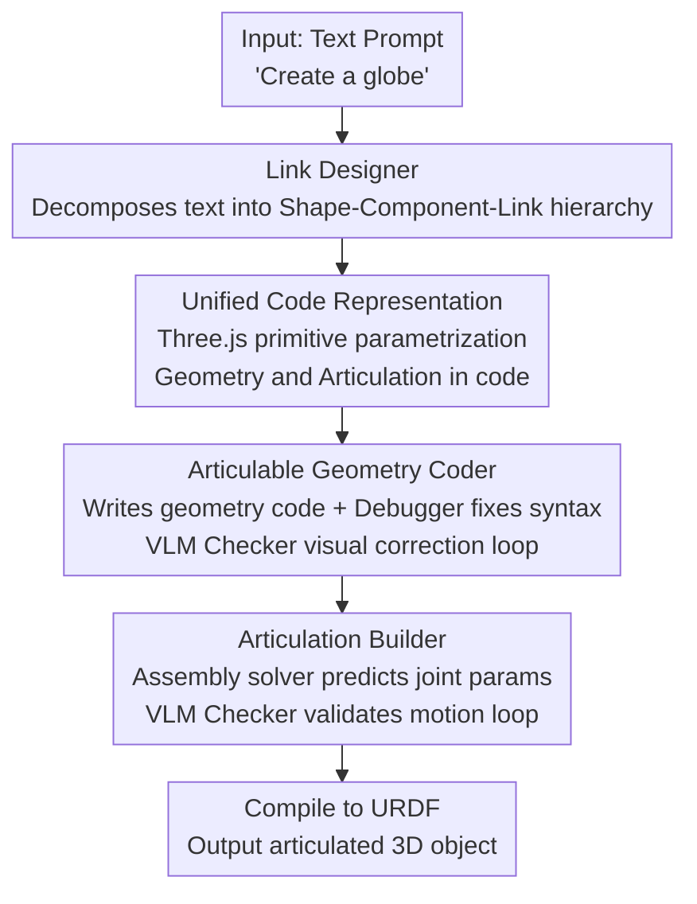

# LAM: Language Articulated Object Modelers

**Conference**: CVPR 2026  
**Paper**: [CVF Open Access](https://openaccess.thecvf.com/content/CVPR2026/html/Gao_LAM_Language_Articulated_Object_Modelers_CVPR_2026_paper.html)  
**Code**: https://gaoypeng.github.io/LAM (Project Page)  
**Area**: 3D Vision  
**Keywords**: Articulated Object Generation, Text-to-3D, Code Generation, Multi-agent Collaboration, URDF

## TL;DR
LAM reformulates "text-to-articulated object generation" as a unified code generation task. A collaborative team of LLM and VLM modules—planning hierarchical structures, writing geometry and articulation code, and performing closed-loop error correction via VLMs—generates geometrically and kinematically correct articulated 3D objects from single sentences. It requires no visual priors or pre-made 3D assets, achieving a joint prediction success rate of 77.1%, significantly outperforming Articulate Anything's 40.3%.

## Background & Motivation

**Background**: Articulated objects (doors, drawers, scissors, keyboards with movable parts) are ubiquitous in robotics, embodied AI, games, and VR/AR, serving as key components for interactive virtual environments. Unlike static 3D objects, articulated models require manual expert annotation—representing objects as a "link hierarchy tree + corresponding joints, types, and motion ranges"—which is extremely time-consuming, resulting in datasets with only a few thousand instances.

**Limitations of Prior Work**: Most existing works rely on **inputs containing structural information** (images, videos, graphs, or meshes) for reconstruction or generation, often requiring pre-defined annotations or part graphs for guidance. This restricts inputs to structured data and faces a scalability ceiling: diffusion or graph-based methods mostly demonstrate capability on objects with few parts. Scaling to complex objects (e.g., a 20-key keyboard) is nearly impossible due to the scarcity of high-part-count training data and the computational explosion of high-resolution geometry in end-to-end models.

**Key Challenge**: Geometry generation and articulation generation are **strongly coupled**. Explicit 3D representations (meshes/voxels) incur memory costs that grow with resolution, becoming prohibitive as the number of parts increases. Conversely, ensuring correct relations between links requires joint design of geometry and articulation rather than a divide-and-conquer approach.

**Goal**: Automatically generate geometrically and kinematically correct, physically plausible articulated 3D objects from pure text (no visual/structural priors), with scalability to complex high-part-count objects.

**Key Insight**: The authors observe that **code** is a highly compressed parametric 3D representation. Unlike meshes or voxels, the cost of code is nearly independent of geometric resolution, allowing for the efficient definition of complex objects with large and variable part counts.

**Core Idea**: Unify geometry and articulation into a single, interpretable code representation. Code acts as the "structural bridge" between links. A team of specialized LLM/VLM modules collaborates on generation, using a VLM-based render-and-feedback closed-loop for self-correction.

## Method

### Overall Architecture
The input is a text description $x$, and the output is an articulated object $A=(\mathcal{L},\mathcal{J})$ consisting of a set of links $\mathcal{L}=\{L_i=(M_i,T_i)\}$ (mesh $M_i$ and pose $T_i\in SE(3)$ for each link) and a set of joints $\mathcal{J}=\{J_{pc}=(T_{pc},t_{pc},a_{pc},\ell_{pc})\}$ (joint pose, type, axis, and range). A compiler $\Psi$ converts $A$ into a physically plausible URDF. LAM operates through a sequence of modules: the **Link Designer** (LLM) first decomposes text into a "Shape → Component → Link" hierarchy; the **Articulable Geometry Coder** translates this into Three.js geometry code, followed by a Debugger for syntax and a VLM Checker for visual error correction; the **Articulation Builder** predicts joint parameters on aligned links, writes joint code, and uses a Debugger and VLM Checker to ensure physical plausibility. Code remains the unified representation throughout, finally compiled into URDF.

### Key Designs

**1. Unified Code Representation: Code as a Resolution-Independent 3D Generation Medium**

End-to-end text-to-3D fails to scale because explicit geometry memory explodes with resolution and part count. LAM treats code as a highly compressed parametric representation, where the cost is largely independent of resolution. To make structure manageable for LLMs, the authors introduce a **hierarchical code representation**, assembling shape primitives $S=\{s_k(\phi_k)\}$ (calling Three.js factories like `<BoxGeometry>(l,w,h)` normalized to a shared frame) into components and then links. This structured representation bypasses controllability limits of end-to-end methods and makes code an **interpretable structural bridge** between links, ensuring correct relationships—the fundamental reason it can generate high-part-count objects like 20-key keyboards.

**2. Link Designer: Hierarchical Planning Before Coding**

Generating an entire articulated object at once often leads to structural chaos. The Link Designer (defaulting to GPT-4o) reasons over the text to decompose the target into a "Shape → Component → Link" hierarchy and their relations, creating an assembly blueprint. Subsquent Coders follow this blueprint, ensuring that part membership and parent-child relationships are clear from the start.

**3. Articulable Geometry Coder: Closed-Loop Correction via VLM Render-Feedback**

Initial LLM geometry code often contains hallucinated errors or physical implausibility (e.g., misalignment between a sphere and its arch). The Geometry Coder translates the link blueprint into executable code. A **Geometry Debugger** fixes syntax, followed by a **Geometry Checker** (2D VLM like GPT-4o or 3D VLM like PointLLM) that corrects geometric errors: a **Geometry Visualizer** renders multi-view images and point clouds (with per-link coloring for easy reference), and the Checker provides targeted feedback (e.g., "the sphere is misaligned with the arch") to drive iterative refinement until the geometry is confirmed. This **multimodal closed-loop feedback** is the cornerstone of the system.

**4. Articulation Builder: Joint Decoupling via Assembly Solver and VLM Motion Loop**

Predicting relative poses is difficult. The **Joint Assembly Solver** simplifies this: since links produced in the geometry stage are already aligned in a shared world frame, it **bypasses complex relative joint pose prediction** and only predicts joint types $t_{pc}$, parent-child pairs $(L_p,L_c)$, and absolute 3D joint positions $p_{pc}$. Assembly starts from a base link and iterates: prismatic and fixed joints require no position updates; revolute joints recalculate child link positions to ensure correct rotation around the joint $p_c^\text{new}=p_{pc}+R_{pc}(p_c-p_{pc})$, propagating updates along the kinematic chain. The **Articulation Coder** (defaulting to o3) then generates joint code, the **Articulation Debugger** fixes syntax, and the **Articulation Visualizer** simulates motion sequences. The **Articulation Checker** (2D VLM) judges physical plausibility (e.g., whether a door opens in the wrong direction) and provides feedback until valid.

### Key Experimental Results

#### Main Results
Evaluated on Part-Mobility datasets (5 classes from Real2Code, 6 shared from CAGE/SINGAPO, 46 General Classes, and 27 complex objects in LAMBench Open-World Classes). `LAM*` denotes default commercial models; "zero-shot" is Qwen3-VL-8B; "finetuned" is Qwen3-VL-8B on LAMBench.

| Joint Success Rate | Five Classes | General Classes |
|--------------------|--------------|-----------------|
| Real2Code          | 13.5%        | –               |
| URDFormer          | –            | 14.6%           |
| Articulate Anything| 40.3%        | 48.9%           |
| **LAM\***          | **77.1%**    | **68.2%**       |
| LAM (zero-shot)    | 36.8%        | 44.3%           |
| LAM (finetuned)    | 51.6%        | 49.6%           |

Visual alignment (CLIP/BLIP) and articulation plausibility (GPT-5 pass rate) on shared classes:

| Method             | CLIP ↑ | BLIP ↑ | GPT-5 ↑ |
|--------------------|--------|--------|---------|
| CAGE               | 27.65  | 53.92  | 53.9%   |
| SINGAPO            | 30.43  | 56.21  | 58.8%   |
| Articulate Anything| 28.23  | 56.99  | 65.3%   |
| **LAM\***          | **31.94**| **63.76**| **77.0%**|
| LAM (finetuned)    | 29.55  | 58.38  | 69.3%   |

#### Ablation Study
In-distribution generation quality (lower MMD is better, higher COV is better, lower 1-NNA is better):

| Method             | MMD ↓  | COV ↑  | 1-NNA ↓ | Note |
|--------------------|--------|--------|---------|------|
| CAGE               | 0.0193 | 0.6064 | 0.5319  | Diffusion+Graph base |
| ArtFormer-PR       | 0.0214 | 0.6400 | 0.3950  | Strong baseline |
| **LAM\***          | **0.0149**| **0.6871**| **0.3599**| Best performance |
| LAM (finetuned)    | 0.0210 | 0.6235 | 0.4369  | Significant improvement via LAMBench |

### Key Findings
- **Unified Code Representation leads**: LAM* is optimal across MMD, COV, and 1-NNA, showing shape distributions that are both closer to ground truth and more diverse.
- **LAMBench significantly boosts open-source models**: Qwen3-VL-8B saw joint success rates jump from 36.8%→51.6% and GPT-5 pass rates from 66.1%→69.3% after fine-tuning.
- **Superiority in complexity**: In Open-World evaluation, LAM achieved a 91.7% user preference. It dominates Articulate Anything in generalization and complex object handling.

## Highlights & Insights
- **Treating "Code as 3D Representation" for articulated objects is the smartest move**: By decoupling cost from resolution, LAM bypasses memory bottlenecks of end-to-end models, enabling high-part-count generation.
- **Leveraging geometric alignment for articulation**: Since links are already aligned in a shared frame during the geometry stage, the joint stage avoids predicting complex relative poses, simplifying the problem significantly.
- **VLM feedback-loop makes generation error-correctable**: Per-link coloring allows VLMs to give specific feedback, turning text-to-3D into an iterative refinement process that is far more robust than one-shot generation.

## Limitations & Future Work
- **Heavy reliance on commercial models**: High scores for LAM* depend on GPT-4o/o3/Gemini. The open-source gap is still significant.
- **Geometry limited to Three.js primitives**: Parametric assembly using primitives might struggle with highly irregular or organic shapes.
- **Evaluation bias**: Relying on LLM judges (GPT-5 pass rate) introduces potential bias; objective physical simulation (e.g., grasping) is lacking.
- **Cost and convergence**: The time/token cost of multi-round VLM loops and the risk of infinite loops in feedback are not extensively discussed.

## Related Work & Insights
- **vs Articulate Anything**: Both use code-to-URDF, but LAM uses unified code for both geometry and joints with VLM loops, leading to 77.1% vs 40.3% joint success.
- **vs CAGE / ArtFormer**: Diffusion/Graph models struggle with high-part-count data scarcity and memory; LAM uses code to bypass these limits.
- **vs SINGAPO**: While SINGAPO requires image inputs and fails on OOD classes, LAM generalizes to new classes from text alone.

## Rating
- Novelty: ⭐⭐⭐⭐⭐ Decoupling part-count from memory via code and multi-agent loops is a novel path.
- Experimental Thoroughness: ⭐⭐⭐⭐ Extensive metrics across success rates, alignment, and quality, though physical simulation validation is thin.
- Writing Quality: ⭐⭐⭐⭐ Clear frameworks and intuitive examples.
- Value: ⭐⭐⭐⭐⭐ High potential for generating interactive assets for embodied AI and robotics training.

<!-- RELATED:START -->

## Related Papers

- [\[CVPR 2026\] ArtPro: Self-Supervised Articulated Object Reconstruction with Adaptive Integration of Mobility Proposals](artpro_self-supervised_articulated_object_reconstruction_with_adaptive_integrati.md)
- [\[CVPR 2026\] ArtLLM: Generating Articulated Assets via 3D LLM](artllm_generating_articulated_assets_via_3d_llm.md)
- [\[CVPR 2026\] DICArt: Advancing Category-level Articulated Object Pose Estimation in Discrete State-Spaces](dicart_advancing_category-level_articulated_object_pose_estimation_in_discrete_s.md)
- [\[CVPR 2026\] ArtHOI: Taming Foundation Models for Monocular 4D Reconstruction of Hand-Articulated-Object Interactions](arthoi_taming_foundation_models_for_monocular_4d_reconstruction_of_hand-articula.md)
- [\[CVPR 2026\] Copy-Transform-Paste: Zero-Shot Object-Object Alignment Guided by Vision-Language and Geometric Constraints](copy-transform-paste_zero-shot_object-object_alignment_guided_by_vision-language.md)

<!-- RELATED:END -->
