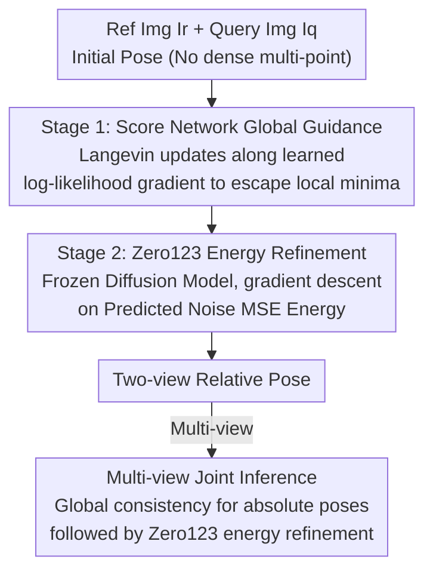

# Landscape-Awareness for Geometric View Diffusion Model

**Conference**: CVPR 2026  
**Paper**: [CVF Open Access](https://openaccess.thecvf.com/content/CVPR2026/html/Chen_Landscape-Awareness_for_Geometric_View_Diffusion_Model_CVPR_2026_paper.html)  
**Code**: To be confirmed  
**Area**: 3D Vision / Camera Pose Estimation  
**Keywords**: Two-view pose estimation, Diffusion models, score-based optimization, optimization landscape, Zero123

## TL;DR
Addressing the pain point where using Zero123 noise space MSE for two-view camera pose estimation leads to a loss landscape riddled with local minima requiring brute-force multi-initialization, this paper attributes the root cause to landscape local minima caused by geometric symmetry/self-similarity. It uses a score network in the first stage to reshape update directions toward high-likelihood regions of the ground truth pose, followed by a second stage using frozen Zero123 MSE for refinement, significantly improving success rates and sampling efficiency with minimal reliance on multi-initialization.

## Background & Motivation

**Background**: In camera relative pose estimation under sparse views (especially with only two images and large baselines), traditional feature matching fails due to insufficient overlap. A representative recent approach "inverts" the pose-conditional diffusion model Zero123: given a reference image, a query image, and a candidate relative pose, the frozen Zero123 predicts noise, and the MSE between predicted and actual noise is used as an energy function for gradient descent (e.g., ID-Pose, iFusion). Compared to energy methods like RelPose that require brute-force sampling of tens of thousands of candidates, using MSE as energy allows for smoother, end-to-end gradient optimization.

**Limitations of Prior Work**: Even with smooth gradients from diffusion models, these methods still must start from multiple initial poses and select the one with the minimum loss to avoid converging to incorrect views—meaning the optimization is extremely sensitive to initialization.

**Key Challenge**: The authors visualize the loss landscape of Zero123 MSE under fixed image pairs and varying conditional poses (latitude/longitude in spherical coordinates as x/y axes, normalized MSE as z-axis). They find the landscape is not a single basin: while some objects have a clear minimum, many exhibit local minima along longitudinal plateaus or deep valleys 180° apart due to **geometric symmetry and self-similarity**. Once a trajectory slides into a local minimum, it stops—this is the root cause of the "multi-initialization" requirement, stemming from the geometric properties of the landscape itself rather than optimizer tuning.

**Goal**: Transform pose estimation from "repeated multi-point restarts on a bad surface" to "reshaping the surface/gradient field first, then refining," thereby eliminating the dependency on dense multi-initialization and improving sampling efficiency.

**Key Insight**: Since local minima originate from the data distribution itself, a network can be trained to approximate the log-likelihood gradient (score) of the data distribution. This network "pushes" any initial pose toward high-likelihood regions in the first stage, crossing bad minima; the second stage then hands over to the higher-precision Zero123 energy for local refinement.

**Core Idea**: Reshape the optimization landscape and gradient field using a score network to escape local minima, followed by Zero123 MSE refinement—where the score provides global guidance and diffusion energy provides local refinement.

## Method

### Overall Architecture
The method is a **two-stage optimization framework** aiming to estimate the relative pose $(\Theta,\Phi,\rho)$ (spherical coordinates: latitude, longitude, and radius difference) between reference image $I_r$ and query image $I_q$. The first stage uses a lightweight score network $s_\theta(I_r,I_q,\tilde{x})$ to predict the pose update direction, performing Langevin-style iterations along the learned log-likelihood gradient to push the pose toward high-probability regions, bypassing local minima on the Zero123 MSE landscape. After escaping bad minima (using a fixed iteration threshold), the second stage treats the frozen Zero123 as an energy function, refining the pose using the MSE gradient of predicted vs. actual noise. Both stages rely on gradient updates, differing only in the gradient source: explicitly from the learned score in stage one, and implicitly from the energy loss in stage two. In multi-view scenarios, relative poses for each pair are first derived via the score network, followed by a global consistency optimization to obtain absolute poses as a strong initialization for the final Zero123 energy refinement.

### Key Designs

**1. Score-based Global Guidance Phase: Reshaping Gradient Fields to Escape Local Minima**

This stage directly addresses the "local minima on the landscape" pain point. Researchers train a score network $s_\theta$ to approximate the log-likelihood gradient of the valid pose distribution conditioned on image pair $y$. The network is lightweight: ResNet-50 extracts image features, conditional poses are encoded via sinusoidal embeddings, and both are concatenated through a three-layer MLP to output the score. Training utilizes a conditional version of Denoising Score Matching (DSM): $L(\theta)=\tfrac12\mathbb{E}_{x,y}\mathbb{E}_{\tilde{x}}\|s_\theta(\tilde{x},y)-\nabla_{\tilde{x}}\log p_\sigma(\tilde{x}\mid x,y)\|_2^2$. A key simplification: since the score network operates in lower-dimensional pose space, the authors sample $\tilde{x}$ from a uniform distribution $U$ and fix the noise scale at $\sigma=1$, removing the need for noise level conditioning. Uniform sampling allows the model to learn the **global gradient structure of the entire pose space** rather than just local neighborhoods around the ground truth. During inference, Langevin-like updates follow $\tilde{x}_t=\tilde{x}_{t-1}+\alpha s_\theta(\tilde{x}_{t-1},y)+G z_t$ (where $G=\mathrm{diag}(\gamma_1,\gamma_2,\gamma_3)$ controls noise scales). The learned score provides drift toward high-likelihood regions while Gaussian noise encourages exploration, ensuring the expected pose error norm $\|\mathbb{E}[\tilde{x}_t-x_{gt}]\|=M(1-\alpha)^t$ decays exponentially. The appendix further proves (Lemma 2) that under the assumption of a unique ground truth pose per image pair, the uniform sampling simplification shares the same optimal solution as the original Gaussian kernel objective.

**2. Zero123 Energy Refinement Phase: Local Refinement via Generative Priors**

After escaping bad minima, the pose resides in a geometrically consistent region but lacks precision. The second stage reuses the frozen Zero123: the query image is encoded into latent space with Gaussian noise $z_t$. Zero123 predicts noise conditioned on the reference image and current pose. The MSE between predicted and actual noise serves as energy $E$, and its gradient is used for descent. This essentially solves the symmetrical inverse problem: $\hat{T}_{r\to q}=\arg\min_{T}\,L(I_q,(I_r,T))+L(I_r,(I_q,T^{-1}))$. This complements the first stage: the score provides global guidance to avoid traps, while the diffusion energy provides fine-grained local correction. Utilizing Zero123's powerful generative prior allows even unseen objects to be refined accurately, even if the score model was trained on limited data.

**3. Multi-view Joint Inference: Correcting Individual Pairs via Global Consistency**

Extending two-view methods to multi-view naively by processing pairs independently loses multi-view consistency. Instead, the authors perform energy optimization in high-dimensional pose space: $\hat{T}=\arg\min_{\{T_1,\dots,T_n\}}\sum_i\sum_{j\neq i}L\big(I^{(j)},(I^{(i)},T_i^{-1}T_j)\big)$, parameterized by absolute poses ($T_{i\to j}=T_i^{-1}T_j$) to eliminate redundancy and enforce global consistency. Since the solution space grows exponentially with the number of views, the two-stage framework is applied: first, the score network outputs all pairwise relative poses; then, a global optimization provides consistent absolute poses as a strong initialization for final Zero123 energy refinement.

### Loss & Training
The score network is trained with a conditional DSM loss (Eq. 3) where $\tilde{x}\sim U$ and $\sigma=1$ is fixed. In the second stage, Zero123 is entirely frozen and used only during inference as an energy function to compute pose gradients. A fixed iteration threshold is used to switch between stages.

## Key Experimental Results

### Main Results
Pose estimation results on synthetic datasets GSO and OO3D. Two custom metrics are used: **Recall (R)**, whether the prediction with the minimum loss out of $N$ random initializations meets the threshold; and **Success Rate (SR)**, evaluating the percentage of all $N$ predictions that meet the threshold (measuring robustess to initialization). `@5/@15/@30` denote rotation thresholds (degrees) with a fixed translation threshold of 0.2. `Rot./Trans.` are median errors.

| Dataset | Method | SR@15 ↑ | SR@30 ↑ | R@30 ↑ | Rot.↓ |
|---------|--------|---------|---------|--------|-------|
| GSO | ID-Pose | 0.118 | 0.146 | 0.607 | 10.29 |
| GSO | iFusion | 0.365 | 0.382 | 0.918 | 3.07 |
| GSO | **Ours** | **0.811** | **0.836** | 0.927 | 3.63 |
| OO3D | iFusion | 0.306 | 0.332 | 0.882 | 4.76 |
| OO3D | **Ours** | **0.780** | **0.848** | 0.905 | 5.15 |

The Success Rate (SR) shows the most significant Gain: on GSO, SR@30 increased from 0.382 (iFusion) to 0.836, and on OO3D from 0.332 to 0.848. This indicates the method is far more robust to initialization. Meanwhile, Recall (best-case) and Rotation/Translation errors remain competitive with the SoTA (GSO Rot. 3.63 vs iFusion 3.07), confirming that the goal is robust global convergence rather than just improving peak accuracy.

Validation on the real-world dataset HOPEv2 (28 grocery objects, 50 scenes) confirmed robustness, specifically resolving ambiguities in geometrically symmetric objects using texture differences:

| Dataset | Method | SR@30 ↑ | Rot.↓ | Trans.↓ |
|---------|--------|---------|-------|---------|
| HOPEv2 | VGGT | 0.631(R) | 8.10 | 0.132 |
| HOPEv2 | iFusion | 0.206 | 14.78 | 0.151 |
| HOPEv2 | **Ours** | **0.786** | 8.96 | **0.059** |

### Ablation Study
Ablation of the two-stage multi-view joint inference (Recall@15 relative to view count):

| Configuration | 2 views | 3 views | 4 views | 5 views | Note |
|---------------|---------|---------|---------|---------|------|
| w/o Stage 1 | 0.200 | 0.103 | 0.065 | 0.075 | Without score guidance, performance drops as view count increases |
| Stage 1 + 2 | Higher | Higher | Higher | Higher | Two stages are complementary |

Removing Stage 1 leads to a rapid decline in multi-view recall as view counts increase (0.200 to 0.075 for 2 to 5 views), demonstrating that without score-based global guidance, energy optimization easily traps in local minima within the high-dimensional pose space.

### Key Findings
- **Stage 1 (Score Guidance)** is the source of "robustness": it contributes most to SR and multi-view recall.
- **Stage 2 (Zero123 Refinement)** is the source of "precision and generalization": leveraging generative priors allows accurate refinement even for unseen objects.
- When the number of samples $N$ is small, Ours shows a significant recall advantage over iFusion, validating the goal of reduced dependency on dense multi-initialization.

## Highlights & Insights
- **Novelty in Diagnosis**: Visualizing the loss landscape to pinpoint local minima caused by geometric symmetry provides a more convincing narrative than simply stacking networks.
- **Pose-Space Simplification**: The low-dimensional pose space allows for a simplified score training objective (uniform sampling + fixed $\sigma$), which is theoretically consistent with standard diffusion objectives under the "unique ground truth" assumption.
- **Methodological Paradigm**: The "score-based global guidance + diffusion energy refinement" strategy is transferable to other non-convex inverse problems (e.g., shape or lighting estimation from generative models).

## Limitations & Future Work
- The switch between stages uses a **fixed iteration threshold** rather than an adaptive criterion, which may require tuning across different datasets.
- On "best-case" metrics like Recall and Rotation error, the method is on par with SoTA but doesn't significantly exceed it; its value is concentrated on success rate and sampling efficiency.
- The score network depends on training data, though Stage 2's Zero123 helps generalize to unseen objects.

## Related Work & Insights
- **vs iFusion / ID-Pose**: These also use Zero123 MSE as energy but rely on multi-point restarts. Ours reshapes the gradient field using scores first.
- **vs RelPose**: RelPose requires sampling tens of thousands of candidates; Ours supports end-to-end gradient optimization via smooth energy and score guidance.
- **vs DUSt3R / VGGT**: These predict dense geometry and excel in Recall; Ours offers a complementary path via generative model inversion and landscape reshaping.

## Rating
- Novelty: ⭐⭐⭐⭐⭐ (Attributing failures to visualized landscape minima and reshaping them is a fresh perspective)
- Experimental Thoroughness: ⭐⭐⭐⭐ (Synthetic/Real datasets and multi-view coverage, though some ablation values are partially presented)
- Writing Quality: ⭐⭐⭐⭐ (Clear motivation and visualization)
- Value: ⭐⭐⭐⭐ (Significantly improves sampling efficiency for generative inversion tasks)

<!-- RELATED:START -->

## Related Papers

- [\[CVPR 2026\] Iris: Bringing Real-World Priors into Diffusion Model for Monocular Depth Estimation](iris_bringing_realworld_priors_into_diffusion_model_for_monocular_depth_estimation.md)
- [\[CVPR 2026\] DMAligner: Enhancing Image Alignment via Diffusion Model Based View Synthesis](dmaligner_enhancing_image_alignment_via_diffusion_model_based_view_synthesis.md)
- [\[CVPR 2026\] Iris: Integrating Language into Diffusion-based Monocular Depth Estimation](iris_integrating_language_into_diffusion-based_monocular_depth_estimation.md)
- [\[CVPR 2026\] DuoMo: Dual Motion Diffusion for World-Space Human Reconstruction](duomo_dual_motion_diffusion_for_world-space_human_reconstruction.md)
- [\[CVPR 2026\] MatE: Material Extraction from Single-Image via Geometric Prior](mate_material_extraction_from_single-image_via_geometric_prior.md)

<!-- RELATED:END -->
