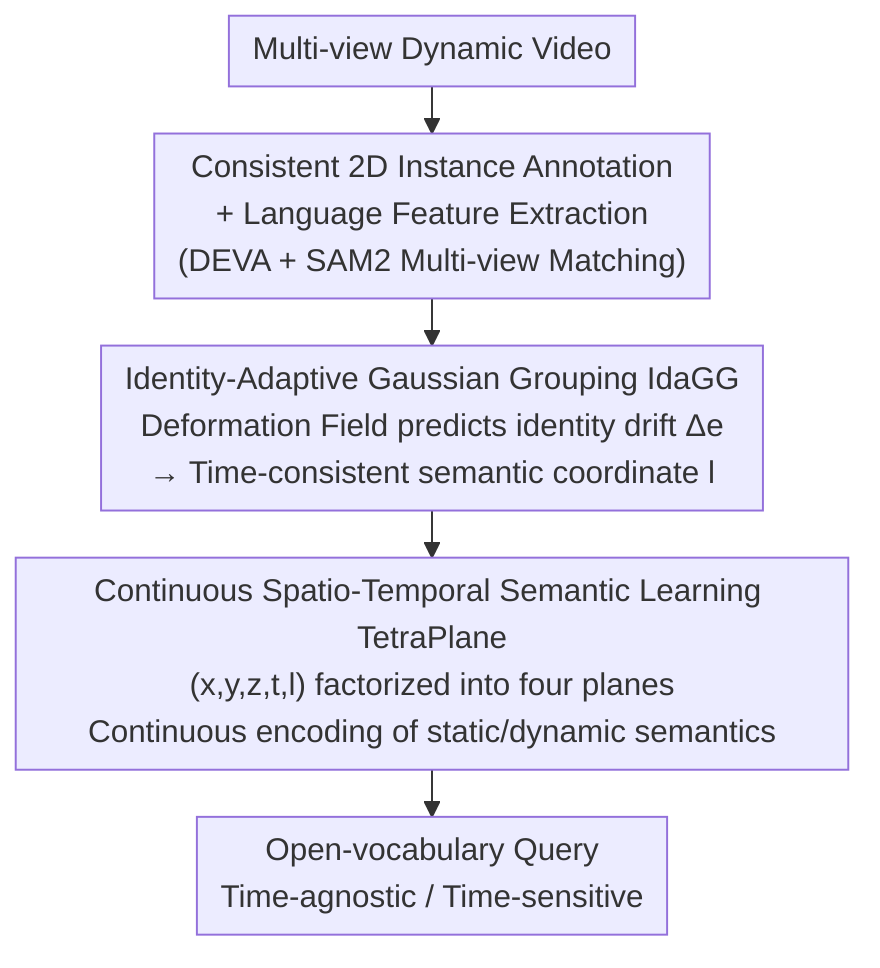

# LangField4D: Learning Identity-Adaptive and Spatio-Temporal Continuous 4D Language Fields for Dynamic Scenes

**Conference**: CVPR 2026  
**Paper**: [CVF Open Access](https://openaccess.thecvf.com/content/CVPR2026/html/Xu_LangField4D_Learning_Identity-Adaptive_and_Spatio-Temporal_Continuous_4D_Language_Fields_for_CVPR_2026_paper.html)  
**Code**: To be confirmed  
**Area**: 3D Vision  
**Keywords**: 4D Language Field, Gaussian Splatting, Open-vocabulary Query, Identity-Adaptive, Spatio-Temporal Continuous Semantics

## TL;DR
LangField4D constructs an open-vocabulary language field on 4D Gaussian Splatting. It addresses semantic inconsistency caused by Gaussian drift across object boundaries via "Identity-Adaptive Gaussian Grouping" and replaces discrete state prototypes with a "TetraPlane Continuous Spatio-Temporal Semantic Representation," setting new SOTAs for both time-agnostic and time-sensitive queries in dynamic scenes.

## Background & Motivation

**Background**: Injecting semantic embeddings from vision-language models like CLIP into NeRF or 3D Gaussian Splatting (3D-GS) has enabled open-vocabulary queries in static scenes (e.g., LERF, LangSplat). To extend this to dynamic scenes, a natural progression is to build "4D Language Fields" on 4D Gaussian Splatting (4D-GS, which models motion with deformation fields), with 4DLangSplat being the representative SOTA in this direction.

**Limitations of Prior Work**: 4DLangSplat employs a dual-field design: a static field for time-agnostic semantics (inheriting LangSplat's CLIP features) and a dynamic field for time-varying semantics. However, it relies on two flawed assumptions: (1) it assumes the identity of each Gaussian remains fixed, whereas in reality, deformation fields can "twist" the same Gaussian across different object boundaries—a phenomenon the authors call **Gaussian ID Oscillation**, leading to flickering or inconsistent semantics for the same instance; (2) dynamic semantics are modeled using $K$ discrete pre-defined state prototypes with interpolation, which introduces **Action Boundary Bias**, failing to capture continuous state transitions and blurring fine-grained temporal boundaries (e.g., the exact moment a cookie is snapped).

**Key Challenge**: A 4D language field must simultaneously model "time-agnostic semantics" (what the object is) and "time-varying semantics" (what it is doing at this moment). The former requires **temporal identity stability**, while the latter requires **temporally continuous and differentiable states**. Previous methods adopted static assumptions for identity and discrete prototypes for states, failing to satisfy either requirement.

**Goal**: (1) Enable each Gaussian to correctly correspond to its object instance at any timestamp; (2) model time-varying semantics as continuous functions rather than discrete prototype interpolations.

**Key Insight**: Since the deformation field is the root cause of identity drift, it should be leveraged to "predict the identity drift." Furthermore, as 4D-GS already factorizes spatio-temporal fields into multiple planes (HexPlane) for geometric decoupling, the semantic field can use similar factorized planes while incorporating "instance identity" as a new queryable dimension.

**Core Idea**: Replace "identity-static" with "identity-adaptive" to eliminate ID oscillation, and replace "discrete state prototypes" with "continuous TetraPlane semantics" to eliminate action boundary bias.

## Method

### Overall Architecture
LangField4D is built upon 4D-GS as a two-stage serial pipeline. The input is multi-view video of a dynamic scene, and the output is a 4D language field supporting open-vocabulary text queries that distinguish between "time-agnostic" and "time-sensitive" semantics.

Data preprocessing (following the 4DLangSplat route) involves: extracting temporally consistent hierarchical instance masks for each view using DEVA, followed by a SAM2-based prompted multi-view matching mechanism. This mechanism treats multi-view images at a single timestamp as a "pseudo-video," propagates reference masks into the SAM2 memory bank for other views, and utilizes voting by matching frequency to achieve consistent global instance IDs and pixel-level CLIP/text language features as supervision signals.

Subsequently, two core modules are introduced: **Identity-Adaptive Gaussian Grouping (IdaGG)** first calculates a drift-corrected discrete instance label $l$ (semantic coordinate) for each Gaussian to suppress ID oscillation. **Continuous Spatio-Temporal Semantic Learning (TetraPlane)** then uses these semantic coordinates as anchors to factorize the 5D space $(x,y,z,t,l)$ into four 2D planes, continuously encoding static and dynamic semantics. Finally, two lightweight MLPs decode these into text-queryable semantic embeddings.

### Key Designs

**1. Identity-Adaptive Gaussian Grouping (IdaGG): Predicting identity drift via the deformation field to eliminate Gaussian ID Oscillation**

To address the issue where Gaussians switch identities due to deformation, IdaGG modifies the original Gaussian Grouping, which assigns each Gaussian a **static** identity encoding $e\in\mathbb{R}^{16}$. In dynamic scenes, this encoding fails to follow motion. IdaGG's approach: given a Gaussian's spatial position $(x,y,z)$ and time $t$, it queries the 4D-GS HexPlane encoder for a deformation-aware feature $f_d$ (which implicitly contains motion-induced instance membership changes). A lightweight identity-adaptive head $\phi_{id}$ within the MLP decoder $D$ then predicts a drift correction for the identity encoding, resulting in an adaptive encoding at time $t$:

$$e' = e + \phi_{id}(f_d).$$

$e'$ is rendered into 2D identity feature maps via differentiable splatting and restored to $n$ dimensions ($n$ is the total number of mask labels) via a linear layer $FC_{cls}$ for softmax classification. Optimization uses a 2D identity loss $\mathcal{L}_{2d}$ (cross-entropy) and a 3D regularization $\mathcal{L}_{3d}$ (encouraging local consistency among neighboring Gaussians). After training, the $\arg\max$ of the dynamic identity embedding assigns a consistent discrete label $l\in\{1,\dots,n\}$ to all Gaussians of the same object. This $l$ acts as a **semantic coordinate**—a stable instance identifier. Compared to static $e$, it explicitly learns identity changes through the deformation field, eliminating ID oscillation at its root.

**2. Continuous Spatio-Temporal Semantic Learning (TetraPlane): Factorizing instance identity as a new dimension to eliminate Action Boundary Bias**

To address the blurring of action boundaries caused by discrete prototype interpolation, the semantic coordinate $l$ (an abstract identifier) must be mapped to language features along with its spatio-temporal context $(x,y,z,t)$. Inspired by factorization, the authors decompose this 5D semantic space into four multi-resolution 2D planes (collectively called **TetraPlane**): three **space-semantic planes** $P_{xl}, P_{yl}, P_{zl}$ encoding time-agnostic object-level semantics, and one **time-semantic plane** $P_{tl}$ merging object-level cues with time to continuously model object states. Each plane $P_c\in\mathbb{R}^{h\times mN\times mN}$. For each Gaussian, coordinates are projected onto corresponding planes for bilinear interpolation. Features are fused via Hadamard products, concatenated across $m$ resolution levels, and passed through a small MLP $\phi_d$:

$$f_{sem}(g) = \phi_d\!\left(\prod_{c}^{m} f(g)_c\right).$$

Two lightweight MLP decoders split $f_{sem}$ into static semantics $\phi_{static}$ (time-agnostic) and dynamic semantics $\phi_{dynamic}$ (time-sensitive). By replacing discrete interpolation with differentiable queries in a continuous latent space with $t$ as a variable, smooth semantics are obtained at any time point, and action boundaries are no longer "flattened." Training uses an alternating strategy between static and dynamic targets, primarily supervised by $\mathcal{L}_{lang}$ (L1) between rendered features and target embeddings, alongside spatial TV regularization $\mathcal{L}_{TV}$ and a 1D Laplacian smoothing loss $\mathcal{L}_{smooth}$ along the time dimension.

### Loss & Training
- Reconstruction phase: $\mathcal{L}_{render} = \mathcal{L}_{rgb} + \lambda_{id}(\mathcal{L}_{2d} + \mathcal{L}_{3d})$, where $\mathcal{L}_{rgb}$ is the 4D-GS image reconstruction loss.
- Semantic TetraPlane phase: $\mathcal{L}_{tetra} = \mathcal{L}_{lang} + \mathcal{L}_{TV} + \mathcal{L}_{smooth}$, alternating optimization for static and dynamic targets.

## Key Experimental Results

**Metrics**: Time-agnostic queries use **mIoU** (mean intersection over union across all test frames); time-sensitive queries use **Acc** (ratio of correct time intervals) and **vIoU** (video IoU for temporal consistency).

### Main Results
Dataset: 4DLangSplat benchmark (built on HyperNeRF and Neu3D). Comparison highlights 4DLangSplat (4D open-vocabulary SOTA) and other 3D language feature rendering methods for time-agnostic queries.

Time-sensitive queries (HyperNeRF, %, higher is better):

| Test Scene | 4DLangSplat vIoU | Ours vIoU | 4DLangSplat Acc | Ours Acc |
|----------|------------------|-----------|-----------------|----------|
| chickchicken | 72.83 | 75.61 | 88.04 | 88.04 |
| split-cookie | 33.36 | **79.95** | 47.17 | **92.45** |
| espresso | 50.46 | 51.23 | 82.51 | 84.61 |
| americano | 31.49 | 50.46 | 52.88 | 74.04 |
| **overall** | 47.04 | **64.31** | 67.65 | **84.79** |

Time-agnostic queries (mIoU %):

| Method | HyperNeRF | Neu3D |
|------|-----------|-------|
| Feature-3DGS | 36.63 | 34.96 |
| Gaussian Grouping | 50.49 | 49.93 |
| LangSplat | 74.92 | 61.49 |
| 4DLangSplat | 80.93 | 55.18 |
| **Ours** | **83.09** | **71.62** |

Time-sensitive overall vIoU improved from 47.04 to 64.31, and Acc from 67.65 to 84.79. Gains primarily stem from scenes with distinct action boundaries like split-cookie (vIoU 33 to 80). Time-agnostic performance on Neu3D saw a significant jump (55.18 to 71.62), indicating that identity adaptation also benefits static localization of dynamic objects.

### Ablation Study
Ablation of TetraPlane and IdaGG (HyperNeRF):

| Configuration | Time-agnostic mIoU | Time-sensitive vIoU | Time-sensitive Acc | Description |
|------|--------------|--------------|-------------|------|
| MLPs | 80.85 | 51.61 | 71.95 | Dual MLP decoder baseline |
| MLPs + IdaGG | 82.63 | 52.59 | 70.79 | With identity adaptation |
| TetraPlane | 81.94 | 60.03 | 80.97 | With continuous plane representation |
| TetraPlane + IdaGG | **83.09** | **64.31** | **84.79** | Full model |

### Key Findings
- **TetraPlane drives time-sensitive performance**: Switching from MLPs (vIoU 51.61) to TetraPlane (60.03) yielded a ~9 point jump, proving continuous representations are vital for modeling state evolution and removing action boundary bias.
- **IdaGG enhances time-agnostic accuracy and boundary stability**: It consistently boosts time-agnostic performance across semantic backbones and qualitatively suppresses ID oscillation, maintaining sharp object boundaries during motion.
- The combination of both yields the best results, showing that "stable identity" and "continuous semantics" are complementary.

## Highlights & Insights
- **Predicting identity drift via the deformation field** is an elegant solution: since the deformation field already calculates Gaussian movement, letting it output identity drift $\Delta e$ resolves ID oscillation with almost no structural overhead.
- **Factorizing instance identity as a queryable dimension** is the most innovative aspect: while HexPlane factorizes geometry, TetraPlane extends this to "Space $\times$ Semantic" and "Time $\times$ Semantic," unifying static identity and dynamic states in a compact, differentiable 5D decoupled space.
- The use of a 1D temporal Laplacian loss to penalize state "acceleration" is a transferable insight for any field requiring continuous temporal semantics (e.g., audio or action understanding).

## Limitations & Future Work
- The method depends on DEVA for segmentation and consistent IDs; if upstream consistency fails, the semantic field degrades. Modeling time-sensitive semantics remains difficult when MLLM descriptions of fine-grained actions are imprecise.
- Evaluation was limited to synthetic/controlled benchmarks (HyperNeRF/Neu3D); generalization to large-scale real-world dynamic scenes (heavy occlusion, fast motion, intersecting instances) is unverified.
- Future work could involve end-to-end optimization of instance consistency and semantic learning to reduce reliance on offline tools like DEVA/SAM2.

## Related Work & Insights
- **vs 4DLangSplat**: Both build 4D language fields, but 4DLangSplat uses static identity and discrete prototype interpolation. Ours uses identity-adaptive grouping and continuous TetraPlane, significantly outperforming it in time-sensitive tasks.
- **vs Gaussian Grouping / SA4D**: Gaussian Grouping focuses on 3D segmentation for static Gaussians. SA4D extends this to 4D with temporal identity features. This work further enables identity encodings to **adaptively drift** with the deformation.
- **vs LangSplat**: LangSplat uses SAM multi-granularity masks for static 3D open-vocabulary queries. This work temporalizes and continuous-models this approach for 4D, specifically solving the identity drift problem.

## Rating
- Novelty: ⭐⭐⭐⭐⭐ Leveraging the deformation field for identity drift and the TetraPlane queryable identity dimension are both highly effective and elegant ideas.
- Experimental Thoroughness: ⭐⭐⭐⭐ Clear two-stage ablation and rich qualitative results, though benchmarks are somewhat small and real-world generalization is not fully tested.
- Writing Quality: ⭐⭐⭐⭐ Concepts like ID Oscillation and Action Boundary Bias are clearly defined.
- Value: ⭐⭐⭐⭐ Provides a reusable paradigm for identity-adaptive and continuous semantics in dynamic 4D language fields.

<!-- RELATED:START -->

## Related Papers

- [\[CVPR 2026\] ST4R-Splat: Spatio-Temporal Referring Segmentation in 4D Gaussian Splatting](st4r-splat_spatio-temporal_referring_segmentation_in_4d_gaussian_splatting.md)
- [\[CVPR 2026\] MotionScale: Reconstructing Appearance, Geometry, and Motion of Dynamic Scenes with Scalable 4D Gaussian Splatting](motionscale_reconstructing_appearance_geometry_and_motion_of_dynamic_scenes_with.md)
- [\[CVPR 2026\] SLARM: Streaming and Language-Aligned Reconstruction Model for Dynamic Scenes](slarm_streaming_and_language-aligned_reconstruction_model_for_dynamic_scenes.md)
- [\[CVPR 2026\] Revisiting Monocular SLAM with Spatio-Temporal Scene Modeling](revisiting_monocular_slam_with_spatio-temporal_scene_modeling.md)
- [\[CVPR 2026\] Learning Explicit Continuous Motion Representation for Dynamic Gaussian Splatting from Monocular Videos](learning_explicit_continuous_motion_representation_for_dynamic_gaussian_splattin.md)

<!-- RELATED:END -->
