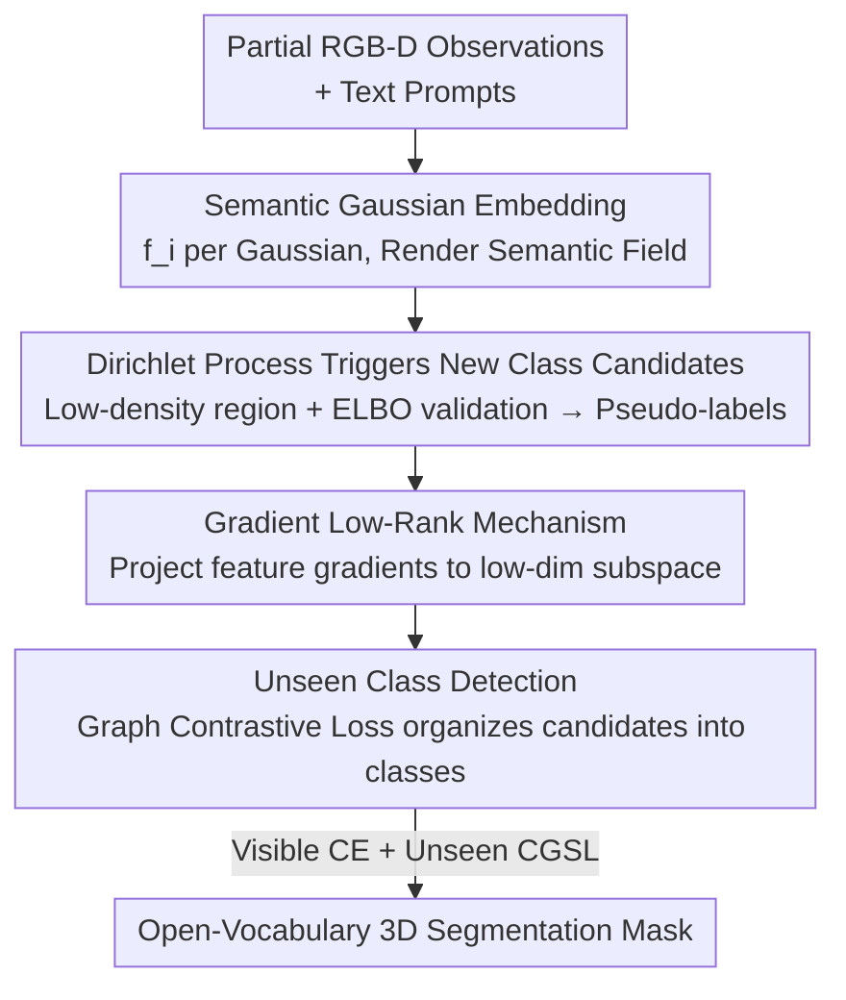

# LangRef3DGS: Natural Language-Guided 3D Referential Segmentation from Partial Observations via 3D Gaussian Splatting

**Conference**: CVPR 2026  
**Paper**: [CVF Open Access](https://openaccess.thecvf.com/content/CVPR2026/html/Ye_LangRef3DGS_Natural_Language-Guided_3D_Referential_Segmentation_from_Partial_Observations_via_CVPR_2026_paper.html)  
**Code**: https://github.com/Tap12345/LangGS (Available)  
**Area**: 3D Vision  
**Keywords**: 3D Gaussian Splatting, Language-Guided Segmentation, Open-Vocabulary, Dirichlet Process, Low-Rank Gradient

## TL;DR
A continuous semantic field is constructed on the 3D Gaussian Splatting representation. This method utilizes the Dirichlet Process to automatically discover new classes, compresses semantic features using gradient low-rank constraints, and organizes fragmented candidates into "unseen classes" via graph contrastive loss. This enables robust open-vocabulary 3D segmentation guided by natural language prompts, even under partial observation conditions with sparse or occluded RGB-D views.

## Background & Motivation
**Background**: Language-guided 3D segmentation bridges geometric awareness with semantic understanding. Given a natural language prompt (e.g., "segment the tea glass"), the method must localize and segment the corresponding object in a 3D scene. Recent mainstream approaches distill 2D vision-language features, such as CLIP, into NeRF or 3DGS representations (e.g., LERF, LangSplat, OpenGaussian) or group Gaussians into instances using SAM masks.

**Limitations of Prior Work**: Camera coverage is limited and scenes are dynamic in real-world RGB-D data, making **views naturally sparse and mutually occluded**. Supervised networks rely on dense annotations and tend to misclassify "unseen or occluded" regions into known classes after training on closed sets. Self-supervised or unsupervised methods assume fixed data distributions and fail to generalize to open-vocabulary descriptions. Many RGB-D pipelines also implicitly rely on the integrity of color/depth cues; semantic reasoning collapses when these cues are missing.

**Key Challenge**: The authors attribute these failures to two entangled factors. First, **partial observations lead to ambiguous feature entanglement**, where small or occluded objects correspond only to sparse, low-density Gaussians that are difficult to separate from existing categories. Second, the **semantic feature spaces learned by current networks are high-rank and redundant**. When distribution shifts occur, the feature manifolds of different classes overlap and become unstable, amplifying errors in open-set, language-driven, or partial-view scenarios.

**Goal**: Under partial RGB-D observations, the goal is to discover new classes outside the predefined label space while maintaining a compact and separable feature space to segment both "visible" and "unseen" categories simultaneously.

**Key Insight**: 3DGS is chosen as the carrier because it is an explicit, point-based, and differentiable representation. It supports real-time rasterization and allows semantic features to be attached as Gaussian attributes, forming a continuous semantic field that inherently propagates information to unobserved regions. Building on this, two statistical and optimization tools are introduced: the Dirichlet Process for "unsupervised class discovery" and gradient low-rank constraints to "reduce redundancy and increase separability."

**Core Idea**: By combining a 3DGS continuous semantic field, Dirichlet Process for automatic class discovery, gradient low-rank feature compression, and graph contrastive organization of new classes, the method achieves robust open-vocabulary 3D segmentation under partial observations.

## Method

### Overall Architecture
The method uses 3DGS as the foundation: each Gaussian primitive, in addition to geometry (center $\mu_i$, covariance $\Sigma_i$) and appearance $c_i$, carries a learnable semantic embedding $f_i\in\mathbb{R}^d$. Semantic features are alpha-blended along rays to construct a semantic field $S(u)=\sum_i T_i\alpha_i f_i$. Within this field, the Dirichlet Process is used to trigger potential new class candidates and pseudo-labels from "low-density Gaussian regions." Simultaneously, a gradient low-rank mechanism restricts semantic feature updates to a low-dimensional subspace to eliminate redundancy. Finally, fragmented DP candidates are integrated into a global semantic similarity graph. A graph contrastive loss clusters similar candidates into high-affinity subgraphs, upgrading "point-level evidence" into "structured unseen classes." Visible regions are supervised by cross-entropy, while unseen regions are optimized via graph contrastive loss.

### Key Designs

**1. Semantic Gaussian Embedding: Creating a differentiable continuous field to propagate information to unobserved areas**

To address missing information and the non-differentiability of discrete points in partial observations, the authors associate each Gaussian primitive $i$ with a learnable semantic vector $f_i\in\mathbb{R}^d$, forming a global semantic feature matrix $F=[f_1,\dots,f_N]^\top\in\mathbb{R}^{N\times d}$. During rendering, semantic alpha-blending at pixel $u$ yields $S(u)=\sum_{i=1}^{N}T_i\,\alpha_i\,f_i$, where $T_i=\prod_{j<i}(1-\alpha_j)$ is the transmittance. Because Gaussians provide analytical projection and blending rules, the semantic field is differentiable with respect to Gaussian parameters and can be supervised by image observations. This field serves as the foundation for language queries and "smearing" semantics from observed to unobserved areas via geometry.

**2. Dirichlet Process for New Class Candidates: Using low-density Gaussians as signals for "new concepts"**

To prevent closed-set networks from forcing unseen regions into known categories, the authors observe that in sparse or occluded views, large objects accumulate dense Gaussians, while small or partially observed objects result in sparse, low-density Gaussians. These sparse regions, difficult for existing semantic classes to explain, are natural indicators of potential new classes. A Dirichlet Process Gaussian Mixture Model (DP-GMM) is used to model semantic features: $p(f_i)=\sum_{k}\pi_k\,\mathcal{N}(f_i\mid\mu_k,\Sigma_k)$. Weights $\pi_k$ are generated via a stick-breaking process $\pi_k=v_k\prod_{j<k}(1-v_j),\ v_k\sim\mathrm{Beta}(1,\alpha)$. If a feature falls into a low-density region $\max_k\mathcal{N}(f_{\text{new}}\mid\mu_k,\Sigma_k)<\varepsilon$, it becomes a candidate. To prevent over-clustering, candidates are verified via incremental ELBO; a new component is instantiated only if $\Delta\text{ELBO}=\mathcal{L}_{\text{new}}-\mathcal{L}_{\text{exist}}>0$. Small components ($\pi_k<\gamma_{\text{merge}}$) are merged or pruned. Accepted components provide soft assignments $q(z_i=k)$ as pseudo-labels $L_{DP}=-\sum_i\sum_k q(z_i{=}k)\log\mathcal{N}(f_i\mid\mu_k,\Sigma_k)$ for downstream clustering. This transforms "open-vocabulary" discovery into non-parametric Bayesian on-demand class creation.

**3. Gradient Low-Rank Mechanism: Compressing semantic features into a low-dim subspace to increase separability**

Addressing high-rank redundancy and semantic collapse between adjacent classes, the authors utilize the observation from GaLore: gradients in neural networks naturally tend toward low-rank during training. Instead of updating $F$ with full gradients, feature gradients are projected into a low-rank subspace: $\tilde\nabla_F L=P^\top(\nabla_F L)Q$, where $P\in\mathbb{R}^{N\times r}$ and $Q\in\mathbb{R}^{d\times r}$ are orthogonal projections with $r\ll\min(N,d)$. The paper derives a bound for the stable rank $\mathrm{sr}(\nabla_F L_t)$ that decays exponentially as $\big(\tfrac{1-\eta\lambda_2}{1-\eta\lambda_1}\big)^{2(t-t_0)}$, suggesting that orthogonal residual energy vanishes and gradients concentrate in a low-dimensional subspace. The update rule is $F_{t+1}=F_t-\eta\,\tilde\nabla_F L$, with $P$ and $Q$ periodically recomputed via truncated SVD of $\nabla_F L$. This evolution in a structured low-rank subspace reduces optimization burden and stabilizes decision boundaries for new class discovery.

**4. Unseen Class Detection: Using graph contrastive loss to organize fragmented candidates**

Because DP candidates are point-level evidence lacking structural relationships, Gaussian embeddings are placed into a global semantic similarity graph $G\in\mathbb{R}^{N\times N}$. Visible points receive supervision from rendered pseudo-masks, while unseen points (including all DP candidates) establish structure through inferred graph affinities. The core is the Contrastive Graph Semantic Loss (CGSL): for a pair of Gaussians $(i,j)$, $\Phi=\sum_{i,j}\big(\|f_i-f_j\|_2^2-G_{ij}\big)^2$. Here, $G_{ij}=0$ pulls features together for the same class, and $G_{ij}=\eta>0$ pushes them away for different classes. Unknown affinities are estimated using KNN in semantic space. An $\ell_1$ sparsity regularization $L_{CGSL}=\Phi+\phi\sum_i\|f_i\|_1$ is added to push features toward discrete values, making unseen clusters more separable. The final hybrid loss is $L_{\text{total}}=\delta L_{CE}+\mu L_{CGSL}$, where visible regions align with pseudo-labels and unseen classes emerge via graph structure contrastive learning.

### Loss & Training
The objective is a hybrid loss $L_{\text{total}}=\delta L_{CE}+\mu L_{CGSL}$. The visible region cross-entropy $L_{CE}$ is supervised by pseudo-ground truth from rendered semantic masks. The unseen region is driven by the Contrastive Graph Semantic Loss $L_{CGSL}$ (including an $\ell_1$ term). A separate pseudo-label term $L_{DP}$ exists for the Dirichlet Process module. The gradient low-rank mechanism is implemented at the backpropagation level by periodically updating projection matrices $P$ and $Q$ via truncated SVD of $\nabla_F L$, without introducing extra rendering losses.

## Key Experimental Results

### Main Results
Evaluation was conducted on LERF-Mask (clear boundaries, using mIoU/mBIoU) and LERF-OVS (complex layouts, using mIoU/mAcc). In the dense-view setting, Ours achieved the best overall mean across both benchmarks.

| Dataset (Dense View) | Metric | Ours | Prev. SOTA | Description |
|--------|------|------|----------|------|
| LERF-Mask (mean) | mIoU / mBIoU | **84.9 / 79.1** | OpenSplat3D 84.0 / 78.8 | Overall mean leads |
| LERF-OVS (mean) | mIoU / mAcc | **60.69 / 82.41** | — (See Table 2) | Open-vocabulary scenario |

Scene-specific results on LERF-Mask: figurines 92.8/88.7, teatime 84.3/79.1, ramen 84.3/75.5, showing a significant Gain over LangSplat (57.6/53.6 mean) and Gaussian Grouping (72.8/67.6 mean).

### Robustness to Partial Observations (Core Selling Point)
By randomly removing 20% of RGB-D frames to simulate partial observations, the relative gain of Ours is even more pronounced:

| Dataset (20% View Loss) | Metric | Ours | Description |
|------|------|------|------|
| LERF-Mask | mIoU / mBIoU | 79.6 / 74.9 | Robust under partial views |
| LERF-OVS | mIoU / mAcc | 57.3 / 78.6 | Open-vocabulary + Missing views |

### Key Findings
- Robustness under partial views stems from three factors: ① The continuous semantic field of 3DGS propagates information to unobserved regions; ② The DP module avoids forced misclassification by creating new clusters; ③ Gradient low-rank constraints eliminate redundancy and stabilize decision boundaries under distribution shifts.
- The two core components (DP + GLR) consistently improve segmentation quality even in dense-view settings, indicating they improve the feature space itself rather than just acting as "patches" for missing views.
- ⚠️ The main text primarily provides overall means and qualitative comparisons; full ablation figures (per-item drops for DP/GLR) are stated to be in the appendix.

## Highlights & Insights
- **"Low-density Gaussian" as a New Class Signal**: This is a clever physical intuition—under partial observations, small or occluded objects are physically represented by sparse Gaussians. Thus, "sparsity" becomes a free supervisory signal for "potential new concepts," which, when paired with DP, eliminates the need for manual labeling.
- **Gradient Low-Rank instead of Feature Low-Rank**: By constraining the update direction (gradient) rather than the feature itself, and using the empirical phenomenon that gradients naturally tend toward low-rank, the method achieves representation compression via periodic truncated SVD. This approach is transferable to any 3DGS/NeRF scene with semantic features.
- **DP for Discovery, Graph Contrastive for Structure**: Decoupling "discovery" (point-level DP triggers) from "organization" (graph contrast clustering) is more robust than single-stage clustering. Point-level evidence is fragile; graph propagation upgrades it into cohesive classes.

## Limitations & Future Work
- Experiments were validated only on LERF-based (LERF-Mask / LERF-OVS) indoor scenes. Performance on outdoor large-scale scenes or autonomous driving-level sparse LiDAR/RGB-D is unknown. The partial view experiment was fixed at 20% loss; the degradation curve for more extreme losses was not provided.
- The method involves multiple components (DP-GMM inference, ELBO validation, periodic SVD, KNN global graph). While real-time rendering is ensured by 3DGS, the training-side computational and hyperparameter overhead ($\varepsilon,\alpha,\gamma_{\text{merge}},\phi,\delta,\mu$) might be heavy. Sensitivity analysis is not fully detailed. ⚠️ Refer to the original paper for specifics.
- Unseen class graph affinity relies on KNN. In cases of extreme partial observation with very few samples of a new class, the assumption of topological continuity for KNN might fail. This failure mode requires further analysis.

## Related Work & Insights
- **vs LangSplat / LERF**: These distill CLIP features into 3DGS/NeRF for language queries but are essentially closed-set alignments, making them fragile to open-vocabulary and partial observations. Ours adds DP discovery and low-rank compression specifically for "unseen/occluded" classes.
- **vs OpenGaussian / OpenSplat3D**: These also perform open-vocabulary instance segmentation on explicit Gaussians. Ours is comparable in dense views (84.9 vs 84.0 LERF-Mask mIoU) but emphasizes **robustness to partial observations**, which these methods overlook.
- **vs Gaussian Grouping / ClickGaussian**: These rely on SAM masks to group Gaussians. Ours follows a "semantic field + statistical discovery" route, removing the strong dependency on external segmenters for instance priors.

## Rating
- Novelty: ⭐⭐⭐⭐ Combining Dirichlet Process discovery, gradient low-rank, and graph contrastive learning on a 3DGS semantic field is a novel combination for partial observation segmentation.
- Experimental Thoroughness: ⭐⭐⭐ Validated on LERF benchmarks and partial view settings, but detailed ablation figures are relegated to the appendix and scene diversity is limited.
- Writing Quality: ⭐⭐⭐⭐ Clear motivation and complete formulas, though some formulas (stable rank bounds) are complex and not fully utilized in the main discussion.
- Value: ⭐⭐⭐⭐ Robust open-vocabulary 3D segmentation for partial observations addresses a real pain point; the 3DGS + statistical discovery approach is reusable.

<!-- RELATED:START -->

## Related Papers

- [\[CVPR 2026\] Action-guided Generation of 3D Functionality Segmentation Data](action-guided_generation_of_3d_functionality_segmentation_data.md)
- [\[CVPR 2026\] Geometry-Aware Cross-Modal Graph Alignment for Referring Segmentation in 3D Gaussian Splatting](geometry-aware_cross-modal_graph_alignment_for_referring_segmentation_in_3d_gaus.md)
- [\[CVPR 2026\] Confidence-Guided Multi-Scale Aggregation for Sparse-View High-Resolution 3D Gaussian Splatting](confidence-guided_multi-scale_aggregation_for_sparse-view_high-resolution_3d_gau.md)
- [\[CVPR 2026\] Flow4DGS-SLAM: Optical Flow-Guided 4D Gaussian Splatting SLAM](flow4dgs-slam_optical_flow-guided_4d_gaussian_splatting_slam.md)
- [\[CVPR 2026\] AnchorSplat: Feed-Forward 3D Gaussian Splatting with 3D Geometric Priors](anchorsplat_feed-forward_3d_gaussian_splatting_with_3d_geometric_priors.md)

<!-- RELATED:END -->
