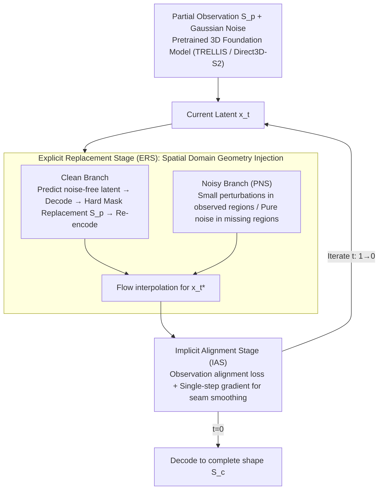

# LaS-Comp: Zero-shot 3D Completion with Latent-Spatial Consistency

**Conference**: CVPR 2026  
**arXiv**: [2602.18735](https://arxiv.org/abs/2602.18735)  
**Code**: [https://github.com/wylyan/LaS-Comp](https://github.com/wylyan/LaS-Comp)  
**Area**: 3D Vision  
**Keywords**: 3D Shape Completion, Zero-shot, 3D Foundation Model, Latent-Spatial Consistency, Point Cloud Completion

## TL;DR
LaS-Comp is proposed as a zero-shot, category-agnostic 3D shape completion framework. By injecting known geometry in the spatial domain through an Explicit Replacement Stage and optimizing boundary consistency via the Implicit Alignment Stage, it bridges the gap between the latent and spatial domains of pretrained 3D foundation models, achieving SOTA performance across various partial observation modes.

## Background & Motivation
3D shape completion is a fundamental problem in computer vision and graphics, aiming to reconstruct complete 3D shapes from partial observations. It is widely applied in robotics, autonomous driving, and AR/VR. An ideal completion method should: (i) robustly handle diverse missing modes (single-view scans, random crops, missing semantic parts); (ii) generalize across categories; (iii) not depend on paired data; (iv) support text-guidance and automatic completion.

Traditional supervised methods rely on paired data and fail to generalize to unseen categories. Recent methods utilizing generative priors (SDS-Complete, ComPC, GenPC) rely on the assumption that "the partial input can render at least one complete image"—when missing regions are visible from all viewpoints, incomplete renderings lead to degraded results.

Latest 3D foundation models (TRELLIS, Direct3D-S2) adopt a "latent space generation" pipeline: a VAE encodes shapes into a compact latent space, followed by diffusion or flow-matching models. This introduces a unique challenge: **the latent encoding of a complete shape and a partial input differ significantly, even if their geometry in the overlapping regions is identical**. Consequently, direct completion in the latent space is unreliable.

The core idea of LaS-Comp is to bridge the latent-spatial domain gap through explicit spatial domain replacement and implicit latent alignment, thereby unlocking the completion potential of 3D foundation models.

## Method

### Overall Architecture
LaS-Comp aims to enable pretrained 3D foundation models (TRELLIS / Direct3D-S2), which generate shapes in compact latent spaces, to perform completion on partial observations without any additional training. The challenge lies in the non-one-to-one mapping between the latent and spatial domains—identical geometry is encoded into different latent features depending on whether it is part of a "complete shape" or a "partial input."

The completion process follows a standard flow-matching denoising pipeline: starting from Gaussian noise and iterating over $t$ from 1 to 0, each step is guided toward the complete geometry by the partial input $\boldsymbol{S}_p$. Crucially, each iteration incorporates two complementary stages: the Explicit Replacement Stage (ERS) injects known geometry in the **spatial domain** to bypass the domain gap, yielding updated latent features $\boldsymbol{x}_t^*$; then, the Implicit Alignment Sage (IAS) performs a gradient-based refinement in the **latent space** to smooth seams left by replacement, resulting in $\boldsymbol{x}_{t-dt}$. The final decoding $\boldsymbol{S}_c = \mathcal{D}(\boldsymbol{x}_0)$ represents the complete shape.

### Key Designs

**1. Explicit Replacement Stage (ERS): Injecting known geometry in the spatial domain to avoid domain gap**

This stage directly addresses the core contradiction: replacing features in the latent space fails due to the domain gap. Therefore, replacement is performed in the spatial domain where geometry is deterministic. ERS employs two parallel branches. The Clean Branch predicts the noise-free latent $\hat{\boldsymbol{x}}_{0|t} = \boldsymbol{x}_t - t \cdot \mathcal{G}(\boldsymbol{x}_t, t)$ and decodes it into a complete shape $\boldsymbol{S}_{0|t}$. A spatial hard replacement is performed using mask $\boldsymbol{M}$: observed voxels use $\boldsymbol{S}_p$, and others use model-generated voxels, i.e., $\boldsymbol{S}'_{0|t} = \boldsymbol{S}_p \odot \boldsymbol{M} + \boldsymbol{S}_{0|t} \odot (1-\boldsymbol{M})$. This "decode-replace-re-encode" cycle is key to bypassing the domain gap, as re-encoding spatial geometry leads to self-consistent latent features.

The Noisy Branch injects reasonable stochasticity using a Partial-aware Noise Schedule (PNS). Observed and missing regions are treated differently: the observed region ($\boldsymbol{M}=1$) has reliable geometry and receives small perturbations decreasing with $t$; the missing region ($\boldsymbol{M}=0$) requires exploration and receives pure Gaussian noise to encourage diversity, i.e., $\boldsymbol{x}^*_{1|t} = \boldsymbol{M} \odot (\sqrt{1-t} \cdot \hat{\boldsymbol{x}}_{1|t} + \sqrt{t} \cdot \boldsymbol{\epsilon}_1) + (1-\boldsymbol{M}) \odot \boldsymbol{\epsilon}_2$. The two branches are synthesized via flow interpolation:

$$\boldsymbol{x}^*_t = (1-t) \cdot \boldsymbol{x}^*_{0|t} + t \cdot \boldsymbol{x}^*_{1|t}$$

**2. Implicit Alignment Stage (IAS): Latent-space gradient repair for ERS boundary seams**

While ERS ensures fidelity in known regions, the "pasted" boundary—the junction between observed and generated parts—is prone to discontinuous artifacts. IAS targets this by performing gradient-based refinement directly in the latent space. It predicts noise-free latents from $\boldsymbol{x}_t^*$, decodes them, and calculates a geometric alignment loss $\mathcal{L}_{\text{align}} = \text{BCE}(\boldsymbol{S}_{0|t} \odot \boldsymbol{M}, \boldsymbol{S}_p \odot \boldsymbol{M})$ only in the observed regions. This measures the discrepancy between current reconstruction and ground truth in known areas, followed by a single-step gradient descent on the latent features:

$$\boldsymbol{x}^{\text{aligned}}_{0|t} = \hat{\boldsymbol{x}}_{0|t} - \eta \cdot \nabla_{\hat{\boldsymbol{x}}_{0|t}} \mathcal{L}_{\text{align}}$$

Importantly, this step **does not update model parameters**. The gradient acts only on the current latent features, maintaining the training-free nature of the method. With a single update ($\eta = 1\times10^{-5}$), the computational overhead is negligible while significantly improving boundary consistency.

**3. Omni-Comp Benchmark: Filling the gap for multi-mode and cross-category evaluation**

The authors identify shortcomings in existing evaluations: Redwood contains only 10 samples, while KITTI/ScanNet are limited to $\le2$ categories and single missing modes. Omni-Comp provides scale and diversity with 30 categories and 180 samples across three missing modes (single-view scan, random crop, semantic part). Samples are curated from Redwood real-world scans, YCB daily objects, and synthetic shapes to include both real-world noise and clean geometry.

### Mechanism Example

Consider completing a **single-view scan of a chair** (front scanned, back missing). In one iteration $t$, the current latent $\boldsymbol{x}_t$ enters ERS: the Clean Branch decodes a predicted complete chair $\boldsymbol{S}_{0|t}$, replaces the front part with the real $\boldsymbol{S}_p$, and re-encodes it into a consistent $\boldsymbol{x}^*_{0|t}$. Simultaneously, the Noisy Branch provides exploration. In IAS, the decoded front legs might show a slight misalignment with the newly generated back legs at the seam. The alignment loss captures this, and a single gradient step pushes the latent feature toward "seam alignment" to obtain $\boldsymbol{x}_{t-dt}$. After ~20 seconds of iteration, the result is a complete chair with consistent style and smooth transitions.

### Loss & Training
LaS-Comp is **training-free**—it requires no additional training and performs inference using pretrained 3D foundation models (TRELLIS or Direct3D-S2). The only "optimization" is the single-step gradient update on the latent features in IAS with a learning rate $\eta = 1 \times 10^{-5}$, without touching model weights. Completion per shape takes ~20 seconds, over 3x faster than existing zero-shot methods.

## Key Experimental Results

### Main Results

| Dataset/Metric | Ours (TRELLIS) | ComPC (Prev. SOTA) | Gain |
|------------|---------------|-----------------|------|
| Redwood CD↓/EMD↓ | **1.42/1.84** | 1.95/2.59 | 27.2%/29.0% |
| Synthetic CD↓/EMD↓ | **1.11/1.41** | 1.61/2.09 | 31.1%/32.5% |
| ScanNet-Chair UCD↓/UHD↓ | **0.8/2.0** | 2.0/5.3 | 60%/62% |
| KITTI-Car UCD↓/UHD↓ | **1.4/4.5** | 1.1/5.7 | - |
| Omni-Comp Single Scan CD↓ | **2.21** | 4.24 | 47.9% |
| Omni-Comp Random Crop CD↓ | **2.60** | 5.48 | 52.6% |
| Omni-Comp Semantic Part CD↓ | **3.30** | 6.37 | 48.2% |

### Ablation Study

| Configuration | Redwood CD↓ | Description |
|------|-------------|------|
| Full LaS-Comp (TRELLIS) | 1.42 | Optimal |
| ERS only (No IAS) | 1.68 | IAS provides ~15% improvement |
| IAS only (No ERS) | 2.31 | ERS is the core |
| No PNS (Uniform noise) | 1.89 | PNS is important |
| Direct3D-S2 backbone | 1.64 | TRELLIS is superior |

### Key Findings
- On Omni-Comp, previous methods show sharp performance drops in Random Crop and Semantic Part modes (due to the "one complete view" assumption), while LaS-Comp remains robust.
- Compatible with different 3D foundation models (TRELLIS and Direct3D-S2), significantly outperforming baselines for both.
- Supports text-guided completion (via base model CFG), allowing control over semantic results.
- Inference speed of ~20s/shape is much faster than ComPC (~60s) and SDS-Complete (>5min).

## Highlights & Insights
- **Training-free**: Low deployment cost by directly utilizing pretrained models.
- **Resolved core domain gap**: Identifies and solves the previously overlooked issue of latent encoding differences between partial and full shapes.
- **Synergistic ERS+IAS design**: Explicit replacement ensures fidelity while implicit alignment ensures smoothness.
- **Partial-aware Noise Schedule**: Different noise strategies for known/unknown regions reflect a deep understanding of completion asymmetry.
- **Omni-Comp benchmark**: Fills the gap in multi-mode completion evaluation.

## Limitations & Future Work
- Dependent on foundation model quality; results are limited if the base model lacks generative capability for a specific category.
- Each step requires encode-decode cycles (ERS), adding to inference overhead.
- IAS utilizes only single-step updates; multi-step optimization might improve boundary quality at the cost of time.
- Currently specialized for rigid objects; articulated or deformable objects are not yet verified.

## Related Work & Insights
- **RepPaint/FlowDPS** inspired the clean-noisy dual-branch design of ERS, migrating from 2D inpainting.
- **TRELLIS/Direct3D-S2** provides the foundation for latent space generation paradigms.
- Difference from ComPC/GenPC: Operates directly in 3D latent space without relying on 2D rendering assumptions.
- Insight: Latent-spatial consistency may be a general challenge in other latent generation tasks like 3D editing or style transfer.

## Rating
- Novelty: ⭐⭐⭐⭐⭐ First systematic solution for 3D foundation model completion, strong ERS+IAS originality.
- Experimental Thoroughness: ⭐⭐⭐⭐⭐ 4 existing benchmarks + Omni-Comp, 2 backbones, multiple partial modes.
- Writing Quality: ⭐⭐⭐⭐ Clear structure, detailed method descriptions, intuitive illustrations.
- Value: ⭐⭐⭐⭐⭐ Practical training-free solution, Omni-Comp benchmark provides lasting value.

<!-- RELATED:START -->

## Related Papers

- [\[CVPR 2026\] Learning Spatial-Temporal Consistency for 3D Semantic Scene Completion](learning_spatial-temporal_consistency_for_3d_semantic_scene_completion.md)
- [\[CVPR 2026\] Elastic3D: Controllable Stereo Video Conversion with Guided Latent Decoding](elastic3d_controllable_stereo_video_conversion_with_guided_latent_decoding.md)
- [\[CVPR 2026\] I-Scene: 3D Instance Models are Implicit Generalizable Spatial Learners](i-scene_3d_instance_models_are_implicit_generalizable_spatial_learners.md)
- [\[CVPR 2026\] Dehallu3D: Hallucination-Mitigated 3D Generation from a Single Image via Cyclic View Consistency Refinement](dehallu3d_hallucination-mitigated_3d_generation_from_a_single_image_via_cyclic_v.md)
- [\[CVPR 2026\] 3D-Fixer: Coarse-to-Fine In-place Completion for 3D Scenes from a Single Image](3d-fixer_coarse-to-fine_in-place_completion_for_3d_scenes_from_a_single_image.md)

<!-- RELATED:END -->
