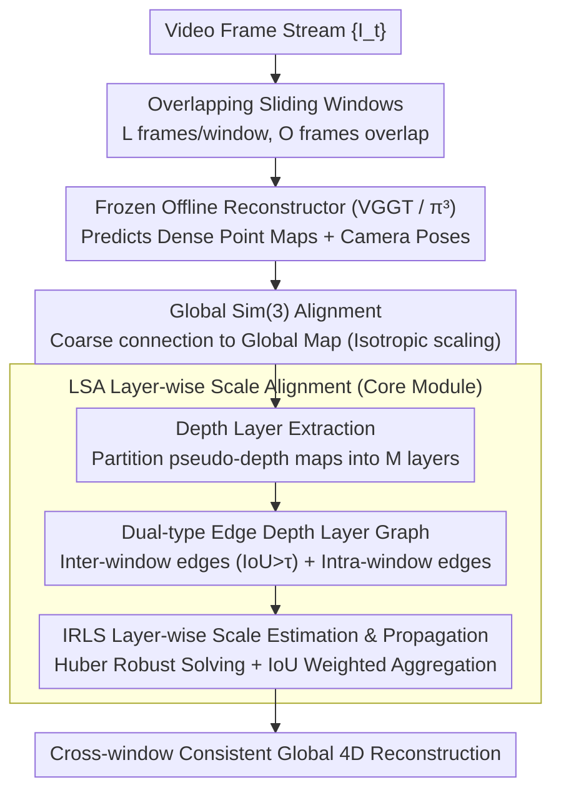

# LASER: Layer-wise Scale Alignment for Training-Free Streaming 4D Reconstruction

**Conference**: CVPR2026  
**arXiv**: [2512.13680](https://arxiv.org/abs/2512.13680)  
**Code**: [Project Page](https://neu-vi.github.io/LASER/)  
**Area**: 3D Vision  
**Keywords**: Streaming 4D reconstruction, Training-free framework, Layer-wise scale alignment, Sliding window, Sim(3) registration

## TL;DR

Ours introduces LASER, a training-free framework that converts offline feed-forward reconstruction models (e.g., VGGT, π³) into streaming systems via Layer-wise Scale Alignment (LSA). It achieves real-time streaming 4D reconstruction of kilometer-level videos at 14 FPS with a 6GB peak memory on an RTX A6000.

## Background & Motivation

**Limitations of Prior Work**: Feed-forward reconstruction models such as VGGT and π³ perform excellently on static image sets. however, due to quadratic memory complexity, they cannot handle streaming video inputs and suffer from OOM on long sequences like KITTI.

**Existing Streaming Methods Require Retraining**: Streaming methods such as CUT3R, StreamVGGT, and STream3R implement incremental processing through learned memory mechanisms or causal attention, but all require extensive retraining or knowledge distillation, resulting in high computational costs.

**Drift Issues in Recursive Designs**: Recursive designs like CUT3R suffer from drift and catastrophic forgetting over long sequences; methods relying on growing memory face scalability limitations.

**Simple Sim(3) Alignment is Insufficient**: Concurrent work like VGGT-Long attempts training-free methods using chunking and Sim(3) alignment, but simple rigid alignment is inadequate in the depth direction.

**Issue of Layer-wise Depth Inconsistency**: Monocular scale ambiguity causes the relative depth scales of different scene layers (e.g., foreground vs. background) to vary inconsistently between windows. The uniform scaling of a global Sim(3) transformation cannot resolve this anisotropic scaling.

**Practical Deployment Requirements**: Applications in autonomous driving, robotics, and AR/VR require models to process video streams efficiently and consistently, necessitating online processing while maintaining reconstruction quality.

## Method

### Overall Architecture

LASER addresses the problem of enabling offline feed-forward reconstructors like VGGT and π³ to process kilometer-scale long videos in a streaming fashion without retraining, while maintaining global geometric consistency. The approach segments the video into overlapping sliding windows; each window is processed by a frozen offline reconstructor to produce local point maps and poses, which are then sequentially registered and stitched into a global map.

Specifically, given a video stream $\{I_t\}$, overlapping windows $\{W_i\}$ are formed (each window has $L$ consecutive frames with $O$ frames of overlap). After the frozen reconstructor predicts dense point maps and camera poses, a global Sim(3) alignment is first performed to coarsely attach the current window to the global map. Subsequently, the core module, LSA (Layer-wise Scale Alignment), corrects scale drifts in the depth direction layer-by-layer to achieve cross-window consistent reconstruction.

### Key Designs

**1. Depth Layer Extraction: Refining scale alignment from "global" to "layer-wise"**

Global Sim(3) registration assumes isotropic scaling—multiplying the entire point map by a single scale factor. However, under low-parallax motion, scale constraints in the depth direction are unreliable, leading to inconsistent scaling between foreground and background. A single global scale cannot align both simultaneously. LASER's strategy is to refine the alignment space: pseudo-depth maps after Sim(3) registration are partitioned into $M$ disjoint depth layers $\{L_{t,m}\}$ using an efficient segmentation algorithm. Each layer corresponds to a depth-continuous geometric surface, allowing scales to be estimated independently per layer.

**2. Dual-type Edge Depth Layer Graph: Organizing correspondences across windows and time into an optimizable graph**

To achieve layer-wise alignment, one must determine correspondences between layers across different windows. LASER organizes all depth layers into a directed graph $H=(V,E)$, establishing correspondences via two types of edges: inter-window edges $E_{\text{inter}}$ connect layers in overlapping windows with IoU $>\tau$ (default 0.3), providing cross-window scale constraints; intra-window edges $E_{\text{intra}}$ connect the same depth layer across adjacent frames within the same window, serving as paths for scale propagation along the temporal axis. This graph explicitly structures which layers should be aligned and how scales should propagate.

**3. IRLS Layer-wise Scale Estimation and Propagation/Aggregation: Robustly solving for per-layer scales**

Given the graph, IRLS (with Huber loss) is used to optimize the layer-wise scaling factor $\hat{s}$ for each inter-window edge, aligning depth values of corresponding layers. Huber loss suppresses outliers from mismatched layers, providing more stability than standard least squares. Scales are first estimated along $E_{\text{inter}}$ in overlapping regions and then propagated temporally to non-overlapping frames via $E_{\text{intra}}$. The final scale for each layer is a weighted average based on IoU, allowing layers with higher overlap and more reliable correspondences to dominate the result, ensuring consistency across windows and time.

### Loss & Training

LASER is entirely training-free. All "optimization" occurs during inference as geometric registration: global scale $s_i^w$ is robustly estimated using IRLS + Huber loss to suppress outliers; rotation and translation are solved via the Kabsch algorithm under the estimated scale; layer-wise scales similarly utilize IRLS + Huber loss. Since no network weights are updated, LASER is plug-and-play for any new offline reconstructor.

## Key Experimental Results

### Main Results

**Video Depth Estimation** (Table 1):

| Method | Type | Sintel Abs Rel↓ | Bonn Abs Rel↓ | KITTI Abs Rel↓ |
|------|------|---------|---------|---------|
| π³ (Offline) | Offline | 0.245 | 0.050 | 0.038 |
| CUT3R | Streaming | 0.421 | 0.078 | 0.118 |
| STream3Rβ | Streaming | 0.264 | 0.069 | 0.080 |
| **π³+Ours** | **Streaming** | **0.247** | **0.048** | **0.054** |

**Camera Pose Estimation** (Table 2):

| Method | Sintel ATE↓ | ScanNet ATE↓ | TUM ATE↓ |
|------|-------------|--------------|----------|
| π³ (Offline) | 0.073 | 0.030 | 0.014 |
| CUT3R | 0.213 | 0.099 | 0.046 |
| TTT3R | 0.201 | 0.064 | 0.028 |
| **π³+Ours** | **0.061** | **0.031** | **0.016** |

Ours reduces ATE by 68.6% on Sintel compared to the previous best streaming method and reduces Acc by 63.9% on 7-Scenes.

**Large-scale KITTI Odometry** (Table 3): Offline models VGGT and π³ all suffer from OOM, as does CUT3R in most cases. LASER(π³) remains stable across all 11 sequences, achieving an average ATE of 24.17, outperforming VGGT-Long (27.64) and π³-Long (30.72).

### Ablation Study

**LSA Component Ablation** (Table 5, Sintel Depth):

| Configuration | Abs Rel↓ | δ<1.25↑ |
|------|----------|---------|
| Full LASER | 0.247 | 68.8 |
| W/o LSA | 0.328 | 51.4 |
| Replace Seg with SAM 2 | 0.251 | 67.8 |
| W/o E_intra | 0.261 | 64.7 |

**Key Findings**:
- Removing LSA leads to a 32.8% degradation in Abs Rel, proving layer-wise scale alignment is the core contribution.
- SAM 2, despite finer segmentation, yields no improvement; simple and efficient segmentation is sufficient.
- Removing intra-window temporal propagation edges $E_{\text{intra}}$ harms global consistency.
- The IoU threshold $\tau$ is robust within 0.2–0.6, with 0.3 being optimal.
- Window size $L=20$ achieves the best balance.

### Efficiency Analysis

- π³+Ours: ~14.2 FPS, 6GB peak memory (RTX A6000)
- VGGT+Ours: ~10.9 FPS, 10GB peak memory
- Fastest speed and lowest memory consumption among all streaming methods.

## Highlights & Insights

- **Zero Training Cost**: Requires no retraining; directly converts any offline reconstruction model into a streaming system, enabling plug-and-play for new models.
- **Identifies and Resolves Layer-wise Inconsistency**: Provides deep insight into the anisotropic scaling failure modes of global Sim(3) alignment, proposing a solution based on classical layered scene representations.
- **Comprehensive SOTA**: Outperforms existing streaming methods across depth estimation, pose estimation, and point map reconstruction, with many metrics approaching or exceeding offline models.
- **Practically Deployable**: 14 FPS + 6GB memory supports kilometer-length sequences, offering significant real-world application value.
- **Elegant Design Philosophy**: Uses classical geometric principles to bridge the gaps in deep learning models without requiring end-to-end retraining.

## Limitations & Future Work

- Limited by the upper bound of the underlying offline model (e.g., π³'s weaker normal accuracy affects NC metrics).
- Layer-wise segmentation depends on depth map quality and may fail in extreme scenarios (e.g., pure rotation, textureless regions).
- The sliding window strategy introduces fixed latency, making it unsuitable for ultra-low latency requirements.
- Large-scale scenes still require additional loop closure to reduce long-term drift.
- Although categorized under human_understanding in some contexts, it is essentially a general 3D/4D reconstruction work.

## Related Work & Insights

- **Offline Feed-forward Reconstruction**: DUSt3R → VGGT → π³, shifting from image pairs to dense reconstruction of arbitrary viewpoint sets.
- **Streaming Reconstruction (Requires Training)**: CUT3R (recursive memory), StreamVGGT (causal attention), STream3R (sliding window + token pooling), WinT3R, TTT3R (test-time adaptation).
- **Training-Free Streaming (Concurrent Work)**: VGGT-Long (chunking + Sim(3)); this paper demonstrates that simple Sim(3) is insufficient.
- **Classical Methods**: ORB-SLAM2, DROID-SLAM, etc., which offer high precision but require calibration and provide only sparse reconstruction.
- **4D Reconstruction**: Evolution from per-scene optimization (NeRF/3DGS) to feed-forward dynamic reconstruction.

## Rating

- Novelty: ⭐⭐⭐⭐ — Identifying the layer-wise depth inconsistency problem and designing the LSA solution is novel; the combination of classical geometry and modern deep learning is elegant.
- Experimental Thoroughness: ⭐⭐⭐⭐⭐ — Three tasks, six datasets, extensive baseline comparisons, complete ablation studies, and efficiency analysis.
- Writing Quality: ⭐⭐⭐⭐ — Problem motivation is clear, diagrams are intuitive, and method description is formal.
- Value: ⭐⭐⭐⭐⭐ — Training-free, plug-and-play, and highly efficient; significant for practical deployment.

<!-- RELATED:START -->

## Related Papers

- [\[CVPR 2026\] Scal3R: Scalable Test-Time Training for Large-Scale 3D Reconstruction](scal3r_scalable_test-time_training_for_large-scale_3d_reconstruction.md)
- [\[CVPR 2026\] DetAny4D: Detect Anything 4D Temporally in a Streaming RGB Video](detany4d_detect_anything_4d_temporally_in_a_streaming_rgb_video.md)
- [\[CVPR 2026\] Fast3Dcache: Training-free 3D Geometry Synthesis Acceleration](fast3dcache_training-free_3d_geometry_synthesis_acceleration.md)
- [\[CVPR 2026\] AeroGS: Scale-Aware Gaussian Splatting for Pose-Free Dynamic UAV Scene Reconstruction](aerogs_scale-aware_gaussian_splatting_for_pose-free_dynamic_uav_scene_reconstruc.md)
- [\[CVPR 2026\] Point4Cast: Streaming Dynamic Scene Reconstruction and Forecasting](point4cast_streaming_dynamic_scene_reconstruction_and_forecasting.md)

<!-- RELATED:END -->
