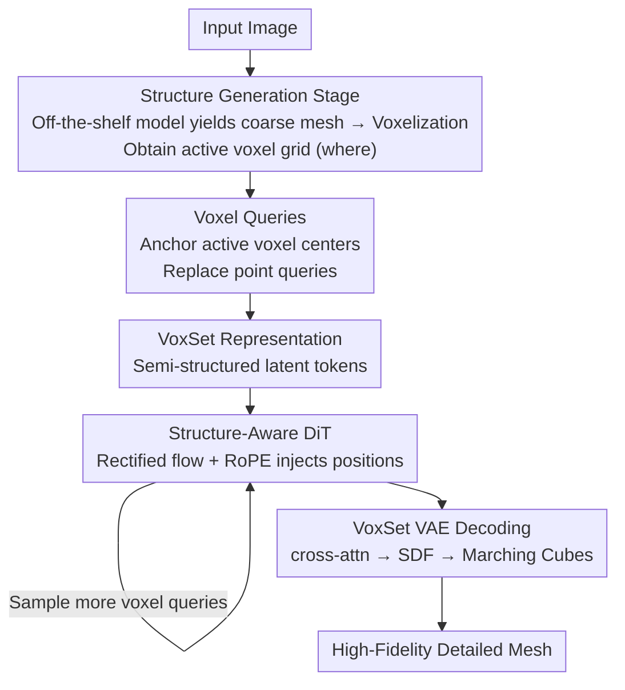

# LATTICE: Democratize High-Fidelity 3D Generation at Scale

**Conference**: CVPR 2026  
**Paper**: [CVF Open Access](https://openaccess.thecvf.com/content/CVPR2026/html/Lai_LATTICE_Democratize_High-Fidelity_3D_Generation_at_Scale_CVPR_2026_paper.html)  
**Code**: https://lattice3d.github.io (Project Page)  
**Area**: 3D Vision / 3D Generation / Diffusion Models  
**Keywords**: 3D Generation, Semi-structured latent, VecSet, Voxel queries, test-time scaling

## TL;DR
LATTICE proposes a semi-structured 3D latent representation called VoxSet, which anchors the compact latent tokens of VecSet onto a coarse voxel grid, thereby injecting positional information into the diffusion transformer. Combined with a two-stage "coarse-to-fine" pipeline that first generates coarse structures and then refines geometry, this pure transformer architecture scales the image-to-3D model to 4.5B parameters. At the same time, it achieves token-level test-time scaling, which is rare in 3D generation, outperforming prior SOTA in reconstruction and generation quality.

## Background & Motivation
**Background**: Native 3D diffusion generation currently revolves around "what latent representation to use for 3D assets," primarily following two paths. One is **Sparse Voxel** (XCube, Trellis/SLAT), which anchors features on active voxels near the object surface; this inherently possesses spatial structure, facilitating editing and generalization. The other is **VecSet** (3DShape2VecSet, Hunyuan3D-2, TripoSG), which compresses the entire 3D object into thousands of latent vectors via cross-attention between point clouds and a set of query tokens, offering compactness, elegance, and scalability through standard self/cross-attention.

**Limitations of Prior Work**: Even when leveraging 3D sparsity, Sparse Voxel sequences still explode in length (exceeding 20,000 active voxels at $64^3$ resolution), requiring complex system designs like sparse convolutions and sparse attention; whether it can scale remains an open question. Although VecSet is compact and efficient, it has long been criticized for "modeling globally while losing details," lagging behind 2D latent diffusion in quality. Overall, both paths fall significantly behind 2D image generation.

**Key Challenge**: The authors attribute the root cause of 3D lagging behind 2D to **how the generation task itself is defined**. In 2D image synthesis, the spatial grid is pre-defined—the model only needs to infer RGB values at fixed pixel coordinates (an overlooked but greatly simplifying "secret condition" for the denoising process). Conversely, 3D generation is an open-ended task: it must decide both **where** to place content and **what** content to place (SDF, RGB). This joint reasoning over "structure + content" expands the search space exponentially, introduces ambiguity, and makes optimization harder and scaling behavior unpredictable.

**Goal**: From a **generation-centric** perspective of "what is a good 3D representation for the diffusion generator itself", decouple the prediction of "where" and "what" in 3D generation, using structure/position to guide the originally unstructured VecSet generation, similar to 2D.

**Key Insight**: The authors observe that the latents encoded by VecSet using point queries **secretly contain historical positional information**—each latent is strongly correlated with the region near its corresponding point query (as noted by FlashVDM). However, this information is unusable during generation because point queries are sampled on the surface, and their locations are unknown at test time.

**Core Idea**: What truly matters is "localizability" rather than "locality". Thus, **Voxel Queries are used instead of Point Queries**—anchored at the centers of coarse active voxels intersecting the surface. During testing, these positions can be easily acquired via a cheap coarse structure generation phase, thereby injecting explicit structure into VecSet to obtain the semi-structured representation, VoxSet.

## Method

### Overall Architecture
The core of LATTICE is the VoxSet representation, coupled with a coarse-to-fine two-stage pipeline ("coarse structure $\to$ fine geometry").
**First Stage (Structure Generation)**: Given an input image, an off-the-shelf 3D generator (Hunyuan3D-2, Trellis, etc.) is directly used to generate a coarse mesh of imperfect quality, which is then voxelized to obtain a sparse active voxel grid. This step is solely responsible for providing "where," i.e., determining where the content should be placed in space.
**Second Stage (Geometry Refinement, i.e., LATTICE itself)**: Using these active voxel centers as Voxel Queries, a rectified-flow transformer (DiT) denoises and generates detailed geometric VoxSet tokens in the latent space of VoxSet VAE. Each token is injected with the position of its corresponding voxel via RoPE. Finally, the VAE decoder (using cross-attention with SDF mesh coordinates as queries) decodes the SDF, and Marching Cubes extracts meshes with high-frequency details. The entire pipeline does not contain any sparse convolutions or sparse attention; it is pure transformer, enabling smooth scaling from 0.6B to 4.5B parameters, and supports arbitrary token counts (arbitrary resolutions) for decoding and test-time scaling.

### Key Designs

**1. VoxSet: Adding a semi-structured coordinate skeleton to VecSet latents**

VoxSet aims to resolve the conflict of "VecSet is compact but unstructured, while Sparse Voxel is structured but has excessively long sequences." It follows the approach of 3DShape2VecSet, using a VAE to apply cross-attention to the input point cloud $P \in \mathbb{R}^{N\times 7}$ (where each point encodes 3D coordinates, normals, and a binary sharpness indicator flagging whether point lies on sharp edges), compressing it into a sequence of compact latent tokens to retain the compression and simplicity advantages of VecSet. However, the crucial modification is **anchoring each latent token to the grid points of a regular voxel grid**, converting positional information into an explicit structure that can be directly injected into the DiT. This avoids sequence explosion (remaining in the range of thousands of tokens, unlike Sparse Voxel) while avoiding completely world-unaligned latents as in original VecSet. Furthermore, since latent tokens inherently encode global signals and can represent the same object with sequences of arbitrary length, VoxSet naturally supports **arbitrary resolution encoding/decoding** and **progressive token scaling**—pre-training starts at 1024 tokens and gradually scales to more, significantly reducing training costs.

**2. Voxel Query: Replacing surface-unknown point queries at test time with obtainable voxel centers**

This is the lifeblood distinguishing VoxSet from VecSet. In VecSet, there are two types of query sets: learnable queries (which encode global statistics; easy to train but hard to scale) and point queries (farthest point sampling on the surface, encoding local information, supporting arbitrary resolution, and strongly correlating latents with their positions). Point queries seem ideal, but they are sampled on the object surface, and at test time, the surface is unknown $\Rightarrow$ positions are unknown. Consequently, the "secretly encoded positional info" cannot be utilized at test time. The authors instead propose Voxel Queries—anchored at the centers of **active voxels** that intersect the surface. These coordinates are easily obtained at test time via the coarse structure generation stage. Moreover, voxel centers are "decoupled" from the specific surface (a voxel center is not bound to a single surface patch), narrowing the training-test gap and significantly improving generalization during testing. In short: replacing "surface coordinates unavailable at test time" with "localizable voxel coordinates" makes positional guidance practically feasible.

**3. Injecting structure into the diffusion transformer (RoPE): Saving the 3D denoising trajectory with positional embeddings**

Having a structured representation is not enough; the DiT must actually utilize the structure. The authors **apply RoPE (Rotary Position Embedding) to each noisy latent token** of the rectified-flow transformer, feeding the VoxSet voxel coordinates into the generator. While seemingly minor, this modification is crucial for convergence for two reasons: representing 3D spatial data is far more challenging because the 3D data scale is much smaller than 2D images/videos, leaving the latent space severely "under-occupied", making it hard for denoising to converge without positional priors; second, geometric generation is inherently sparser and harder than image generation—3D surfaces occupy only a small fraction of the bounding box, whereas images have RGB values at every pixel. Previous methods conditioned only on a single image struggled to guide the denoising trajectory towards detailed geometry. The coordinates injected via RoPE provide the exact missing "predefined grid" condition from 2D.

**4. Query Jitter + Progressive Training + Token-Level Test-Time Scaling: Low-cost training and free post-training quality gains**

To support multi-resolution voxel structures without randomly sampling voxel queries of various resolutions, the authors employ a simpler approach: **Query Jitter**. During training, a small random offset $\epsilon \sim \mathcal{U}\!\left(-\tfrac{1}{2R}, \tfrac{1}{2R}\right)$ is added to the point query (where $R$ is the minimum supported resolution). During testing or diffusion training, voxel queries can be sampled at any resolution larger than $R$. Additional cost-reduction strategies are stacked on the training side: **randomly sampling a fixed number of structure tokens** during denoising (far fewer than sparse voxel methods) and **progressive training**—first training on 1024 tokens and gradually scaling up to 6144 tokens. Finally, with the model trained on 6144 tokens, **simply increasing the token count to 12288, 24576, or even 30720 during testing consistently improves quality** (token-level test-time scaling, as shown in the experiments below). This is a rare property in 3D generation and a benefit of VoxSet's structured design.

### Loss & Training
- VAE Stage: Standard geometric VAE reconstruction (encoding point clouds, reconstructing SDF, Marching Cubes extracting meshes), with remaining configurations identical to Hunyuan3D-2, except queries are drawn strictly from uniformly sampled point clouds.
- Generation Stage: Rectified flow is used to train the VoxSet DiT; the image condition utilizes the last layer of Dinov2-Giant (excluding the class token), with resolution increased to 1022 (compared to 518 in Hunyuan3D-2) to preserve detail. Objects are cropped according to a binary mask to maintain the aspect ratio, without adding extra positional embeddings.
- Scale: A family of models from 0.6B to 4.5B is trained; the 2B base model can be trained in < 24 hours on 64 GPUs while still outperforming prior methods.

## Key Experimental Results

### Main Results
Reconstruction (LATTICE-Bench(R), CD $\times 10^4$, F1 $\times 10^2$): LATTICE achieves the best reconstruction with a more compact latent.

| Method | Latent Size | CD(↓) | F1(↑) |
|------|-------------|-------|-------|
| Hunyuan3D-2 | $64\times 4096$ | 12.35 | 82.78 |
| Hunyuan3D-2 | $64\times 8192$ | 9.157 | 91.57 |
| SparseFlex (1024) | $8\times 196028$ | 2.972 | 97.76 |
| Direct3D-s2 (1024) | $64\times 46592$ | 4.987 | 97.46 |
| **Ours (LATTICE)** | $64\times 4096$ | 5.321 | 95.31 |
| **Ours (LATTICE)** | $64\times 8192$ | 2.909 | 98.53 |
| **Ours (LATTICE)** | $64\times 20480$ | **1.893** | **99.59** |

Generation (image-to-geometry, ULIP/Uni3D similarity, higher is better):

| Method | ULIP-T | ULIP-I | Uni-T | Uni-I |
|------|--------|--------|-------|-------|
| Trellis | 0.076 | 0.126 | 0.249 | 0.311 |
| Hunyuan3D 2.0 | 0.077 | 0.130 | 0.251 | 0.315 |
| Hi3DGen | 0.066 | 0.112 | 0.246 | 0.299 |
| Direct3D-s2 | 0.074 | 0.122 | 0.247 | 0.314 |
| **Ours (LATTICE-1.9B)** | **0.078** | **0.130** | **0.254** | **0.315** |

Ours (LATTICE-1.9B) (closest in scale to competitors) consistently leads or matches the best performance across all four metrics.

### Ablation Study
VAE training strategy ablation (evaluated uniformly with 4096 tokens + voxel query, showing columns for different resolutions):

| Configuration | CD(↓) | F1(↑) | Description |
|------|-------|-------|------|
| Baseline (point-query VAE, tested with voxel query) | 10.7 | 85.3 | Training-test query mismatch, severe degradation |
| + Fixed Train (fixed resolution training) | 5.73~5.69 | 94.5~94.7 | Improved, but lacks resolution flexibility |
| + Query Jitter | 5.32 | 95.3 | Optimal, and usable at arbitrary resolutions |

Voxel Query / VoxSet VAE incremental ablation (Fig.10): Gradually adding voxel query and VoxSet VAE step-by-step reduces artifacts and increases details. Voxel query reduces artifacts by bridging the domain gap, while VoxSet VAE yields more details with stronger reconstruction capability.

### Key Findings
- **Localizability > Locality**: Replacing point queries with voxel queries is key to quality gains, verifying that "structures/positions obtainable at test time" is core, rather than the traditional belief in the spatial locality of sparse voxels.
- **Query Jitter is the critical switch for training-test alignment**: Testing the original point-query VAE with voxel queries degrades results significantly (CD 10.7 / F1 85.3). Adding jitter reduces CD to 5.32, increases F1 to 95.3, and supports arbitrary resolutions.
- **Test-time scaling is real**: For the model trained on 6144 tokens, increasing the token count to 20480 during testing drops reconstruction CD from ~2.9 to 1.893 and elevates F1 to 99.59, boosting quality without extra training.
- In user studies, the overall win rates against four commercial models are all positive (around +19.6% to +26.5%), dominant in both object and scene categories.

## Highlights & Insights
- **Redefining the criteria for a "good 3D representation"**: From the generator's perspective, this work points out that the root cause of 3D lagging behind 2D is the lack of a "predefined spatial grid" secret condition, and addresses this with VoxSet. This insight frames the problem cleanly, which is more inspiring than simply stacking modules.
- **The slogan "localizability not locality" has high transfer value**: While debates on 3D/4D representations often obsess over local modeling capabilities, this paper clarifies that the real bottleneck is "whether positions can be obtained at test time". This criterion can be adapted to inspect other implicit representations.
- **Token-level test-time scaling is virtually a free lunch**: Because the latent encodes global signals and voxel anchoring supports arbitrary resolutions, one can simply scale up voxel queries at test time to gain quality, which is highly cost-effective in engineering.
- **Pure transformer + low-cost training**: Scaling a 2B model on 64 GPUs in under 24 hours proves that high-fidelity 3D can be achieved without relying on complex systems like sparse convolutions or sparse attention, lowering the barrier to scaling (echoing the title "Democratize").

## Limitations & Future Work
- **Heavy reliance on the first-stage off-the-shelf structure generator**: Coarse voxels are derived from external models like Hunyuan3D-2/Trellis. If the coarse structure itself is missing or misaligned (e.g., thin structures, occluded parts), the degree to which the second-stage refinement can recover is not fully discussed. While the authors list "image misalignment/omissions" under mesh/part refinement applications, quantitative evaluation is limited.
- **Focuses only on geometry, without joint texture/appearance modeling**: The paper focuses entirely on geometry (SDF/mesh), while RGB/material generation remains out of scope.
- **Evaluation metrics are somewhat indirect**: Generation quality relies mainly on ULIP/Uni3D similarity and user studies, lacking more direct quantitative metrics for geometric details. Comparisons with closed-source commercial models are constrained to user study win rates due to the high cost of obtaining large-scale outputs.
- **Directions for improvement**: End-to-end integration of the structure generation stage, or introducing refinement mechanisms more robust to coarse structure errors; extending the localizable code concept to textures, 4D dynamics, etc.

## Related Work & Insights
- **vs VecSet / Hunyuan3D-2**: Both compress 3D into compact latent tokens, but Hunyuan3D-2's latents lack explicit structure and rely solely on single-image conditioning. LATTICE adds voxel anchoring + RoPE to the latents, explicitly injecting "position" into the DiT, thereby yielding better details and scaling (improving reconstruction F1 from 82.78 to 98.53 at the 4096/8192 scale).
- **vs Sparse Voxel (XCube / Trellis / Direct3D-s2 / SparseFlex)**: These rely on spatial locality for details but require long sequences and sparse convolutions/attention. LATTICE achieves comparable or superior reconstruction under far more compact latents (64×4096 vs 64×46592, etc.) using semi-structured VoxSet, all while built on a pure transformer architecture.
- **vs FlashVDM**: FlashVDM points out that point-query latents secretly carry position and can perform test-time scaling but does not solve "unknown position at test time". LATTICE applies this insight to generation via voxel queries.

## Rating
- Novelty: ⭐⭐⭐⭐⭐ "localizability not locality" + VoxSet/voxel query perfectly bridges VecSet and structure, with both novel perspective and mechanism.
- Experimental Thoroughness: ⭐⭐⭐⭐ Complete reconstruction, generation, ablation, and user studies, though generation metrics are somewhat indirect and closed-source comparisons rely solely on user studies.
- Writing Quality: ⭐⭐⭐⭐⭐ Masterfully explains "why 3D lags behind 2D", with a clear link between motivation and method.
- Value: ⭐⭐⭐⭐⭐ Scaling up to 4.5B with a pure transformer at low cost + test-time scaling, practically driving large-scale high-fidelity 3D generation.

<!-- RELATED:START -->

## Related Papers

- [\[CVPR 2026\] FACE: A Face-based Autoregressive Representation for High-Fidelity and Efficient Mesh Generation](face_a_face-based_autoregressive_representation_for_high-fidelity_and_efficient_.md)
- [\[CVPR 2026\] MetroGS: Efficient and Stable Reconstruction of Geometrically Accurate High-Fidelity Large-Scale Scenes](metrogs_efficient_and_stable_reconstruction_of_geometrically_accurate_high-fidel.md)
- [\[CVPR 2026\] HiFi-BRep: High-Fidelity Latent Representation for Robust B-Rep Generation](hifi-brep_high-fidelity_latent_representation_for_robust_b-rep_generation.md)
- [\[CVPR 2026\] VIAFormer: Voxel-Image Alignment Transformer for High-Fidelity Voxel Refinement](viaformer_voxel-image_alignment_transformer_for_high-fidelity_voxel_refinement.md)
- [\[CVPR 2026\] Extend3D: Town-Scale 3D Generation](extend3d_town-scale_3d_generation.md)

<!-- RELATED:END -->
