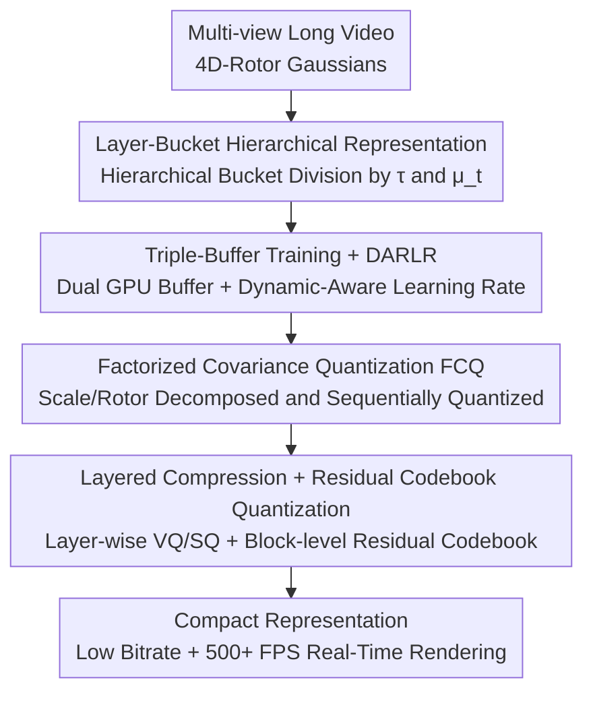

# Layered 4D-Rotor Gaussian Splatting: A Compressed Representation for Long Dynamic Scenes

**Conference**: CVPR 2026  
**Paper**: [CVF Open Access](https://openaccess.thecvf.com/content/CVPR2026/html/Xu_Layered_4D-Rotor_Gaussian_Splatting_A_Compressed_Representation_for_Long_Dynamic_CVPR_2026_paper.html)  
**Code**: [Project Page](https://m1sak1mei.github.io/layered-4d-rotor/)  
**Area**: 3D Vision  
**Keywords**: 4D Gaussian Splatting, dynamic scene reconstruction, long videos, representation compression, real-time rendering

## TL;DR
This paper proposes Layered 4D-Rotor Gaussian Splatting (L4DRotorGS), which organizes 4D Gaussians into a "layer + bucket" structure based on temporal spans. Equipped with a triple-buffer training framework and a hierarchically oriented quantization compression suite (factorized covariance quantization + layered compression + residual codebook quantization), L4DRotorGS achieves up to a 22.3× compression ratio and a bitrate below 1 MB/s for minute-long dynamic scene reconstruction, while maintaining high fidelity and real-time rendering of over 500 FPS.

## Background & Motivation
**Background**: Reconstructing dynamic scenes from multi-view videos and synthesizing novel views represent fundamental capabilities in AR/VR, film, and interactive entertainment. NeRF-based methods map time-varying geometry back to a canonical space using deformation fields, achieving decent quality but suffering from slow volume rendering. 3D Gaussian Splatting (3DGS) achieves real-time rendering through tile-based rasterization. Subsequent works have extended it to 4D (XYZT anisotropic Gaussians, sliced temporally to obtain the 3D Gaussians of the current frame), yielding impressive performance on short videos.

**Limitations of Prior Work**: Almost all of these 4D methods struggle with three challenges: short duration, large storage, and high memory footprint—typically with video durations < 10 s, storage > 500 MB, and high GPU VRAM consumption. This is because as the video gets longer, the number of Gaussians grows exponentially, making storage and memory demands unsustainable. Although the recent Temporal Gaussian Hierarchy (TGH) attempts to extend 4D Gaussians to long videos, it fails to meet the low-bandwidth requirements (e.g., < 1 MB/s) necessary for practical deployment, making it difficult to deploy in bandwidth-constrained scenarios such as mobile devices.

**Key Challenge**: In long dynamic scenes, the motion scales of different regions vary drastically (ranging from static backgrounds to rapid human movements), with the temporal spans of Gaussians spanning several orders of magnitude, from milliseconds to minutes. Furthermore, the 4D covariance scales quadratically with scale, causing the numerical range to be magnified by over 10 orders of magnitude. Directly applying vector quantization (VQ) to such "extremely heterogeneous and numerically ill-conditioned" 4D Gaussians leads to catastrophic failure. This constitutes the fundamental tension between "compression friendliness" and "high fidelity in long videos."

**Goal**: To simultaneously achieve three objectives within a unified framework: (1) reduce the training and rendering GPU memory footprint for long videos; (2) compress storage to a bitrate under 1 MB/s with almost no quality loss; (3) maintain real-time rendering at over 500 FPS.

**Key Insight**: The authors observe that TGH-style hierarchical structuring, which forces Gaussians into fixed time intervals, pushes down short-span Gaussians near interval boundaries and mixes them with geometrically disparate content, which paradoxically hinders compression. Real compressibility comes from "groups of Gaussians with temporal consistency and similar statistical properties within the same layer." Therefore, the approach begins by redesigning the hierarchical structure specifically for compression.

**Core Idea**: To utilize a "layer + left/right bucket" hierarchical representation to enforce temporal consistency of Gaussians within the same layer, and then tailor three quantization schemes (FCQ, layered compression, and RCQ) specifically for this hierarchical structure, compressing long dynamic scenes into a compact, real-time renderable representation with low bitrate.

## Method

### Overall Architecture
L4DRotorGS is built upon 4D-Rotor Gaussian Splatting: each 4D Gaussian is described by a 4D center $\mu_{4D}=(\mu_x,\mu_y,\mu_z,\mu_t)$ and a 4D covariance $\Sigma_{4D}=R_{4D}S_{4D}S_{4D}^T R_{4D}^T$, where the 4D rotation is represented by an 8-coefficient rotor (the first 4 encode spatial rotation, and the last 4 encode space-time rotation). Given a time $t$, the 4D Gaussian is sliced to obtain a 3D Gaussian $G_{3D}(x,t)=e^{-\frac{1}{2}\lambda(t-\mu_t)^2}e^{-\frac{1}{2}[x-\mu(t)]^T\Sigma_{3D}^{-1}[x-\mu(t)]}$. Gaussians that are too far from $t$ ($\lambda(t-\mu_t)^2>16$) are culled by a visibility gate, resulting in an effective temporal span of $\tau=2\sqrt{16/\lambda}$.

The entire pipeline consists of three steps: First, all 4D Gaussians are organized into a **layer + bucket** structure based on their temporal span $\tau$ and mean time $\mu_t$. When rendering at a specific time, only the current bucket and its neighboring buckets are loaded, restricting GPU memory overhead at its source. During training, a **triple-buffer framework + DARLR** are used to eliminate CPU-to-GPU transfer consumption and instability in static regions. Finally, a combination of **factorized covariance quantization, layered compression, and residual codebook quantization** is applied to this hierarchical representation to compress storage to the extreme. The number of layers is adaptively set to $L=\lceil\log_2 n\rceil+1$ (where $n$ is the number of frames).

### Key Designs

**1. Layer-Bucket Hierarchical Representation: Temporal Consistency of Same-layer Gaussians for Memory Reduction and Easy Compression**

Aiming at the pain points of Gaussian explosion in long videos and the negative impact of TGH's fixed-time interval slicing on compression, this work adopts TGH's concept of "dividing Gaussians into multiple layers based on temporal span $\tau$ (long span → slowly varying zones, short span → fast-changing zones)". However, it further splits each TGH interval into **two buckets (left and right)** and **allows Gaussians to cross bucket boundaries**; each Gaussian is assigned solely based on its own mean time $t$ and temporal scale $\tau$, without manual clipping. This yields more temporally coherent Gaussian groups with closer statistical properties within the same layer, resulting in tighter codebooks and smaller errors during downstream quantization. During rendering at query time $t$, each layer only loads the current bucket and its neighboring buckets, ensuring visibility while minimizing memory footprint (with a peak training GPU memory of only 2 GB on N3DV). Compared to TGH, which pushes boundary-crossing short Gaussians to lower layers and mixes them with geometrically disparate content, this design provides the structural foundation that enables high compression ratios.

**2. Triple-Buffer Training Framework + Dynamic-Aware Rotor Learning Rate (DARLR): Frictionless Streaming and Stable Static Regions**

There are two potential issues when training on long videos: First, the massive number of Gaussians exceeds GPU capacity, making frequent CPU↔GPU transfers the primary bottleneck (which is precisely the pain point of TGH). Second, using a high learning rate for the temporal rotor component of static Gaussians in 4D-Rotor Splatting leads to training instability, causing large position drifts far away from the mean time; while this effect is minor in short clips, it is significantly amplified in long videos. This work employs a **Triple-buffer strategy** consisting of a dual GPU buffer and a CPU bucket buffer: at each step, training frames at sampling time $t$ are selected, progressive adaptive density control (pruning/densification) is performed, and then Gaussians visible at $t$ are loaded from the CPU bucket into the GPU rendering buffer while unused Gaussians are offloaded back to the CPU, followed by forward/backward passes and an optimizer step. The dual GPU buffer overlaps "loading next-step data" with "computing current-step gradients," substantially reducing transfer overhead. Simultaneously, **DARLR** assigns scaled-down learning rates for time-rotors to Gaussians with larger temporal spans $\tau$, specifically stabilizing static scene regions. Ablation studies show that removing DARLR results in overly smoothed textures and a loss of high-frequency structures in static regions.

**3. Factorized Covariance Quantization (FCQ): Decomposing Scale and Rotor to Address Ill-conditioned 4D Covariance**

Directly applying VQ to normalized 4D covariance as in C3DGS fails: the spatial and temporal scales of 4D Gaussians span several orders of magnitude ($10^{-3}\sim10^3$), and since covariance is quadratically related to scale (viz. $\Sigma_{4D}=R_{4D}S_{4D}S_{4D}^T R_{4D}^T$), the effective numerical range is magnified by over 10 orders of magnitude, far exceeding the representation accuracy of standard VQ. The FCQ approach adopts a **divide-and-conquer** strategy: (1) Scale Decomposition: 4D scales are normalized into a "scale factor + normalized scale." The scale factor is scalar-quantized (SQ, performed on pre-activation values to avoid precision loss of 8-bit SQ under large dynamic ranges), while the normalized scale is vector-quantized (VQ). (2) Rotor Decomposition: The spatial component of the static-zone rotor is isomorphic to a quaternion, while the temporal component is typically close to zero. Thus, the spatial and temporal components are vector-quantized independently. During decoding, two indices are used to look up the spatial and temporal codebooks, which are then combined and normalized to restore the complete rotor. VQ importance weights follow C3DGS: all training views are rendered, and the pixel contribution of each Gaussian (backpropagated gradient) serves as the quantization weight. In ablation studies, FCQ boosts the PSNR directly from 11.35 to 22.09 while cutting storage from 29.03 MB to 16.22 MB, yielding the most significant improvement in the compression pipeline.

**4. Layered Compression + Residual Codebook Quantization (RCQ): Handling Layer Distribution Discrepancy Separately and Boosting Compression Bounds with Block-level Residuals**

In long videos, temporal spans of different layers cross multiple orders of magnitude, causing the distributions of scale factors, normalized scales, and spatial/temporal rotor components to vary drastically across layers. Joint quantization with a shared codebook would lead to massive codebook sizes and soaring reconstruction errors. Consequently, **layered compression** applies **layer-wise quantization** to components with high inter-layer distribution discrepancies (making each layer more accurate and storage-efficient within its own distribution range). Conversely, components with stable inter-layer distributions (e.g., spherical harmonic [SH] coefficients, opacity) are processed using **global VQ/SQ** (opacity undergoes SQ on post-sigmoid values bounded within [0,1]), significantly reducing SH codebook storage overhead. Layers toward the end with very few Gaussians are merged to remove redundancy. Building on this, **RCQ** further pushes the upper bound of compression: after global VQ in each layer, the buckets are split into multiple bucket blocks, and an additional VQ is applied to each block to derive block-specific codebooks. Instead of storing each block-specific codebook individually, a lightweight **residual codebook** is used to quantize the "differences between the block-specific codebooks and the layer's global codebook," yielding an index table referencing both the global and residual codebooks. During decoding, block-specific codebooks are reconstructed by adding the corresponding residual vectors to the global codebook vectors. Layer 0 is excluded from RCQ due to minimal temporal changes and limited gains. Ablation studies demonstrate that RCQ is highly robust, showing negligible variation in storage and quality across codebook sizes from 64 to 1024.

## Key Experimental Results

### Main Results
N3DV Dataset (6 dynamic scenes, 19–21 cameras, 1352×1014, 10 s), evaluated on RTX 3090:

| Method | PSNR↑ | SSIM↑ | LPIPS↓ | Train↓ | FPS↑ | Storage |
|------|-------|-------|--------|--------|------|---------|
| RealTime4DGS | 31.57 | 0.97 | 0.16 | 8 h | 72.80 | 3128 MB |
| STG | 32.05 | 0.95 | 0.14 | 1.3 h | 140 | 200 MB |
| Ex4DGS | 32.11 | 0.94 | 0.14 | 0.6 h | 120.6 | 115 MB |
| TGH† | 29.44 | 0.945 | 0.214 | 2.1 h | 550 | 90 MB |
| **Ours** | **32.23** | **0.941** | **0.153** | 0.5 h | 351.12 | 180.7 MB |
| **Ours Large** | 32.06 | 0.939 | 0.153 | 0.6 h* | 661.93 | 13.8 MB |
| **Ours Small** | 31.84 | 0.937 | 0.156 | 0.6 h* | 660.79 | 8.8 MB |

Uncompressed Ours achieves the best visual quality with a PSNR of 32.23. Ours Large trades a ~4-minute compression stage for a 13.1× storage reduction and ~90% faster rendering (661.93 FPS), with only a 0.17 dB drop in PSNR. Ours Small pushes the compression ratio to 20.5× and the bitrate to < 1 MB/s, while maintaining quality comparable to strong baselines. Compared to RealTime4DGS (3128 MB) and STG (200 MB), the proposed method reduces storage by one to two orders of magnitude at equivalent or superior quality. (Note: The original text uses (l)/(m)/(n) to denote Ours/Large/Small, which presents a mismatch with the IDs m/n/o in Table 1; ⚠️ refer to the original text; the values here are taken from Table 1.)

SelfCap Dataset (6 large-motion long sequences, 1–10 min, 4K, 18–22 cameras), evaluated on RTX 5090:

| Method | PSNR↑ | FPS↑ | Train↓ | Storage↓ |
|------|-------|------|--------|----------|
| Ours | 24.64 | 854.21 | 7.2 h | 928.8 MB |
| Ours Large | 24.49 | 1190.15 | 7.9 h | 48.4 MB |
| Ours Small | 24.41 | 1193.50 | 7.9 h | 41.8 MB |

On long sequences, compression incurs negligible quality degradation while delivering a ~40% boost in FPS, with Ours Small scaling the compression ratio to 19.1×. Qualitatively, Ours Large is almost indistinguishable from the uncompressed version.

### Ablation Study
Ablation of each compression component (N3DV Flame Salmon, RCQ codebook size set to 256):

| Configuration | PSNR | Storage | Description |
|------|------|---------|------|
| (a) Cov4D VQ | 11.35 | 29.03 MB | Directly quantize 4D covariance, nearly breaks down |
| (b) + FCQ | 22.09 | 16.22 MB | Factorized covariance quantization, largest gain |
| (c) + Layer Structure | 28.90 | 15.93 MB | Layered compression, preserves fine-grained structure |
| (d) + RCQ | 28.92 | 16.73 MB | Residual codebook, minor additional gain |

### Key Findings
- **FCQ and Layered Structure Contribute the Most**: Moving from direct 4D covariance quantization (11.35 PSNR) to adding FCQ (22.09) is a qualitative leap, which further jumps to 28.90 when the layered structure is added. RCQ provides a minor icing-on-the-cake boosting (28.92) but prevents capacity bottlenecks in extremely long scenes.
- **SH Codebook Yields the High Efficiency**: Scaling the VQ codebooks for different attributes from 1,024 to 16,384 steadily increases storage, but SH VQ yields the highest "quality gain per MB (PSNR/MB)." Adjusting VQ thresholds shows a similar trend: lowering the threshold for SH features offers the optimal quality-storage trade-off.
- **RCQ is Insensitive to Codebook Size**: Varying the codebook size from 64 to 1024 keeps the PSNR stable between 28.919 and 28.923, and storage nearly constant at 16.73 to 16.74 MB, demonstrating the robustness of this module.
- **DARLR Preserves Static Details**: Removing DARLR over-smooths static textures and leads to a loss of high-frequency structures.
- **Stability Across Durations**: Evaluated progressively on the Bike scene across 1, 2.5, 5, and 10 minutes, training remains stable as the duration increases.

## Highlights & Insights
- **"Redesigning Hierarchy for Compression" is the Crowning Touch**: The layer-bucket structure and boundary-crossing allowance ensure temporal consistency for same-layer Gaussians. This structural modification directly dictates whether subsequent FCQ/layered compression can be successful—compression-friendliness is not a post-processing byproduct but is inherent in the representation design.
- **Factorization is a Universal Paradigm for Ill-Conditioned Mathematics**: 4D covariance spanning 10 orders of magnitude is fundamentally incompatible with direct VQ. Decomposing scales into "factors (SQ) + normalized scales (VQ)" and rotors into "spatial/temporal components (VQ individually)" essentially partitions the representation by "distribution discrepancy/numerical range" before quantizing separately. This approach is highly transferable to any representation compression with extremely heterogeneous attribute distributions.
- **Residual Codebook is a "Codebook of Codebooks"**: RCQ avoids storing independent codebooks for each block. Instead, it stores "block-specific codebook residuals relative to the global codebook," leveraging an index table that refers to both global and residual codebooks simultaneously. This represents a highly clever engineering compression trick that executes fine-grained adjustments with almost zero storage overhead.
- **Coupling of Triple-Buffer and Adaptive Density Control**: Bundling the loading/unloading of Gaussians with pruning/densification, while overlapping transfer and computation using dual GPU buffers, successfully mitigates the primary bottleneck (CPU-to-GPU copying) in TGH.

## Limitations & Future Work
- The authors acknowledge that the **compression process is still time-consuming** (~4 minutes on N3DV, longer on long sequences), and the current framework **lacks support for online training**, limiting its applicability in streaming capture scenarios.
- The reconstruction quality of long sequences remains relatively low (SelfCap PSNR of only ~24.5). Additionally, in Table 3, the 5-minute configuration (28.58) unexpectedly outperforms the 1-minute (26.45) and 10-minute (24.90) configurations, indicating that scene content discrepancy significantly impacts absolute PSNR; thus, values across different durations should not be directly cross-compared.
- SelfCap lacks open-source long-video baselines, forcing the authors to compare only against their own uncompressed/compressed variants, making horizontal comparisons with contemporary long-video counterparts somewhat insufficient (comparisons with short-sequence baselines are only conducted on 1-second segments in the supplementary materials).
- Future Directions: Integrating compression into the training loop (compressing during training) and incorporating online/streaming training to support real-time capture and transmission.

## Related Work & Insights
- **vs TGH (Temporal Gaussian Hierarchy)**: While both construct hierarchies for 4D Gaussians according to temporal spans, TGH forces Gaussians into fixed time intervals, pushing boundary-crossing short Gaussians down and mixing them with heterogeneous content—making it difficult to compress and unable to reach < 1 MB/s. Ours leverages a layer-bucket structure plus boundary-crossing allowance to ensure temporal consistency in the same layer, paired with three-part quantization to achieve 22.3× compression and low bitrates.
- **vs RealTime4DGS / STG / Ex4DGS (4D/Dynamic Gaussians)**: These methods offer high quality on short clips but exhibit large storage footprints (200–3128 MB) and generally only handle sequences around 10 s. Ours reduces storage by one to two orders of magnitude at comparable or superior PSNR, while extending the duration to minute-scale.
- **vs C3DGS (Gaussian Compression)**: C3DGS directly applies VQ to normalized 3D covariance, which fails in 4D due to the amplified numerical range. Our FCQ addresses this ill-conditioned 4D covariance via factorized adaptation while reusing C3DGS's gradient pixel contributions as quantization weights.
- **vs TC3DGS / Light4GS / QUEEN / 4DGS-1K / 4DGC (Dynamic Gaussian Compression)**: These compress 3DGS from the perspective of pruning, trajectory interpolation, entropy-constrained SH, inter-frame residuals, etc., but often make trade-offs regarding generalizability, latency, or decoding cost. Ours simultaneously achieves a high compression ratio and real-time rendering on long dynamic scenes via the "hierarchical structure + three-part quantization" formulation.

## Rating
- **Novelty**: ⭐⭐⭐⭐ The combination of the layer-bucket hierarchy and hierarchical-oriented three-part quantization (FCQ / layered compression / RCQ) resolves long-video 4D Gaussian compression. The co-design of structure and compression is highly refreshing.
- **Experimental Thoroughness**: ⭐⭐⭐⭐ Evaluated on both N3DV and SelfCap, supported by comprehensive ablations and hyperparameter analysis. However, it lacks open-source horizontal baselines on long videos, relying strictly on self-comparison variants.
- **Writing Quality**: ⭐⭐⭐⭐ Clear progression from motivation to methodology to experiments; mathematical formulations and figures are well-presented; one mismatch exists between the IDs in Table 1 and the text labels.
- **Value**: ⭐⭐⭐⭐ Extends dynamic Gaussians from < 10 s / > 500 MB to minute-scale with < 1 MB/s bitrate and 500+ FPS, offering strong practical value for mobile and bandwidth-constrained deployments.

<!-- RELATED:START -->

## Related Papers

- [\[CVPR 2026\] 4C4D: 4 Camera 4D Gaussian Splatting](4c4d_4_camera_4d_gaussian_splatting.md)
- [\[CVPR 2026\] MotionScale: Reconstructing Appearance, Geometry, and Motion of Dynamic Scenes with Scalable 4D Gaussian Splatting](motionscale_reconstructing_appearance_geometry_and_motion_of_dynamic_scenes_with.md)
- [\[CVPR 2026\] FastEventDGS: Deformable Gaussian Splatting for Fast Dynamic Scenes from a Single Event Camera](fasteventdgs_deformable_gaussian_splatting_for_fast_dynamic_scenes_from_a_single.md)
- [\[CVPR 2026\] GP-4DGS: Probabilistic 4D Gaussian Splatting from Monocular Video via Variational Gaussian Processes](gp-4dgs_probabilistic_4d_gaussian_splatting_from_monocular_video_via_variational.md)
- [\[CVPR 2026\] MoRel: Long-Range Flicker-Free 4D Motion Modeling via Anchor Relay-based Bidirectional Blending with Hierarchical Densification](morel_long-range_flicker-free_4d_motion.md)

<!-- RELATED:END -->
