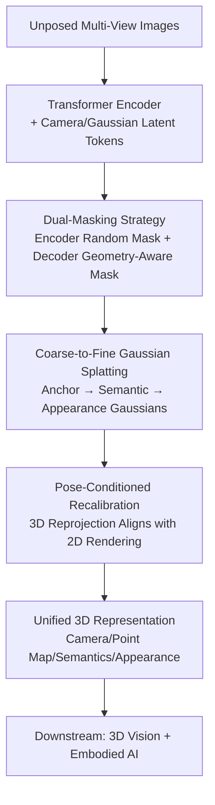

# Learning 3D Representations for Spatial Intelligence from Unposed Multi-View Images

**Conference**: CVPR 2026  
**Paper**: [CVF Open Access](https://openaccess.thecvf.com/content/CVPR2026/html/Zhou_Learning_3D_Representations_for_Spatial_Intelligence_from_Unposed_Multi-View_Images_CVPR_2026_paper.html)  
**Code**: https://bobochow.github.io/UniSplat (Project Page)  
**Area**: 3D Vision  
**Keywords**: 3D representation learning, feed-forward Gaussian splatting, unposed multi-view, self-supervised learning, embodied AI

## TL;DR
UniSplat is a feed-forward framework that directly learns a unified 3D representation from "sparse multi-view images without camera poses." It employs a dual-masking strategy to enhance geometric induction, coarse-to-fine Gaussian splatting to bridge the granularity mismatch between "coarse semantics and fine appearance," and pose-conditioned recalibration to align geometry and semantics. It comprehensively outperforms the unposed baseline LSM in novel view synthesis, open-vocabulary segmentation, and depth estimation on ScanNet, and achieves an average score of 62.5 across 268 tasks as a visual backbone for embodied AI.

## Background & Motivation
**Background**: Spatial intelligence requires a unified 3D representation that simultaneously carries geometric layout, semantic context, and visual details to serve as the perception foundation for navigation, manipulation, and planning of embodied agents. Learning such a representation directly from the cheapest and easiest inputs to obtain—**multi-view images without calibrated camera poses**—remains an open challenge.

**Limitations of Prior Work**: Supervised feed-forward reconstruction (NeRF, 3D Gaussian Splatting, and various semantic/geometric variants) either relies on calibrated cameras or ground-truth geometry, and predicts geometry, appearance, and semantics as independent tasks, lacking a unified representation. Although self-supervised methods eliminate expensive 3D annotations, most assume dense video supervision and degrade under sparse views. Even recent unposed self-supervised methods (RayZer, SelfSplat) generally suffer from three persistent issues: **weak geometric induction, limited appearance details, and geometric-semantic inconsistency**.

**Key Challenge**: The root cause is the natural conflict between these three attributes in terms of "granularity" and "supervision signals"—semantic fields are inherently coarse, whereas appearance fields require dense, fine-grained primitives. When task heads operate independently (conventional multi-tasking), geometric and semantic predictions drift and fail to align in 3D space, lacking a consistent 3D reference frame to bind them together.

**Goal**: To learn a unified 3D representation that is robust to all three attributes and generalizable across tasks under unposed, sparse-view inputs, which is decomposed into three sub-problems: (1) how to infer geometric structures from incomplete visual cues; (2) how to reconcile the granularity mismatch between coarse semantics and fine appearance; (3) how to enforce cross-task consistency between geometry and semantics.

**Key Insight**: The authors observe that to force the model to "learn to reason about 3D structure" rather than just "memorize texture," one must deliberately hide regions with the richest geometric information to force completion from sparse evidence. To align geometry and semantics, the most reliable supervisor is to project the 3D predictions back to the 2D image plane using the estimated camera parameters and perform pixel-wise comparison with the 2D rendered results.

**Core Idea**: Incorporate the trio of "dual-masking + coarse-to-fine Gaussian splatting + pose-conditioned recalibration" into a feed-forward framework called UniSplat. It is trained jointly via self-supervision and knowledge distillation (extracting semantic and geometric priors from frozen LSeg / VGGT teachers) without any ground-truth 3D annotations to obtain a unified representation.

## Method

### Overall Architecture
UniSplat takes a set of unposed multi-view images $I=\{I_v\}_{v=1}^V$ as input and outputs a unified 3D representation (camera parameters + 3D point maps + appearance Gaussians + semantic Gaussians), which can be directly fed into downstream 3D vision tasks and embodied AI policies. The backbone consists of a **Transformer encoder + multi-head decoder**: Images are first patched into tokens and fed into the encoder along with learnable camera tokens and Gaussian latent tokens. In between, a dual-masking strategy (random masking in the encoder + geometry-aware masking in the decoder) forces the learning of geometry-aware features. The decoder uses hierarchical coarse-to-fine Gaussian heads to decode the latent representation in three stages: "anchor Gaussians → semantic Gaussians → appearance Gaussians". Finally, pose-conditioned recalibration projects the 3D point maps and semantic maps back to 2D using the estimated camera params to align with the rendered results, closing the geometry-semantic consistency loop. This entire process is completed in a single feed-forward pass without per-scene optimization.

### Key Designs

**1. Dual-Masking Strategy: Forcing structural reasoning by hiding "geometry-critical regions"**

To address the issue of "weak geometric induction, where models only patch local textures," UniSplat applies masking not only at the encoder but also at the decoder. Importantly, the second masking stage specifically targets the regions richest in geometric information. In the first stage (initial masking + augmented encoding), a random mask $M^v_{enc}(\rho_e)$ is applied to the patch tokens $X^v$ of each view, yielding visible tokens $X^v_{vis}=(1-M^v_{enc})\odot X^v$. Following RayZer, learnable camera tokens $T_{cam}$ and Gaussian latent tokens $T_{coarse}$ are appended to the encoder input: $[Y_{vis}, T'_{cam}, T'_{coarse}]=\text{Enc}([X_{vis}, T_{cam}, T_{coarse}])$.

The second stage (Gaussian-guided geometric masking) is the core innovation: the updated camera tokens are first fed into a Coarse Camera Head to obtain coarse camera parameters $C_{coarse}\in\mathbb{R}^9$ (intrinsic + extrinsic), while $T'_{coarse}$ and $C_{coarse}$ are fed into a Coarse Gaussian Head to construct an initial geometric Gaussian field $G_{geo}(\mu,\sigma,r,s,\beta)$, where $\beta$ is a learnable importance score. Then, a geometric importance map is rendered via alpha blending:

$$J = \sum_{i=1}^{N_g}\sigma_i\beta_i\prod_{j=1}^{i-1}(1-\sigma_j)$$

The average importance score for each patch is obtained by pooling over $J$, and patches with scores exceeding a threshold $\rho_d$ are selected to form the geometry-aware mask $M^v_{dec}(\rho_d)$, which is then applied to the visible tokens from the first stage: $Z^v_{vis}=(1-M^v_{dec})\odot Y^v_{vis}$. This **selectively hides features that are most critical to the structure**, forcing the decoder to reconstruct them via 3D spatial reasoning from sparse evidence rather than relying on local textures. Ablation studies show that this geometry-aware mask significantly improves both segmentation and synthesis.

**2. Coarse-to-Fine Gaussian Splatting: Bridging granularity mismatch between "coarse semantics" and "fine appearance"**

Semantic fields are inherently coarse, whereas appearance fields require dense, fine-grained primitives. A single-scale Gaussian cannot satisfy both. UniSplat decodes the refined Gaussian latent tokens $T''_{coarse}$ through hierarchical Gaussian heads from coarse to fine in three levels. The first level, the Anchor Gaussian Head, predicts anchor Gaussians $G_{anchor}(\mu',\epsilon,\gamma)$ (center position, geometric feature $\epsilon\in\mathbb{R}^{11}$, and semantic feature $\gamma\in\mathbb{R}^{64}$), following the idea of Scaffold-GS to use each anchor as a base to generate multiple Gaussians. The second level, the Semantic Gaussian Head, expands each anchor into semantic Gaussians $G_{sem}$, predicting offsets $\Delta'$, coarse appearance attributes, and semantic features $\gamma'$, which can be rasterized into 2D semantic maps:

$$S = \sum_{i=1}^{N_s}\sigma'_i\gamma'_i\prod_{j=1}^{i-1}(1-\sigma'_j)$$

where $N_s=10N_g$ (each anchor generates 10 semantic Gaussians). In the third level, each semantic Gaussian acts as an anchor to spawn denser, fine-grained appearance Gaussians $G_{app}$. This progression realizes a step-by-step refinement of $G_{anchor}\Rightarrow G_{sem}\Rightarrow G_{app}$, **determining structure first, then filling in semantics, and finally completing texture**. This allows coarse semantics and fine appearance to adapt to their respective granularities without interfering with each other. Ablation studies show that this step-by-step approach yields consistent gains in PSNR and mIoU (progressing from single-scale to semantics-only coarse-to-fine, and to full coarse-to-fine hierarchy).

**3. Pose-Conditioned Recalibration: Projecting 3D predictions to 2D to enforce geometric-semantic consistency**

When multi-task heads operate independently, the 3D predictions of the geometric and semantic heads can easily misalign in space. UniSplat solves this by utilizing a Point Head (based on DPT) to regress per-view 3D point maps $P$ and a Camera Head to predict refined camera parameters $C_{final}$. Then, the 3D outputs (appearance Gaussians $G_{app}$, semantic Gaussians $G_{sem}$, and point maps $P$) are projected back onto the 2D image plane using $C_{final}$ to perform pixel-wise comparison with the rendered results, penalizing any inconsistency. Since the projected coordinates $Q$ are continuous, differentiable bilinear sampling is utilized to obtain the warped output $I_{proj}$, which is compared with the Gaussian-rendered result $I_{rend}$. Geometric recalibration uses a reprojection loss:

$$\mathcal{L}_{recalib}^{geo}=\sum_{v=1}^{V}\sum_{j=1}^{H\times W}\|I^v_{rend,j}-\text{Proj}(C^v_{final}, P^v_j)\|$$

And semantic recalibration constructs 3D semantic point maps $P_{sem}$ and projects them to obtain semantic maps $F_{proj}$, which are compared with the rendered semantic maps $F_{rend}$ using cosine similarity:

$$\mathcal{L}_{recalib}^{sem}=\sum_{v=1}^{V}\sum_{j=1}^{H\times W}\Big(1-\frac{F^v_{proj,j}\cdot F^v_{rend,j}}{\|F^v_{proj,j}\|\cdot\|F^v_{rend,j}\|}\Big)$$

The total recalibration objective is $\mathcal{L}_{recalib}=\mathcal{L}_{recalib}^{geo}+\mathcal{L}_{recalib}^{sem}$. This step **forces what the "geometry head" and "semantics head" say to align on the 2D image plane for verification**, which is the source of the final significant performance boost in ablation studies (PSNR 24.96 → 25.65, mIoU 0.5377 → 0.5625). This is the key difference between UniSplat and traditional multi-task methods with independent heads.

### Loss & Training
The total objective is a weighted sum of four terms: $\mathcal{L}_{total}=\mathcal{L}_{rgb}+\mathcal{L}_{sem}+\mathcal{L}_{geo}+\mathcal{L}_{recalib}$, focusing on **joint self-supervision and knowledge distillation** to avoid ground-truth 3D annotations:

- **Photometric Reconstruction Loss** $\mathcal{L}_{rgb}=\sum_v(\|I^v_{rend}-I^v\|+\text{LPIPS}(I^v_{rend},I^v))$, where L1 and perceptual metrics ensure the rendered appearance matches the input views.
- **Semantic Distillation Loss** $\mathcal{L}_{sem}$: extracts semantic feature maps from a frozen VLM (LSeg) to distill into the 3D semantic Gaussians, using 1 minus cosine similarity for alignment.
- **Geometric Prior Loss** $\mathcal{L}_{geo}=\lambda_{pose}\mathcal{L}_{pose}+\lambda_{point}\mathcal{L}_{point}$: extracts pseudo-truth camera parameters $\tilde C$ and point maps $\tilde P$ from a frozen VGGT teacher. Cameras are optimized via Huber loss, and point maps via confidence-weighted L1 ($\lambda_{pose}=10.0, \lambda_{point}=1.0$).

Implementation details: The backbone is a ViT-L pre-trained on ScanNet/ScanNet++. Optimization uses AdamW with a base learning rate of $1\times10^{-4}$, 30 warm-up epochs, and a total of 300 epochs on 8×A100 GPUs. The input size is 256×256. The mask ratios for the dual mask encoder/decoder are both set to 0.5. Each anchor generates 10 Gaussians, and the number of coarse Gaussian tokens $N_g$ corresponds to 256.

## Key Experimental Results

### Main Results
On ScanNet, novel view synthesis (NVS), open-vocabulary segmentation (OVSS), and depth estimation (DE) are evaluated simultaneously. UniSplat requires no SfM or per-scene optimization. Its feed-forward reconstruction takes only 0.041s, comprehensively outperforming the unposed baseline LSM and other supervised baselines:

| Task / Metric (Target View) | Ours (UniSplat) | Prev. SOTA (LSM, Unposed) | Gain |
|--------|------|----------|------|
| OVSS mIoU↑ | 0.5625 | 0.5078 | +5.5 |
| OVSS mAcc↑ | 0.8334 | 0.7686 | +6.5 |
| NVS PSNR↑ | 25.65 | 24.39 | +1.26 |
| NVS SSIM↑ | 0.8782 | 0.8072 | +0.071 |
| NVS LPIPS↓ | 0.1353 | 0.2506 | −0.115 |
| DE Abs Rel↓ (Source View) | 3.10 | 3.38 | Better |

For embodied AI, the pre-trained ViT encoder of UniSplat is used as a frozen feature backbone. It achieves an average score of 62.5 on a benchmark covering 8 simulators and 268 tasks, surpassing the previous best embodied-specific method SPA (59.6):

| Benchmark (No. of Tasks) | Ours | SPA | InternViT |
|--------|------|------|------|
| Franka Kitchen (5) | 57.7 | 56.3 | 55.6 |
| Meta-World (5) | 89.3 | 87.5 | 86.4 |
| RLBench (18) | 26.7 | 24.2 | 22.8 |
| LIBERO (130) | 72.1 | 68.1 | 67.3 |
| **Average** | **62.5** | 59.6 | 57.6 |

### Ablation Study
Gradually adding back the three major components (ScanNet, NVS + OVSS):

| Configuration | PSNR↑ | mIoU↑ | Description |
|------|---------|------|------|
| baseline | 22.83 | 0.4901 | All three components removed |
| + Dual Masking | 24.17 | 0.5132 | Geometric induction |
| + Coarse-to-Fine Gaussian | 24.96 | 0.5377 | Bridging granularity mismatch |
| + Recalibration (Full) | 25.65 | 0.5625 | Geometric-semantic consistency |

Comparison of masking strategies (Table 4): No Masking 22.83 → Encoder-only 23.74 → Decoder Random 24.05 → Dual (Geometry-aware) 24.17 PSNR. This validates that "applying a second mask layer at the decoder targeting geometry-critical regions" is significantly stronger than pure encoder masking. Comparison of Gaussian strategies (Table 5): Single-scale 24.17 → Semantics-only coarse-to-fine 24.61 → Full coarse-to-fine 24.96. The step-by-step refinement is proven effective.

### Key Findings
- Incorporating the three modules progressively yields monotonic performance improvements, with **recalibration contributing the last and largest semantic gain** (mIoU +0.0248), confirming that "cross-task consistency" is the key bottleneck for unposed unified representations.
- Cross-dataset generalization (trained on ScanNet, tested on ScanNet++): PSNR 24.12 vs LSM 22.87 vs pixelSplat 21.34, showing that the model learns transferable structural priors rather than overfitted patterns.
- Using the learned features as a frozen backbone for embodied tasks outperforms general/embodied-specific representations such as DINOv2, CLIP, VC-1, and SPA, proving that "3D representations with geo-semantic consistency" provide a superior visual foundation for robotic control policies.

## Highlights & Insights
- **Geometry-guided secondary masking is highly elegant**: The first random mask acts as a standard MAE, while the second mask uses the rendered "importance map" from the initial Gaussian fields. This allows the model to self-annotate "where to hide most," shifting masking from blind to purposeful. This "coarse estimation followed by targeted masking" paradigm can be transferred to any self-supervised pre-training that requires hard example mining.
- **Casting multi-task consistency as 2D reprojection alignment is the most elegant step**: Rather than directly regularizing in the 3D space (which is difficult and unstable), it unifies them on the 2D image plane via pixel-wise alignment. The geometric and semantic heads are measured by the same 2D yardstick, aligning them naturally.
- **Three-level Gaussian anchor propagation** (anchor → semantic → appearance, with each level serving as the anchor for the next) enables a single representation to serve both coarse semantics and fine appearance, avoiding training different-resolution fields for different tasks.

## Limitations & Future Work
- Though self-supervised, the method **heavily relies on knowledge distillation**: Semantics depend on LSeg and geometry relies on VGGT for pseudo-ground truth. This essentially distills the capabilities of two strong teachers. The teacher models' biases and blind spots will be inherited; thus "no 3D annotation" does not mean "no strong priors."
- Evaluation is focused on ScanNet/ScanNet++ indoor scenes with a low resolution of 256×256. Robustness under **large-scale outdoor, high-resolution, and dynamic scenes** remains unverified.
- Recalibration requires differentiable reprojection and bilinear sampling, which entails rendering multi-level Gaussians and performing multiple projections at each step. This leads to **considerable training overhead** (300 epochs on 8×A100), and the paper does not specify the total training time and VRAM footprint.
- Results are sensitive to hyperparameters like the dual-masking ratio, threshold $\rho_d$, and the number of generated Gaussians per anchor. The paper only provides minor ablations without a systematic sensitivity analysis.

## Related Work & Insights
- **vs LSM [13]**: Both are unposed feed-forward methods that lift 2D semantics to 3D. However, LSM exhibits weak geometric induction and is prone to geometric-semantic drift. UniSplat enhances geometry via dual masking and enforces consistency through recalibration, leading across the board on ScanNet (mIoU +5.5, PSNR +1.26).
- **vs RayZer [22] / SelfSplat [24]**: Both estimate joint camera-scene representations without poses, but they only cover geometry and appearance without involving semantic unification or geometric-semantic consistency. UniSplat explicitly couples geometry, appearance, semantics, and camera parameters while distilling VLM semantics.
- **vs UniForward / Uni3R [46, 48]**: Although they also attempt to unify the three attributes, they adopt "posed training + unposed inference," leaving residual spatial inconsistencies. UniSplat operates entirely unposed and explicitly eliminates inconsistency via 2D reprojection alignment.
- **vs Scaffold-GS [34]**: UniSplat adopts the concept of anchor Gaussians generating child Gaussians from Scaffold-GS, but extends it into a three-level hierarchy ("anchor → semantic → appearance") and integrates it into a self-supervised feed-forward framework rather than per-scene optimization.

## Rating
- **Novelty**: ⭐⭐⭐⭐ The three components are well-targeted. The combination of "geometry-guided secondary masking" and "2D reprojection alignment for multi-task consistency" is highly creative, though individual components are built on existing paradigms (MAE, Scaffold-GS, reprojection consistency).
- **Experimental Thoroughness**: ⭐⭐⭐⭐ The paper covers five 3D vision tasks, 268 embodied tasks, cross-dataset generalization, and three sets of ablations. However, it lacks evaluations on outdoor/high-resolution scenes, as well as analyses of training overhead and hyperparameter sensitivity.
- **Writing Quality**: ⭐⭐⭐⭐ The chain of motivation-method-experiment is clear, formulas are complete, and the roles of the three components are well explained. Some notations (e.g., the relationship between $N_g$ and the token count 256) could be clarified with reference to the original paper.
- **Value**: ⭐⭐⭐⭐ A unified, unposed 3D representation is a critical need for embodied AI. Its performance as a frozen backbone surpassing DINOv2, CLIP, and SPA is highly convincing, indicating high transfer value.

<!-- RELATED:START -->

## Related Papers

- [\[CVPR 2026\] Uni3R: Unified 3D Reconstruction and Semantic Understanding via Generalizable Gaussian Splatting from Unposed Multi-View Images](uni3r_unified_3d_reconstruction_and_semantic_understanding_via_generalizable_gau.md)
- [\[CVPR 2026\] Learning Multi-View Spatial Reasoning from Cross-View Relations](learning_multi-view_spatial_reasoning_from_cross-view_relations.md)
- [\[CVPR 2026\] Learning Scene Coordinate Reconstruction from Unposed Images via Pose Graph Optimization](learning_scene_coordinate_reconstruction_from_unposed_images_via_pose_graph_opti.md)
- [\[CVPR 2026\] Learning Compact 3D Representations from Feed-Forward Novel View Synthesis](learning_compact_3d_representations_from_feed-forward_novel_view_synthesis.md)
- [\[CVPR 2026\] CrossHOI: Learning Cross-View Representations for Monocular 3D Human-Object Interaction Reconstruction](crosshoi_learning_cross-view_representations_for_monocular_3d_human-object_inter.md)

<!-- RELATED:END -->
