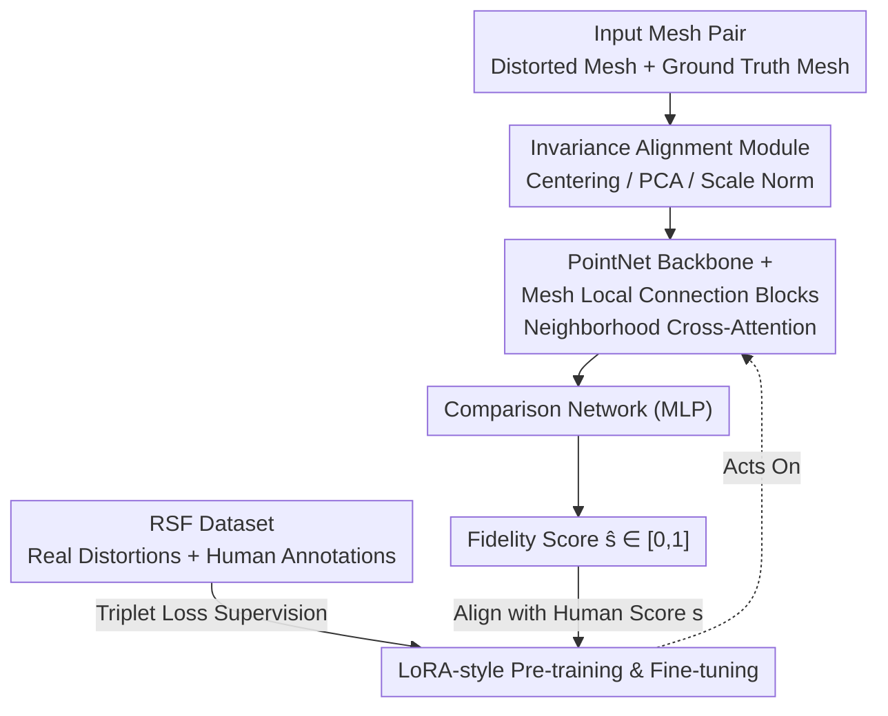

# Learning 3D Shape Fidelity Metric from Real-world Distortions

**Conference**: CVPR 2026  
**Paper**: [CVF Open Access](https://openaccess.thecvf.com/content/CVPR2026/html/Feng_Learning_3D_Shape_Fidelity_Metric_from_Real-world_Distortions_CVPR_2026_paper.html)  
**Code**: None  
**Area**: 3D Vision  
**Keywords**: Shape fidelity, perceptual metric, mesh local connection, LoRA fine-tuning, human-annotated dataset

## TL;DR
This paper proposes LoCaSE, a learnable 3D shape fidelity metric. It captures details using local attention on mesh topology and mitigates model bias through LoRA-style pre-training and fine-tuning. Accompanied by the RSF dataset featuring real-world distortions and human annotations, the metric aligns significantly closer to human perception than geometric metrics like Chamfer Distance.

## Background & Motivation

**Background**: 3D generation and reconstruction are widely used in gaming, film, and content creation, where the resulting 3D shapes are expected to "look real." Consequently, evaluating 3D shape quality commonly relies on geometric metrics such as Chamfer Distance (CD), IoU, F-score, and Unidirectional Hausdorff Distance (UHD), as well as the recent frequency-domain metric SAUCD.

**Limitations of Prior Work**: These metrics fail to reflect human-perceived fidelity. Geometric metrics like CD only focus on the average geometric error between two shapes; a smooth surface and a highly detailed surface may have nearly identical CD values (e.g., $CD=0.0058$m in Figure 1), yet their perceived fidelity differs immensely. Frequency-domain metrics like SAUCD attempt to capture details through spectral analysis, but frequency information cannot cover the full complexity of human perception.

**Key Challenge**: There is a systematic misalignment between geometric accuracy and human-perceived fidelity—humans are highly sensitive to local details, which handcrafted global or frequency-domain metrics fail to capture.

**Goal**: To **learn** a fidelity metric directly aligned with human perception from annotated data, while simultaneously addressing two types of bias: data bias (existing datasets mostly use synthetic distortions with a domain gap from real reconstruction/generation) and model bias (the network must capture shape details while maintaining generalization).

**Key Insight**: The authors observe that human judgment of mesh quality depends on local details embedded in the geometry and **connectivity**. Therefore, mesh topological adjacency information is explicitly injected into feature extraction. Simultaneously, priors from pre-training on large-scale unlabeled shape datasets (ModelNet) are used to combat overfitting caused by small-scale annotated data.

**Core Idea**: Construct a metric network using "local-connection attention + LoRA-style pre-training and fine-tuning," paired with the "real distortion + human annotation" RSF dataset, to learn human preferences for 3D shape fidelity into a differentiable metric.

## Method

### Overall Architecture
LoCaSE (Local-Connection-based Shape Evaluation) formalizes the fidelity metric as $\hat{s} = F(\hat{m}, m; \theta)$: given a distorted mesh $\hat{m}$ and a ground truth mesh $m$, it outputs a fidelity score $\hat{s}$ (the higher, the better, normalized to $[0,1]$). The training objective is $\min_\theta \mathcal{L}(\hat{s}, s)$ to align predicted scores with human-annotated scores $s$.

The pipeline: The input distorted and ground truth meshes first pass through a **non-learned invariance alignment module** to eliminate translation, rotation, and scale differences. Aligned vertices are fed into a shape encoder with a **PointNet backbone and embedded mesh local connection blocks** to extract features for both meshes. A MLP **comparison network** then grades the two sets of features to output the fidelity score. The backbone is pre-trained on ModelNet, with **LoRA-style fine-tuning** applied to its MLP layers to adapt to real distortion distributions and human annotations, while the comparison network and local connection blocks are trained from scratch.

### Key Designs

**1. Invariance Alignment Module: Eliminating noise from global transformations without learned parameters**

Human judgment of shape quality is inherently invariant to translation, viewpoint rotation, and scale changes. Thus, a **purely geometric, non-parametric** module is used to normalize the input and ground truth meshes, preventing the network from wasting capacity on learning these known invariances. Three steps are performed: Translation invariance is achieved by subtracting the centroid from all vertices $v'_i = v_i - \frac{1}{N}\sum_{i=1}^{N} v_i$ to center them at the origin. Rotation invariance involves calculating the covariance matrix $\Sigma = \frac{1}{N}V^\top V$ for the centered vertices $V$ and performing eigen-decomposition $\Sigma = U\Lambda U^\top$, then using $v''_i = U^\top v'_i$ to align the three principal components with the coordinate axes. Scale invariance normalizes the average distance from all vertices to the origin to 1, i.e., $v^{\text{norm}}_i = \frac{1}{\frac{1}{N}\sum_i \|v''_i\|_2} v''_i$. This ensures the geometry entering the backbone is canonical regardless of how the input mesh was positioned or scaled, enhancing metric robustness.

**2. Mesh Local Connection Block: Supplementing missing connectivity in PointNet with neighborhood cross-attention**

PointNet was originally designed for point clouds and lacks explicit connectivity, making it difficult to extract local details critical to humans. The authors construct a local attention block for each vertex: using its own feature $x_i$ as the query and the features of its neighboring vertices $x_{n,i}$ as keys/values for cross-attention, followed by a feed-forward network to obtain local features $x_{l,i} = \mathrm{FFN}(\mathrm{Attention}(x_i, x_{n,i}, x_{n,i}))$. Attention is restricted to the neighborhood rather than all vertices because: 1) meshes often have tens of thousands of vertices, making $N \times N$ attention maps computationally infeasible and hard to learn; 2) local connectivity is sufficient to compensate for PointNet’s weakness in local details. Neighbors are determined using the $k$-th order neighborhood of the mesh adjacency matrix $A$: $I_i(k) = \mathrm{supp}((A^k)_i)$. The paper uses $k=5$ and truncates to 64 neighbors after sorting by topological distance (in the dataset, >95% of vertices have $\geq 64$ neighbors in a 5th-order neighborhood; fewer neighbors are padded by oversampling 1st-order neighbors).

**3. LoRA-style Pre-training & Fine-tuning: Retaining large-scale shape priors while learning human preferences**

High-quality human-annotated fidelity data is expensive to collect and limited in scale; training on it alone risks overfitting and lack of shape priors. The authors use PointNet pre-trained on ModelNet as the backbone (carrying large-scale shape priors) and apply LoRA-style low-rank bypass fine-tuning to its MLP layers: rewriting the original $x' = \mathrm{MLP}(x)$ as $x' = \mathrm{MLP}(x) + x L_d L_u$, where $L_d \in \mathbb{R}^{C \times r}$ and $L_u \in \mathbb{R}^{r \times C'}$ are down- and up-projection matrices. The rank $r$ is set to 32 based on experiments. This adds only $r \times (C + C')$ trainable parameters per MLP. The pre-trained shape priors are frozen, while the LoRA bypasses specifically absorb information related to "human fidelity annotations," thus suppressing both data and model bias.

**4. RSF Dataset and Triplet Loss Training: Supervision with real distortions and human annotations**

To eliminate the domain gap caused by synthetic distortions, the authors constructed the two-branch Real Shape Fidelity (RSF) dataset: The main subset selects 16 image/object pairs and creates distorted meshes using 16 real reconstruction and generation algorithms (text-to-3D models use GPT-4o to convert images to prompts first). A test-only subset contains 8 objects and newer distortion algorithms not seen in the main subset (e.g., CraftsMan3D, Hunyuan2.1, SPAR3D) for cross-domain evaluation. For annotation, a Swiss-system pairwise comparison was used: each participant performed 6 rounds of comparison for 28 distorted meshes of a reference object, yielding scores from 0–6 normalized to $[0,1]$. Each object collected scores from 25–35 people, with reliability improved via the IQR method (removing outliers $>1.5\times$ IQR). The error after outlier removal is approximately 6.9%. Training uses three complementary losses: Smooth L1, Pearson Linear Correlation Coefficient (PLCC), and Spearman Rank Correlation Coefficient (SROCC). The total loss is $\mathcal{L} = \lambda_{\text{smooth}}\mathcal{L}_{\text{smooth}} + \lambda_{\text{plcc}}\mathcal{L}_{\text{plcc}} + \lambda_{\text{srocc}}\mathcal{L}_{\text{srocc}}$, with weights $\lambda_{\text{smooth}}=5,\ \lambda_{\text{plcc}}=1,\ \lambda_{\text{srocc}}=1$ to ensure the network fits absolute scores and aligns ranking relationships.

### Loss & Training
The total loss is a weighted sum of Smooth L1, Pearson correlation, and Spearman correlation (weight ratio 5:1:1). The comparison MLP has 4 layers (2048→1024→512→256→1). The local connection module uses 2 blocks with $C=C'=64$, and the FFN has 4 layers (dimension 16). The backbone uses ModelNet10 pre-trained weights with LoRA rank 32. It is optimized using AdamW with a learning rate of $1\times10^{-3}$, weight decay of $1\times10^{-4}$, and trained on a single RTX A6000 (PyTorch implementation).

## Key Experimental Results

Evaluation uses three correlation coefficients to measure the alignment between the metric and human scores, ranging from $[-1,1]$ (higher is better): **PLCC** (linear correlation), **SROCC** (rank consistency), and **KROCC** (Kendall rank consistency).

### Main Results

A 16-fold object-wise cross-validation was conducted on the main RSF subset (one object left out for testing in each fold). The table below shows the average values and standard deviations across 16 objects (lower std indicates better robustness):

| Metric | PLCC Avg ↑ | PLCC Std ↓ | SROCC Avg ↑ | KROCC Avg ↑ |
|------|-----------|-----------|-------------|-------------|
| Chamfer Distance | 0.513 | 0.311 | 0.424 | 0.328 |
| P2S | 0.488 | 0.297 | 0.468 | 0.360 |
| IoU | 0.383 | 0.313 | 0.410 | 0.311 |
| UHD | 0.410 | 0.395 | 0.375 | 0.269 |
| SAUCD | -0.021 | 0.322 | 0.014 | -0.028 |
| **LoCaSE (Ours)** | **0.728** | **0.106** | **0.757** | **0.614** |

LoCaSE leads significantly in all three correlation coefficients and achieves the lowest standard deviation (PLCC Std 0.106 vs. next-best 0.276+), proving it is both perceptually aligned and stable across object categories. Notably, SAUCD's average PLCC is near zero, indicating frequency metrics largely fail on real-world distortions.

Regarding cross-domain generalization, **direct inference** (without fine-tuning) on the test-only subset:

| Metric | PLCC Avg ↑ | SROCC Avg ↑ | KROCC Avg ↑ |
|------|-----------|-------------|-------------|
| Chamfer Distance | -0.46 | -0.46 | -0.40 |
| F-score | 0.51 | 0.41 | 0.30 |
| IoU | 0.38 | 0.28 | 0.28 |
| SAUCD | 0.15 | 0.09 | 0.08 |
| **LoCaSE (Ours)** | **0.68** | **0.64** | **0.55** |

Most traditional metrics show negative correlations during cross-domain evaluation (CD is negative across the board), while LoCaSE maintains high positive correlations, reflecting its generalization power derived from real distortion training and shape priors. In training/test split experiments (leaving out dog/bus/female/hand), LoCaSE also leads: PLCC 0.6968, SROCC 0.7025, KROCC 0.5335, compared to P2S's SROCC of 0.4490.

### Ablation Study

| Configuration | PLCC ↑ | SROCC ↑ | KROCC ↑ |
|------|--------|---------|---------|
| Trained only on synthetic ShapeGrading | 0.380 | 0.395 | 0.312 |
| Trained from scratch (No pre-training) | 0.697 | 0.708 | 0.556 |
| Replace local attention with ball query | 0.645 | 0.671 | 0.533 |
| w/o LoRA | 0.671 | 0.638 | 0.488 |
| w/o Local Attention | 0.605 | 0.632 | 0.482 |
| w/o Local Attention & w/o LoRA | 0.597 | 0.627 | 0.485 |
| **Full (Ours)** | **0.728** | **0.757** | **0.614** |

### Key Findings
- **Real distortion data is fundamental**: Training only on synthetic ShapeGrading yields a PLCC of only 0.380, highlighting a significant domain gap and the necessity of domain adaptation.
- **Local attention and LoRA are complementary**: Removing local attention drops performance to 0.605, and removing LoRA drops it to 0.671. Removing both leads to 0.597 (the largest drop), indicating they contribute to "local detail capture" and "prior retention + bias mitigation," respectively. Replacing local attention with ball query (0.645) proves neighborhood cross-attention is superior for local geometry.
- **Hyperparameter sensitivity**: A LoRA rank of 32 is optimal (PLCC 0.728); lower ranks (8/16) lack expressiveness, while higher ranks (64, 0.730) offer marginal gains or slight decreases. Loss weights at $5{:}1{:}1$ are optimal; removing the Smooth L1 dominance (e.g., 1:1:1 gives 0.677) results in a Performance drop.
- **Backbone choice**: Replacing with complex backbones like MeshCNN/DiffusionNet/PointNet++/DGCNN yields reasonable but inferior results compared to simple PointNet (DGCNN 0.699 vs. Ours 0.728), suggesting performance stems from the local connection + LoRA design rather than backbone complexity.

## Highlights & Insights
- **Explicitly learning "human perception" into the metric**: Moving beyond handcrafted geometric/frequency metrics to directly optimize alignment with human judgment using annotated data and ranking losses. This approach is transferable to any task where "geometric accuracy $\neq$ subjective quality" (e.g., point cloud or textured mesh assessment).
- **Efficient non-parametric invariance alignment**: Using PCA, centering, and scale normalization provides "free" translation/rotation/scale invariance to the network, removing the burden of learning these invariances.
- **LoRA is not just for LLM fine-tuning**: Here, LoRA is used as a tool for bias mitigation, retaining large-scale unlabeled priors while performing low-rank adaptation on small annotated sets, providing a paradigm for small-data perceptual tasks.
- **Local vs. global attention trade-off**: Neighborhood cross-attention avoids the memory explosion of $N \times N$ global attention while capturing local geometry better than ball queries—a useful compromise for detail-sensitive tasks.

## Limitations & Future Work
- **Shape-only evaluation**: The method deliberately separates shape from texture; it is not directly applicable to meshes with color/materials where texture is often the primary perceptual factor. Extending to textured mesh quality assessment is a natural progression.
- **Dependence on mesh topology**: The local connection block requires explicit adjacency information. Robustness on point clouds only, meshes with broken topology, or non-manifold inputs was not fully discussed.
- **Annotation cost and scale**: The RSF main subset contains only 16 objects due to high costs. Although LoRA + pre-training helps, generalization across a broader range of object categories needs further verification; the test-only subset (8 objects) is also relatively small.
- **Neighbor truncation effects**: Forcing a truncation at 64 neighbors or oversampling 1st-order neighbors for sparse areas might introduce bias in highly irregular meshes; adaptive neighborhood sizes could be explored.

## Related Work & Insights
- **vs. Chamfer Distance / P2S / IoU / UHD**: These are pure geometric matching metrics that ignore human perception, leading to misalignment or negative correlation with human scores for detail differences. LoCaSE outperforms them by fitting human annotations directly.
- **vs. SAUCD (Frequency Metric)**: SAUCD uses spectral analysis for shape details, but frequency information fails to cover the full spectrum of human perception. In experiments, its correlation was near zero; LoCaSE captures details in the spatial domain via local connections, which aligns better with human judgment.
- **vs. Prior Perceptual Metrics & Datasets**: Previous learnable metrics often used synthetic distortions and focused on textured meshes, leading to a domain gap. The core difference here is the use of RSF—built from real reconstruction/generation distortions and large-scale human annotations—focusing on the fidelity of untextured 3D shapes.
- **vs. Complex Mesh Backbones**: Simply switching to stronger backbones did not provide gains, highlighting that "Local-Connection Attention + LoRA fine-tuning" is the primary performance driver. This suggests the bottleneck for this task lies in detail modeling and bias control rather than backbone capacity.

## Rating
- Novelty: ⭐⭐⭐⭐ Systematically learning 3D shape fidelity using "Local Connection Attention + LoRA Fine-tuning + Real Distortion Human Dataset" is a novel combination of established components.
- Experimental Thoroughness: ⭐⭐⭐⭐⭐ 16-fold cross-validation + train/test split + cross-domain test-only + extensive ablations (backbone, loss weights, LoRA rank, neighborhood) provide comprehensive coverage.
- Writing Quality: ⭐⭐⭐⭐ Clear motivation and sufficient figures, though some formulas and symbols (neighborhood statistics, test-only counts) contain minor OCR/representational noise.
- Value: ⭐⭐⭐⭐ Provides a differentiable, perceptually aligned evaluation tool for 3D generation/reconstruction; the RSF dataset is of practical value to the community.

<!-- RELATED:START -->

## Related Papers

- [\[CVPR 2026\] AnthroTAP: Learning Point Tracking with Real-World Motion](anthrotap_learning_point_tracking_with_real-world_motion.md)
- [\[CVPR 2026\] OLATverse: A Large-scale Real-world Object Dataset with Precise Lighting Control](olatverse_a_large-scale_real-world_object_dataset_with_precise_lighting_control.md)
- [\[CVPR 2026\] X-Part: High Fidelity And Structure Coherent Shape Decomposition And Completion](x-part_high_fidelity_and_structure_coherent_shape_decomposition_and_completion.md)
- [\[CVPR 2026\] ICTPolarReal: A Polarized Reflection and Material Dataset of Real World Objects](ictpolarreal_a_polarized_reflection_and_material_dataset_of_real_world_objects.md)
- [\[CVPR 2026\] UniTEX: Universal High Fidelity Generative Texturing for 3D Shapes](unitex_universal_high_fidelity_generative_texturing_for_3d_shapes.md)

<!-- RELATED:END -->
