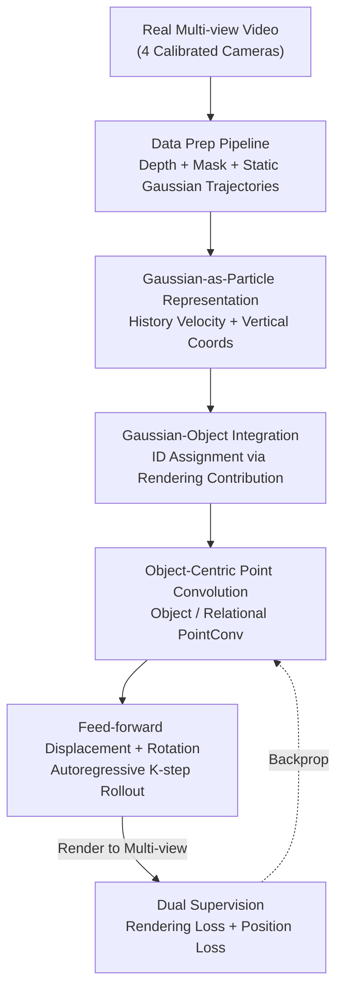

# Learning a Particle Dynamics Model with Real-world Videos

**Conference**: CVPR 2026  
**arXiv**: [2605.23845](https://arxiv.org/abs/2605.23845)  
**Code**: https://chkim403.github.io/gs_physics (Project page, committed to open-sourcing data + code)  
**Area**: 3D Vision / Neural Physics Simulation / World Models  
**Keywords**: Particle Dynamics, Gaussian Splatting, Rendering Supervision, Multi-object Collision, Real-world Video

## TL;DR
A framework is proposed to learn multi-object collision dynamics directly from unannotated real-world videos. By treating 3D Gaussians as particles and feeding them into a point cloud backbone to predict displacement and rotation, the model uses differentiable rendering loss for supervision instead of expensive 3D ground truth. A dataset of approximately 500 multi-view collision videos is also released.

## Background & Motivation

**Background**: Learning "particle dynamics models" (a type of differentiable physical world model) using neural networks has become a hot topic. Given historical particle states, the network predicts their motion in the next frame. Because these models are differentiable, they can be embedded into larger end-to-end systems like robotics or generative models. Representative approaches represent scenes as point clouds and use Graph Neural Networks (GNNs) or point convolutions to model force propagation.

**Limitations of Prior Work**: Such models are almost exclusively trained in **simulated environments** because they rely on "perfect state" information: complete scene point clouds, frame-by-frame point correspondences, and object IDs for each particle. This information is extremely difficult to obtain in the real world: dense point cloud correspondence requires either expensive annotation or **approximate and noisy** signals like Chamfer distance. Consequently, models fail when the sim-to-real gap is large.

**Key Challenge**: Learning from real videos lacks particle-level 3D ground truth, while obtaining clean ground truth limits research to simulation. Differentiable rendering (Gaussian Splatting / NeRF) offers a third path—allowing gradients to flow from 2D images back to 3D without 3D labels. However, existing rendering-supervised dynamics works focus almost entirely on **single-object** scenes (e.g., a robot manipulating one object) and cannot handle the **discontinuous and strong interactions** of multi-object collisions.

**Goal**: The objective is to achieve learning of **multi-object collision** dynamics using only real videos, 2D masks, and rendering loss for the first time. This requires solving three new challenges: recovering 3D trajectories from local 2D cues, assigning each Gaussian to the correct object during occlusion and collision, and feed-forward prediction of future Gaussian states.

**Key Insight**: Dense Gaussians from Gaussian Splatting are treated **directly as particles with scale/rotation** and fed into a point cloud convolutional network. Supervision is provided via differentiable rendering loss (complemented by pseudo-position labels from point cloud tracking), removing reliance on particle-level 3D ground truth and predefined physical parameters.

## Method

### Overall Architecture

The method consists of two parts: a **data preparation pipeline** (converting multi-view real videos into "3D Gaussian trajectories with consistent object IDs + supervision signals" suitable for the network) and a **particle dynamics model** (treating Gaussians as particles to predict displacement and rotation autoregressively). During training, the model predicts future Gaussian states for $K=3$ frames. The predicted Gaussians are rendered back to multiple calibrated views to calculate rendering loss against real images and position loss against pseudo-labels from point cloud tracking.

Inputs are three frames of historical Gaussians ($t-2, t-1, t$). For each Gaussian $i$, velocities $\mathbf{v}_{t-1}^{(i)}, \mathbf{v}_t^{(i)}$ and vertical coordinates $z_{t-1}^{(i)}, z_t^{(i)}$ (helping the network perceive gravity and the ground) are extracted to form point-wise features $\mathbf{f}_t^{(i)}=[\mathbf{v}_{t-1}^{(i)}, \mathbf{v}_t^{(i)}, z_{t-1}^{(i)}, z_t^{(i)}]$. The network outputs the next frame center $\hat{\mathbf{x}}_{t+1}^{(i)}$ (predicting velocity or acceleration) and incremental rotation $\Delta\mathbf{R}_t^{(i)}\in SO(3)$.

### Key Designs

**1. Gaussian-as-Particles + Rendering Supervision: 2D Image Backpropagation instead of 3D Labels**

Real-world particle-level 3D ground truth is unavailable. The authors note that each Gaussian in Gaussian Splatting is essentially a 3D point $G^{(i)}=(\mathbf{x}^{(i)}, \mathbf{R}^{(i)}, \mathbf{s}^{(i)}, \mathbf{c}^{(i)}, o^{(i)})$ with attributes. Thus, they feed the entire Gaussian set into a point cloud backbone **without heuristic downsampling**, predicting on the original dense Gaussians. Supervision comes from the differentiable rendering equation $I(u)=\sum_{j}\mathbf{c}^{(j)}\alpha_c^{(j)}(u)\prod_{k<j}(1-\alpha_c^{(k)}(u))$. By rendering predicted Gaussians and comparing them to real frames, gradients flow from 2D pixels to 3D motion prediction. This eliminates the need for dense 3D correspondences or predefined physical parameters (density, Young's modulus, friction), providing a more explicit representation compared to NeRF's implicit deformation fields.

**2. Gaussian-Object Integration: Assigning Object IDs via Cross-view Voting**

The core difficulty in multi-object scenes is that Gaussians **lack object IDs**, yet collision modeling requires them. Assuming consistent 2D segmentation masks across views and time (provided by models like SAM), the authors backtrack ownership via "the contribution of each Gaussian to the rendered object mask." Specifically, the contribution of Gaussian $i$ to pixel $u$ in view $c$ is $\gamma_c^{(i)}(u)=\alpha_c^{(i)}(u)\prod_{j\in\mathcal{F}_c(i)}(1-\alpha_c^{(j)}(u))$ where $\mathcal{F}_c(i)$ is the set of Gaussians in front. For each mask, the maximum contribution within the mask is taken: $\Gamma_{c,m}^{(i)}=\max_{u\in\text{mask}(c,m)}\gamma_c^{(i)}(u)$. Each view casts a vote $\text{ID}_c^{(i)}=\arg\max_m\Gamma_{c,m}^{(i)}$, and a majority vote across $C$ views determines the ID, converted to a one-hot vector $\mathbf{w}^{(i)}$.

**3. Object-Centric Point Convolution: Single-pass KNN + ID Affinity for Force Propagation**

Collision dynamics require modeling both **intra-object** rigid force propagation and **inter-object** contact interactions. Prior work [12] maintained object-specific neighborhoods, which is inefficient. This work performs a **single, object-agnostic KNN** and uses the ID vectors to calculate affinity weights: $m_{i,0}=(\mathbf{w}^{(i)})^\top\mathbf{w}^{(0)}$ for Object PointConv (close to 1 if same object) and $m_{i,0}=1-(\mathbf{w}^{(i)})^\top\mathbf{w}^{(0)}$ for Relational PointConv (close to 1 if different objects). These weights are plugged into the point convolution:
$$\mathbf{y}_0=\mathbf{W}_l\,\mathrm{vec}\!\left(\frac{1}{\sum_i m_{i,0}}\sum_{\mathbf{p}_i\in\mathcal{N}(\mathbf{p}_0)}m_{i,0}\,h(\mathbf{p}_i-\mathbf{p}_0)\,\mathbf{x}_i^\top\right)$$
where $h(\cdot)$ is an MLP encoding relative position. This achieves object-level partitioning without explicit neighborhood construction, efficiently supporting both one-hot and soft ID representations.

**4. Dual Supervision + Rollout + Hard Example Mining: Stabilizing Training with Noisy Signals**

Neither rendering nor position supervision is perfect. Rendering loss faces inaccuracies in the underlying Gaussians, while position pseudo-labels derived from tracking and stereo depth are naturally noisy. The strategy uses both: $\mathcal{L}=\frac{1}{BK}\sum_i\sum_k(\lambda_{\text{rend}}\mathcal{L}_{\text{render}}^{(i,k)}+\lambda_{\text{pos}}\mathcal{L}_{\text{pos}}^{(i,k)})$, with $\lambda_{\text{rend}}=3, \lambda_{\text{pos}}=1$. Training involves autoregressive $K=3$ step rollouts. Additionally, **Hard Example Mining (HEM)** is used, where frames with higher losses are sampled more frequently.

### Loss & Training
The total loss is the weighted sum of rendering L1 loss and position Huber loss ($\lambda_{\text{rend}}=3, \lambda_{\text{pos}}=1$). An epoch is defined as 10 samplings per scene; batch size $B=12$. Trained for 50 epochs using Adam (initial learning rate 0.001) with two 10× decays. Frame sampling supports both uniform random and loss-based HEM.

## Key Experimental Results

Experiments were conducted on self-collected real datasets: bowling (ball hitting up to 10 pins) and falling cube stacks, captured by 4 Intel RealSense D455 cameras at 640×480. Metrics include PSNR/SSIM/LPIPS for rendering, position accuracy $\delta_{avg}$ (average of thresholds 5/10/20 cm), and Chamfer Distance (CD, in cm). The authors note that rendering metrics have low discriminative power in this setting, making **CD and $\delta_{avg}$ more meaningful**.

### Main Results: Comparison with Re-implemented Baselines (Table 2)

| Scene | Method | CD ↓ | $\delta_{avg}$ ↑ | PSNR ↑ | LPIPS ↓ |
|------|------|------|------|------|------|
| Bowling | GS-Dynamics* | 9.48±0.13 | 62.94±1.56 | 27.34 | 0.047 |
| Bowling | **Ours** | **9.08±0.53** | **65.21±2.15** | 27.31 | 0.047 |
| Cube Stacks | GS-Dynamics* | 10.07±0.48 | 60.83±0.82 | 25.85 | 0.054 |
| Cube Stacks | **Ours** | **9.65±0.27** | **61.17±0.89** | 25.92 | 0.054 |

GS-Dynamics* is a re-implementation of DPI [14] formulas and [37] densification adapted for multi-object settings without actions. Ours shows a **modest numerical advantage** in CD and $\delta_{avg}$, though statistical significance is not established.

### Ablation Study (Table 1, key rows, Bowling scene)

| Configuration | CD ↓ | $\delta_{avg}$ ↑ | Note |
|------|------|------|------|
| No O-Centric | 17.06±11.02 | 56.74±8.12 | Unstable training, significant CD degradation |
| O-Centric, No P.Fit | 11.15±2.04 | 55.52±5.12 | Worse CD without pose fitting |
| Soft ID | 11.37±2.09 | 61.64±0.51 | Inferior to discrete ID |
| Rendering Loss Only | 9.67±0.05 | **66.67±0.13** | High $\delta_{avg}$ but unbalanced across scenes |
| Position Loss Only | 9.85±0.87 | 62.67±0.72 | Single-path supervision |
| Dual Loss (Uniform) | 9.74±0.41 | 63.54±2.77 | More balanced |
| Dual Loss + HEM (Full) | **9.08±0.53** | 65.21±2.15 | Best CD |

### Key Findings
- **Object-centric modeling is critical**: Removing object-relational decomposition caused CD to spike and training to become unstable, suggesting explicit multi-object interaction is essential.
- **Discrete ID is superior to soft ID**: Gaussians typically belong to a single moving object; hard assignment provides a cleaner signal.
- **Dual loss is more robust**: While rendering loss alone can achieve high accuracy in one scene, the dual-loss setup generalizes better across different scenarios.
- **HEM provides marginal gains**: CD improved from 9.74 to 9.08, though the authors note this is not statistically significant.

## Highlights & Insights
- **Turning "Object Assignment" from an Annotation Problem into Rendering Evidence Aggregation**: Using rendering contributions across views to vote for IDs is an elegant mechanism that reuses GS alpha-composition values with zero extra cost.
- **Single-pass KNN + ID Affinity**: Replacing inefficient per-object loops with a simple dot product for intra/inter-object convolution is an excellent decoupling in engineering.
- **Key Insight**: Complex multi-object collision dynamics can be learned from real-world videos + 2D masks without any physical parameters or 3D ground truth, extending "differentiable rendering as supervision" from single to multiple objects.

## Limitations & Future Work
- **Lack of Reliable Physics Metrics**: PSNR/SSIM/LPIPS show low discriminative power here. CD and $\delta_{avg}$ depend on noisy pseudo-labels. Measuring "physical plausibility" remains an open challenge.
- **Weak Statistical Significance**: The advantages over GS-Dynamics* and the gains from HEM are modest and not yet statistically significant.
- **Upstream Noise**: The pipeline is sensitive to the quality of SAM masks and point tracking; drift in segmentation can inject noise.
- **Limited Scene Diversity**: Currently limited to rigid body tabletop collisions. Future work should explore non-rigid bodies, complex materials, and large-scale outdoor scenes.

## Related Work & Insights
- **vs GS-Dynamics* / [37] / DPI [14]**: While previous robot world models used GS for rendering supervision, they focused on actions on single objects. This work extends the modeling to action-free multi-object interactions.
- **vs [12]**: Inherits the Object/Relational PointConv idea but adapts it to dense Gaussian inputs and real-world video supervision without 3D ground truth.
- **vs NeRF-based Dynamics**: NeRF is a volumetric model using implicit deformation fields, making it difficult to incorporate explicit object concepts or rigid constraints compared to the explicit particle-like nature of GS.
- **vs MPM-based GS [34, 10, 40]**: Those methods require physical parameters (density, friction) and are highly sensitive to them; this work produces rollouts directly without manual tuning or system identification.

## Rating
- Novelty: ⭐⭐⭐⭐⭐ First framework for learning multi-object collision dynamics from real video + 2D masks.
- Experimental Thoroughness: ⭐⭐⭐⭐ Comprehensive ablation, but quantitative gains over the baseline lack statistical significance.
- Writing Quality: ⭐⭐⭐⭐ Clear motivation and methodology.
- Value: ⭐⭐⭐⭐ Opens the "real video to differentiable dynamics" path and provides a new dataset.

## Related Papers

- [\[CVPR 2026\] ParticleGS: Learning Neural Gaussian Particle Dynamics from Videos for Prior-free Physical Motion Extrapolation](particlegs_learning_neural_gaussian_particle_dynamics_from_videos_for_prior-free.md)
- [\[CVPR 2026\] NeoVerse: Enhancing 4D World Model with in-the-wild Monocular Videos](neoverse_enhancing_4d_world_model_with_in-the-wild_monocular_videos.md)
- [\[CVPR 2026\] AnthroTAP: Learning Point Tracking with Real-World Motion](anthrotap_learning_point_tracking_with_real-world_motion.md)
- [\[CVPR 2026\] Learning 3D Shape Fidelity Metric from Real-world Distortions](learning_3d_shape_fidelity_metric_from_real-world_distortions.md)
- [\[CVPR 2026\] Iris: Bringing Real-World Priors into Diffusion Model for Monocular Depth Estimation](iris_bringing_realworld_priors_into_diffusion_model_for_monocular_depth_estimation.md)

<!-- RELATED:END -->

<!-- RELATED:START -->

## Related Papers

- [\[CVPR 2026\] Learning 3D Shape Fidelity Metric from Real-world Distortions](learning_3d_shape_fidelity_metric_from_real-world_distortions.md)
- [\[CVPR 2026\] OLATverse: A Large-scale Real-world Object Dataset with Precise Lighting Control](olatverse_a_large-scale_real-world_object_dataset_with_precise_lighting_control.md)
- [\[CVPR 2026\] Learning Explicit Continuous Motion Representation for Dynamic Gaussian Splatting from Monocular Videos](learning_explicit_continuous_motion_representation_for_dynamic_gaussian_splattin.md)
- [\[CVPR 2026\] Learning Hierarchical Hyperbolic Mixture Model for Part-aware 3D Generation](learning_hierarchical_hyperbolic_mixture_model_for_part-aware_3d_generation.md)
- [\[CVPR 2026\] LumiMotion: Improving Gaussian Relighting with Scene Dynamics](lumimotion_gaussian_relighting_dynamics.md)

<!-- RELATED:END -->
